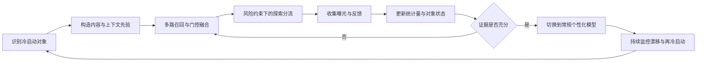

# 推荐系统冷启动问题

冷启动（Cold Start）是指推荐系统面对**缺少历史交互、曝光或监督信号的对象**时，无法可靠估计偏好的问题。它并不对应某一个模型，而是贯穿对象识别、先验构造、流量分配、反馈采集、模型切换和分群评测的一套系统工程。

冷启动真正要解决的不是“没有数据时猜得更准”这一件事，而是以下闭环：

1. 在协同信号不足时生成质量可接受的初始结果。
2. 控制探索成本，尽快收集有辨识度的真实反馈。
3. 防止新品、新用户或新场景长期困在低曝光、低反馈状态。
4. 随证据增长，从先验策略平滑过渡到个性化模型。
5. 在收益、体验、公平、安全和系统成本之间取得平衡。

## 文档导航

- [新用户冷启动](./方法详解/NewUser.md)：画像、上下文、主动偏好采集与会话建模。
- [新物品冷启动](./方法详解/NewItem.md)：内容表示、多模态、图关系和新品流量机制。
- [迁移与少样本学习](./方法详解/TransferAndFewShot.md)：跨域迁移、域适配、元学习和预训练。
- [探索与反馈闭环](./方法详解/Exploration.md)：Bandit、流量分配、不确定性与安全探索。
- [工业案例分析](./方法详解/CaseStudies.md)：内容、电商、广告、新闻、本地生活等场景拆解。
- [文献体系](../文献/冷启动问题/冷启动文献综述.md)：按问题、方法和阅读顺序整理的论文索引。
- [面试与工作实战](./InterviewAndPractice.md)：常见问题、诊断框架和优化思路。

## 一、冷启动主要解决什么问题

### 1. 新用户冷启动

用户刚注册、未登录、跨设备访问，或历史行为被清理时，系统不知道其长期偏好。此时可用信号通常只有入口、时间、地域、设备、渠道、少量人口属性和当前会话行为。

核心矛盾是：**越早个性化，依据越弱；越保守地等待数据，首屏体验和留存越差。**

### 2. 新物品冷启动

商品、视频、文章、广告或房源刚进入系统时，没有点击率、转化率、共现关系和稳定 ID Embedding。常规模型容易因缺少统计特征而给出低分，低分又导致低曝光，最终形成“无曝光 -> 无反馈 -> 继续无曝光”的自我强化。

核心矛盾是：**必须给新品流量才能判断质量，但探索流量本身会占用用户注意力并影响业务收益。**

### 3. 新场景与新市场冷启动

产品进入新国家、新城市、新频道、新终端或新业务线时，用户和物品可能都存在，但标签分布、供给结构、交互语义和业务目标发生变化。直接复用旧域模型会产生负迁移，完全从零训练又缺少样本。

### 4. 系统级冷启动

新产品上线时，用户、物品和交互图同时稀疏。此时不存在可供协同过滤学习的稳定矩阵，需要依靠内容理解、编辑运营、外部知识、规则与主动采集建立第一批反馈。

### 5. 休眠与兴趣漂移

老用户长期未访问或兴趣发生突变，在统计上也接近冷启动。历史数据并非不存在，而是可能已经失效。实践中需要同时估计“数据量”和“数据新鲜度”，避免陈旧行为压制当前意图。

## 二、为什么冷启动困难

- **信号稀疏**：缺少足够的正负反馈，Embedding、CTR 和转化率估计方差很大。
- **选择偏差**：日志只记录旧策略展示过的内容，未曝光不等于不喜欢。
- **反馈延迟**：购买、留存和长期满意度需要较长时间才能观测。
- **探索风险**：随机探索可能降低 CTR、伤害体验，甚至触发安全与合规问题。
- **对象异质性**：不同用户、物品、市场的冷启动速度和可用先验差异很大。
- **目标冲突**：短期点击、长期留存、新品成长、供给公平与商业收入并不总是一致。
- **训练服务偏差**：内容特征缺失、元数据更新延迟和新类别 OOV 会让离线方案在线失效。

## 三、工业系统中的冷启动分层

冷启动不应只有一个布尔标签。更实用的方式是建立状态机，例如：

| 阶段 | 示例判定 | 主要依据 | 推荐策略 |
| --- | --- | --- | --- |
| S0 零信号 | 0 次有效行为或 0 次曝光 | 场景、地域、内容、运营先验 | 热门、内容、规则与小流量探索 |
| S1 极少信号 | 1-5 次有效行为 | 当前会话、轻量画像 | 会话兴趣与先验融合 |
| S2 少量信号 | 6-30 次行为或少量转化 | 短期序列、内容与弱协同 | 混合模型、置信度门控 |
| S3 成长期 | 反馈可估计但不稳定 | 协同、序列、统计特征 | 个性化为主，保留探索 |
| S4 稳定期 | 样本量与新鲜度达标 | 完整个性化特征 | 常规模型与持续探索 |
| Re-cold | 长期休眠或分布突变 | 当前上下文与新会话 | 衰减旧兴趣，重新探索 |

阈值不能只按交互次数设置，还应结合曝光次数、行为类型、时间跨度、特征完整度、估计置信区间和业务风险。

## 四、常见解决方法

### 1. 热门、规则与运营先验

按全站、地域、时间、频道、设备或人群选择热门内容，并叠加库存、安全、时效和业务规则。其核心不是“推荐最热门”，而是用低方差先验保证首屏下限。

典型特征：实现快、稳定、可解释，但个性化弱，容易强化头部和马太效应。适合系统启动、新用户首屏、故障降级和高风险场景。

### 2. 画像与上下文推荐

使用注册信息、地域、设备、来源渠道、时间、天气、入口页面和当前查询等信号寻找相似人群或直接预估偏好。核心是假设“相似上下文中的用户具有相似需求”。

典型特征：无需长期历史，但受画像质量、隐私合规和群体刻板偏差影响。适合本地生活、新闻、广告、旅行和即时需求场景。

### 3. 主动偏好采集

通过兴趣标签选择、关注作者、评分少量代表物品或 onboarding 问卷，让用户主动提供高信息量反馈。关键在于选择能最大幅度缩小偏好不确定性的少量问题，而不是让用户完成冗长问卷。

适合音乐、视频、阅读和社区产品；主要风险是注册漏斗流失、用户表达偏好与真实行为不一致。

### 4. 基于内容的方法

利用物品标题、类目、标签、正文、图像、音频、视频、作者和价格等内容生成表示，再与用户画像或已有行为匹配。核心是让新物品在没有 ID 交互时也能获得可比较的语义向量。

适合内容丰富、更新快的新闻、短视频、电商和广告场景。主要限制是内容相似不等于偏好相同，且容易产生过度同质化。

### 5. 混合与置信度门控

将热门、内容、规则、协同和序列模型按冷启动阶段融合。常见方式包括线性加权、Mixture-of-Experts、门控网络、蒸馏，以及按样本量或不确定性动态切换。

工业上它通常比“为冷启动单独训练一个模型”更实用，因为可以平滑完成从零信号到稳定个性化的过渡。

### 6. 跨域迁移与域适配

从成熟业务、相邻频道或其他市场迁移用户表示、物品表示和模型参数。核心是复用跨域稳定知识，同时隔离域特有模式。

适合拥有多业务、多国家或多终端产品的平台。主要风险是用户重叠不足、特征语义不一致和负迁移。

### 7. 元学习与少样本学习

训练模型学会“如何用少量样本快速适配”，将每个用户、物品或场景视为一个任务。典型方法包括参数初始化、度量学习、记忆增强和生成初始 Embedding。

适合对象数量多、每个对象反馈少但任务结构可复用的场景。其难点是任务构造、训练稳定性和线上增量更新成本。

### 8. 图与知识增强

利用类目、品牌、作者、主题、社交关系和知识图谱，将新对象连接到已有节点，再通过邻居聚合获得表示。核心是用关系结构替代尚未形成的交互边。

适合元数据和实体关系丰富的电商、内容、社交和本地生活场景；风险是图构建成本、噪声传播和实时更新压力。

### 9. Contextual Bandit 与受控探索

在利用当前最优策略的同时，为不确定但可能优质的对象分配探索流量。常见方法包括 $\epsilon$-greedy、UCB、Thompson Sampling 和 Contextual Bandit。

核心不是纯随机，而是根据上下文、预期收益和不确定性选择“最值得试”的内容。适合新品、新闻、广告创意和快速变化的供给；必须配置安全约束、预算、频控和回退。

### 10. 预训练与基础模型

使用预训练文本、视觉、语音或多模态模型获得具有迁移能力的初始表示，再通过少量交互微调或对齐到推荐空间。它能显著增强零样本内容理解，但不能自动解决曝光偏差、探索和业务约束。

## 五、工业落地的完整闭环

工程上应包含以下组件：

- 冷启动对象识别服务：维护阶段、样本量、新鲜度和特征完整度。
- 先验特征服务：提供内容向量、人群统计、趋势和质量分。
- 策略编排层：组合规则、内容、协同、探索与降级通道。
- 探索预算管理：限制用户级、物品级和业务级探索成本。
- 反馈归因：区分曝光、点击、停留、转化、负反馈和延迟反馈。
- 状态迁移：根据证据与置信度决定融合权重，而非硬切模型。
- 分群监控：单独观察冷启动对象的覆盖、收益、留存和公平性。

## 六、工业应用场景

### 内容与新闻

文章和视频生命周期短，物品冷启动是常态。常用内容表示、作者/主题先验、实时热度与 Contextual Bandit；评价重点是短期点击、停留、负反馈、时效性与主题多样性。

### 电商

新品拥有标题、类目、品牌、图片、价格和商家信息，但缺少成交历史。常用多模态商品塔、同款/替代关系、商家质量先验和受控新品流量；需同时约束库存、履约、价格竞争力与作弊风险。

### 广告

新广告和新创意缺少 CTR/CVR 统计，而探索直接消耗预算。通常使用创意内容、广告主与行业先验、贝叶斯平滑和 Bandit，在收益、预算消耗、频控和用户体验之间优化。

### 音乐、视频与阅读

新用户偏好空间大，首屏质量直接影响留存。常用 onboarding 兴趣选择、流行趋势、地域语言、当前会话和多兴趣探索，并逐步切换到序列模型。

### 本地生活、旅行与房源

地域和时间约束强，新城市或新房源没有足够交互。常用地理邻域、价格带、设施、文本图像质量、供给可用性和跨城市迁移；评价还需关注履约与供给公平。

### 社交与社区

新用户需要建立关注关系，新作者需要获得初始曝光。常用通讯录/社交图、主题兴趣、共同关系、内容质量和探索流量，同时必须控制骚扰、安全与回音室效应。

## 七、评测与实验设计

### 离线评测

- 使用时间切分，模拟对象第一次出现后的真实过程。
- 建立严格冷启动集合，例如训练期零交互、测试期首次出现的用户或物品。
- 按 0、1-5、6-20、20+ 次交互分桶，而不是只报告全量均值。
- 同时报告 Recall/NDCG、覆盖率、新品曝光率、多样性、校准和流行度偏差。
- 对探索策略使用 IPS、SNIPS、Doubly Robust 等反事实评价时，检查 propensity 是否可靠及方差是否可控。

### 在线评测

- 新用户：首屏 CTR、有效消费、首日/首周留存、完成 onboarding 比例。
- 新物品：首次有效反馈耗时、冷启动成功率、曝光覆盖、成长后质量与商家公平。
- 探索：累计后悔值、探索成本、负反馈、安全事故和长期收益。
- 系统：P95/P99 时延、特征缺失率、回退率、状态迁移延迟与成本。

实验必须按用户或对象稳定分流，防止同一新品同时受到实验组和对照组流量干扰。对供给侧策略还要考虑网络效应和双边市场干扰。

## 八、方法综述表

| 方法 | 核心思想 | 主要信号 | 主要对象 | 适用场景 | 优点 | 局限与风险 |
| --- | --- | --- | --- | --- | --- | --- |
| 热门/趋势 | 用低方差群体先验保证下限 | 全局与分群统计 | 新用户、系统 | 首屏、降级、强时效 | 稳定、简单、可解释 | 个性化弱、放大头部 |
| 规则/运营 | 将业务知识编码为候选与约束 | 类目、库存、安全、运营池 | 全类型 | 高风险、新业务上线 | 可控、见效快 | 维护成本高、泛化弱 |
| 画像/上下文 | 相似环境映射到相似需求 | 地域、时间、设备、渠道 | 新用户、新场景 | 新闻、本地生活、广告 | 无需长期历史 | 隐私、偏见、信息有限 |
| 主动采集 | 用少量高信息问题缩小偏好空间 | 标签选择、关注、评分 | 新用户 | 音乐、视频、社区 | 信号直接、启动快 | 增加操作成本、表达偏差 |
| 基于内容 | 从语义与属性构造初始表示 | 文本、图像、音频、类目 | 新物品 | 电商、内容、广告 | 可零样本泛化、可解释 | 过度同质化、内容噪声 |
| 混合/门控 | 按阶段和置信度融合多类专家 | 内容、协同、统计、上下文 | 全类型 | 大多数工业系统 | 过渡平滑、鲁棒 | 系统复杂、权重难校准 |
| 跨域迁移 | 从成熟域复用稳定知识 | 跨域用户、物品、参数 | 新市场、新业务 | 平台型产品 | 减少目标域样本需求 | 负迁移、语义不一致 |
| 元学习 | 学习少样本快速适配机制 | 多任务历史与少量支持集 | 新用户、新物品 | 大量稀疏对象 | 适配快、结构化利用经验 | 任务构造和部署复杂 |
| 图/知识增强 | 通过邻居关系传播已有知识 | 品牌、作者、主题、社交图 | 新物品、新用户 | 电商、社区、本地生活 | 利用高阶关系 | 图噪声、更新与成本压力 |
| Bandit 探索 | 根据收益和不确定性分配试验流量 | 上下文、奖励、置信度 | 新物品、新策略 | 新闻、广告、快速供给 | 主动收集高价值反馈 | 短期损失、偏差与安全风险 |
| 预训练/基础模型 | 用大规模预训练获得可迁移表示 | 文本、视觉、音频、多模态 | 新物品、新域 | 内容丰富或跨域场景 | 强零样本语义能力 | 成本高，不能替代探索闭环 |
| 编辑与种子供给 | 人工建立初始高质量内容池 | 专家判断、策展、外部知识 | 系统级 | 产品上线、垂类社区 | 质量可控、建立产品调性 | 规模有限、主观偏差 |

## 九、实践原则

1. 先定义“冷”的业务口径，再讨论模型。
2. 把内容表示和流量探索视为两个互补问题：前者负责初始化，后者负责验证。
3. 优先设计连续融合与状态迁移，避免固定阈值硬切造成分数跳变。
4. 必须记录曝光概率和策略版本，否则后续难以去偏和做反事实评价。
5. 冷启动指标必须分用户、物品、阶段和场景报告。
6. 用热门和规则守住体验下限，但为长尾保留可控的成长通道。
7. 复杂模型只有在内容质量、反馈归因和在线探索机制可靠后才有稳定收益。