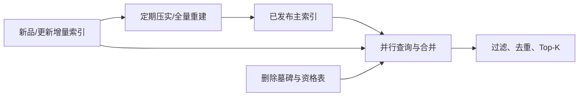

# Index 构建

Index 构建模块把可推荐商品池转换为 L1 召回可低延迟查询的数据结构。核心可分为 **ID-to-Item** 键值索引和 **Embedding-to-Item** 向量索引，两者可以并存并共享商品状态与版本体系。

## 一、Index 类型

| 类型 | 查询形式 | 常用结构 | 典型场景 |
| --- | --- | --- | --- |
| ID-to-Item | 离散键 -> 商品/候选列表 | Hash Table、KV、倒排表 | I2I、用户预计算、类目/标签、热门榜单 |
| Embedding-to-Item | 查询向量 -> 近邻商品 | Flat、LSH、IVF、HNSW、树、PQ | 双塔、语义、多模态、图向量召回 |

ID-to-Item 的“ID”也可以是类目、标签、地域或查询词等离散键。Embedding-to-Item 的查询向量可以来自用户、会话、搜索查询或种子商品。

## 二、ID-to-Item 构建

典型记录不仅包含候选 ID，还包含分数和生成信息：

```text
key -> [(item_id, score, reason, source_version), ...]
```

构建流程：

1. 从可推荐商品池和行为数据生成键与候选对。
2. 聚合、打分、去重并保留每个键的 Top-N。
3. 绑定候选生成版本、商品状态版本和过期时间。
4. 按键分片写入内存 Hash Table、Redis 或其他 KV 存储。
5. 预热热点键，通过双版本或命名空间完成原子切换。

简单示例见 [hash_index.py](./hash_index.py)。生产环境应根据数据规模选择 Redis、RocksDB、内存服务或分布式 KV，而不是把本地字典直接用于多实例服务。

## 三、Embedding-to-Item 构建

### 向量生产契约

建库前必须固定：

- `embedding_model_version` 与 `feature_version`。
- 向量维度、数据类型和是否归一化。
- 距离函数：内积、余弦距离或欧氏距离。
- 商品 ID 与向量行号的稳定映射。
- 向量缺失、异常范数、NaN/Inf 和重复 ID 的处理方式。

若使用单位归一化向量，则余弦相似度与内积排序一致：

$$
\cos(\mathbf{q}, \mathbf{x}) = \frac{\mathbf{q}^{\mathsf{T}}\mathbf{x}}{\|\mathbf{q}\|_2\|\mathbf{x}\|_2}
$$

### ANN 选型

不同 ANN 方法在召回率、延迟、内存、构建时间、更新能力和过滤支持上取舍不同。方法对比及 Python 实现见 [ANN](./ANN/README.md)。

### 元数据关联

向量索引至少要能由内部位置映射回业务商品 ID，并访问场景、地域、类目和有效状态等过滤字段。常见方式包括：

- 将少量稳定字段存入索引原生 payload。
- 按地域、场景或租户建立独立分区索引。
- ANN 过召回后访问资格位图或 KV 执行过滤。
- 对动态状态维护独立过滤表，避免频繁重建主索引。

## 四、全量、增量与删除

推荐采用主索引加增量索引：



- **新增**：先写增量索引，缩短新品可检索延迟。
- **更新**：若索引不支持原地更新，则写新版本并将旧版本标记删除。
- **删除**：使用墓碑或资格过滤立即阻断，后台再物理清理。
- **压实**：当增量比例或墓碑比例超过阈值时合并重建。

## 五、分片与副本

### 分片策略

- 按商品 ID 哈希：负载均衡好，查询通常需要扇出全部分片。
- 按地域/场景分区：便于预过滤，但需处理跨区商品与热点倾斜。
- 按类目分区：适合查询路由明确的场景，可能损失跨类目召回。
- 按模型版本分区：便于实验与回滚，但会增加索引副本成本。

### 副本策略

副本承担读取扩展和故障恢复。索引文件应有校验和、构建清单和对象存储快照，实例加载完成并预热后才进入服务发现。

## 六、版本化发布

一个可回滚的发布过程包括：

1. 使用一致快照生成索引与 manifest。
2. 校验商品数、向量数、重复 ID、异常值和文件校验和。
3. 在离线查询集上验证 Recall@K、时延和结果差异。
4. 新实例影子加载并执行线上请求回放。
5. 预热热点数据后，以别名或路由配置原子切换。
6. 观察错误率、空结果率和业务指标，异常时切回旧版本。

manifest 建议包含：

```json
{
  "index_version": "items_v20260820_01",
  "item_snapshot_version": 42,
  "embedding_model_version": "two_tower_v7",
  "feature_version": "item_features_v12",
  "metric": "cosine",
  "normalized": true,
  "dimension": 128,
  "build_parameters": {},
  "item_count": 12000000
}
```

## 七、检索后处理

Index 层查询通常包含以下步骤：

1. 从一个或多个分片检索超过目标数量的候选。
2. 映射内部向量位置到业务商品 ID。
3. 合并主索引与增量索引结果并去重。
4. 应用资格、地域、权限、库存和删除墓碑过滤。
5. 按统一距离语义重排并截取 Top-K。
6. 返回索引名、版本、原始分数和检索排名用于归因。

过召回倍数应根据实际过滤率动态设置。倍数过小会导致结果不足，过大则增加延迟和下游负担。

## 八、基准评测

ANN 评测应使用同一机器、同一数据和查询集，并先以精确 Flat 检索生成真值。至少记录：

- Recall@K 与过滤后 Recall@K。
- P50、P95、P99 延迟和 QPS。
- 索引大小、峰值构建内存和服务内存。
- 全量构建时间、增量写入速度和删除成本。
- 不同参数下的效果-延迟-内存曲线。

不能只比较默认参数，也不能只在随机向量上得出生产选型结论。向量分布、维度、数据规模和过滤模式都会显著改变结果。

## 九、监控与告警

- 索引版本、年龄、加载状态和副本一致性。
- 主索引、增量索引和墓碑数量。
- 查询 QPS、P95/P99、超时率、空结果率和过滤率。
- 返回数量不足率、分片错误率和路由扇出。
- 向量覆盖率、异常范数和模型版本错配。
- 发布、回滚、压实与快照恢复耗时。