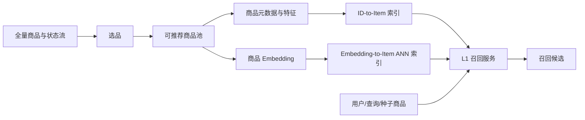

# Index 池综述

Index 池位于商品供给与 L1 召回之间，负责回答两个问题：

1. 当前有哪些商品具备被推荐的资格？
2. 这些商品如何被组织，才能让召回服务快速、稳定地找到它们？

因此，你总结的两条主线是正确的：先从全量商品池完成**选品**，再构建 **ID-to-Item** 和 **Embedding-to-Item** 两类召回池。完整的工业实现还需要覆盖特征契约、增量更新、版本发布、分片、过滤、评测、监控和容灾。

## 一、职责边界



Index 池负责可推荐集合和检索结构，L1 召回负责根据用户、查询或种子商品选择检索入口并生成候选。两者通过稳定的索引契约解耦：召回算法不应自行维护商品有效性真值，Index 层也不决定候选的最终个性化价值。

## 二、选品：从全量供给到可推荐集合

选品不是一次性的离线筛选，而是持续处理商品新增、上下架、库存、审核、权限和质量变化的状态计算过程。

典型规则分为四层：

| 规则层 | 典型内容 | 处理方式 |
| --- | --- | --- |
| 有效性 | 上架状态、有效期、库存、可售状态、内容完整性 | 硬过滤 |
| 安全合规 | 有害内容、违法违规、版权、黑名单、年龄限制 | 硬过滤并记录原因 |
| 场景资格 | 地域、语言、渠道、终端、用户权限、业务线 | 生成场景化资格或子池 |
| 质量与策略 | 低质、重复、刷量、商家信誉、新品保护、运营白名单 | 阈值、分层、降权或专用池 |

选品结果不宜只有一个布尔值。更实用的数据模型是“商品状态真值 + 场景资格 + 原因码 + 生效时间 + 版本”，使审计、回滚和问题定位成为可能。

## 三、两类核心召回池

### 1. ID-to-Item

ID-to-Item 根据离散键直接返回商品或预计算候选列表，通常用哈希表、键值存储或倒排表实现。键可以是用户 ID、商品 ID、类目、标签、作者、地域或查询词。

典型形式包括：

- `item_id -> 相似商品列表`：I2I、共现或图邻居。
- `user_id -> 预计算候选列表`：离线个性化召回。
- `category/tag -> 商品列表`：类目、标签和内容召回。
- `region/scenario -> 热门列表`：地域、场景和兜底召回。

哈希表描述的是访问方式，不代表值只能是单个商品。生产系统常将已排序的 Top-N 候选、分数、生成版本和过期时间一起存储，并通过 TTL、增量覆盖和双版本切换保证新鲜度。

### 2. Embedding-to-Item

Embedding-to-Item 根据用户、查询或种子商品向量检索相近商品向量。商品侧向量通常由双塔、内容模型、多模态模型或图模型离线/准实时生成，并写入 ANN 索引。

完整链路包括：

1. 固化模型版本、向量维度、距离函数和归一化约定。
2. 导出商品向量并检查缺失、NaN、重复 ID 和范数分布。
3. 用精确检索生成真值集，选择并调优 ANN 算法。
4. 构建分片、主索引与增量索引，绑定商品元数据和过滤字段。
5. 影子加载、预热、验收后原子切换索引版本。
6. 持续处理新增、更新、删除，并定期合并或全量重建。

常见 ANN 方法包括 LSH、IVF、HNSW、随机投影树以及 IVF-PQ 等量化索引。不存在对所有规模和硬件都最优的方法，应以真实向量和过滤条件测量 Recall@K、尾延迟、吞吐、内存及构建成本。

## 四、容易遗漏的工程能力

### 特征与向量契约

索引必须记录模型版本、特征版本、向量维度、数据类型、归一化方式和距离函数。余弦相似度、内积和欧氏距离不可在训练、建库与查询阶段混用。

### 元数据过滤

ANN 返回“向量相近”不等于“当前可推荐”。库存、地域、权限等动态约束可以采用预过滤、索引分区、检索后过滤或过召回补偿。过滤率过高会导致结果不足和延迟上升。

### 全量与增量索引

全量索引提供稳定基线，增量索引快速接入新品与变更。查询时合并两者并去重，达到阈值后再压实或全量重建。删除操作需要墓碑、过滤表或支持删除的索引结构。

### 分片与路由

大规模索引需要按商品 ID、地域、类目、租户或模型版本分片。路由策略要兼顾负载均衡与召回完整性，并支持单分片故障时的降级。

### 发布与回滚

索引构建完成后，应执行离线验收、影子查询、加载预热和容量检查，再通过别名或指针原子切换。旧版本需保留一段时间以支持秒级回滚。

### 可观测性与容灾

监控至少包括可推荐商品量、各原因过滤量、索引年龄、向量缺失率、空结果率、过滤率、Recall@K、P95/P99、内存和构建耗时。生产环境还需要副本、校验和、快照及跨机房恢复方案。

## 五、核心数据契约

### 可推荐商品记录

```text
item_id
eligible
eligibility_scopes
reason_codes
valid_from / valid_to
inventory_or_availability
metadata_version
updated_at
```

### 向量索引记录

```text
item_id
embedding
embedding_model_version
feature_version
metric
normalized
index_version
metadata_filters
updated_at
```

### 索引查询结果

```text
item_id
raw_score
index_name / shard
index_version
retrieval_rank
filter_status
```

## 六、评测体系

| 维度 | 代表指标 |
| --- | --- |
| 选品质量 | 有效商品覆盖率、误杀率、漏放率、状态更新延迟、规则命中分布 |
| 数据质量 | 向量覆盖率、重复 ID、异常范数、元数据完整率、版本一致率 |
| 检索效果 | Recall@K、Precision@K、距离误差、过滤后结果充足率 |
| 在线性能 | P50/P95/P99、QPS、超时率、空结果率、降级率 |
| 资源成本 | 索引大小、单向量内存、构建时间、CPU/GPU 使用、网络放大 |
| 运维稳定性 | 索引年龄、增量积压、发布成功率、回滚耗时、分片健康度 |

ANN 的 Recall@K 应以同一批查询上的精确 Top-K 为真值：

$$
\operatorname{Recall@K} = \frac{1}{|Q|}\sum_{q \in Q}\frac{|A_K(q) \cap E_K(q)|}{K}
$$

其中 $A_K(q)$ 为 ANN 返回结果，$E_K(q)$ 为精确检索结果。选型时必须把召回率与延迟、内存和构建成本放在同一条曲线上比较。

## 七、推荐实施顺序

1. 先统一商品 ID、状态真值、原因码和场景资格。
2. 建立可审计的选品规则与增量状态流。
3. 先实现精确 Flat 基线和简单 ID-to-Item 键值索引。
4. 基于真实数据评测 ANN 方法，不凭算法名称选型。
5. 增加版本化、双索引发布、回滚和线上监控。
6. 最后再优化压缩、分片、GPU 和混合检索等规模化能力。

进一步内容见[选品](./选品/README.md)、[Index 构建](./Index构建/README.md)和 [ANN 方法与样例](./Index构建/ANN/README.md)。