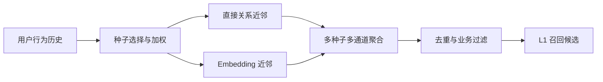
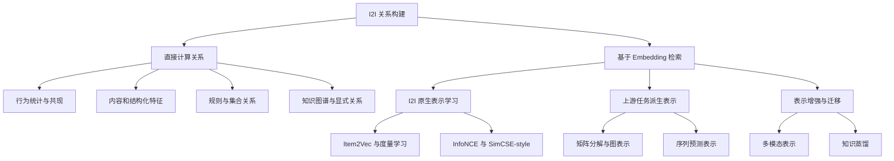

# I2I 召回综述

I2I（Item-to-Item）召回以用户历史中的物品为检索入口，从每个物品的相关物品集合中取得候选，再将多组候选合并为用户级召回结果。其基本过程为：

$$
\text{用户历史行为}
\rightarrow \text{种子物品集合}
\rightarrow \text{逐种子检索相关物品}
\rightarrow \text{多种子候选合并}
\rightarrow \text{过滤后的召回集合}
$$

例如，用户历史中包含物品 $i_1,i_2,i_3$，系统分别查询三个物品的 Top-$K$ 相关物品，再按种子权重和物品相关度聚合。I2I 的核心因此由两部分组成：

1. **构建 item-to-item 关系**：计算或学习任意两个物品之间的相关程度。
2. **基于用户历史执行召回**：选择种子、查询近邻、合并分数并过滤候选。

本文先说明 I2I 的整体链路，再按照“非向量召回（直接计算关系）”和“向量召回（基于 embedding 检索）”两大类，自顶向下梳理各类方法的数据、原理、构建或训练方式和服务形态。对于需要模型训练的方法，再进一步讨论正负样本与优化目标。

## 1. I2I 的完整工作链路

设用户 $u$ 的行为历史为：

$$
H_u=\{(i_k,a_k,t_k)\}_{k=1}^{n}
$$

其中 $i_k$ 是物品，$a_k$ 是点击、收藏、加购、购买等行为类型，$t_k$ 是行为时间。在线召回通常依次执行以下步骤。

### 1.1 种子选择

从 $H_u$ 中选择种子集合 $S_u$。常见策略包括：

- 选择最近交互的若干物品。
- 为购买、收藏、加购和点击设置不同优先级。
- 按时间衰减降低较早行为的权重。
- 按类目或兴趣簇去重，避免大量相似历史占满种子额度。
- 过滤下架、异常、低质量或无有效近邻的种子。

### 1.2 单种子近邻检索

对每个种子 $i\in S_u$，从一个或多个 I2I 通道中取得近邻集合：

$$
N_m(i)=\{(j,s_m(i,j))\}_{j=1}^{K_m}
$$

$m$ 表示通道，例如行为共现、文本特征、知识关系、Item2Vec 或图 embedding。$s_m(i,j)$ 是该通道下物品 $i$ 与候选 $j$ 的相关度。

### 1.3 多种子候选聚合

同一个候选可能由多个种子和多个通道召回。基础聚合公式为：

$$
score(u,j)=
\sum_{i\in S_u}\sum_{m}
\mathbb I[j\in N_m(i)]\,
w(u,i)\,\alpha_m\,\widetilde{s}_m(i,j)
$$

其中：

- $w(u,i)$ 是用户对种子 $i$ 的兴趣权重。
- $\alpha_m$ 是通道权重。
- $\widetilde{s}_m(i,j)$ 是校准后的通道分数。
- 指示函数表示候选 $j$ 是否由该种子和通道召回。

### 1.4 过滤与截断

聚合后执行已看过滤、库存与地域过滤、安全审核、候选去重和 Top-$N$ 截断，得到送入后续排序层的 L1 候选。



## 2. I2I 方法总分类

I2I 方法可以按照 item-to-item 关系的产生方式分为两大类。



### 2.1 非向量召回：直接计算关系

这类方法直接根据行为计数、内容字段、集合重合、规则或显式关系计算 $s(i,j)$。结果通常被离线物化为 `item_id -> Top-N neighbors`，不要求先训练统一向量空间。

### 2.2 向量召回：基于 embedding 检索

这类方法通过训练得到每个物品的低维表示 $z_i$，再通过余弦相似度、内积、距离函数或关系特定打分检索近邻：

$$
s(i,j)=\frac{z_i^\top z_j}
{\lVert z_i\rVert_2\lVert z_j\rVert_2}
\quad\text{或}\quad
s(i,j)=z_i^\top z_j
$$

物品向量可以由共现预测、矩阵分解、图传播、序列预测、度量学习、对比学习、重建任务或教师蒸馏获得。

### 2.3 向量方法的三类表示来源

向量 I2I 不应只按模型名称平铺。更重要的区别是：item embedding 为什么被学习，以及其训练目标是否直接面向 I2I。

| 类型 | 表示如何产生 | 典型方法 | 与 I2I 的关系 |
| --- | --- | --- | --- |
| I2I 原生表示学习 | 使用共现物品对、关系标签、三元组或双视图训练 | Item2Vec、监督度量学习、InfoNCE、SimCSE-style | 训练目标直接塑造 item-to-item 邻近关系 |
| 上游任务派生表示 | 先优化 user-item 推荐、图推荐或序列预测任务 | MF/BPR、LightGCN、Next-item、Masked-item | item embedding 是上游任务的中间产物，随后被复用于 I2I |
| 表示增强与迁移 | 引入额外模态、预训练表示或教师知识 | 多模态编码、领域微调、知识蒸馏 | 可叠加到前两类方法上，增强输入信息或迁移相关性能力 |

“上游任务派生表示”通常不等于严格意义上的迁移学习。迁移学习通常包含明确的源任务、目标任务以及参数迁移或目标域适配；而 MF、图推荐和序列预测的常见 I2I 用法只是导出已有 item embedding、选择相似度函数并构建近邻，未必存在独立的 I2I 微调阶段。因此，将其称为“表示复用”或“派生表示”更准确。

这一区分也对应不同的评测责任：原生表示可以围绕目标关系直接构造样本，上游派生表示则必须额外验证训练目标与 I2I 语义是否一致。上游 Recall、NDCG 或交互预测指标提升，并不保证静态 item 近邻同步改善；导出哪一层 embedding、是否归一化、采用内积还是余弦，以及是否保留方向性，都需要单独实验。多模态和蒸馏是横向机制，可以与原生训练或上游任务组合，不能简单视为第三种互斥损失。

### 2.4 两类检索方式的整体对比

| 维度 | 直接计算关系 | 基于 embedding 检索 |
| --- | --- | --- |
| 关系表示 | 显式分数、规则或边 | 低维稠密向量或关系向量 |
| 主要输入 | 计数、字段、标签、关系表 | 行为样本、内容、图、序列或多模态数据 |
| 是否需要模型训练 | 不一定 | 通常需要 |
| 近邻生成 | 全量/倒排计算后物化 Top-N | ANN 检索或离线全量近邻计算 |
| 可解释性 | 通常较高 | 依赖训练目标和特征 |
| 泛化能力 | 受规则和观测覆盖限制 | 可从共享表示中泛化 |
| 新品能力 | 内容和规则方法较强 | 内容 encoder 较强，ID-only 模型较弱 |
| 主要风险 | 热门偏差、规则覆盖不足 | 负样本偏差、表示退化、ANN 误差 |

## 3. 直接计算关系的方法

### 3.1 行为统计与 ItemCF

[ItemCF](../协同过滤/ItemCF/README.md) 根据用户或会话中的物品共现计算关系。设 $U(i)$ 为与物品 $i$ 发生过行为的用户集合，基础余弦形式为：

$$
s(i,j)=\frac{|U(i)\cap U(j)|}
{\sqrt{|U(i)|\,|U(j)|}}
$$

### 数据构造

1. 按用户或 session 聚合行为序列。
2. 在全序列或固定时间窗口内枚举物品对 $(i,j)$。
3. 根据行为类型、时间间隔和位置距离累加共现权重。
4. 统计单物品频次并执行归一化、热门惩罚和收缩。
5. 为每个源物品保留得分最高的 Top-$N$ 目标物品。

带时间和位置衰减的共现量可以写为：

$$
C_{ij}=\sum_{u}\sum_{p,q}
\mathbb I[i_{u,p}=i,i_{u,q}=j]
\cdot e^{-\lambda|t_{u,p}-t_{u,q}|}
\cdot \frac{1}{1+|p-q|}
$$

### 关键点

- 长 session 会产生大量物品对，需要限制窗口或降低长 session 权重。
- 热门物品容易与所有物品共现，需要归一化、IUF 或热门惩罚。
- 浏览共现、同购共现和顺序转移表达的关系不同，通常分别统计。
- $C_{ij}$ 与 $C_{ji}$ 可以相同，也可以通过前后顺序构造非对称关系。
- 新品缺少行为记录，需要内容或规则通道补充。

### 3.2 文本特征相似度

文本方法直接比较标题、描述、标签或正文。常见实现包括 TF-IDF、BM25 和字段加权相似度。

### TF-IDF 余弦

将每个物品文本表示为稀疏向量 $x_i$：

$$
TFIDF(t,i)=TF(t,i)\cdot
\log\frac{N+1}{df(t)+1}
$$

$$
s(i,j)=\frac{x_i^\top x_j}{\lVert x_i\rVert_2\lVert x_j\rVert_2}
$$

### BM25

将源物品文本作为查询、目标物品作为文档，可使用 BM25：

$$
BM25(i,j)=\sum_{t\in i}IDF(t)
\frac{f(t,j)(k_1+1)}
{f(t,j)+k_1(1-b+b|j|/avgdl)}
$$

### 数据与构建流程

1. 清洗标题、描述和标签，完成分词、归一化及停用词处理。
2. 按字段分别建立词项统计或倒排索引。
3. 设置标题、品牌、实体词、标签等字段权重。
4. 对每个物品检索文本相关物品并保留 Top-$N$。

### 关键点

- 高词面相似不一定对应替代或互补关系。
- 型号、品牌、作者、系列名等实体字段通常需要单独处理。
- 同义词和语义改写是纯词项方法的主要盲区。
- 文本方法能够为尚无行为记录的新品生成近邻。

### 3.3 类目、标签与结构化属性

结构化特征可以直接构造可解释的物品相似度。对标签集合 $A_i,A_j$，Jaccard 相似度为：

$$
J(i,j)=\frac{|A_i\cap A_j|}{|A_i\cup A_j|}
$$

对多字段特征，可以使用加权组合：

$$
s(i,j)=
w_c s_{category}(i,j)+
w_b s_{brand}(i,j)+
w_a s_{attribute}(i,j)+
w_p s_{price}(i,j)
$$

其中类目和品牌可使用精确匹配或层级距离，连续属性可使用归一化距离，集合属性可使用 Jaccard 或 weighted Jaccard。

### 数据与构建流程

1. 统一类目树、品牌实体、单位和属性枚举值。
2. 区分缺失值、不适用值和真实零值。
3. 通过倒排索引先生成共享特征的候选。
4. 计算细粒度综合相似度并截取 Top-$N$。

### 关键点

- 不同类目中的关键属性不同，需要类目级 schema。
- 价格距离应在类目内归一化，避免跨类目量纲失真。
- 缺失字段不应直接视为不相似。
- 结构化特征适合同款、同类替代和条件约束明确的场景。

更完整的内容方法见[内容与属性相似度](./非向量召回/内容与属性相似度/README.md)。

### 3.4 业务规则与显式关系

业务系统中常存在无需学习即可确定的关系，例如：

- 同一 SPU 下的不同 SKU。
- 同作者、同系列、同专辑或同剧集。
- 主商品与配件之间的兼容关系。
- 套装、升级款、替代款和续集关系。
- 人工运营维护的关联物品。

此类关系通常存储为带类型和方向的边：

$$
(i,r,j,w_{ij}^{(r)})
$$

$r$ 表示关系类型，$w_{ij}^{(r)}$ 表示关系置信度。线上根据场景选择允许使用的关系类型，并按关系优先级生成候选。

规则方法的关键在于关系数据的准确性、有效期、方向性、冲突处理和版本管理。

### 3.5 知识图谱与路径关系

物品可通过品牌、作者、演员、品类、主题、适配设备等实体连接成知识图。直接关系方法可以基于邻接边、元路径或 Personalized PageRank 计算 item-to-item 分数。

例如元路径：

```text
item -> brand -> item
item -> actor -> item
accessory -> compatible_device -> item
```

对路径 $p$ 可定义：

$$
s(i,j)=\sum_{p\in\mathcal P(i,j)}w_{type(p)}\,decay(length(p))
$$

直接路径打分属于非训练式关系构建；若使用 TransE、关系 GNN 或 link prediction 学习知识 embedding，则应按照训练目标设计三元组或边样本，并归入向量方法。详见[知识与关系相似度](./非向量召回/知识与关系相似度/README.md)。

## 4. 基于 embedding 的方法

Embedding 方法将物品映射到低维空间：

$$
z_i=f_\theta(i,x_i,\mathcal H_i,\mathcal G)
$$

输入可以包含 item ID、内容特征 $x_i$、行为上下文 $\mathcal H_i$ 和图结构 $\mathcal G$。不同方法的核心差异不仅在于模型结构，还在于训练目标是否直接服务 I2I，以及表示是原生学习、从上游任务派生，还是经过额外信息与教师能力增强。

### 4.1 I2I 原生表示学习

这类方法直接使用 item-item 共现、关系标签、三元组或多视图一致性定义训练目标。模型得到的几何空间就是待上线的 I2I 关系空间，因此样本语义、负例分布与线上近邻质量之间联系最直接。

#### 4.1.1 Item2Vec：基于行为上下文预测

[Item2Vec](./向量召回/I2I原生表示学习/Item2Vec/README.md) 将用户 session 视为句子，将物品视为 token。对于序列：

$$
[i_1,i_2,\ldots,i_T]
$$

在窗口大小 $c$ 内构造中心物品与上下文物品对：

$$
\mathcal D^+=\{(i_t,i_{t+r}):0<|r|\le c\}
$$

##### 模型与目标

模型维护中心向量 $v_i$ 和上下文向量 $v'_j$。SGNS 损失为：

$$
\mathcal L_{i,j}=
-\log\sigma(v_i^\top v'_j)
-\sum_{n=1}^{K}\log\sigma(-v_i^\top v'_{j_n})
$$

训练后可使用中心向量、上下文向量或两者平均值构建近邻。

##### 负样本

Item2Vec 明确需要负样本，以近似全量 softmax。常按物品频率的 $3/4$ 次幂采样：

$$
P_n(i)\propto count(i)^{3/4}
$$

需要过滤当前正例，并注意高频物品过度出现、假负例以及采样分布与线上物品分布的偏差。

##### 关键点

- session 划分和窗口宽度决定“上下文相关”的时间尺度。
- 双向窗口学习对称上下文；仅预测后续物品可保留方向性。
- 高频行为应降采样，异常长序列应截断或降权。
- ID-only Item2Vec 无法直接为新品生成可靠向量。

#### 4.1.2 监督度量学习：直接学习指定物品关系

[监督度量学习](./向量召回/I2I原生表示学习/监督度量学习/README.md) 使用已标注或由规则生成的物品关系训练 encoder。样本可采用物品对、三元组或候选列表。

Pair 分类或回归构造 $(i,j,y_{ij})$，其中 $y_{ij}$ 表示是否相关、关系类型或连续相关度。Contrastive margin loss 和 Triplet loss 则直接约束正负物品之间的距离：

$$
\mathcal L_{triplet}=
\max(0,d(i,i^+)-d(i,i^-)+m)
$$

标签来源决定模型学习替代、互补、同款还是一般相关关系。对称关系可使用共享 encoder；方向性关系可使用 source/target 双 encoder。若线上必须使用 ANN，训练打分函数应可分解为向量内积或可索引距离。

#### 4.1.3 InfoNCE：基于正负集合组织向量空间

[InfoNCE](./向量召回/I2I原生表示学习/InfoNCE/README.md) 将每个 anchor 的正例与一组负例共同归一化：

$$
\mathcal L_i=-\log
\frac{\exp(sim(z_i,z_i^+)/\tau)}
{\exp(sim(z_i,z_i^+)/\tau)+
\sum_{j\in\mathcal N_i}\exp(sim(z_i,z_j^-)/\tau)}
$$

正例可以来自同一 session、下一次交互、同购、同款、替代、互补、跨模态视图或教师高分物品对。批内负例、跨批队列、类目内难例和 ANN 难例会形成不同的决策边界，需要重点处理假负例与多正例。

#### 4.1.4 SimCSE-style：同一物品的随机双视图

[SimCSE-style](./向量召回/I2I原生表示学习/SimCSE/README.md) 对同一物品执行两次带 dropout 的前向计算，并使用双向 InfoNCE 约束表示一致性。文本 token dropout、字段遮蔽、图像裁剪和模态 dropout 也可形成双视图，但增强必须保留决定物品身份的语义。只有 item ID 时，该目标容易退化为实例区分，不能自然形成跨物品业务关系。

### 4.2 上游任务派生表示

这类方法首先优化 user-item 匹配、图推荐或序列预测等上游任务，再导出 item embedding 构建 I2I。其优势是复用成熟模型和训练数据，风险是上游目标与静态物品关系不完全一致。

#### 4.2.1 矩阵分解：基于用户偏好的低秩表示

[矩阵分解表示](./向量召回/上游任务派生表示/矩阵分解表示/README.md) 将 user-item 交互矩阵分解为：

$$
R\approx UV^\top
$$

$U$ 是用户向量矩阵，$V$ 是物品向量矩阵。训练完成后，使用 $V$ 的行向量计算 item-to-item 近邻。

##### 数据构造与目标

- 显式评分可使用 MSE 重构。
- 隐式反馈可使用 Weighted ALS，对观测和未观测项赋予不同置信度。
- 排序任务可构造三元组 $(u,i^+,i^-)$ 并使用 BPR：

$$
\mathcal L_{BPR}=-\log\sigma(
u_u^\top v_{i^+}-u_u^\top v_{i^-})
$$

##### 负样本

MSE 显式评分不一定需要负采样；Weighted ALS 将未观测项作为低置信度数据；BPR 明确需要为每个用户采样未交互物品 $i^-$。

##### 关键点

- MF 直接优化 user-item 预测，item-item 几何是训练结果的派生产物。
- 内积会受到向量范数和热门度影响，I2I 导出常比较内积与归一化余弦。
- 未交互不一定代表不喜欢，负采样会引入曝光偏差。
- ID-only MF 对新品没有表示能力。

#### 4.2.2 图表示学习：聚合多跳关系

[图表示学习](./向量召回/上游任务派生表示/图表示学习/README.md) 将用户、物品和其他实体构造成图，通过随机游走或图神经网络学习节点 embedding。

##### 随机游走方法

DeepWalk、Node2Vec 和 PinSage 等方法在图上生成节点序列，再使用类似 Skip-gram 的上下文预测训练。数据样本来自随机游走窗口，负样本来自图节点采样。

##### 图神经网络方法

以 user-item 二部图上的 LightGCN 为例：

$$
e_i^{(l+1)}=\sum_{u\in N(i)}
\frac{1}{\sqrt{|N(i)||N(u)|}}e_u^{(l)}
$$

多层传播后聚合各层表示：

$$
e_i=\sum_{l=0}^{L}\alpha_l e_i^{(l)}
$$

训练可使用 BPR、link prediction、随机游走上下文预测或图对比学习。

##### 负样本

- BPR 需要未交互物品负样本。
- Link prediction 需要不存在或未观测的边作为负边。
- 随机游走 Skip-gram 需要上下文负采样。
- 图对比学习通常使用批内其他节点或队列作为负例。

##### 关键点

- 多跳传播可提高稀疏节点覆盖，也可能造成过平滑和热门节点支配。
- 采样邻居、图快照和训练样本必须遵守时间边界。
- 不同边类型应保留关系类型和方向，或使用关系专用参数。
- 大图训练需要邻居采样、分区或稀疏矩阵计算。

#### 4.2.3 序列预测表示：学习下一步或上下文关系

[序列预测表示](./向量召回/上游任务派生表示/序列预测表示/README.md) 使用 RNN、CNN 或 Transformer 对有序行为序列建模。常见目标分为下一物品预测和掩码物品预测。

##### 下一物品预测

从前缀 $[i_1,\ldots,i_t]$ 预测 $i_{t+1}$：

$$
P(i_{t+1}=j\mid i_{\le t})=
\frac{\exp(h_t^\top v'_j)}
{\sum_{k\in\mathcal I}\exp(h_t^\top v'_k)}
$$

训练样本由每条序列的多个前缀和下一物品组成。输入 item embedding、输出分类器 embedding 或二者组合可以用于 I2I。

##### 掩码物品预测

随机遮蔽序列中的物品，根据左右上下文恢复原物品。它学习双向上下文关系，适合表示“在相似上下文中出现”的物品。

##### 负样本

全量 softmax 不需要人工负采样，但物品规模大时成本很高。Sampled softmax、BPR 或对比式序列目标需要采样负物品，可使用随机、流行度、曝光或 ANN 难负例。

##### 关键点

- 下一物品关系具有方向性，可分别保留输入和输出 embedding。
- session 切分、序列长度和位置编码直接影响学习范围。
- 分类器 embedding 是否适合静态 I2I，需要通过 item-item 与用户链路指标验证。
- 在线实时序列模型可直接做 U2I；将其物品向量离线导出后才形成静态 I2I 通道。

### 4.3 表示增强与迁移

这类方法不单独规定 I2I 的基础关系，而是通过额外内容、预训练模型或教师信号增强原生表示和派生表示。多模态描述输入来源，蒸馏描述能力迁移机制，两者都可以与前两类训练目标组合。

#### 4.3.1 自编码、掩码重建与多模态表示

[多模态与蒸馏](./向量召回/表示增强与迁移/多模态与蒸馏/README.md) 使用文本、图像、音频、视频和结构化属性生成统一物品表示。

##### 重建类目标

Autoencoder 将输入压缩为 $z_i$，再重建原始特征：

$$
z_i=f_\theta(x_i),\qquad
\hat{x}_i=g_\phi(z_i),\qquad
\mathcal L=\ell(x_i,\hat{x}_i)
$$

Masked modeling 则随机遮蔽文本 token、图片 patch 或属性字段，并预测被遮蔽内容。

重建类目标不一定需要负样本，但需要设计遮蔽比例、重建目标和不同模态的 loss 权重。

##### 跨模态对齐

将同一物品的文本和图片作为正例，不同物品作为负例，使用对比学习对齐模态。也可以训练分类、匹配或生成任务，使共享表示保留跨模态信息。

##### 关键点

- 不同模态的信息量和缺失率不同，需要模态门控和缺失标识。
- 训练与上线预处理必须一致，包括图片版本、文本清洗和属性 schema。
- 内容 encoder 可以直接编码新品，是冷启动 I2I 的主要来源。
- 通用预训练模型的语义空间需要使用推荐关系评测，必要时再做领域微调。

#### 4.3.2 知识蒸馏：迁移高成本模型的相关性

教师模型可以是 cross-encoder、精排模型、图模型或大规模多模态模型，学生模型则是可离线编码物品的轻量 encoder。

##### 样本与目标

先为物品 $i$ 生成候选集合 $C_i$，再由教师输出分数 $t_{ij}$。学生学习：

$$
\mathcal L_{score}=\sum_{j\in C_i}
(s_\theta(i,j)-t_{ij})^2
$$

也可对教师和学生的候选分布使用 KL 散度，或直接匹配教师表示。

##### 候选集合

蒸馏不一定使用二元负标签，但候选集合需要同时覆盖高分正例、普通负例和教师容易混淆的难例。只蒸馏教师 Top 结果会缺少决策边界信息。

##### 关键点

- 教师分数需按场景和关系类型校准。
- 学生结构必须兼容线上 ANN 或近邻表生成。
- 教师偏差会被学生继承，需要保留独立人工或行为评测集。
- 可将蒸馏 loss 与行为对比、分类或重建 loss 联合训练。

## 5. 各方法的数据与训练对照

### 5.1 非向量方法的构建方式

非向量方法没有统一的模型训练阶段，因此重点是输入数据、关系计算和更新策略，而不是逐项讨论负样本。

| 方法 | 主要输入 | 关系构建方式 | 新品能力 |
| --- | --- | --- | --- |
| ItemCF | 用户/session 内物品对 | 共现统计、归一化与热门惩罚 | 弱 |
| TF-IDF/BM25 | 物品文本 | 稀疏词项相似度或倒排检索 | 强 |
| 属性与规则 | 字段、标签、关系边 | Jaccard、距离或规则加权 | 强 |
| 知识路径 | 实体边和元路径 | 路径计数、约束遍历或 PPR | 取决于知识覆盖 |

### 5.2 向量方法的训练方式

| 类型 | 方法 | 主要训练样本 | 目标 | 负例机制 | 新品能力 |
| --- | --- | --- | --- | --- | --- |
| 原生表示 | Item2Vec | 窗口中心-上下文对 | SGNS | 频率采样 | 弱 |
| 原生表示 | 监督度量 | 物品对、三元组、候选列表 | 分类、回归、Triplet、Margin | 随机、类目内或难例 | 使用内容 encoder 时强 |
| 原生表示 | InfoNCE | anchor-positive 对 | 对比 softmax | 批内、队列或 ANN 难例 | 使用内容 encoder 时强 |
| 原生表示 | SimCSE-style | 同物品随机双视图 | 双向 InfoNCE | 通常为批内其他物品 | 强 |
| 派生表示 | MF | user-item 交互 | MSE、ALS、BPR | 依目标而定 | 弱 |
| 派生表示 | 图表示 | 图边、随机游走或子图 | BPR、链路预测、Skip-gram、对比 | 通常需要 | ID 图模型较弱 |
| 派生表示 | 序列预测 | 前缀-下一物品或掩码序列 | Softmax、sampled softmax、BPR | 依目标而定 | ID 模型较弱 |
| 表示增强 | 自编码/掩码重建 | 单物品内容及遮蔽视图 | 重建损失 | 不依赖对比负例 | 强 |
| 表示增强 | 跨模态对齐 | 同物品跨模态对 | 对比、匹配或多任务 | 依目标而定 | 强 |
| 表示增强 | 知识蒸馏 | 教师打分的候选集合 | MSE、KL、listwise loss | 候选集合隐含边界样本 | 取决于学生输入 |

## 6. 训练型方法的正例、负例与关系语义

本节仅讨论通过优化目标学习表示的方法。直接统计、检索公式、显式规则和路径计算不需要套用正负样本框架。

### 6.1 常见正例来源

| 正例来源 | 主要表达的关系 |
| --- | --- |
| 短时间窗口内共同浏览 | 当前兴趣或主题相关 |
| 下一次交互 | 有方向的转移关系 |
| 同一订单购买 | 互补或共同需求 |
| 同一比较集合 | 替代关系 |
| 同 SPU 不同 SKU | 同款关系 |
| 相同类目与关键属性 | 内容替代关系 |
| 兼容表、系列表、知识边 | 显式业务关系 |
| 同物品的多视图 | 实例一致性 |
| 教师模型高分物品对 | 教师定义的相关性 |

同一种训练算法使用不同正例会得到不同的 I2I 关系。例如，InfoNCE 使用同购正例时偏向互补关系，使用同款正例时偏向替代或同款关系，使用下一跳正例时偏向顺序转移关系。

### 6.2 常见负样本来源

| 负样本 | 特点 | 主要风险 |
| --- | --- | --- |
| 全局随机物品 | 简单、覆盖广 | 大量负例过于容易 |
| 流行度采样 | 接近高曝光物品分布 | 强化热门偏差 |
| 批内其他目标 | 计算效率高 | batch 内假负例 |
| 曝光未点击物品 | 接近真实决策集合 | 位置和曝光机制偏差 |
| 同类目难负例 | 提升细粒度区分 | 可能是真实替代品 |
| ANN 难负例 | 聚焦当前模型错误 | 索引滞后和训练震荡 |
| 教师筛选负例 | 质量较高 | 继承教师偏差且成本高 |

负样本主要属于训练型表示学习问题，常见于 SGNS、BPR、Triplet、InfoNCE、link prediction 和 sampled softmax。ItemCF、TF-IDF、BM25、固定规则和路径计算等非训练方法只需关注关系构建与候选过滤，不纳入本节的负采样讨论。

### 6.3 假负例处理

- 同 SPU、重复内容和已知关系物品不作为负例。
- 对一个 anchor 的多个相关物品使用 multi-positive mask。
- 根据关系置信度对负例降权，而不是全部使用硬标签。
- 使用教师模型或规则过滤高相似负例。
- 对不同来源的负样本分桶监控 loss 和命中率。

## 7. 对称关系与方向关系

部分 I2I 关系是对称的，例如同款或内容相似；部分关系是有方向的，例如“下一集”“升级到”“配件适用于主商品”。

对称关系可使用单一向量：

$$
s(i,j)=z_i^\top z_j=s(j,i)
$$

方向关系可以使用 source 和 target 两套向量：

$$
s(i\rightarrow j)=
(z_i^{src})^\top z_j^{dst}
$$

也可为不同关系类型引入关系参数：

$$
s_r(i,j)=z_i^\top W_r z_j
$$

方向性决定了样本对是否需要交换、索引中存储哪一侧向量，以及在线查询使用哪一套 embedding。

## 8. 近邻生成与离线发布

### 8.1 预计算近邻表

离线为每个物品计算 Top-$N$：

```text
source_item_id -> [(target_item_id, score, channel, relation_type), ...]
```

近邻表可存储在 KV 系统中。其优点是在线延迟稳定、过滤和截断可提前执行；缺点是全量刷新成本高，且难以实时反映 embedding 更新。

### 8.2 ANN 向量检索

Embedding 方法可将目标物品向量建立 ANN 索引。在线使用种子向量查询 Top-$K$。常见距离包括 cosine、inner product 和 L2。

ANN 需要关注：

- 索引召回率与查询延迟的权衡。
- embedding 归一化是否与训练打分一致。
- source/target 非对称向量的索引方向。
- 增量插入、删除、压缩和定期全量重建。
- item ID 映射、模型版本和索引版本的一致性。

向量索引的完整内容见 [Index 池](../../Index池/README.md)。

### 8.3 版本化发布

一次可回滚的发布至少应绑定：

```text
behavior_snapshot_version
feature_snapshot_version
model_version
item_id_mapping_version
ann_or_neighbor_table_version
score_calibration_version
```

## 9. 多种子与多通道融合

### 9.1 种子权重

种子权重可表示为：

$$
w(u,i)=
w_{behavior}(a_{ui})
\cdot e^{-\lambda\Delta t_{ui}}
\cdot w_{position}(i)
\cdot w_{quality}(i)
$$

分别对应行为类型、时间衰减、历史位置和物品质量。

### 9.2 分数校准

ItemCF 共现分数、BM25 分数、余弦相似度和知识关系权重不在同一尺度。常用融合方式包括：

- 每个通道分配固定候选额度后合并。
- 对各通道做分位数、min-max、z-score 或温度校准。
- 使用 Reciprocal Rank Fusion：

$$
RRF(j)=\sum_m\frac{1}{k+rank_m(j)}
$$

- 使用轻量融合模型，根据通道、种子、物品和上下文特征预测融合分数。

### 9.3 去重与多样性

同一候选由多个种子命中时，可以累加证据，也可以仅保留最大分数并记录命中次数。种子和候选两侧均可使用类目约束、聚类或 MMR 控制重复度。

## 10. 评测体系

### 10.1 单物品关系评测

为源物品 $i$ 构建真实相关集合 $G(i)$，评估近邻 $N_K(i)$：

$$
Recall@K=\frac{1}{|Q|}\sum_{i\in Q}
\frac{|N_K(i)\cap G(i)|}{|G(i)|}
$$

同时可使用 Precision@K、NDCG@K、MRR、关系分类准确率和人工相关性标注。替代、互补、顺序和同款关系应分别评测。

### 10.2 用户级召回评测

在时间 $t$ 之前截取用户历史作为种子，预测 $t$ 之后的真实交互，评估完整的多种子融合结果：

- Recall@K、HitRate@K、NDCG@K。
- 各通道独立命中和相对其他通道的增量命中。
- 新品、长尾、头部、类目和行为类型分桶。
- 覆盖率、热门度、重复率和多样性。
- 平均种子数、候选数、近邻表命中率和在线延迟。

### 10.3 时间切分与数据泄漏

行为样本、内容特征、知识边和索引均应使用预测时刻之前的快照。随机划分可能将未来共现、未来属性或未来图关系泄漏到训练和近邻构建中。

## 11. 方法选择与组合

| 业务条件 | 适合的主要方法 |
| --- | --- |
| 行为充分且需要稳定可解释近邻 | ItemCF、共现统计 |
| 新品比例高且内容字段完整 | TF-IDF、BM25、属性相似度、内容 encoder |
| 存在明确同款、兼容或系列关系 | 规则表、知识关系和元路径 |
| 短期共现模式重要 | Item2Vec、行为对比学习 |
| 用户偏好低秩结构明显 | MF item embedding |
| 多跳协同关系重要 | LightGCN、PinSage、随机游走 embedding |
| 消费顺序和下一跳重要 | Next-item、Masked-item 序列模型 |
| 存在高质量物品对或三元组 | 监督度量学习、InfoNCE |
| 文本、图片等多模态内容丰富 | 多模态对齐、重建和对比学习 |
| 高成本模型效果好但不能在线运行 | 知识蒸馏到轻量 item encoder |

生产系统通常并行维护多种 I2I 通道：行为统计提供稳定相关性，内容方法覆盖新品，规则和知识关系表达确定性关系，embedding 方法提供语义与协同泛化。各通道独立构建、评测和监控，再在用户级召回阶段融合。
