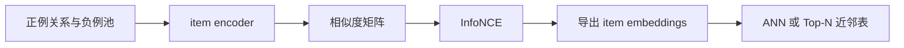

# InfoNCE：显式对比学习

InfoNCE 将每个 anchor 与正例拉近，并在同一个 softmax 分母中与负例竞争。它是一种对比目标，不是一种固定模型：encoder 可以是 ID embedding、MLP、文本模型、多模态模型或图网络。

## 1. 编码与相似度

对物品输入 $x_i$：

$$
z_i=\frac{f_\theta(x_i)}{\lVert f_\theta(x_i)\rVert_2}
$$

归一化后内积等于余弦相似度：

$$
s(i,j)=z_i^\top z_j
$$

也可以使用不归一化内积，但向量范数会影响 logit，训练稳定性和 ANN 度量都随之变化。

## 2. 单向 InfoNCE

一个 batch 包含 $B$ 个配对 $(a_b,p_b)$，第 $b$ 个 anchor 只把 $p_b$ 视为正例，其余 $B-1$ 个 positive 物品自动成为该 anchor 的批内负例：

$$
\mathcal L=-\frac1B\sum_b\log\frac{\exp(z_b^\top z_b^+/\tau)}{\sum_j\exp(z_b^\top z_j^+/\tau)}
$$

[example.py](./example.py) 使用 `cross_entropy(logits, arange(B))` 实现这一单向目标，矩阵第 $b$ 行与第 $b$ 列配对。

## 3. 双向与多正例目标

若关系对称，可以同时优化两个方向：

$$
\mathcal L=\frac12(\mathcal L_{a\to p}+\mathcal L_{p\to a})
$$

若 anchor 有多个正例集合 $P(a)$，单标签交叉熵会错误地把其他正例作为负例。多正例形式为：

$$
\mathcal L_a=-\frac{1}{|P(a)|}\sum_{p\in P(a)}
\log\frac{\exp(s(a,p)/\tau)}
{\sum_{k\ne a}\exp(s(a,k)/\tau)}
$$

实现时需构造 positive mask，并屏蔽重复 item ID、同款 SKU 或其他已知相关物品。

## 4. 正例定义

正例决定 embedding 语义：

| 正例来源 | 主要语义 | 风险 |
| --- | --- | --- |
| 短会话邻近物品 | 当前意图相关 | 多意图 session 混合 |
| 同购或先后购买 | 互补与转移 | 热门和促销偏差 |
| 同款不同 SKU | 强同款 | 可能缺乏类间泛化 |
| 同类替代标注 | 替代关系 | 标注规模有限 |
| 同一物品跨模态 | 实例一致性 | 不保证不同物品相关 |
| 教师模型高分 pair | 教师定义的相关性 | 继承教师偏差 |

替代与互补不宜无区分混合。如果线上需要不同解释和融合权重，应训练独立空间、使用关系条件 encoder，或至少在样本中保留关系类型。

## 5. 温度参数

$\tau$ 控制 softmax 的尖锐程度。较小温度强调困难样本、增大梯度，也更容易受假负例影响；较大温度使分布平滑，但可能降低细粒度区分能力。温度与 batch size、归一化及负例难度耦合，应联合调参。

## 6. 负例来源

- **批内负例**：GPU 效率高，但 batch 组成就是负例分布，重复正例会形成冲突。
- **跨批队列**：低成本扩大分母；缓存表示可能陈旧，可使用 momentum encoder。
- **同类目难负例**：强化细粒度区分，也更容易误伤真正替代品。
- **ANN 难负例**：从当前模型近邻挖掘，应与随机负例混合并周期刷新。
- **曝光未点击**：贴近线上竞争，但带有展示、位置和旧策略偏差。

## 7. 采样偏差与假负例

InfoNCE 学习区分当前分母中的候选，不自动等价于全物品概率。若候选按非均匀分布 $q(i)$ 采样，可根据目标选择是否修正：

$$
	ilde s(a,i)=s(a,i)-\log q(i)
$$

该修正针对特定 sampled-softmax 估计问题，不会消除曝光偏差。假负例治理包括多正例 mask、同 item/SPU 屏蔽、已知关系过滤以及对不确定候选降权。

## 8. Encoder 设计

示例 encoder 拼接 item ID 和 category embedding 后线性投影：

$$
z_i=normalize(W[e_i^{item};e_i^{category}]+b)
$$

ID 提供记忆能力，类目提供共享信息。真实系统可加入文本、图像、品牌、价格和统计特征。只有 ID 时无法编码未见新品；即使加入内容，模型也可能过度依赖 ID，需要 ID dropout 和新品分桶评测。

## 9. 训练与发布



导出时切换到 `eval`，固定预处理并记录 encoder、特征快照和 ID 映射版本。线上相似度必须与训练 logit 兼容。

## 10. 评测与诊断

使用目标关系上的 Recall@K、NDCG@K 和 MRR，并报告用户级多种子 I2I 指标。训练 loss 降低不保证近邻质量提高。还应监控正负分数分布、向量范数、各维方差、近邻 hubness、重复 ID、假负例率及 ANN 近似召回率。

## 11. 示例

[example.py](./example.py) 用 item ID 与类目特征编码预定义正例 pair，执行单向批内 InfoNCE 并输出余弦近邻：

```powershell
python example.py
```

示例没有多正例 mask、跨批队列、采样校正和难负例挖掘，仅用于展示基础矩阵化目标。