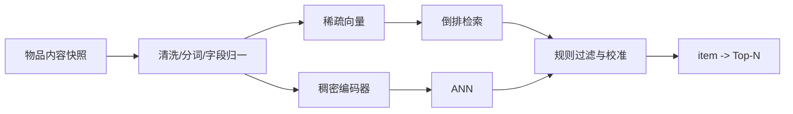

# 内容与属性相似度

内容 I2I 直接比较两个物品自身的文本、类目、品牌、标签和结构化属性。它不要求两个物品已经被同一批用户消费，因此是新品和长尾物品的重要召回来源。

## 1. 相似度语义

内容相似通常表达“描述相近”或“属性相近”，不必然表达共同消费、替代或互补。例如手机与保护壳行为上强相关，但内容字段并不相似；两篇同主题新闻内容高度相似，却可能因重复而不适合同时推荐。

应先定义目标关系，再选择字段：

| 目标 | 适合字段 |
| --- | --- |
| 同主题内容 | 标题、正文、主题标签、实体 |
| 同类替代商品 | 类目、品牌、价格带、规格、功能属性 |
| 同款 SKU | SPU、型号、颜色、尺寸 |
| 同作者或系列 | 作者、创作者、系列 ID、知识实体 |
| 视觉相似 | 主图、视频关键帧、视觉标签 |

## 2. 规则与集合相似度

对标签集合 $T_i,T_j$，Jaccard 相似度为：

$$
J(i,j)=\frac{|T_i\cap T_j|}{|T_i\cup T_j|}
$$

对带权属性，可使用加权 Jaccard：

$$
J_w(i,j)=
\frac{\sum_a\min(x_{ia},x_{ja})}
{\sum_a\max(x_{ia},x_{ja})}
$$

实际商品通常混合精确条件与软相似度。例如先要求类目和适配型号一致，再按品牌、价格、颜色计算相似度。规则近邻可解释、更新快，但同义词、缺失属性和人工标签质量会直接限制覆盖。

## 3. TF-IDF 与 BM25

将每个物品视为文档，词 $t$ 在物品 $i$ 中的 TF-IDF 权重可写为：

$$
x_{it}=tf(t,i)\log\frac{N+1}{df(t)+1}
$$

两个物品使用稀疏向量余弦相似度：

$$
sim(i,j)=\frac{x_i^\top x_j}{\lVert x_i\rVert_2\lVert x_j\rVert_2}
$$

TF-IDF 适合离线 item-item 全文近邻。BM25 原本是 query-document 打分，也可将种子物品的关键词作为查询检索其他物品：

$$
BM25(i,j)=\sum_{t\in i}IDF(t)
\frac{f(t,j)(k_1+1)}{f(t,j)+k_1(1-b+b|j|/avgdl)}
$$

稀疏方法保留关键词解释，对型号、专有名词和长尾实体尤其有效。字段应分开建权重，防止长正文淹没类目、品牌等高价值信号。

## 4. 稠密文本表示

使用预训练文本编码器将标题、描述和属性序列编码为：

$$
z_i=f_\theta(text_i,attributes_i)
$$

未经推荐数据微调的语义模型可以直接做余弦近邻，但它优化的是通用语言语义。进一步可用点击对、同款对或教师相关度进行对比学习、Triplet 训练或蒸馏，使空间对齐推荐关系。

结构化属性常采用字段 embedding 后融合：

$$
z_i=MLP([z_{text};e_{category};e_{brand};e_{price};e_{tags}])
$$

对于新品，所有输入必须在物品首次上线时可得；不能用上线后的点击统计生成历史评测中的新品表示。

## 5. 混合相似度

生产系统很少只依赖一种内容分数。常见组合为：

$$
s(i,j)=\alpha s_{text}+\beta s_{attribute}
+\gamma s_{image}+\delta s_{rule}
$$

各分数应先做分位数、温度或监督校准。规则既可参与打分，也可作为硬过滤，例如：

- 排除相同 SKU，或只保留同一 SPU。
- 要求商品可配送到当前地区。
- 配件必须与种子型号兼容。
- 新闻和短视频限制重复主题或相同内容指纹。

## 6. 离线构建

索引必须记录内容版本、分词器、编码器、字段配置和 ID 映射。内容修改后应增量重编码；若模型版本变化，存量与增量向量不能混用。

## 7. 评测与监控

除用户级 Recall@K 外，应构造同款、同主题、替代等关系标注集，评估 Precision@K、NDCG@K，并进行人工检查。重点分桶包括新品/成熟、文本丰富/缺失、多语言和头部/长尾。

线上监控编码失败率、字段缺失率、OOV、索引年龄、近邻重复率、新品覆盖和与协同通道的增量命中。内容高度相似可能造成信息茧房或重复推荐，应同时监控类目、品牌和主题多样性。

通用 query-to-item 内容召回及示例见[内容检索召回](../../../其他召回方式/内容检索召回/README.md)；本章关注以历史物品作为查询的 item-to-item 用法。