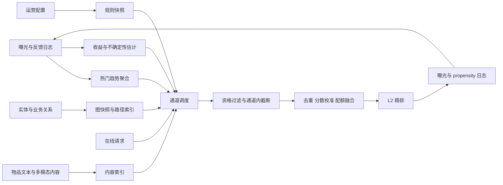

# 其他召回方式综述

双塔、协同过滤、I2I 和生成式召回主要学习“这个用户可能喜欢什么”。工业召回系统还必须回答另外几类问题：用户没有足够历史时拿什么兜底，刚发布的物品如何进入候选，突发热点如何在几分钟内生效，知识关系如何参与发现，运营供给如何确定性进入链路，以及系统怎样为未知物品主动收集反馈。

这些问题无法仅靠扩大个性化模型解决。它们需要热门与趋势、内容检索、图与知识、规则与运营、探索五类补充通道。这里的“其他”表示它们不按某一种主模型结构归类，并不表示它们次要。在冷启动、热点、高时效或强运营场景中，它们可能承担主要流量。

## 1. 为什么需要补充召回通道

主召回模型通常从历史交互中学习相关性，因而存在四个结构性缺口：

1. **观测缺口**：新用户、新物品和长尾物品缺少行为数据。
2. **时效缺口**：离线模型和索引更新赶不上突发热点、库存变化或实时意图。
3. **关系缺口**：单一用户-物品匹配不容易表达作者、实体、社交和知识路径。
4. **决策缺口**：日志只记录已曝光物品的反馈，模型会重复选择已知高收益内容，无法主动降低未知性。

此外，活动供给、公共信息和协议保量属于确定性业务要求，不应指望统计模型偶然召回。补充通道的价值因此包括三部分：弥补不可观测信息、缩短信号生效时间，以及提供可控的候选责任。

## 2. 分类方法

### 2.1 按候选的主要证据分类

| 类别 | 候选为何被召回 | 主要解决的问题 | 常见服务产物 |
| --- | --- | --- | --- |
| 热门与趋势召回 | 群体近期正在消费或消费增速异常 | 冷用户兜底、突发热点、故障降级 | 分窗口、场景、地域的 Top-K 榜单 |
| 内容检索召回 | 物品内容与显式或隐式查询语义匹配 | 新品、长尾、显式意图、跨域迁移 | 倒排表、稀疏索引、内容向量索引 |
| 图与知识召回 | 用户或种子与目标之间存在可信关系路径 | 多跳发现、关系意图、可解释候选 | 邻接表、路径候选、PPR、图向量 |
| 规则与运营召回 | 请求命中已审批的确定性配置 | 活动注入、公共供给、协议候选、兜底 | 版本化规则快照和候选集合 |
| 探索召回 | 候选预期收益尚可且不确定性较高 | 新品试投、长尾发现、反馈采集 | 带选择概率与预算信息的候选 |

分类依据是“该通道使用什么证据承担什么责任”，而不是模型结构。内容召回可以使用双塔和 ANN，图召回可以导出 embedding，趋势榜也可以加入用户分群。只要候选成立的核心理由分别是内容、关系或群体时效，它们就应按相应通道治理和评测。

### 2.2 按个性化程度分类

- **全局通道**：全站热门、全局运营名单。覆盖稳定，但容易千人一面。
- **分群通道**：地域趋势、类目榜单、人群活动。成本和个性化程度居中。
- **请求级通道**：内容查询、图路径、Contextual Bandit。更精准，但在线计算和数据要求更高。

### 2.3 按更新速度分类

- **批处理**：日级榜单、知识图快照、长期运营计划。
- **流式或准实时**：分钟级趋势、实时内容索引、用户行为触发的候选刷新。
- **请求时计算**：在线图扩展、动态规则匹配、Bandit 采样。

同一种方法可以有多种实现。例如热门榜既可每日离线计算，也可通过流式窗口分钟级更新；选择取决于信号半衰期和服务预算。

### 2.4 按系统职责分类

| 职责 | 典型通道 | 成功标准 |
| --- | --- | --- |
| 兜底 | 热门、规则 | 候选不为空、质量稳定、低延迟 |
| 增量覆盖 | 内容、图与知识 | 独占候选率、增量 Recall、长尾覆盖 |
| 实时响应 | 趋势、实时内容、会话图 | 事件到可召回延迟、热点捕获率 |
| 确定性供给 | 规则与运营 | 命中准确率、配额兑现、可审计性 |
| 主动学习 | 探索 | 单位反馈成本、累计遗憾、毕业率 |

不同职责不能只用同一个 Recall@K 排名。例如规则通道是否准确执行配置，比它单独的历史点击率更重要；探索通道短期 CTR 略低，也可能因为获取了高价值反馈而合理。

## 3. 五类方法的核心原理

### 3.1 热门与趋势：估计群体强度及其变化

热门召回估计物品在一个时间范围内的总体消费强度。基础形式是对事件做加权和时间衰减：

$$
H(i,t)=\sum_{e\in E_i}w_{a_e}\exp\left(-\frac{t-t_e}{\tau}\right)
$$

其中 $w_{a_e}$ 区分曝光、点击、有效消费、购买和负反馈，$\tau$ 控制记忆长度。趋势召回关注“增长是否超出常态”，可比较短窗和长窗：

$$
T(i,t)=\frac{H_{short}(i,t)+\alpha}{H_{long}(i,t)+\beta}
$$

它适合捕获突发新闻、赛事、热歌和促销商品，但必须处理小样本爆炸、机器人流量和头部垄断。工业系统通常同时维护全局、场景、地域、类目和人群榜单，并按粒度逐级回退。

详见[热门与趋势召回](./热门与趋势召回/README.md)。

### 3.2 内容检索：从语义证据匹配候选

内容召回将请求转换为查询 $q$，把物品表示为文档或向量 $d_i$。它包括：

- 标签、类目和实体的精确倒排匹配。
- TF-IDF、BM25 等稀疏词项检索。
- 文本、图像、音频或多模态 encoder 的稠密向量检索。
- 稀疏与稠密结果的混合检索。

BM25 使用词频、逆文档频率和长度归一化计算相关性；稠密检索则常使用余弦或内积：

$$
s(q,i)=\frac{f(q)^\top g(d_i)}{\lVert f(q)\rVert\lVert g(d_i)\rVert}
$$

内容召回不依赖目标物品已有行为，因此是新品召回的基础设施。其局限是“描述相似”并不等于“消费偏好相同”，且标题党、错误标签和重复内容会直接污染结果。

详见[内容检索召回](./内容检索召回/README.md)。

### 3.3 图与知识：沿关系路径发现候选

图召回将用户、物品、作者、商家、主题和知识实体表示为节点，将交互、关注、创作、属于和语义关系表示为带类型的边。候选可以来自邻居扩展、限定 metapath、随机游走、Personalized PageRank 或图表示学习。

PPR 从种子分布 $p_0$ 出发反复传播：

$$
p_{t+1}=\alpha p_0+(1-\alpha)P^\top p_t
$$

重启概率 $\alpha$ 防止结果完全漂向全局高度节点。异构图还要区分边类型、方向、时间和可信度；“两跳可达”本身不代表关系有业务意义。

详见[图与知识召回](./图与知识召回/README.md)。

### 3.4 规则与运营：执行确定性候选配置

规则召回可以形式化为：请求 $x$ 命中条件 $C_r(x)$ 时，从规则候选集 $I_r$ 中选取不超过配额 $q_r$ 的物品：

$$
R(x)=\bigcup_{r:C_r(x)=1}\operatorname{Top}_{q_r}(I_r)
$$

规则必须包含生效时间、场景、人群、地域、优先级、配额、责任人和版本。它负责“应进入候选”，不负责绕过 Index 池准入，也不等于保证最终曝光。配置系统需要 schema 校验、冲突检测、灰度、审批、自动过期和回滚。

详见[规则与运营召回](./规则与运营召回/README.md)。

### 3.5 探索：用有限机会降低不确定性

探索召回面对的是部分反馈问题：系统只观察被展示动作的奖励。若始终选择当前均值最高的物品，新品永远没有机会证明自身。Bandit 方法在预期收益和不确定性之间权衡。

UCB 的典型形式为：

$$
\operatorname{UCB}_i(t)=\hat\mu_i(t)+c\sqrt{\frac{\log t}{n_i(t)}}
$$

第二项让样本少但潜力高的候选获得受控机会。Thompson Sampling 则从每个候选的收益后验采样。探索不是把随机物品塞给用户，而是先经过相关性、质量和安全门槛，再在预算内选择信息价值较高的候选。

详见[探索召回](./探索召回/README.md)。

## 4. 如何判断应该使用哪一种方法

| 业务现象 | 优先考虑 | 原因 |
| --- | --- | --- |
| 新用户没有行为历史 | 分场景热门、内容、少量探索 | 先提供稳定先验，再采集个性化反馈 |
| 新物品没有交互 | 内容、关系、探索 | 内容与供给关系负责初始匹配，探索验证真实效用 |
| 突发热点生效过慢 | 流式趋势 | 直接聚合近期群体信号，不等待模型重训 |
| 用户明确表达关键词或类目 | 稀疏/稠密内容检索 | 显式意图比长期协同偏好更直接 |
| 需要同作者、同系列、同实体扩展 | 图与知识 | 关系路径比纯相似度更准确、更可解释 |
| 活动内容必须进入候选 | 规则与运营 | 需要确定性、配额、审计和自动失效 |
| 长尾长期没有反馈 | 探索 | 仅靠历史最优策略无法消除选择偏差 |
| 主模型或索引故障 | 热门、规则快照 | 依赖少、延迟稳定、易于降级 |

一个问题往往需要多类方法配合。例如新品冷启动可采用“内容生成初始人群候选 + 图关系限定场景 + 探索分配小额曝光 + 行为积累后进入协同和双塔”，而不是选择一个所谓的新品算法解决全部阶段。

## 5. 统一的离线到在线链路



### 5.1 数据生产

五类通道依赖不同数据，但都必须遵循事件时间、版本和可追溯性要求：

- 热门与探索依赖准确曝光、反馈和负反馈日志。
- 内容召回依赖当时可见的文本、多模态特征和内容审核结果。
- 图召回依赖带方向、类型、权重和时间的边。
- 规则召回依赖经过审批的配置与候选集合版本。

### 5.2 离线产物

常见产物包括榜单快照、倒排索引、内容 embedding、邻接表、PPR Top-K、规则编译结果、探索参数和候选池。这些产物必须绑定 catalog 快照，并支持原子发布和快速回滚。

### 5.3 在线调度

不是每次请求都运行全部通道。调度器可根据用户状态、请求场景、时延预算和通道健康状态决定：

- 冷用户增加热门与内容配额。
- 有明确查询时增加内容检索配额。
- 详情页根据当前物品启用关系扩展。
- 活动期间启用对应规则快照。
- 满足安全条件且仍有预算时启用探索。

### 5.4 过滤、去重与融合

各通道先执行 Index 池资格和自身约束，再进入统一融合。若物品被多个通道命中，应保留来源集合，而不是简单删除重复记录：

```text
item_id -> {
	channels: [trend_region, content_dense, author_graph],
	raw_scores: {...},
	reasons: [...],
	exploration_propensity: ...
}
```

不同通道原始分数不可直接相加。榜单热度、BM25、余弦相似度、PPR 和 Bandit 后验处于不同尺度，应通过分位数、Platt/Isotonic 校准、学习融合或固定配额组合。通道配额既控制质量，也防止一个高分通道吞掉全部候选。

## 6. 方法之间的边界与组合

### 6.1 热门与探索不是相反策略

热门利用已知群体收益，探索为未知候选分配机会。合理系统会用热门保障基线，再用有限探索预算发现可能成为下一批高质量供给的物品。

### 6.2 内容召回与内容双塔的边界

若模型通过查询和物品内容训练向量，它在实现上属于双塔；若本节讨论其不依赖物品历史、用于新品与语义意图的职责，则属于内容召回。模型分类与业务通道分类可以同时成立。

### 6.3 图召回与 GraphCF 的边界

GraphCF 主要从用户-物品交互图学习协同 embedding；图与知识召回还包括作者、实体、社交、类目等显式关系以及路径约束。若只是导出 GraphCF item embedding 做近邻，它更接近协同或 I2I；若候选由关系路径成立，则属于本节图召回。

### 6.4 规则召回与过滤的边界

- Index 池和过滤回答“物品是否允许推荐”。
- 规则召回答“合格物品是否应被注入候选”。
- L3 后处理回答“最终列表如何满足展示约束”。

运营优先级不能绕过安全、库存和合规资格；召回成功也不能等同于最终展示兑现。

### 6.5 探索召回与随机流量的边界

探索必须有明确候选池、后验或置信度、选择概率、预算和停止条件。没有 propensity 日志、质量门槛与毕业机制的随机曝光，无法可靠学习，也不应称为探索系统。

## 7. 统一评测框架

### 7.1 通用指标

- 候选量、空结果率、P50/P95/P99 延迟和超时率。
- Recall@K、NDCG@K、L2 采用率和最终曝光率。
- 独占候选率、与主召回重合率、融合后的增量 Recall。
- 物品、类目、作者和长尾覆盖率。
- 数据与索引年龄、发布失败率和降级率。

### 7.2 职责专属指标

| 通道 | 重点指标 |
| --- | --- |
| 热门与趋势 | 热点捕获延迟、榜单稳定性、异常流量占比、回退层级 |
| 内容检索 | OOV、查询空结果、新品覆盖、语义相关性、重复内容率 |
| 图与知识 | 路径准确性、每跳膨胀、孤立节点率、高度节点集中度 |
| 规则与运营 | 配置命中率、候选兑现率、冲突率、无效物品率、审计完整性 |
| 探索 | propensity 完整率、累计遗憾、单位有效反馈成本、毕业/淘汰率 |

### 7.3 增量价值评估

补充通道不能只独立计算 Recall。应在固定主召回集合 $C_{base}$ 上加入通道候选 $C_m$，比较：

$$
\Delta Recall@K=Recall@K(C_{base}\cup C_m)-Recall@K(C_{base})
$$

还应做通道消融、候选配额曲线和相同延迟预算下的比较。若一个通道独立 Recall 很高但结果几乎被主通道覆盖，它的在线增量价值可能很小；反之，低频但独占命中新品或长尾的通道可能很有价值。

## 8. 常见失败模式

- **热门固化曝光偏差**：越曝光越热门，长尾永远无法积累反馈。
- **趋势被异常流量操纵**：刷量或单次外部事件污染短窗榜单。
- **内容相关但消费无效**：标题和标签相似，却不符合质量、价格或使用场景。
- **图扩展爆炸**：高度节点和无区分关系导致候选数量指数增长。
- **规则永久化**：活动没有自动过期，成为无人理解的隐性业务逻辑。
- **探索无日志**：未记录候选集合和选择概率，后续无法反事实评估。
- **跨通道分数硬加**：不同尺度的分数造成某个通道系统性垄断。
- **只看召回不看采用**：大量候选在 L2 前被过滤或从未进入最终曝光。

## 9. 一个完整场景：新品短视频进入系统

1. 视频发布后先经过 Index 池资格、审核和基础质量门槛。
2. 内容召回根据标题、视觉、音频、作者和主题匹配初始受众。
3. 图召回沿作者关注、同系列和主题实体关系补充候选。
4. 探索召回在相关人群中分配小额曝光，并记录 propensity 与反馈。
5. 若消费速度显著高于同龄内容，趋势通道扩大覆盖。
6. 若属于专题活动，规则通道按配置注入相应场景，但仍受安全和配额限制。
7. 积累足够交互后，物品进入 I2I、协同过滤和双塔等主召回通道。
8. 若负反馈或质量指标触发阈值，探索熔断，Index 池状态也可使所有通道立即失效。

这个过程说明五类方法不是互斥选项，而是供给生命周期中的不同机制。

## 10. 学习与设计顺序

建议按以下顺序阅读：

1. [热门与趋势召回](./热门与趋势召回/README.md)：理解最简单、最可靠的群体先验和兜底机制。
2. [内容检索召回](./内容检索召回/README.md)：掌握倒排、稀疏、稠密及新品能力。
3. [图与知识召回](./图与知识召回/README.md)：理解关系路径、随机游走和异构图治理。
4. [规则与运营召回](./规则与运营召回/README.md)：建立确定性配置、职责边界和审计意识。
5. [探索召回](./探索召回/README.md)：最后学习部分反馈、Bandit、propensity 和安全预算。

设计真实系统时，先明确业务缺口和候选责任，再选择方法；不要因为某个算法流行，就为它寻找一个并不存在的问题。
