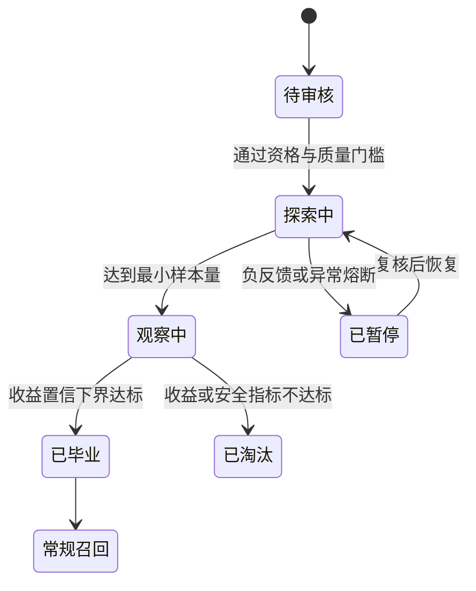

# 探索召回

探索召回为收益尚不确定的新品、长尾物品或新策略分配受控候选机会，以收集能改变后续决策的反馈。它解决的是曝光机制中的“没有展示就没有反馈，没有反馈就永远无法入选”，而不是随机降低推荐质量。

本章关注 L1 候选生成。更完整的冷启动状态机、反馈闭环和反事实评价见[冷启动探索章节](../../../../冷启动问题/方法详解/Exploration.md)。

## 1. 问题本质与方法边界

常规召回倾向选择当前估计收益最高的物品，但估计值只来自已获得曝光的样本。若新品从未曝光，它的收益未知；若系统持续利用已有高分物品，它就永远没有机会获得反馈。这是典型的选择偏差和部分反馈问题。

探索需要同时处理：

- **利用**：选择当前预期收益高的候选，保护短期体验。
- **探索**：选择信息价值高但尚不确定的候选，改善未来决策。
- **约束**：让质量、安全、预算和公平性始终处在允许范围内。

探索召回只负责把受控候选送入 L1。候选进入 L2 不等于获得曝光；若 L2 总把它们淘汰，就收集不到反馈。因此生产系统通常为探索设置独立候选配额，并在 L3 保留有限、可审计的展示机会。

探索与随机流量也不同。随机流量是实验工具；探索策略会利用上下文、收益估计和不确定性，有目的地选择最有信息价值的动作。

## 2. 方法分类

| 方法 | 选择逻辑 | 特点 |
| --- | --- | --- |
| $\epsilon$-greedy | 以 $1-\epsilon$ 利用，以 $\epsilon$ 随机探索 | 简单、propensity 易记录，探索效率一般 |
| UCB | $\hat\mu_i+c\sqrt{\log t/n_i}$ | 乐观面对不确定性，无需采样后验 |
| Thompson Sampling | 从每个动作后验采样并选择最大值 | 自然平衡利用与探索 |
| Contextual Bandit | 根据用户、物品和场景估计收益与不确定性 | 可做匹配人群探索，工程复杂度较高 |
| 受约束 Bandit | 在预算、安全或公平约束下优化收益 | 更符合工业系统，求解和监控更复杂 |

召回侧可先按内容相关、质量和安全约束形成探索池，再用 Bandit 分配有限名额。全局随机新品池会把不相关物品推给用户，既浪费预算，也使反馈难以解释。

### 2.1 $\epsilon$-greedy

设动作集合为 $A(x)$，当前估计最优动作为 $a^*$。单次选择概率为：

$$
p(a\mid x)=\frac{\epsilon}{|A(x)|}+
(1-\epsilon)\mathbb I(a=a^*)
$$

它容易实现和审计，但随机探索不关心动作的不确定性，候选很多时会浪费预算。Top-K 不放回选择中，每选一个动作，剩余集合都会变化，因此必须记录每一步的条件概率，不能只记录一个全局 $\epsilon$。

### 2.2 UCB

经典 UCB 为每个动作构造乐观上界：

$$
UCB_i(t)=\hat\mu_i+c\sqrt{\frac{\log t}{n_i}}
$$

$n_i$ 少时不确定性项大，动作会获得试验机会。它适合奖励相对平稳、动作数可控的场景；新品持续涌入、动作规模很大时，需要按类目共享统计或使用上下文模型。

### 2.3 Thompson Sampling

二元奖励可用 Beta-Bernoulli 后验：

$$
	heta_i\sim \operatorname{Beta}(\alpha_i,\beta_i),
\qquad a=\arg\max_i\theta_i
$$

正反馈更新 $\alpha_i$，负反馈更新 $\beta_i$。先验决定冷启动阶段的探索强度；分层先验可让新品从相似类目或作者继承统计。复杂奖励通常需要其他后验或近似采样模型。

### 2.4 Contextual Bandit

上下文 Bandit 估计 $\mathbb E[r\mid x,a]$，其中 $x$ 包含用户、场景和时间，$a$ 包含物品特征。LinUCB 示例为：

$$
s(x,a)=\hat\theta^T\phi(x,a)+
\alpha\sqrt{\phi(x,a)^TA^{-1}\phi(x,a)}
$$

第一项是预期收益，第二项是上下文相关的不确定性。它能把新品探索给更可能喜欢的人群，但模型错误、特征漂移和不确定性校准会直接影响试错成本。

## 3. 探索池构造

Bandit 不应面对全量 Index 池。先构建满足最低相关和质量要求的探索池：

1. 通过 Index 池的安全、合规、库存和地域资格。
2. 使用内容、类目、作者或知识关系限定与请求相关的候选。
3. 排除用户已看、明确负反馈和超过频控的物品。
4. 应用品质先验、最小审核等级和供给健康度门槛。
5. 只保留仍有探索预算、未毕业也未淘汰的候选。

探索池过宽会损害体验，过窄则无法打破曝光偏差。应监控入池率、池规模、候选覆盖和各过滤原因。

## 4. 奖励设计与归因

奖励应对应业务目标并处理延迟，例如有效观看、收藏、成交、负反馈和退款的组合。只使用点击容易奖励标题党。每次选择必须记录请求上下文、候选集合、策略版本、动作、选择概率 propensity 和后续奖励。

一个简化复合奖励可写为：

$$
r=w_1\mathbb I(\text{有效消费})+w_2\mathbb I(\text{收藏})
-w_3\mathbb I(\text{负反馈})-w_4\mathbb I(\text{退款})
$$

需要预先定义归因窗口和多次曝光规则。点击可立即到达，完播、成交和退款可能延迟数小时或数日。过早把“尚未返回”当成零奖励会系统性偏向短反馈物品。常见处理包括延迟窗口、成熟样本训练、延迟模型和对账更新。

若一个请求选择多个物品，还要处理位置偏差和组合干扰。展示概率不是仅由 L1 决定，应记录从召回、排序、L3 到实际渲染的完整决策。

## 5. Propensity 与决策日志

Propensity 是日志策略在给定上下文和候选集合下选择动作的概率：

$$
p_i=\pi_0(a_i\mid x_i,A_i)
$$

日志至少包含：

- 请求与用户上下文快照。
- 合格候选集合或可重建它的版本标识。
- 策略、模型、探索池和特征版本。
- 被选动作、位置、随机种子或采样轨迹。
- 每一步条件 propensity。
- 是否经过 L2、L3 并最终渲染。
- 奖励值、事件时间和归因状态。

记录错概率比不记录更危险，因为 IPS 会把错误放大。确定性策略对未选择动作的概率为零，无法离线评价会选择这些动作的新策略；这称为缺少 support 或 positivity。

## 6. 预算、安全与约束

至少设置以下护栏：用户级探索频控、物品级累计预算、场景总流量比例、质量门槛、敏感人群排除、负反馈熔断和最大损失阈值。

预算可分层定义：

- 请求级：每次最多多少探索候选或展示位。
- 用户级：一段时间内最多多少探索曝光。
- 物品级：总曝光、单人群和单日预算。
- 场景级：探索流量比例及业务损失上限。
- 供给组级：类目、作者或商家的机会上下限。

安全约束必须在采样前执行；采样后再过滤会改变真实选择概率。出现安全事件、负反馈异常、收益显著劣化或日志缺失时，应自动熔断到纯利用策略。

## 7. 候选生命周期

探索不是永久流量通道。物品可采用以下状态机：

毕业不能只看样本均值，应同时考虑样本量、不确定性、分群表现和长期指标。例如当收益置信下界超过准入门槛，且风险指标合格时进入常规召回。超时仍无法得到足够样本的候选应降级或淘汰，不能无限占用预算。

## 8. 非平稳性与共享信息

用户兴趣、内容热度和物品质量会变化，历史观测不能永久等权。可使用滑动窗口、指数衰减、折扣后验或变化点检测。变化太快时，算法会把过时确定性误当成真实把握。

大规模物品无法为每个 arm 独立积累足够样本。常见做法是：

- 按类目、作者、价格带或内容 embedding 共享先验。
- 用上下文模型预测均值和不确定性。
- 分层 Bandit 先选供给组，再在组内选物品。
- 对新品使用内容质量先验，并随真实反馈校正。

共享提高样本效率，也会传播分组偏差，因此需要按供给群体监控机会和收益。

## 9. 在线服务架构

典型流程是：探索状态服务提供未毕业候选和剩余预算，相关性检索形成请求级探索池，策略服务按上下文采样，预算服务原子扣减或预留，结果与 propensity 一起进入 L1 融合。曝光确认后再对账预算，反馈流异步更新奖励和后验。

关键工程问题包括：

- 并发请求不能超卖物品预算。
- 请求重试需幂等，不能重复扣减。
- 采样策略和 propensity 计算必须使用同一候选快照。
- 策略超时应回退到确定性高质量候选。
- 模型、候选池、预算和日志版本必须可关联。

## 10. 离线策略评价

离线回放只能评价日志策略覆盖到的动作。IPS 使用 $\pi(a|x)/p(a|x)$ 修正策略差异，但 propensity 太小时方差会很大；SNIPS 和 Doubly Robust 可改善稳定性，仍不能修复缺少覆盖或错误日志。上线需小流量渐进实验。

IPS 估计为：

$$
\hat V_{IPS}(\pi)=\frac{1}{N}\sum_{i=1}^{N}
r_i\frac{\pi(a_i\mid x_i)}{p_i}
$$

SNIPS 用权重和归一化：

$$
\hat V_{SNIPS}(\pi)=
\frac{\sum_i r_i w_i}{\sum_i w_i},\qquad
w_i=\frac{\pi(a_i\mid x_i)}{p_i}
$$

Doubly Robust 同时使用奖励模型和重要性加权，在 propensity 或奖励模型至少一个正确时具有更好性质。实践中仍需做权重截断、有效样本量和方差报告，并检查目标策略与日志策略的 support 重叠。

离线 OPE 不能发现全新的系统交互、用户长期行为变化或安全风险。它用于筛除明显不佳策略，最终结论仍需要小流量在线实验。

## 11. 评测与监控

监控探索曝光占比、预算消耗速度、单位有效反馈成本、累计遗憾、毕业/淘汰率、负反馈、安全事件、不同供给群体机会，以及探索候选被 L2 采用和最终曝光的比例。

指标应分为：

- **短期效用**：CTR、有效消费、成交、负反馈和实验增量。
- **学习效率**：单位预算有效样本、置信区间收缩速度和累计遗憾。
- **供给结果**：新品覆盖、毕业率、淘汰率和毕业耗时。
- **安全与公平**：风险事件、损失阈值、不同供给组机会和用户体验差异。
- **系统健康**：propensity 缺失/异常、预算对账差异、策略延迟和版本分布。

## 12. 适用场景与常见误区

适合：新品冷启动、长尾供给发现、新作者/商家扶持、新模型或召回通道试验，以及需要持续适应收益变化的候选分配。

不适合：不能承担任何试错成本的高风险场景、无法记录动作概率和真实曝光的系统、奖励极难归因且没有代理目标的任务。

常见误区：

- **探索就是随机推荐**：高质量探索只在相关、安全的候选池内分配不确定性预算。
- **召回后记录 $\epsilon$ 就是 propensity**：Top-K、过滤、去重和下游展示都会改变真实概率。
- **点击是最快也最好的奖励**：它可能放大标题党和短期行为。
- **样本均值高即可毕业**：小样本幸运值需要不确定性和风险约束。
- **IPS 能评价任意新策略**：没有日志策略覆盖的动作无法可靠反事实评价。
- **Bandit 会自动公平**：纯收益优化可能进一步偏向已有优势供给。

## 13. 代码

[example.py](./example.py) 实现不放回的 $\epsilon$-greedy 候选选择，记录每一步条件 propensity，并根据候选资格与剩余预算过滤。示例使用固定随机种子以便复现，但未实现并发预算扣减、延迟奖励、状态机和离线 OPE。