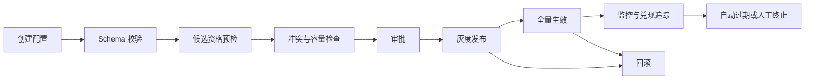

# 规则与运营召回

规则与运营召回根据活动配置、人工精选、供给协议或确定性业务条件产生候选。它适合节日专题、赛事直播、广告/商家保量、公共服务信息和模型故障兜底。规则召回的价值是可控与可审计，不是绕过质量、安全或合规约束。

## 1. 方法分类

| 类型 | 候选来源 | 典型场景 | 是否保证曝光 |
| --- | --- | --- | --- |
| 人工精选 | 编辑或专家维护名单 | 专题、精品、公共信息 | 否，只保证进入候选 |
| 活动规则 | 活动与请求条件匹配 | 节日、赛事、促销 | 否，受配额和下游策略约束 |
| 供给协议 | 商家、作者或业务供给池 | 合约候选、生态扶持 | 取决于独立展示策略，不应在 L1 隐式保证 |
| 动态查询规则 | 从类目、标签、库存等集合取候选 | 大规模运营池 | 否，需要运行时过滤 |
| 故障兜底 | 预审的稳定候选快照 | 模型、索引或特征故障 | 只保证候选可用 |

规则召回不是随手编写的 `if-else`。生产系统需要结构化配置、编译发布、优先级和配额语义、全链路追踪以及自动失效。

## 2. 与 Index 池、过滤和 L3 的边界

- **Index 池资格**决定物品是否允许被推荐，例如上架、库存、地域和合规状态。
- **规则召回**决定哪些合格物品应进入 L1 候选，例如命中某活动或场景名单。
- **L2 排序**评估候选对当前用户的效用，除非产品定义了独立保量策略。
- **L3 后处理**决定候选在最终列表中的硬约束、去重、多样性和展示位置。

因此“运营希望曝光”不能修改 Index 准入，也不能保证最终展示。L1 只携带活动、优先级和召回原因给下游，最终是否曝光仍由全链路策略决定。

若业务确实要求曝光保证，应由独立、显式的保量或广告系统负责预算与兑现，不应通过把规则候选伪装成高相关分数实现。

## 3. 配置模型

一条规则至少包含：

| 字段 | 含义 |
| --- | --- |
| `rule_id/version` | 稳定标识与配置版本 |
| `start/end` | 生效时间与自动失效时间 |
| `scene/regions/cohorts` | 请求匹配条件 |
| `item_ids` | 候选集合或动态供给查询 |
| `priority/quota` | 规则间顺序及单请求上限 |
| `owner/reason` | 责任人、审批和解释信息 |

还应包含 `status、exclusive_group、fallback、created_at、approved_by` 等治理字段。规则条件应采用有限 DSL 或结构化 schema，例如：

```yaml
when:
	scene: feed
	regions: [east]
	cohorts: [new_user]
	time_range: [start, end)
source:
	candidate_set: festival-2026-v3
policy:
	priority: 50
	quota: 8
	exclusive_group: homepage_campaign
```

在线服务不应解释任意脚本。发布系统应把配置编译成按场景、地域和人群索引的只读快照。

## 4. 规则生命周期



配置发布应经过 schema 校验、候选资格预检、冲突检测、灰度、双人审批和回滚。必须设置失效时间，避免活动结束后成为永久隐性逻辑。规则和候选集要独立版本化，确保同一规则版本引用不可变候选快照。

## 5. 冲突、优先级与配额

在线先筛选匹配场景、地域、人群和时间的规则，再按优先级取候选；同一物品保留全部命中规则。规则配额应限制候选注入量，避免淹没个性化通道。多个规则冲突时使用明确的优先级、互斥组和总预算，不依赖配置遍历顺序。

需要区分三个概念：

- **优先级**：多个规则同时竞争有限候选位时的处理顺序。
- **配额**：单条规则或规则组最多注入多少候选。
- **互斥组**：同一请求最多激活其中一条或一组规则。

同优先级规则必须有确定性 tie-breaker，例如稳定 `rule_id`，否则多实例遍历顺序会造成结果漂移。配额应在资格过滤后计算，避免规则名义取满但实际全是无效物品。

同一物品命中多条规则时只保留一个候选实体，但携带全部 `rule_ids`。若规则之间存在“必须出现”和“不得同时出现”等更强约束，它们应由显式约束求解或 L3 执行，而不是依赖列表顺序。

## 6. 候选来源

### 6.1 静态名单

适合小规模人工精选，易审计、易回滚。缺点是维护成本高、容易过期。

### 6.2 动态供给集合

规则引用查询定义，例如“活动类目下有库存且审核通过的商品”。应在离线或准实时阶段物化集合，在线不要扫描 catalog 或执行任意数据库查询。

### 6.3 模板与轮播池

大型候选池可按质量、时间或运营顺序预排序，在线从游标位置取候选并应用频控。轮播状态需要幂等和一致性设计，不能让重试请求重复消耗预算。

## 7. 在线服务

高频配置可编译为按场景/地域的只读快照，在线无需执行任意表达式。物品列表较大时存储集合引用，不将整个名单复制到每条规则。

典型请求流程为：

1. 根据场景、地域、人群和时间查找匹配规则。
2. 处理互斥组，并按优先级稳定排序。
3. 读取候选集，执行 Index 池资格和用户级频控。
4. 按规则配额截断，跨规则去重并保留全部来源。
5. 输出 `rule_id、version、priority、reason` 给融合和日志系统。

规则服务应设严格 deadline，并保留最近成功快照。配置中心不可用时继续服务已加载版本，而不是让在线请求同步依赖配置数据库。

## 8. 保量与兑现

L1 候选注入率、L2 采用率、最终曝光率是三个不同漏斗。若业务要求曝光目标，需要记录：

$$
	ext{candidate} \rightarrow \text{ranked} \rightarrow
	ext{selected} \rightarrow \text{rendered}
$$

只监控规则召回次数无法判断活动是否真实展示。反过来，也不能为了提高兑现率而绕过安全与资格。预算不足、用户体验护栏和库存变化都应成为可解释的未兑现原因。

## 9. 安全、审计与权限

- 按业务域实施最小权限，创建、审批和发布角色分离。
- 保存配置 diff、审批记录、发布时间、操作者和回滚记录。
- 对候选集做安全、库存、地域和敏感内容预检。
- 限制单规则和全局最大候选量，防止配置错误压垮服务。
- 对高风险场景使用双人审批和紧急停止开关。
- 自动识别无 owner、即将过期和长期未命中的规则。

## 10. 监控与评测

- 生效规则数、无主规则数、即将过期和异常长期规则数。
- 匹配请求率、原始/去重/过滤后候选量、配额使用率和冲突率。
- 无效物品率、配置发布失败、版本分布和回滚次数。
- L2 采用率、最终曝光率、增量业务价值及对自然推荐的挤占率。

上线前应做请求回放和属性测试：同一输入与版本结果必须确定；结束时间采用一致的半开区间；规则顺序变化不应改变结果；无效物品不能消耗配额；过期和未审批规则永不生效。

## 11. 适用场景与常见误区

适合：节日专题、赛事直播、公共服务信息、人工精选、协议候选、生态扶持、紧急通知和系统故障兜底。

常见误区：

- **规则优先级等于最终排序分**：优先级只处理规则内部竞争，不应伪造用户效用。
- **规则召回可以绕过 Index 池**：安全、合规、库存和地域资格始终优先。
- **活动结束后手工删除即可**：必须自动过期并保留历史审计。
- **配置可以在线执行任意表达式**：任意脚本带来性能、安全和不可预测性。
- **召回量等于曝光兑现**：必须追踪完整漏斗及未兑现原因。
- **规则越多业务越灵活**：无治理的规则会形成不可理解、不可测试的隐性系统。

## 12. 代码

[example.py](./example.py) 展示带时间、场景、地域、优先级和配额的确定性规则召回，并在召回后执行资格过滤。示例没有实现审批、DSL 编译、互斥组、灰度发布和兑现追踪。