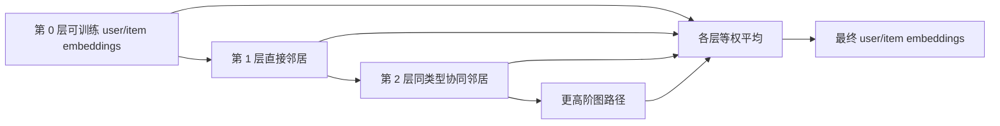
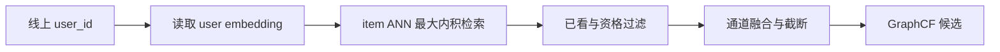

# GraphCF：LightGCN

GraphCF（Graph Collaborative Filtering）把用户与物品交互表示成二部图，通过图上的邻居传播学习 user/item embedding。它仍然只依赖协同行为，但与直接学习 ID embedding 的 MF 相比，GraphCF 在前向计算中显式聚合一跳和多跳邻居。

本目录实现最小 LightGCN：第 0 层是可训练 user/item ID embedding，后续层只执行规范化邻接矩阵传播，最终对所有层取平均，并使用 BPR loss 训练 Top-K 排序。

## 1. 从交互矩阵到二部图

设用户-物品交互矩阵为：

$$
R\in\{0,1\}^{|\mathcal U|\times|\mathcal I|}
$$

用户和物品组成节点集合：

$$
\mathcal V=\mathcal U\cup\mathcal I
$$

每个正交互 $(u,i)$ 构成一条无向边。按“用户节点在前、物品节点在后”的顺序排列，邻接矩阵为：

$$
A=
\begin{bmatrix}
0&R\\
R^\top&0
\end{bmatrix}
$$

它没有 user-user 或 item-item 直接边。二跳邻接为：

$$
A^2=
\begin{bmatrix}
RR^\top&0\\
0&R^\top R
\end{bmatrix}
$$

因此二跳用户关系对应 UserCF 的用户共现，二跳物品关系对应 ItemCF 的物品共现。GraphCF 不直接物化这些高阶共现矩阵，而是让 embedding 沿边逐层传播。

## 2. 节点编号与第 0 层 embedding

[model.py](./model.py) 将节点编号定义为：

```text
用户节点: [0, num_users)
物品节点: [num_users, num_users + num_items)
```

模型包含两张可训练参数表：

$$
U^{(0)}\in\mathbb R^{|\mathcal U|\times d},
\qquad
V^{(0)}\in\mathbb R^{|\mathcal I|\times d}
$$

拼接后得到全部节点的第 0 层表示：

$$
E^{(0)}=
\begin{bmatrix}
U^{(0)}\\
V^{(0)}
\end{bmatrix}
\in\mathbb R^{(|\mathcal U|+|\mathcal I|)\times d}
$$

第 0 层与 MF 的 ID embedding 相似，但 LightGCN 不直接用它完成最终打分，而是先进行图传播。

## 3. 规范化邻接矩阵

设节点 $x$ 的度为 $d_x$，度矩阵为：

$$
D=\operatorname{diag}(d_1,d_2,\ldots)
$$

LightGCN 使用对称规范化邻接矩阵：

$$
	ilde A=D^{-1/2}AD^{-1/2}
$$

对于交互边 $(u,i)$，双向边权均为：

$$
	ilde A_{u,i}=\tilde A_{i,u}
=\frac{1}{\sqrt{d_ud_i}}
$$

该归一化降低高活跃用户和热门物品在聚合中的支配程度。

### 3.1 代码如何构建稀疏矩阵

`_build_normalized_adjacency` 执行以下步骤：

1. 物品节点编号统一加上 `num_users` 偏移。
2. 每条 $(u,i)$ 同时加入 `u -> i` 与 `i -> u` 两条有向存储边。
3. 使用 `torch.bincount` 计算每个节点的度。
4. 为每条边计算 $1/\sqrt{d_{source}d_{target}}$。
5. 构造并合并 `torch.sparse_coo_tensor`。

规范化邻接矩阵通过 `register_buffer` 注册，因此会跟随模型移动设备和保存状态，但不会被优化器更新。图结构在当前实现中是固定输入，不是可训练参数。

孤立节点不会出现在稀疏边索引中。其传播层表示为零，但最终层聚合仍保留按 $1/(K+1)$ 缩放的第 0 层 embedding；由于没有正边训练信号，该表示通常不具备可靠推荐意义。

## 4. LightGCN 传播

每一层执行一次稀疏矩阵乘法：

$$
E^{(k+1)}=\tilde A E^{(k)}
$$

拆分到用户与物品节点：

$$
e_u^{(k+1)}=
\sum_{i\in N(u)}\frac{1}{\sqrt{d_ud_i}}e_i^{(k)}
$$

$$
e_i^{(k+1)}=
\sum_{u\in N(i)}\frac{1}{\sqrt{d_id_u}}e_u^{(k)}
$$

不同层表达不同范围的协同信号：

| 层 | 用户侧主要信息 | 物品侧主要信息 |
| --- | --- | --- |
| $0$ | 用户自身可训练 ID | 物品自身可训练 ID |
| $1$ | 直接交互物品 | 直接交互用户 |
| $2$ | 有共同物品的用户 | 有共同用户的物品 |
| $3$ | 相似用户消费的其他物品 | 相似物品触达的其他用户 |

当前实现对第 $0$ 层到第 $K$ 层取等权平均：

$$
e_x=\frac{1}{K+1}\sum_{k=0}^{K}e_x^{(k)}
$$

一般形式也可以使用可配置权重：

$$
e_x=\sum_{k=0}^{K}\alpha_ke_x^{(k)},
\qquad \sum_k\alpha_k=1
$$

保留第 0 层可以保留节点自身身份并减轻过度平滑。层数过深时，不同节点的表示可能逐渐趋同；推荐图中常使用较少传播层，并通过验证集选择 `num_layers`。



## 5. LightGCN 与普通 GCN

普通 GCN 层常写为：

$$
E^{(k+1)}=\sigma\left(\tilde A E^{(k)}W^{(k)}\right)
$$

其中 $W^{(k)}$ 是特征变换矩阵，$\sigma$ 是非线性激活。LightGCN 删除了这两部分，只保留邻居聚合：

$$
E^{(k+1)}=\tilde A E^{(k)}
$$

纯 ID 推荐场景没有丰富节点属性，额外特征变换和非线性不一定提供有效信息，还可能增加优化难度。LightGCN 的可训练参数集中在第 0 层 embeddings，图结构通过传播约束这些参数如何形成最终表示。

## 6. 打分与 BPR loss

传播得到最终用户表示 $e_u$ 和物品表示 $e_i$ 后，使用内积打分：

$$
\hat y_{ui}=e_u^\top e_i
$$

对于三元组 $(u,i^+,i^-)$，要求正物品得分高于未交互负物品。当前实现的排序损失为：

$$
\mathcal L_{rank}=-\frac{1}{B}\sum_{b=1}^{B}
\log\sigma\left(
e_{u_b}^\top e_{i_b^+}
-e_{u_b}^\top e_{i_b^-}
\right)
$$

LightGCN 通常只正则化未经传播的第 0 层 ego embeddings。当前代码的正则项精确对应：

$$
\mathcal R_B=\frac{1}{Bd}\sum_{b=1}^{B}
\left(
\lVert e_{u_b}^{(0)}\rVert_2^2
+\lVert e_{i_b^+}^{(0)}\rVert_2^2
+\lVert e_{i_b^-}^{(0)}\rVert_2^2
\right)
$$

完整目标为：

$$
\mathcal L_{BPR}=\mathcal L_{rank}+\lambda\mathcal R_B
$$

`square().mean()` 同时除以 batch 大小 $B$ 和 embedding 维度 $d$；同一 ID 在 batch 中重复出现时按出现次数参与正则化。这个缩放约定与 [MF](../MF/README.md) 示例一致。

梯度路径为：

```text
BPR loss
  -> 最终 user/item embeddings
  -> 各层平均
  -> 稀疏图传播
  -> 第 0 层 user/item embedding 参数
```

邻接矩阵没有梯度，优化器只更新两张第 0 层 embedding 表。

## 7. 训练数据与执行过程

[train.py](./train.py) 为每个用户构造三个正交互，并为每条正边采一个未交互物品。训练流程为：

1. 使用训练时间窗口中的正交互构建二部图。
2. 建立 `user -> positive items` 集合。
3. 采样 $(u,i^+,i^-)$ 三元组，负物品不能命中已知正例。
4. 执行整图传播，得到当前 step 的最终 embeddings。
5. 计算 BPR loss 并反向传播到第 0 层参数。
6. 周期性在验证集计算 Recall@K、NDCG@K 等指标。

当前示例每个 epoch 使用全部三元组，并在每次 `bpr_loss` 调用中重新执行整图传播。真实系统通常使用 mini-batch 三元组；同一优化 step 内的传播结果可共享，但参数更新后必须重新计算。

### 7.1 防止时间泄漏

训练图只能包含预测时点之前的交互。验证和测试正边不能提前加入邻接矩阵，否则目标物品会通过图传播直接影响待评测用户表示，导致指标虚高。

推荐使用按时间切分的协议：

```text
训练边 -> 构图与参数学习
验证边 -> 调参与早停
测试边 -> 最终离线评测
```

负采样也必须排除训练时已知正例。热门负例和难负例可以增强排序信号，但更容易包含未观测的真实兴趣，需要结合曝光日志谨慎设计。

### 7.2 主要超参数

| 参数 | 作用 | 典型影响 |
| --- | --- | --- |
| `embedding_dim` | 第 0 层向量维度 $d$ | 增大容量，也增加存储和过拟合风险 |
| `num_layers` | 图传播层数 $K$ | 扩大感受野，过深会过度平滑 |
| `regularization` | 第 0 层正则强度 $\lambda$ | 控制向量范数与泛化 |
| 学习率 | 优化器更新步长 | 过大不稳定，过小收敛慢 |
| 负样本分布 | 排序对比难度 | 决定训练信号与热门偏差 |

## 8. 复杂度与大图训练

设交互边数为 $|E|$。无向图以两个方向存储，因此稀疏邻接非零元素约为 $2|E|$。一次 $K$ 层整图传播的主要复杂度为：

$$
O(K|E|d)
$$

主要内存包括：

$$
O((|U|+|I|)d+|E|)
$$

即节点 embeddings、中间层表示和稀疏边。当前实现会把所有层保存到列表并堆叠求均值，便于理解，但会增加 $O(K(|U|+|I|)d)$ 的中间内存。

大规模训练常需要：

- 分布式稀疏矩阵乘法或图分片。
- 混合精度、分片 embedding 和高效负采样。
- 按 step 或训练阶段缓存可复用传播结果。
- 在超大图上使用邻居采样或分块传播，但需评估其对 LightGCN 全邻居聚合语义的影响。
- 定期重建图快照，并保持样本、图和 ID 映射版本一致。

## 9. 线上服务

全图传播应在线下完成。模型训练结束后执行一次最终传播并导出：

```text
user_id -> final user embedding
item_id -> final item embedding
```

物品向量发布到 ANN 索引，用户向量写入 KV。在线 U2I 流程为：



线上请求不重新执行全图传播。[model.py](./model.py) 中的 `recommend` 是小规模演示：它现场传播、计算用户与全部物品的内积、将已消费物品置为负无穷，再执行 `topk`。生产系统不能对每个请求扫描全部物品。

服务发布时必须保证以下版本一致：

- 图快照和模型 checkpoint。
- 用户、物品 ID 映射。
- user embedding KV。
- item embedding ANN 索引。
- 已看集合与物品资格数据。

新增交互不会自动改变已导出向量。常见方案是小时级增量刷新、日级全量训练，或叠加近期物品 embedding 构造实时兴趣向量。新用户和无交互新物品仍需要冷启动、内容或热门通道。

## 10. GraphCF、MF 与邻域 CF

| 方法 | 参数表示 | 协同关系来源 | 推理产物 |
| --- | --- | --- | --- |
| UserCF | 无 embedding | 用户二跳共现 $RR^\top$ | user 近邻表 |
| ItemCF | 无 embedding | 物品二跳共现 $R^\top R$ | item 近邻表 |
| MF | 可训练 ID embeddings | 由训练目标隐式压缩进低秩空间 | user/item embeddings |
| LightGCN | 可训练 ID embeddings | 沿二部图显式多层传播 | 图增强 embeddings |

LightGCN 可视为“MF 风格的第 0 层参数 + 图结构约束的高阶传播”。它不是邻域表算法，也不需要在线遍历图。其最终 embedding 可以支持 U2I ANN，也可以单独建立 item-to-item ANN。

## 11. 评测、监控与局限

离线使用按时间切分的 Recall@K、HitRate@K、NDCG@K 和 MRR，并分别报告不同用户活跃度、物品热门度及新旧实体上的结果。完整物品池评测比少量随机负例更接近线上检索难度。

线上重点监控：

- user embedding KV 与 item ANN 命中率、延迟和版本。
- 候选量、已看过滤率、空结果率和通道独占贡献。
- embedding 范数、分数分布和热门集中度漂移。
- 图快照年龄、用户行为延迟和新物品覆盖率。

LightGCN 的主要局限包括：

- 全图传播和大规模 embedding 表带来较高训练成本。
- 图更新后需要重新传播和发布向量。
- 层数过深会过度平滑，热门节点仍可能主导传播。
- 纯 ID 图模型无法直接处理无交互新物品。
- 曝光偏差和反馈回路会沿图结构被进一步传播。

## 12. 代码结构与运行

- [model.py](./model.py)：`_build_normalized_adjacency` 构建双向归一化 COO 矩阵；`propagated_embeddings` 执行多层传播；`bpr_loss` 计算排序目标；`recommend` 演示全物品打分和历史过滤。
- [train.py](./train.py)：构造交互图、采样三元组、训练并输出推荐结果。

在本目录执行：

```powershell
python train.py
```

依赖 PyTorch。示例用于说明 LightGCN 的数学与执行路径，不包含分布式图训练和 ANN 建库。

原论文：[LightGCN: Simplifying and Powering Graph Convolution Network for Recommendation](https://arxiv.org/abs/2002.02126)。更广泛的异构图遍历、PPR 与知识图召回见 [图与知识召回](../../其他召回方式/图与知识召回/README.md)。