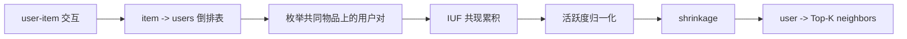
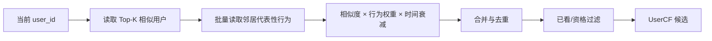

# UserCF

UserCF（User-based Collaborative Filtering）根据用户之间的共同交互构造用户近邻，再从近邻的历史行为中生成当前用户尚未消费的候选物品。它属于邻域协同过滤，不学习 user/item embedding，也没有基于梯度下降的损失函数。

UserCF 的离线构建过程包括：

1. 从用户历史建立 `item -> users` 倒排表。
2. 只枚举共享物品的用户对并累计共现贡献。
3. 对共现值进行活跃度归一化和小样本收缩。
4. 为每个用户保留 Top-K 相似用户。
5. 在线展开相似用户行为并聚合候选分数。

## 1. 数据表示

设用户集合为 $\mathcal U$，物品集合为 $\mathcal I$，二值交互矩阵为：

$$
R\in\{0,1\}^{|\mathcal U|\times|\mathcal I|}
$$

其中：

$$
R_{ui}=\begin{cases}
1,&u\text{ 与 }i\text{ 发生目标交互}\cr
0,&\text{未观察到目标交互}
\end{cases}
$$

记用户 $u$ 的交互集合为：

$$
I(u)=\{i\mid R_{ui}=1\}
$$

物品 $i$ 的用户集合为：

$$
U(i)=\{u\mid R_{ui}=1\}
$$

[model.py](./model.py) 使用如下内存结构：

```text
user_id -> {item_id: behavior_weight}
```

相似度构建只使用物品是否出现；`behavior_weight` 在候选聚合阶段才参与打分。生产系统可以提前将点击、收藏、购买等行为转换成不同权重，也可以按业务目标只保留一种正反馈。

## 2. 用户相似度

### 2.1 基础余弦相似度

交互矩阵第 $u$ 行 $R_u$ 表示用户历史。二值交互下，两个用户的余弦相似度为：

$$
sim_{cos}(u,v)
=\frac{R_uR_v^\top}{\lVert R_u\rVert_2\lVert R_v\rVert_2}
=\frac{|I(u)\cap I(v)|}{\sqrt{|I(u)|\,|I(v)|}}
$$

分子表示共同物品数；分母降低高活跃用户仅凭大量行为获得高相似度的问题。矩阵形式中的 $RR^\top$ 是未归一化的用户共现矩阵。

### 2.2 热门物品惩罚

共同点击一个冷门物品通常比共同点击一个全站热门物品更能说明兴趣相似。当前实现对每个共同物品加入 IUF（Inverse User Frequency）式权重：

$$
C(u,v)=\sum_{i\in I(u)\cap I(v)}
\frac{1}{\log(1+|U(i)|)}
$$

物品交互用户数 $|U(i)|$ 越大，对用户相似度的贡献越小。代码中的 `math.log1p(len(users))` 对应分母 $\log(1+|U(i)|)$。

随后按用户活跃度归一化：

$$
sim_{base}(u,v)=
\frac{C(u,v)}{\sqrt{|I(u)|\,|I(v)|}}
$$

由于分子使用了 IUF 加权共现，该式是余弦式归一化，不再是原始二值向量的严格余弦值。

### 2.3 小样本收缩

只共享一个物品的用户对可能偶然获得较高相似度。设：

$$
n_{uv}=|I(u)\cap I(v)|
$$

当前实现使用 shrinkage 系数：

$$
reliability(u,v)=\frac{n_{uv}}{n_{uv}+\beta}
$$

最终相似度为：

$$
sim(u,v)=sim_{base}(u,v)\cdot
\frac{n_{uv}}{n_{uv}+\beta}
$$

$\beta$ 越大，对低共现用户对的惩罚越强。当 $n_{uv}\gg\beta$ 时，可靠性系数逐渐接近 $1$。示例通过 `shrinkage` 参数控制 $\beta$。

### 2.4 其他相似度

不同数据类型还可使用：

- **Jaccard**：$|I(u)\cap I(v)|/|I(u)\cup I(v)|$，直接衡量集合重叠比例。
- **Pearson**：适合显式评分，可消除不同用户评分尺度的偏差。
- **加权余弦**：将行为类型、次数或时间衰减写入 $R_{ui}$。
- **BM25 类归一化**：进一步控制用户活跃度与物品热门度。

相似度选择必须与交互语义一致。二值点击、连续评分和带强度的购买次数不应无条件使用同一公式。

## 3. 离线近邻构建



### 3.1 为什么使用倒排表

直接比较所有用户对需要 $O(|U|^2)$ 次相似度计算，而且绝大多数用户对没有共同交互。[model.py](./model.py) 先建立：

```text
item_id -> [user_id, ...]
```

对于每个物品，只在其用户列表内部枚举有序用户对。这样不会生成完全没有共同物品的用户对。

若物品 $i$ 有 $m_i=|U(i)|$ 个用户，共现枚举量约为：

$$
\sum_{i\in\mathcal I}m_i(m_i-1)
$$

超级热门物品仍可能产生近似平方级计算，因此生产中通常对其进行降采样、过滤或单独降低权重。分布式实现可按物品聚合用户列表，再按目标用户分桶累计候选邻居。

### 3.2 Top-K 截断

相似度计算完成后，每个用户仅保留分数最高的 $K$ 个邻居：

```text
user_id -> [(neighbor_user_id, similarity), ...]
```

当前实现对候选邻居完整排序后截取 `top_k`。大规模系统通常使用固定大小最小堆、局部 Top-K 与分区合并，避免保存和排序全部邻居。

### 3.3 参数含义

| 参数 | 作用 | 典型影响 |
| --- | --- | --- |
| `top_k` | 每个用户保留的近邻数 | 增大覆盖率，也增加在线 fan-out 与噪声 |
| `shrinkage` | 小样本收缩强度 $\beta$ | 增大后更保守，低活跃用户更易无有效邻居 |
| 行为窗口 | 构建相似度使用的历史长度 | 短窗口更及时，长窗口更稳定 |
| 最小共现数 | 过滤低支持度用户对 | 降低偶然相似，也可能损失长尾关系 |

## 4. 在线候选生成

设当前用户 $u$ 的 Top-K 近邻为 $N_K(u)$，邻居 $v$ 对物品 $i$ 的行为权重为 $w_{vi}$。候选分数为：

$$
score(u,i)=\sum_{v\in N_K(u)}sim(u,v)w_{vi}
$$

当前实现遍历所有邻居行为，过滤 $I(u)$ 中已消费物品，并按累计分数返回 Top-N。候选高分可能来自一个高度相似邻居，也可能来自多个中等相似邻居的共同贡献。

若考虑行为时间，可以扩展为：

$$
score(u,i)=\sum_{v\in N_K(u)}
sim(u,v)\,w_{vi}\,
\exp\left(-\frac{t-t_{vi}}{\tau}\right)
$$



生产服务还需要：

- 限制每个邻居展开的行为数和总候选数，控制 fan-out。
- 优先读取邻居近期、高价值或有代表性的行为。
- 过滤下架、不可见、地域受限和已消费物品。
- 在候选中保留最大相似度、累计相似度、贡献邻居数等解释特征。
- 对近邻表缺失、KV 超时和候选不足设置热门或其他召回通道降级。

## 5. 数据更新与版本管理

用户行为和用户关系变化较快。常见更新策略包括：

- 日级或小时级全量重建近邻表。
- 对新增交互影响到的用户对执行增量共现更新。
- 使用短期表与长期表双路召回，分别表达即时兴趣和稳定偏好。
- 同时版本化行为窗口、相似度公式、参数、用户历史与近邻表。

近邻表和在线行为表必须使用兼容的数据口径。例如近邻由购买行为构建，而在线展开所有弱点击，候选语义会发生偏移。

## 6. 评测与监控

离线应按时间切分数据，用训练窗口构建近邻表，再预测未来交互。常用指标包括 Recall@K、HitRate@K、NDCG@K、覆盖率和热门集中度。

需要按用户活跃度分桶观察：

- 高活跃用户通常更容易找到稳定邻居。
- 低活跃用户的共同交互少，相似度容易被 shrinkage 压低。
- 新用户没有历史，无法使用纯 UserCF，应回退到冷启动、热门或上下文召回。

线上重点监控近邻表命中率、平均有效邻居数、行为展开量、过滤率、空结果率、延迟和通道独占贡献。

## 7. 局限与适用场景

UserCF 的优势是逻辑透明、无需训练 embedding，且能够给出“相似用户共同选择”的解释。主要局限包括：

- 用户数量通常远大于物品数量，用户近邻表规模较大。
- 用户兴趣变化快，近邻关系容易过期。
- 在线展开多个邻居行为会产生较高 fan-out。
- 热门物品容易制造虚假相似，需要 IUF、降采样或其他校正。
- 新用户、极低活跃用户和匿名用户缺乏可靠邻居。

UserCF 更适合用户规模可控、行为密度较高、群体兴趣明显且解释性要求较强的场景。在大规模内容流中，它通常作为多路召回中的补充通道。

## 8. 代码结构与运行

- [model.py](./model.py)：`build_user_neighbors` 实现倒排表、IUF 共现、活跃度归一化、shrinkage 与 Top-K；`recommend` 实现邻居行为展开、已看过滤与候选聚合。
- [train.py](./train.py)：构造加权交互，生成用户近邻并模拟在线推荐。

在本目录执行：

```powershell
python train.py
```

示例只依赖 Python 标准库。它使用内存字典和完整排序以展示算法路径，不代表生产级分布式实现。

对应的物品邻域方法见 [ItemCF](../ItemCF/README.md)，潜向量方法见 [MF](../MF/README.md)，图传播方法见 [GraphCF](../GraphCF/README.md)。