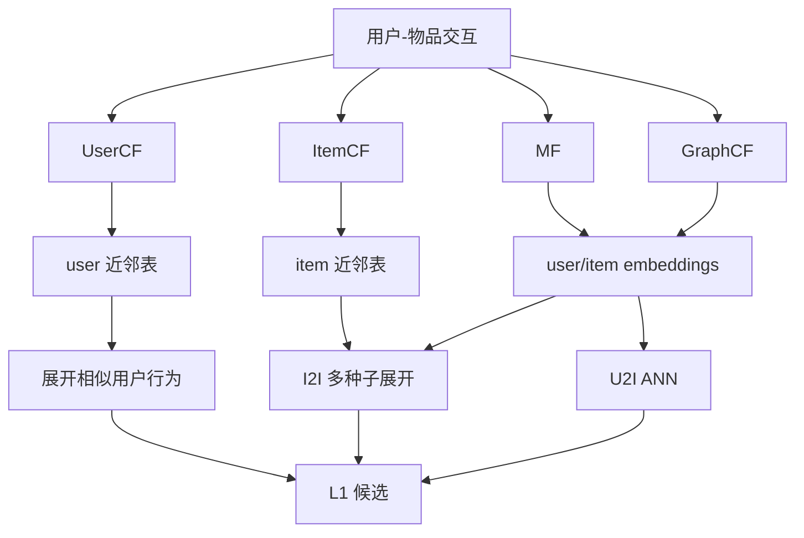
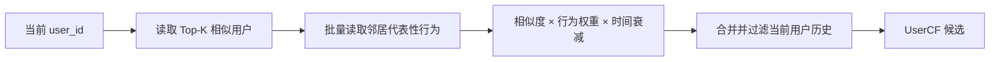
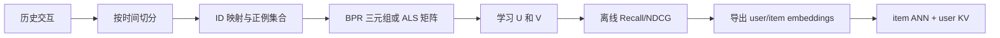
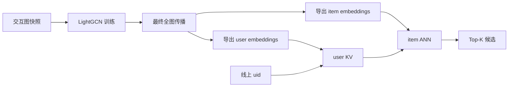

# 协同过滤综述

协同过滤（Collaborative Filtering, CF）利用群体交互行为预测用户偏好。它的核心不是某一种矩阵分解算法，而是一个更一般的假设：**行为模式相似的用户可能喜欢相似物品，被相似用户群体选择的物品也可能彼此相关。**

CF 通常只依赖用户 ID、物品 ID 和交互关系，不要求理解标题、图片或类目。因此它能从行为中发现难以人工定义的兴趣关系，但对没有历史的新用户和新物品天然无能为力。

## 1. 先区分两套命名体系

协同过滤最容易混淆的地方，是把“离线如何得到分数”和“线上从哪里发起检索”混在一起。

### 1.1 算法类型

| 方法 | 是否学习 embedding | 核心计算 | 主要离线产物 |
| --- | --- | --- | --- |
| UserCF | 否 | 比较交互矩阵的行 | `user -> similar users` |
| ItemCF | 否 | 比较交互矩阵的列 | `item -> similar items` |
| MF | 是 | 学习低秩 user/item 潜向量 | user/item embeddings |
| GraphCF | 是 | 在用户-物品图上多层传播 | 图增强的 user/item embeddings |

UserCF 和 ItemCF 是**邻域协同过滤**；MF 是**潜因子协同过滤**；LightGCN 等方法属于**图协同过滤**。它们都从交互行为中提取协同信号，因此都属于 CF。

### 1.2 召回服务方向

- **U2I（User-to-Item）**：输入用户，返回物品。
- **I2I（Item-to-Item）**：输入一个或多个种子物品，返回物品。

两者描述的是线上接口，不是特定算法：

- `uid -> user embedding -> item ANN` 是 MF/GraphCF/双塔都能采用的 U2I 形态。
- `history items -> item neighbors -> merge` 是 I2I 形态，近邻可以来自 ItemCF、Item2Vec、双塔或 GraphCF item embedding。
- UserCF 中的 `User` 表示“计算用户之间的相似度”，不表示“使用 user embedding 做 ANN”。
- 经典 ItemCF 直接统计物品共现，不一定存在 item embedding。



## 2. 统一的数据表示

设用户集合为 $\mathcal U$，物品集合为 $\mathcal I$，交互矩阵为：

$$
R\in\mathbb R^{|\mathcal U|\times|\mathcal I|}
$$

对于隐式反馈，可以定义：

$$
R_{ui}=\begin{cases}
1,&u\text{ 与 }i\text{ 发生目标交互}\cr
0,&\text{未观察到目标交互}
\end{cases}
$$

例如：

$$
R=
\begin{bmatrix}
1&1&0&0\\
1&0&1&0\\
0&0&1&1
\end{bmatrix}
$$

它表示 $u_1$ 交互了 $i_1,i_2$，$u_2$ 交互了 $i_1,i_3$，$u_3$ 交互了 $i_3,i_4$。后面的 UserCF、ItemCF、MF 和 GraphCF 都可以从这一个矩阵出发，只是提取协同关系的方式不同。

隐式矩阵里的 $0$ 是“未观测”，而不是可靠负例。用户可能从未看到该物品。因此训练和评测必须考虑曝光偏差、负采样以及时间切分，不能把所有 $0$ 简单当成“不喜欢”。

### 2.1 行为强度

多行为系统可定义加权交互：

$$
r_{ui}=w_c n_{click}+w_f n_{favorite}+w_a n_{cart}+w_b n_{buy}
$$

还可加入时间衰减：

$$
r_{ui}(t)=r_{ui}\exp\left(-\frac{t-t_{ui}}{\tau}\right)
$$

次数通常使用 $\log(1+n)$ 或上限截断，避免少数高频行为支配模型。行为定义决定协同关系的语义，购买目标不应无条件把所有点击当成等价正例。

实际不会构造完整稠密矩阵，而是使用交互边表、CSR/CSC 稀疏矩阵、倒排表或分布式图。

## 3. 邻域协同过滤

邻域 CF 不学习神经网络参数。它直接从 $R$ 的行或列计算相似度，离线保留 Top-K 邻居，线上读取近邻表并聚合候选。

### 3.1 UserCF：比较矩阵的行

第 $u$ 行 $R_u$ 表示用户 $u$ 的交互历史。二值交互下，用户余弦相似度为：

$$
sim(u,v)=\frac{R_uR_v^\top}{\lVert R_u\rVert\lVert R_v\rVert}
=\frac{|I(u)\cap I(v)|}{\sqrt{|I(u)|\,|I(v)|}}
$$

也可以使用 Jaccard：

$$
sim_J(u,v)=\frac{|I(u)\cap I(v)|}{|I(u)\cup I(v)|}
$$

显式评分场景可使用中心化 Pearson 相关系数，消除不同用户评分尺度的影响。

得到用户 $u$ 的 Top-K 相似用户 $N_K(u)$ 后，对邻居交互过的物品聚合：

$$
score(u,i)=\sum_{v\in N_K(u)}sim(u,v)\,w_{vi}
$$

因此候选并非只按出现频数排序。一个物品被多少邻居选择会影响累计分数，但每个邻居的相似度、行为类型和时间也会影响贡献。

#### 离线计算

直接比较所有用户对需要接近 $O(|U|^2)$ 的工作。生产中通常建立 `item -> users` 倒排表，只为共享物品的用户对累计贡献：

$$
C(u,v)=\sum_{i\in I(u)\cap I(v)}\frac{1}{\log(1+|U(i)|)}
$$

逆流行度项降低热门物品造成的虚假相似。对共同交互过少的用户对还可使用 shrinkage：

$$
sim'(u,v)=\frac{n_{uv}}{n_{uv}+\beta}sim(u,v)
$$

最终产物为：

```text
user_id -> [(neighbor_user_id, similarity), ...]
```

#### 线上服务



近邻表查询在算法层面是键值查找；生产中通常由 Redis、分布式 KV、离线特征表或专用召回服务承载。UserCF 的问题是用户关系更新快、低活跃用户邻居不可靠，而且在线展开邻居行为可能产生较大 fan-out。

代码与更细的构建流程见 [UserCF](./UserCF/README.md)。

### 3.2 ItemCF：比较矩阵的列

第 $i$ 列 $R_{\cdot i}$ 表示与物品 $i$ 交互过的用户。物品余弦相似度为：

$$
sim(i,j)=\frac{R_{\cdot i}^\top R_{\cdot j}}
{\lVert R_{\cdot i}\rVert\lVert R_{\cdot j}\rVert}
=\frac{|U(i)\cap U(j)|}{\sqrt{|U(i)|\,|U(j)|}}
$$

离线为每个物品保留 Top-K 近邻：

```text
item_id -> [(neighbor_item_id, similarity), ...]
```

在线从用户近期历史中选择种子集合 $S_u$，查询各自的近邻并融合：

$$
score(u,j)=\sum_{i\in S_u}w_{ui}\,sim(i,j)
$$

$w_{ui}$ 可以包含行为类型、时间衰减、观看完成度和种子位置。之后进行跨种子去重、已看过滤、物品资格过滤和候选截断。

物品关系一般比用户关系稳定，`item -> neighbors` 也容易缓存，因此 ItemCF 是非常常见的 I2I 通道。在有顺序的内容场景中，还可只统计会话窗口内的有序共现 $C(i\rightarrow j)$，表达后继关系。

完整原理、离线建表、线上流程和代码见 [ItemCF](./ItemCF/README.md)。[I2I 召回综述](../I2I召回/I2I召回综述.md)则统一讨论不同 item 相似度来源的线上服务范式。

### 3.3 用矩阵乘法理解邻域 CF

忽略归一化时：

$$
RR^\top\in\mathbb R^{|U|\times|U|}
$$

其中 $(RR^\top)_{uv}$ 是用户 $u,v$ 的共同物品数，是 UserCF 的基础；而：

$$
R^\top R\in\mathbb R^{|I|\times|I|}
$$

其中 $(R^\top R)_{ij}$ 是物品 $i,j$ 的共同用户数，是 ItemCF 的基础。实际系统不会盲目执行两个稠密矩阵乘法，而会通过倒排、稀疏计算和 Top-K 截断避免结果爆炸。

## 4. 矩阵分解协同过滤

矩阵分解（Matrix Factorization, MF）通过低秩潜向量建模用户与物品之间的协同关系。它学习：

$$
U\in\mathbb R^{|U|\times d},\qquad
V\in\mathbb R^{|I|\times d}
$$

使交互偏好近似为：

$$
R\approx UV^\top,
\qquad
\hat y_{ui}=u_u^\top v_i
$$

$d\ll\min(|U|,|I|)$，因此这是低秩近似而不是严格相等。带偏置的预测为：

$$
\hat y_{ui}=\mu+b_u+b_i+u_u^\top v_i
$$

$U,V$ 是两张可训练参数表。训练开始时通常随机初始化，之后由损失函数的梯度或交替最小二乘更新。MF 的前向过程不显式遍历邻居；协同关系被压缩进最终向量。

### 4.1 MF 与 SVD 的关系

标准 SVD 将一个给定矩阵精确写成：

$$
R=L\Sigma Q^\top
$$

截断 SVD 保留最大的 $d$ 个奇异值，得到全矩阵 Frobenius 误差意义下的最佳 rank-$d$ 近似。但推荐系统中的矩阵存在大量“未知”而非真实零值，直接填零做 SVD 会让未曝光位置主导结果。

因此推荐中的 MF 虽然继承了低秩分解思想，却通常重新定义观测集合、置信度或排序目标。它不是简单因为 SVD 计算困难才改用梯度下降；真正的差异是**缺失值语义和优化目标发生了变化**。

### 4.2 显式评分 MF

对已观测评分集合 $\Omega$，可以优化：

$$
\mathcal L=\sum_{(u,i)\in\Omega}
(r_{ui}-\mu-b_u-b_i-u_u^\top v_i)^2
+\lambda\lVert\Theta\rVert_2^2
$$

它可以使用 SGD/Adam，也可以交替固定一侧求解另一侧。这里未评分位置通常不直接进入损失。

### 4.3 隐式反馈 Weighted ALS

将行为转换为偏好和置信度：

$$
p_{ui}=\mathbb I(r_{ui}>0),\qquad c_{ui}=1+\alpha r_{ui}
$$

优化：

$$
\mathcal L=\sum_{u,i}c_{ui}(p_{ui}-u_u^\top v_i)^2
+\lambda\left(\sum_u\lVert u_u\rVert^2+\sum_i\lVert v_i\rVert^2\right)
$$

所有未观测位置都作为低置信度负反馈，已观测行为具有更高置信度。固定 $V$ 时各用户向量可独立求解，固定 $U$ 时同理，因此适合 ALS 并行计算。

### 4.4 BPR-MF

BPR 为用户构造三元组 $(u,i^+,i^-)$，要求正物品排在未交互物品之前：

$$
\mathcal L_{BPR}=-\sum_{(u,i^+,i^-)}
\log\sigma\left(u_u^\top v_{i^+}-u_u^\top v_{i^-}\right)
+\lambda\lVert\Theta\rVert_2^2
$$

典型训练循环为：

1. 采样用户 $u$。
2. 从其历史中采正物品 $i^+$。
3. 从未交互池采负物品 $i^-$。
4. 计算正负分差并反向传播。
5. 更新涉及的 user/item embeddings。

BPR 非常经典，适合隐式反馈 Top-K 排序，但不是唯一选择。MF 还可使用 Weighted ALS、sampled BCE、sampled softmax 等目标；BPR 也能训练 LightGCN 或其他推荐模型，所以“MF”和“BPR”分别描述模型参数化与训练目标。

负样本分布直接影响模型。均匀负例简单但可能太容易；热门或难负例训练信号更强，也更可能包含用户实际喜欢但尚未交互的假负例。

### 4.5 MF 训练与线上服务



线上 U2I 流程通常是：

```text
uid -> user embedding KV -> item ANN -> Top-K -> 过滤/融合
```

也可离线预计算 `user -> Top-N items`。物品 embedding 还可以单独建立 item ANN，用用户历史 item 作为种子执行 I2I。

纯 MF 用户表示只是 uid 参数，不能立即吸收新行为。可提高向量刷新频率，或临时聚合近期物品向量：

$$
\tilde u=\operatorname{Normalize}\left(\sum_{i\in S_u}w_{ui}v_i\right)
$$

这是一种在线近似，并不是原始 MF 学出的用户参数。需要实时编码历史时，通常使用双塔用户编码器。

代码见 [MF+BPR](./MF/README.md)。

## 5. 图协同过滤

图协同过滤（GraphCF）仍然只使用用户-物品交互，只是将矩阵解释为二部图，并显式聚合多跳邻居。它同样学习 user/item embeddings，但生成 embedding 的方式不同于 MF，也不是执行 SVD。

### 5.1 从交互矩阵到二部图

将所有用户和物品视为节点，$R_{ui}>0$ 时建立边 $(u,i)$。二部图邻接矩阵为：

$$
A=\begin{bmatrix}
0&R\\
R^\top&0
\end{bmatrix}
$$

平方以后：

$$
A^2=\begin{bmatrix}
RR^\top&0\\
0&R^\top R
\end{bmatrix}
$$

这给出了四类 CF 的直接联系：

- $RR^\top$ 是用户二跳共现，对应 UserCF。
- $R^\top R$ 是物品二跳共现，对应 ItemCF。
- 三跳路径 `user -> item -> user -> item` 能到达相似用户消费的新物品。
- GraphCF 不直接物化这些高阶共现矩阵，而让 embedding 沿图边传播。

### 5.2 LightGCN 的第 0 层

LightGCN 先为每个节点设置可训练 ID embedding：

$$
E^{(0)}=
\begin{bmatrix}
U^{(0)}\\
V^{(0)}
\end{bmatrix}
$$

这一步与 MF 很像。区别是 MF 直接拿 $U^{(0)},V^{(0)}$ 打分，而 LightGCN 先通过图结构计算高阶表示。

### 5.3 规范化图传播

设 $d_u,d_i$ 是节点度。每层用户从相邻物品聚合：

$$
e_u^{(k+1)}=\sum_{i\in N(u)}
\frac{1}{\sqrt{d_ud_i}}e_i^{(k)}
$$

物品从相邻用户聚合：

$$
e_i^{(k+1)}=\sum_{u\in N(i)}
\frac{1}{\sqrt{d_id_u}}e_u^{(k)}
$$

写成矩阵形式：

$$
E^{(k+1)}=\tilde A E^{(k)},
\qquad
\tilde A=D^{-1/2}AD^{-1/2}
$$

度归一化抑制超级活跃用户和热门物品的影响。不同层的含义是：

- 第 0 层：节点自己的可训练身份。
- 第 1 层：直接交互用户或物品。
- 第 2 层：相似用户或相似物品。
- 第 3 层：相似用户消费的其他物品等高阶协同信号。

最终聚合各层：

$$
e_x=\sum_{k=0}^{K}\alpha_ke_x^{(k)}
$$

通常令 $\alpha_k=1/(K+1)$。保留第 0 层可以避免完全丢失节点自身身份；层数过深会导致不同节点表示趋同，即过度平滑。

### 5.4 为什么 LightGCN 不像普通 GCN

一般 GCN 常包含线性变换和非线性激活：

$$
E^{(k+1)}=\sigma(\tilde A E^{(k)}W^{(k)})
$$

LightGCN 的研究发现，在只有 ID 和交互边的纯协同过滤任务中，特征变换 $W^{(k)}$ 与非线性激活未必有益，因此只保留邻居聚合。它的“可学习性”来自第 0 层 embeddings 以及端到端排序目标，而不是每层额外的神经网络参数。

### 5.5 GraphCF 如何训练

传播后仍以内积打分：

$$
\hat y_{ui}=e_u^\top e_i
$$

LightGCN 常使用 BPR：

$$
\mathcal L=-\log\sigma
\left(e_u^\top e_{i^+}-e_u^\top e_{i^-}\right)
+\lambda\lVert E^{(0)}\rVert_2^2
$$

梯度从 BPR loss 经过最终 embedding、各层稀疏图传播，最终更新第 0 层 user/item embeddings。图边通常是固定数据，不是训练参数。

因此 LightGCN 可概括为：

> **MF 风格的可训练 ID embeddings + 由交互图约束的多层邻居传播。**

MF 把高阶协同关系隐式压缩进参数；GraphCF 在前向计算中明确规定每个节点必须从哪些一跳和多跳邻居吸收信息。

### 5.6 GraphCF 线上服务

全图传播通常在线下完成：



在线不会为每个请求重新遍历全图。从接口看，它与 MF-based U2I 几乎相同，区别主要在离线 embedding 的生成方式。物品 embedding 也可以建立 item-to-item ANN。

新增交互不会自动改变已导出的向量，需要小时级增量更新、日级全量训练或实时兴趣向量补充。新物品没有图边时，纯 GraphCF 无法产生可靠表示，需要内容模型、热门或探索通道。

代码与完整执行路径见 [GraphCF/LightGCN](./GraphCF/README.md)。

## 6. 四类方法的关系

| 维度 | UserCF | ItemCF | MF | LightGCN |
| --- | --- | --- | --- | --- |
| 基本输入 | 交互矩阵 | 交互矩阵/会话 | 交互样本 | 用户-物品二部图 |
| 是否学习向量 | 否 | 否 | 是 | 是 |
| 高阶关系 | 显式用户共现 | 显式物品共现 | 隐式写入潜向量 | 显式多层传播 |
| 常用训练/求解 | 相似度统计 | 相似度统计 | ALS、BPR、BCE 等 | BPR 等 |
| 典型产物 | user 近邻表 | item 近邻表 | user/item embeddings | 图增强 embeddings |
| 常见线上形态 | 展开相似用户行为 | I2I KV 展开 | U2I ANN | U2I ANN |
| 主要问题 | 用户关系易变、fan-out | 热门偏差、新品无共现 | ID 冷启动、更新滞后 | 全图传播、过度平滑 |

GraphCF 不是对 MF 的线上替代，而是另一种 embedding 编码方式；ItemCF 也不等于所有 embedding I2I。真实系统通常并行部署多个通道：ItemCF 捕捉近期局部意图，MF/GraphCF 表达长期协同泛化，UserCF 补充群体兴趣，最终由 L1 融合去重并控制通道配额。

## 7. 数据、评测与工程边界

### 7.1 数据切分

- 按时间切分训练、验证和测试，不能随机把未来行为泄漏给过去。
- 相似度、图边、热门度和 embedding 只能使用目标时点之前的数据。
- 训练输入历史必须早于预测目标。
- 负样本不能命中用户在训练时已知的正例；评测还要明确如何处理未来其他正例。

### 7.2 离线指标

使用 Recall@K、HitRate@K、NDCG@K 和 MRR 等排序指标。优先在完整可推荐物品池评测；只配少量随机负例会显著高估效果。还应分用户活跃度、物品热门度和新旧物品报告结果，并监控覆盖率、热门集中度和多样性。

统一评测协议见[召回系统评测](../召回系统评测.md)。

### 7.3 线上监控

- 通道召回量、空结果率、独占候选和 L2 采用率。
- KV/ANN 延迟、超时率、缓存命中率和降级比例。
- 用户、物品、模型、图快照与索引版本一致性。
- 已看率、重复率、热门集中度和长尾覆盖。
- 分活跃度用户的点击、转化和留存指标。

### 7.4 共同局限

- **冷启动**：无交互的新用户和新物品缺少协同信号。
- **热门偏差**：热门物品制造大量共现、训练样本和图路径。
- **曝光偏差**：日志只包含旧策略展示过的物品。
- **反馈回路**：模型推荐带来新行为，新行为又强化原有推荐。
- **时间漂移**：用户兴趣和物品关系会变化。
- **重复与同质化**：必须过滤历史并通过其他通道补充多样性。

代表文献包括 GroupLens、ItemCF、隐式反馈 ALS、BPR、矩阵分解和 LightGCN，统一收录于 [L1 召回文献](../../../文献/L1召回/README.md)。