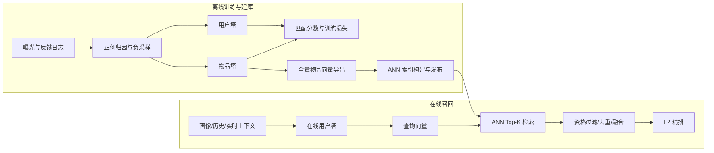

# 双塔召回综述

双塔模型（Two-Tower Model，也称 Dual Encoder）把请求侧和物品侧分别编码为固定维度向量，再通过点积、余弦相似度或其他可分解函数计算匹配分数：

$$
u=f_\theta(x_u),\qquad v_i=g_\phi(x_i),\qquad s(u,i)=u^\top v_i
$$

其中 $x_u$ 可以包含用户画像、历史行为、实时上下文和查询文本，$x_i$ 可以包含物品 ID、类目、作者、文本和多模态内容。双塔最重要的工程性质是：$v_i$ 不依赖当前请求，因此全量物品向量可以离线计算并写入 ANN 索引；在线只需计算一次 $u$，便可在百万至十亿级物品中做近邻搜索。

这也是双塔与交叉网络的根本区别。交叉网络可以让用户和物品特征逐层交互，表达能力更强，但必须针对每个候选单独计算；双塔主动限制了交叉能力，以换取向量预计算、大规模检索和低延迟服务能力。

## 1. 整体架构

典型链路由四个相互约束的部分组成：

1. **样本构造**：定义正反馈、归因窗口、时间边界和负样本分布。样本决定模型在训练时与哪些物品竞争。
2. **双塔编码**：用户塔学习请求意图，物品塔学习可离线缓存的候选表示；两塔输出必须落在同一个向量空间。
3. **匹配目标**：通过 pointwise、pairwise 或 softmax 类目标拉近正对、推远负对，并处理采样偏差和假负例。
4. **向量检索**：导出物品向量，使用与训练匹配函数一致的距离建立索引，再在线查询、过滤和融合。

训练、导出和服务不是三个独立问题。若训练时使用归一化余弦相似度，索引却按未归一化内积搜索；或模型已更新而索引仍保存旧版本向量，离线 loss 即使很好也无法转化为线上召回效果。

## 2. 用户塔与物品塔

### 2.1 用户塔

用户塔常见输入包括用户 ID 与画像、点击/观看/交易历史、页面与设备上下文、Query、当前种子物品和会话内即时行为。简单场景可使用 `Embedding + pooling + MLP`；序列意图明显时可使用 GRU、Transformer 或多兴趣网络。历史很长时，还需处理行为类型、时间间隔、位置编码、序列截断和实时短期序列。

### 2.2 物品塔

物品塔常见输入包括 item ID、类目、品牌、作者、统计特征、标题文本、图片和音频表示。物品侧只能使用在索引构建时可获得、且在索引有效期内语义稳定的特征。库存、地域可见性和实时合规状态通常由 Index 池或检索过滤处理，不宜混进会快速失效的离线向量。

内容特征让模型能够为低交互或新物品生成向量；纯 ID embedding 则更擅长记忆协同信号。工业模型经常将两者拼接或门控融合，并对缺失内容设置独立 embedding 和 mask。

## 3. 匹配函数

| 匹配方式 | 定义 | 特点 |
| --- | --- | --- |
| 点积 | $u^\top v$ | 保留向量模长，适合最大内积搜索；模长可能吸收热门度 |
| 余弦 | $u^\top v/(\lVert u\rVert\lVert v\rVert)$ | 只比较方向，分数稳定；通常先做 L2 归一化 |
| 负欧氏距离 | $-\lVert u-v\rVert_2^2$ | 强调空间距离；归一化后与余弦排序关系紧密 |

训练、离线评测、向量导出和 ANN 必须使用一致定义。使用 L2 归一化时，点积即余弦相似度；温度系数 $\tau$ 只改变训练 logits 的尺度，通常不需要写入 ANN。

## 4. Loss 函数选用

### 4.1 Pointwise BCE

将每个用户-物品对看作二分类样本：

$$
\mathcal L_{\mathrm{BCE}}=-y\log\sigma(s)-(1-y)\log(1-\sigma(s))
$$

它能直接使用曝光点击标签，也方便加入样本权重，但效果高度依赖正负比例和负例定义。未曝光物品并不是可靠负例；训练中的类别先验也往往与线上全库先验不同，因此 BCE 分数未必可直接解释为点击概率。

### 4.2 Pairwise BPR

BPR 比较同一用户的正物品 $i^+$ 与负物品 $i^-$：

$$
\mathcal L_{\mathrm{BPR}}=-\log\sigma\left(s(u,i^+)-s(u,i^-)\right)
$$

它直接优化相对顺序，适合隐式反馈和每个正例搭配少量负例的场景。缺点是一次只比较有限负例，效果对负例难度非常敏感。

### 4.3 Sampled Softmax

对一个正例和采样负例集合 $\mathcal N_u$ 做多分类：

$$
\mathcal L_{\mathrm{SS}}=-\log\frac{\exp(\tilde s(u,i^+))}
{\exp(\tilde s(u,i^+))+\sum_{j\in\mathcal N_u}\exp(\tilde s(u,j))}
$$

其中 $\tilde s(u,i)=s(u,i)-\log q(i)$ 可用于校正非均匀采样概率。该目标更接近“正物品与大量全库物品竞争”的召回任务，是大规模候选生成中的常见选择。

### 4.4 In-batch Softmax / InfoNCE

一个 batch 中其他样本的正物品同时作为当前用户的负例：

$$
\mathcal L_{\mathrm{IB}}=-\frac{1}{B}\sum_{b=1}^{B}\log
\frac{\exp(u_b^\top v_b/\tau)}
{\sum_{j=1}^{B}\exp(u_b^\top v_j/\tau)}
$$

它只编码 $B$ 个物品便得到 $B^2$ 个配对分数，GPU 利用率高，也是本项目两个示例采用的目标。需要特别处理 batch 内重复物品、同用户多正例和热门物品被过度当负例的问题；大 batch 还会改变负例分布，不能只把 batch size 当作吞吐参数。

### 4.5 多正例与蒸馏

用户在一个窗口内可能有多个有效正例，此时可将分子改为所有正例的指数分数之和，或使用 supervised contrastive mask。若有精排或交叉编码器教师模型，可联合检索损失与蒸馏损失：

$$
\mathcal L=\lambda\mathcal L_{\mathrm{retrieval}}+(1-\lambda)\mathcal L_{\mathrm{distill}}
$$

蒸馏能传递复杂交叉特征形成的相对偏好，但教师候选分布、温度和未标注样本处理会显著影响结果。

### 4.6 选择建议

| 条件 | 建议起点 | 重点检查 |
| --- | --- | --- |
| 有可靠曝光日志，需要简单基线 | 加权 BCE | 位置偏差、正负比例、分数校准 |
| 隐式反馈且每个正例配少量负例 | BPR | 负例难度、pair 数量、热门偏差 |
| 超大物品库，可记录采样概率 | Sampled Softmax | $q(i)$ 校正、采样池与线上池一致性 |
| GPU 大 batch，正例重复较少 | In-batch Softmax | 假负例、多正例 mask、温度和 batch 分布 |
| 有高质量精排教师 | 检索 loss + 蒸馏 | 教师覆盖、候选偏差和线上收益 |

## 5. 训练与服务闭环

1. 按事件时间切分日志，定义正例归因和请求时刻可见的物品池。
2. 混合曝光、随机、热门和难负例，记录来源与采样概率。
3. 训练双塔并评估精确向量检索、分桶 Recall@K 和表示分布。
4. 固化模型、特征字典、归一化和距离定义，批量导出全量物品向量。
5. 构建 ANN 索引，以精确 Top-K 为真值扫描召回率、P99、内存和参数。
6. 在线计算用户向量，执行 ANN、资格过滤、去重及多路融合。
7. 监控模型/索引版本、向量缺失、空结果、候选量、增量召回和下游采用率。

完整负采样策略见[数据构造与负采样](./数据构造/README.md)。向量索引构建、发布和回滚归属 [Index 池](../../Index池/README.md)；多路编排、融合与降级见[召回系统综述](../召回系统综述.md)；指标口径见[召回系统评测](../召回系统评测.md)。

## 6. 常见应用场景

- **推荐主召回通道**：综合用户画像、长期历史和上下文，在大规模候选库中提供稳定个性化候选。
- **搜索语义召回**：Query 塔与文档/商品塔构成语义检索，补充关键词倒排无法覆盖的语义匹配。
- **广告候选生成**：检索高相关广告，但需额外处理预算、出价、合规和校准。
- **内容与多模态召回**：通过文本、图片或音频编码为新物品提供冷启动表示。
- **跨域召回**：将不同域的用户行为映射到共享空间，需处理域间样本和特征分布差异。
- **教师模型蒸馏**：将精排或交叉编码器的偏好压缩到可 ANN 服务的双塔中。

双塔不适合承担所有排序责任。需要用户-物品细粒度特征交叉、列表级约束或强业务规则时，应把双塔作为高召回候选生成器，再交给 L2/L3 处理。

## 7. 常见失败模式

- **训练-服务不一致**：特征处理、向量归一化、距离函数或模型/索引版本不一致。
- **热门度捷径**：热门物品在正例和负例中分布失衡，向量模长或分数被流行度支配。
- **假负例**：用户可能喜欢但未曝光的物品被当作强负例，同用户多正例在 batch 内互相排斥。
- **表示坍塌或各向异性**：向量集中在狭窄方向，ANN 候选高度重复；需监控范数、余弦分布和有效维度。
- **长兴趣被平均**：单个用户向量难以同时表达多个不相关兴趣，可使用多兴趣向量或按意图分路召回。
- **离线提升不转化**：更高 Recall@K 可能只增加 L2 不采用的候选，应联合看增量候选、精排采用率和单位资源收益。

代表文献包括 DSSM、YouTube 候选生成、MIND 和采样偏差校正，统一列于 [L1 召回文献](../../../文献/L1召回/README.md)。