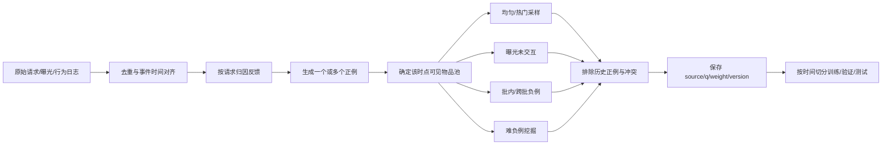

# 数据构造与负采样

双塔训练数据不是简单的“点击为正、未点击为负”。线上召回面对的是全库竞争，而日志只记录推荐策略选择后产生的曝光和反馈。负样本分布会直接改变模型学习的问题：均匀负例强调全库区分，曝光负例强调当前策略下的细粒度偏好，难负例强调局部决策边界，热门负例则改变高频物品受到的训练强度。

本文把一个训练样本表示为：

$$
z=(x_u,i^+,\mathcal N,q,r,t)
$$

其中 $x_u$ 是请求时刻的用户上下文，$i^+$ 是正物品，$\mathcal N$ 是负例集合，$q(i)$ 是采样分布，$r$ 记录采样来源，$t$ 是样本时点。生产数据应保留这些字段，而不只是输出一组 item ID。

## 1. 数据构造链路



推荐顺序是先还原请求和曝光，再归因反馈，随后在事件时点可用的候选池中采样。若先从全量日志统计热门度、生成历史序列或构建难负例索引，未来物品和未来热度会泄漏到过去样本中。

## 2. 正例定义与时间边界

正例可来自点击、有效观看、收藏、加购、购买、分享或关注。应为每类业务明确：

- **归因窗口**：曝光后多久内的行为属于该请求；跨设备和跨会话如何归因。
- **有效阈值**：例如观看时长、播放完成度、停留时间和退款窗口。
- **多行为关系**：点击与购买可做多任务、分级权重或独立样本，不能默认等价。
- **重复行为**：同一用户对同一物品反复点击，是一个正例、多个时点样本，还是强度更高的正例。
- **多正例请求**：同一列表可能产生多个有效反馈，训练 loss 必须允许多个正例。
- **时间切分**：训练、验证和测试按事件时间划分；用户历史只能截断到样本时点之前。

还需区分“未点击”和“不喜欢”。未曝光物品没有反馈；曝光未点击可能因为位置太低、未真正进入视口、页面快速退出或用户稍后才反馈。把所有未点击等价为强负例会学习展示策略偏差。

## 3. 策略总览

| 策略 | 分布或选择逻辑 | 主要作用 | 主要风险 |
| --- | --- | --- | --- |
| 全库均匀 | $q(i)=1/\lvert\mathcal I\rvert$ | 覆盖长尾，近似全库背景 | 负例过易、学习信号弱 |
| 热门度 | $q(i)\propto f_i^\alpha$ | 增加高竞争物品训练频率 | 热门偏差、长尾不足 |
| 曝光未交互 | 从同请求/场景已曝光集合采样 | 接近真实决策边界 | 位置与可见性偏差 |
| 批内负例 | 其他样本的正物品作为当前负例 | $B$ 次编码产生 $B^2$ 配对 | 假负例、batch 分布偏差 |
| 跨批队列 | 使用历史 batch 的物品表示 | 低成本扩大负例数 | 表示陈旧、跨版本不一致 |
| 难/半难负例 | 从模型近邻或高分误判中选择 | 强化局部排序能力 | 假负例、训练不稳、偏差继承 |
| 混合采样 | 按来源配额或 mixture 分布组合 | 兼顾覆盖、竞争和真实曝光 | 概率难追踪、比例需调优 |

下面逐一展开每种采样逻辑。文献不是说某种策略在所有推荐场景中都最优，而是给出其代表性来源或工业用法。

## 4. 全库均匀采样

### 4.1 逻辑

在样本时点可见且未被排除的物品池 $\mathcal I_t\setminus E_u$ 中等概率抽取：

$$
q_{\mathrm{uniform}}(i\mid u,t)=\frac{1}{\lvert\mathcal I_t\setminus E_u\rvert}
$$

$E_u$ 至少应包含当前正例、同请求其他正例和已确认的用户正反馈。若无放回采 $K$ 个物品，需区分“单次 proposal 概率”与“最终被包含概率”；本目录示例保存的是候选池中单个物品的一次归一化概率，主要用于说明接口。

### 4.2 优缺点与使用方式

均匀采样覆盖长尾，不会主动重复热门物品，适合做基础背景负例和调试基线。但在百万级物品库中，随机抽到的物品往往与用户完全无关，模型很快就能分开，后续梯度接近零。常见做法是保留一部分均匀负例保证全局覆盖，再混入曝光或难负例。

### 4.3 来源

从大词表中抽样近似完整 softmax 的思路可追溯到 sampled softmax、importance sampling 和 Noise Contrastive Estimation。推荐候选生成中的代表用法见 [YouTube DNN](https://doi.org/10.1145/2959100.2959190)；采样校正可参考 [Sampling-Bias-Corrected Neural Modeling](https://doi.org/10.1145/3298689.3346996)。

## 5. 热门度采样

### 5.1 逻辑

先在严格的历史窗口内统计物品频次 $f_i$，再构造平滑分布：

$$
q_{\mathrm{pop}}(i)=\frac{(f_i+\epsilon)^\alpha}
{\sum_{j\in\mathcal I_t}(f_j+\epsilon)^\alpha},\qquad 0<\alpha\le 1
$$

$\alpha=1$ 完全按频次采样；$\alpha<1$ 压平头部，给中长尾更多机会。Word2vec 使用 unigram 的 $3/4$ 次幂作为 negative sampling 分布，这也是工程中常见的 $\alpha=0.75$ 来源。本目录 `PopularitySampler` 默认采用该值。

### 5.2 为什么有效

热门物品是线上更常见的竞争者。若模型把它们错配给所有用户，会大量消耗召回配额；提高其负采样频率能提供更强的区分信号。与此同时，热门物品也更可能是真实潜在正例，过度作为负例会压低其表示，并放大日志已有的流行度结构。

### 5.3 实践要点

- 频次必须按训练样本时点之前的滑动窗口统计，不能使用全周期总频次。
- 新物品可加 $\epsilon$、设置最小概率或与均匀分布混合。
- 按曝光频次、点击频次或正例频次统计会得到不同目标，应记录统计口径。
- 若 softmax 需要逼近全库目标，应保存准确 $q(i)$ 并评估 log-probability 修正。

### 5.4 来源

平滑 unigram 负采样来自 [Mikolov et al., Distributed Representations of Words and Phrases](https://arxiv.org/abs/1310.4546)。推荐领域的大规模类别采样和校正见 [YouTube DNN](https://doi.org/10.1145/2959100.2959190) 与 [Yi et al. 2019](https://doi.org/10.1145/3298689.3346996)。

## 6. 曝光未交互采样

### 6.1 逻辑

对请求 $r$ 的曝光集合 $A_r$，去除产生目标行为的物品 $P_r$：

$$
\mathcal N_r^{\mathrm{exposure}}=A_r\setminus P_r
$$

再按均匀、位置分层、可见时长或业务权重从中采样。它比全库随机负例更难，因为这些物品已经通过旧召回和排序策略，被认为与当前用户具有一定相关性。

### 6.2 偏差来源

曝光集合不是随机样本，而是由旧策略、广告预算、库存、位置和规则共同选择。列表底部的物品可能根本未进入视口；未点击也可能是因为上方物品先满足了需求。因此需要记录 rank、视口可见性、停留时长、策略版本和展示概率。

若日志记录 propensity $p(i\text{ exposed}\mid x)$，可使用逆倾向权重或 doubly robust 方法缓解选择偏差：

$$
w_i=\min\left(w_{\max},\frac{1}{p(i\text{ exposed}\mid x)}\right)
$$

但 $-\log q(i)$ 只修正采样频率，不会自动消除曝光策略和位置偏差。

### 6.3 来源

隐式反馈中的“观察到行为不等于偏好标签”可参考 [Hu, Koren and Volinsky 2008](https://doi.org/10.1109/ICDM.2008.22)。推荐日志选择偏差与 propensity 方法见 [Schnabel et al., Recommendations as Treatments](https://arxiv.org/abs/1602.05352)。

## 7. 批内负例

### 7.1 逻辑

给定 batch 中 $B$ 个正对 $(u_b,i_b^+)$，只编码 $B$ 个用户和 $B$ 个物品，构造相似度矩阵：

$$
S_{bj}=u_b^\top v_j/\tau
$$

对第 $b$ 行，$i_b^+$ 是正例，其余 $B-1$ 个物品作为负例。这样编码成本为 $O(B)$，却得到 $O(B^2)$ 个配对分数，特别适合 GPU 矩阵乘法。

### 7.2 Batch 不是中性的

一个物品成为负例的概率由数据读取和 batch 组成决定。按正例频次随机组 batch 时，热门正物品也会更频繁成为其他用户的负例；按用户、地域或任务分桶又会改变负例难度。因此 batch size、shuffle、分布式跨卡 gather 和数据去重都属于采样策略。

必须处理：

- 同一个 item 在 batch 内重复出现，不能把等价列互相作为负例。
- 同用户的多个有效正例不能互相排斥，应构造多正例 mask。
- 跨卡收集 negatives 时，确认远端 embedding 是否参与梯度回传。
- 超大 batch 会增加假负例概率，通常需重新调温度和学习率。

### 7.3 来源

批内负例广泛用于检索和对比学习。代表文献包括 [DPR](https://arxiv.org/abs/2004.04906) 的 in-batch negatives、[InfoNCE/CPC](https://arxiv.org/abs/1807.03748) 对比目标，以及推荐中的 [Sampling-Bias-Corrected Neural Modeling](https://doi.org/10.1145/3298689.3346996)。

## 8. 跨批队列

### 8.1 逻辑

维护容量为 $M$ 的 FIFO 队列，保存前若干 batch 的物品 embedding 和 item ID。当前 batch 的分母同时包含当前物品与队列物品：

$$
\mathcal N_b=\{i_j^+:j\ne b\}\cup\mathcal Q
$$

队列可用较小显存获得数千至数十万负例。若每步都用当前物品塔重新编码整个队列，成本会失去优势；直接缓存 embedding 又会产生陈旧表示。

### 8.2 实现选择

- **普通 FIFO**：实现简单，适合模型更新较慢的阶段。
- **Momentum encoder**：使用物品塔的指数滑动平均版本生成队列向量，减少表示跳变。
- **只存 ID，周期重编码**：更一致但计算更高。
- **跨批记忆库**：按 item ID 更新缓存，并屏蔽当前用户的历史正例。

队列需保存模型版本、写入 step 和 item ID；训练中监控队列年龄与当前编码余弦差。模型结构或词表切换时必须清空队列。

### 8.3 来源

动量编码器和队列的代表工作是 [MoCo](https://arxiv.org/abs/1911.05722)；跨批记忆机制可参考 [Cross-Batch Memory for Embedding Learning](https://arxiv.org/abs/1912.06798)。它们源于视觉表示/度量学习，迁移到推荐时仍需处理用户正例冲突和物品时效性。

## 9. 难负例与半难负例

### 9.1 难负例来源

难负例是当前或旧模型打分较高、但未被判定为正例的物品。常见来源包括：

- 用上一版本双塔对每个训练请求做 ANN，取 Top-K 中非正例。
- 取同类目、同作者、同 Query 或相邻 embedding 簇中的物品。
- 取精排高分但有可靠负反馈的曝光物品。
- 取线上误召回、跳过、快速退出或明确“不感兴趣”的物品。

离线挖掘通常采用“训练模型 $M_k$ -> 建索引 -> 挖负例 -> 训练 $M_{k+1}$”的迭代流程。必须保存挖掘模型和索引版本，避免数据无法复现。

### 9.2 半难负例

最难的近邻常常是假负例或标注冲突。半难负例选择比普通随机负例更接近用户，但不越过正例边界，例如基于间隔：

$$
s(u,i^+)-m<s(u,i^-)<s(u,i^+)
$$

也可以从 ANN 排名的中间区间采样，而不是只取最高分。课程学习常先用随机/热门负例稳定表示，再逐步提高难负例比例。

### 9.3 风险控制

- 排除用户未来一段时间内转化的物品，或把它们标记为不确定样本。
- 对未曝光的高相似物品降权，避免把潜在正例当强负例。
- 混入简单负例维持全局空间，不让模型只围绕局部边界训练。
- 监控难负例的后验正例率、loss 占比、梯度范数和不同来源 Recall。

### 9.4 来源

检索领域的迭代 ANN 难负例可参考 [ANCE](https://arxiv.org/abs/2007.00808)，DPR 也比较了随机与 BM25 hard negatives。半难负例思想的经典来源是 [FaceNet](https://arxiv.org/abs/1503.03832)。这些方法迁移到推荐时，假负例通常比有明确相关性标注的检索任务更严重。

## 10. 混合采样

### 10.1 配额混合

最直观方式是为每个正例固定来源配额，例如 $K=100$ 时采 40 个曝光、30 个热门、20 个均匀和 10 个难负例。若某来源不足，应定义回退顺序，而不是静默减少总数。

### 10.2 概率混合

先按权重选择采样器，再从其分布采样：

$$
q_{\mathrm{mix}}(i\mid u)=\sum_{r=1}^{R}\pi_r q_r(i\mid u),\qquad \sum_r\pi_r=1
$$

若要做严格 log-$q$ 校正，需要计算物品在所有分量中的混合概率，而不是只记录实际命中的那个来源概率。对于依赖请求的曝光/难负例池，这一步往往不容易，因此生产中也常将不同来源分别计算 loss 或设置经验权重，并通过消融实验验证。

### 10.3 比例选择

不存在通用最优比例。可先以“均匀保证覆盖、热门提高竞争、曝光贴近线上、难负例细化边界”为原则建立基线，再扫描难例比例。除了 Recall@K，还要观察长尾覆盖、新物品召回、热门度分布、下游采用率与假负例率。

两塔推荐中的混合负采样可参考 [Mixed Negative Sampling for Learning Two-tower Neural Networks in Recommendations](https://arxiv.org/abs/2003.12420)。

## 11. 采样概率修正

从分布 $q(i)$ 抽样近似全库 softmax 时，常对 logit 做修正：

$$
	ilde s(u,i)=s(u,i)-\log q(i)
$$

直观上，一个物品若因采样策略而出现得更频繁，就不应仅因出现次数多而承受更大的 softmax 竞争权重。校正是否无偏取决于具体 sampled-softmax 估计器、抽样是否独立、是否有放回、采样数量及正例处理，不能把该公式机械套到所有 loss。

需要区分三种概率：

1. **Proposal probability**：一次抽样选择物品 $i$ 的概率。
2. **Inclusion probability**：无放回采多个物品后，$i$ 至少出现一次的概率。
3. **Exposure propensity**：旧线上策略展示 $i$ 的概率。

$-\log q(i)$ 针对前两者中的特定采样估计问题，不等于逆倾向校正。批内负例的 $q(i)$ 通常来自正例频率和 batch 构造；混合采样则应使用总 mixture probability。

## 12. 假负例治理

- 屏蔽当前正例、同请求其他正例、用户历史强正例和内容重复物。
- 为同一用户的多个有效正例构造 multi-positive mask。
- 对未曝光高相似物品设置低权重或 ignore 区，而不是直接作为强负例。
- 使用未来行为只做假负例审计或离线标注时，要避免把未来信息输入训练特征。
- 明确负反馈可比未曝光样本使用更高权重，但仍应检查误触和反馈噪声。
- 难负例保存来源模型、分数、索引版本、挖掘时点和候选池版本。

## 13. 采样质量诊断

| 诊断项 | 要回答的问题 |
| --- | --- |
| 来源占比与回退率 | 实际混合比例是否符合配置；某来源是否经常为空 |
| Item 频次与 Gini/熵 | 负例是否被极少数热门物品支配 |
| 类目/作者重合率 | 负例是完全无关，还是具有合理局部难度 |
| 模型分数分位数 | 各来源的 easy/semi-hard/hard 程度如何 |
| 后验正例率 | 负例在未来是否频繁转为正例，假负例有多严重 |
| $q(i)$ 覆盖与极值 | 是否存在零概率、极小概率和异常大校正项 |
| 分桶 Recall@K | 采样是否只改善热门用户/物品而损害长尾 |
| 向量范数与梯度 | 难例是否造成不稳定、热门物品是否吸收异常范数 |

最有价值的实验通常不是单独报告一种采样器的 loss，而是在相同模型、训练步数和候选池下做来源消融，并联合报告全库精确检索、ANN 召回、覆盖率和下游精排采用率。

## 14. 代码示例

- [sampling.py](./sampling.py)：已实现均匀、热门度、曝光采样，以及简单 log-probability 修正与采样直方图。
- [example.py](./example.py)：比较三种已实现采样器，并展示热门度样本的修正结果。

当前代码没有实现批内队列、难负例挖掘或混合采样器；这些策略需要模型训练循环、ANN 或完整请求日志支持。示例只依赖 Python 标准库，在本目录执行：

```powershell
python example.py
```

`NegativeSample` 保存 `item_id`、单次采样概率和来源。生产版本还应加入 request/user、样本时点、统计窗口、采样器版本、候选池版本和样本权重。

不同召回方法的数据生成机制并不相同。本章只讨论双塔的曝光归因、负采样和时间边界；通用候选资格与索引可见性由 [Index 池](../../../Index池/README.md)负责。相关论文的集中入口见 [L1 召回文献](../../../../文献/L1召回/README.md)。