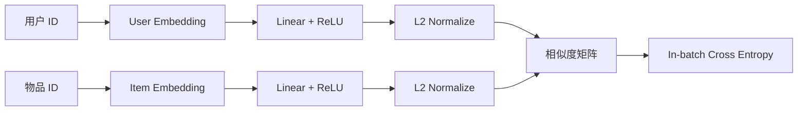

# MLP 双塔示例

本目录提供最小可运行的 ID 双塔，用于验证“独立编码、批内 softmax、物品向量导出和 Top-K 检索”闭环。



## 文件与逻辑

- [model.py](./model.py)：`TwoTowerModel`、用户/物品编码接口及批内 loss。
- [train.py](./train.py)：构造合成偏好、训练模型，并对用户 0 执行全物品 Top-5 检索。

`user_tower` 与 `item_tower` 分别由 `Embedding -> Linear -> ReLU` 组成，最终输出 L2 归一化向量。训练 batch 中第 $b$ 个用户与第 $b$ 个物品组成正对，其余列作为负例，使用交叉熵优化。

示例中每个用户固定关联两个合成物品，因此可以观察 loss 下降和目标物品进入 Top-K。真实系统需要把 ID 输入扩展为画像、上下文和内容特征，并处理 batch 内同用户多正例与重复物品。

## 运行

在本目录执行：

```powershell
python train.py
```

依赖 PyTorch，默认在 CPU 上即可运行。