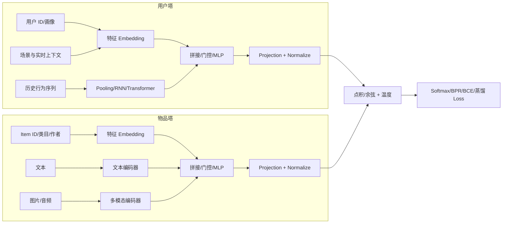
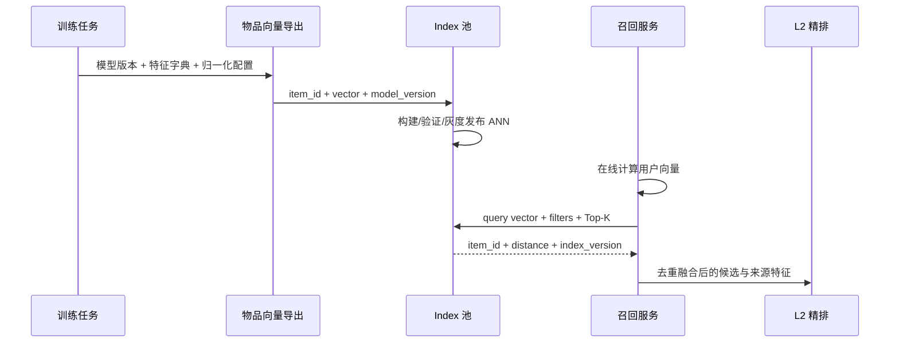

# 模型架构设计

双塔的架构目标不是最大化任意用户-物品交叉能力，而是在“物品向量可离线预计算”的约束下学习高质量匹配空间。只要物品塔输入依赖当前用户，或两塔在向量输出前发生候选级交叉，就无法直接对全库物品做一次性建库。

## 1. 通用结构



两塔不要求结构对称。用户侧需要表达动态兴趣，往往使用序列模型；物品侧强调稳定、可批量计算和冷启动内容，可能使用较深的内容编码器，再将结果缓存或蒸馏。两塔最终投影到相同维度 $d$。

## 2. 特征编码

### 2.1 类别与 ID 特征

用户 ID、item ID、类目、作者和地域等离散特征通常使用 embedding。高基数 ID 可采用哈希、频次裁剪或分层 embedding；低频/OOV 必须有稳定映射。纯 ID embedding 记忆能力强，但新实体没有可学习表示，因此应与内容或元数据结合。

### 2.2 连续特征

价格、时长和历史统计等连续特征应做标准化、对数变换、分桶或小型数值编码器。统计特征必须明确时间窗口并避免未来泄漏。变化极快的特征若进入物品塔，会迫使系统频繁重建全量向量。

### 2.3 序列特征

用户行为序列需处理 padding、行为类型、位置、时间间隔、会话边界和最大长度。平均池化成本低但会稀释短期意图；attention 或 Transformer 能按上下文选择行为，却增加在线计算和缓存复杂度。

### 2.4 文本与多模态特征

标题、描述、图片和音频适合补充新物品表示。大型内容编码器可离线运行于物品侧；若用户塔也需要在线编码 Query，应采用轻量模型、缓存或蒸馏。多模态缺失时应显式提供 mask，避免用零向量混淆“缺失”和“真实零值”。

## 3. MLP 双塔

MLP 双塔先对离散特征做 embedding，再拼接连续特征，通过若干全连接层投影到检索空间：

$$
u=\operatorname{Norm}(W_L\phi(\cdots\phi(W_1x_u))),\qquad
v=\operatorname{Norm}(V_L\phi(\cdots\phi(V_1x_i)))
$$

其优点是推理快、部署简单、便于排查训练和索引链路；缺点是对行为顺序、长序列依赖和多兴趣表达有限。它适合作为复杂双塔的首个可复现基线。

本项目的 [MLP 示例](./MLP/README.md) 使用用户 ID 与物品 ID embedding、线性投影、ReLU、L2 归一化和批内 softmax。示例刻意保持最小化，不代表生产特征规模。

## 4. Transformer 用户塔

对行为序列 $(i_1,\ldots,i_T)$，先将物品、位置、行为类型和时间等 embedding 相加或拼接，再通过自注意力编码：

$$
H^{(0)}=E_{item}+E_{position}+E_{behavior}+E_{time}
$$

$$
H^{(l+1)}=\operatorname{TransformerBlock}(H^{(l)})
$$

可使用 `[CLS]`、最后一个有效位置、attention pooling 或多个兴趣 token 得到用户向量。本项目采用双向 `[CLS]` 聚合：

$$
u=\operatorname{Normalize}(W_u h_{\mathrm{CLS}})
$$

“BERT-style”仅表示双向 self-attention 与 `[CLS]` 聚合，不等于加载语言模型 BERT。训练样本必须保证序列截止于目标时点之前；若输入中包含目标物品或之后行为，即使 attention mask 正确仍然会泄漏标签。线上需要逐事件更新状态时，可考虑 causal attention、KV cache 或异步预计算用户向量。

本项目的 [Transformer 示例](./transformer/README.md) 使用 Transformer 用户塔，以及融合 item ID 和类目的 MLP 物品塔。

## 5. 匹配层与向量归一化

点积允许向量范数表达置信度或热门度，但范数可能持续增长；余弦相似度更稳定，也更便于使用标准 ANN。归一化后：

$$
s(u,i)=\frac{u^\top v_i}{\tau},\qquad \lVert u\rVert_2=\lVert v_i\rVert_2=1
$$

温度 $\tau$ 越小，softmax 越尖锐，难负例梯度越集中；过小会导致训练不稳定或对假负例过度惩罚。可使用固定温度或受约束的可学习温度，并监控正负相似度分布，而不只看 loss。

向量维度越高通常表达能力越强，但会增加索引内存、距离计算和网络传输。应联合扫描维度、ANN 参数、Recall@K 和 P99，而不是只按离线 loss 选择维度。

## 6. 训练目标

### 6.1 批内 softmax

当前两个示例都使用批内 softmax：

$$
\mathcal L=-\frac{1}{B}\sum_{b=1}^{B}\log
\frac{\exp(u_b^\top v_b/\tau)}
{\sum_{j=1}^{B}\exp(u_b^\top v_j/\tau)}
$$

它高效且与大规模检索目标接近，但假设矩阵对角线是唯一正例。重复 item、同用户多正例和内容等价物必须通过 mask 处理。非均匀进入 batch 的物品还可能需要 log-probability 校正。

### 6.2 其他常用目标

- **Sampled softmax**：适合一个正例与大量采样负例竞争，可结合 $-\log q(i)$ 校正。
- **BPR**：直接优化 $s(u,i^+)>s(u,i^-)$，实现简单，但依赖负例质量。
- **BCE**：适合显式曝光二分类和样本加权；训练先验与线上全库先验不一致时需谨慎解释分数。
- **蒸馏**：用精排或交叉模型的软分数补充硬标签，使双塔近似更强的交叉关系。

损失的详细比较与选择建议见[双塔总览](../README.md)，负例分布和校正见[数据构造](../数据构造/README.md)。

## 7. 多兴趣与结构扩展

单个向量容易把“篮球、古典音乐、育儿”等互不相关兴趣平均在一起。MIND 使用动态路由输出多个兴趣向量 $u_1,\ldots,u_M$，分别检索后合并：

$$
s(u,i)=\max_{m\in\{1,\ldots,M\}}u_m^\top v_i
$$

其他常见扩展包括：

- attention pooling 或兴趣 token，让不同请求上下文选择不同历史。
- 共享底层内容编码器、塔顶独立投影，平衡参数共享与角色差异。
- Mixture-of-Experts 按场景、地域或行为类型选择专家。
- 多任务学习，同时预测点击、观看、转化等行为，并处理任务梯度冲突。
- 精排蒸馏、对比蒸馏和 embedding 蒸馏。
- 用户向量缓存与实时增量塔，组合长期兴趣和当前会话。

多兴趣会将一次请求扩展为多次 ANN 查询，必须设置兴趣数、每兴趣配额、跨兴趣去重和总延迟预算。

## 8. 正则化与训练稳定性

- 对 embedding 和 MLP 使用适度 weight decay；对超大稀疏 embedding 可采用单独优化器和正则策略。
- 监控用户/物品向量范数、均值、方差、有效秩与两两余弦分布，识别坍塌和各向异性。
- 大 batch 改变负例数量与分布，通常需要重新调整学习率和温度。
- Gradient clipping 可缓解序列塔和极难负例引起的梯度尖峰。
- Dropout 可用于 Transformer 内部，但物品向量导出必须在 `eval()` 模式，保证索引向量确定。
- 多机训练要确认跨卡 negatives 是否聚合，以及梯度是否能正确回传到远端向量。

## 9. 离线导出与在线服务



导出产物至少包含模型版本、特征 schema、词表/哈希规则、向量维度、归一化方式和距离类型。发布前应检查向量覆盖率、NaN/Inf、范数分布、精确检索一致性和新旧索引候选 Jaccard。在线请求日志需记录模型和索引版本，便于定位版本错配。

ANN 的算法、参数、分片、增量更新与回滚见 [Index 池](../../../Index池/README.md)。

## 10. 架构选型

| 场景 | 用户塔建议 | 物品塔建议 |
| --- | --- | --- |
| 快速验证或行为较少 | ID/画像 Embedding + MLP | ID + 类目 MLP |
| 强短期会话意图 | GRU/Transformer + 实时序列 | ID + 内容/类目塔 |
| 用户兴趣跨度大 | 多兴趣网络或多个兴趣 token | 统一物品向量，分兴趣 ANN |
| 新品占比高 | 历史 + 上下文混合塔 | 强化文本/图像内容编码 |
| 搜索语义召回 | Query Transformer | 文档/商品文本编码器 |
| 在线预算严格 | pooling/轻量 MLP，配合缓存 | 深模型离线编码并缓存 |

## 11. 示例目录

```text
模型架构/
├── README.md
├── MLP/
└── transformer/
```

两份示例都使用合成数据，只用于解释编码、loss 和向量检索闭环。生产实现还需要真实特征流水线、时间切分、多正例 mask、分布式训练、向量导出契约和线上一致性校验。

代表架构来源包括 [DSSM](https://www.microsoft.com/en-us/research/publication/learning-deep-structured-semantic-models-for-web-search-using-clickthrough-data/)、[YouTube DNN](https://doi.org/10.1145/2959100.2959190)、[BERT4Rec](https://arxiv.org/abs/1904.06690) 和 [MIND](https://arxiv.org/abs/1904.08030)。集中入口见 [L1 召回文献](../../../../文献/L1召回/README.md)。