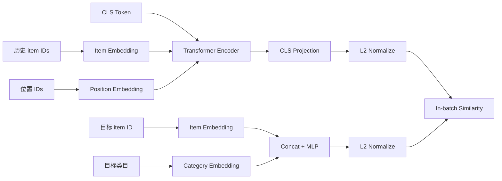

# Transformer 双塔示例

本目录展示“Transformer 用户塔 + 特征 MLP 物品塔”。用户塔编码有顺序的行为历史，物品塔融合 item ID 与类目，最终投影到同一检索空间。



## 文件

- [model.py](./model.py)：`TransformerTwoTower`、padding mask、序列用户编码和物品特征编码。
- [train.py](./train.py)：生成类目一致的合成序列，以 next-item 为正例训练并执行 Top-5 检索。

## 用户塔

历史 item embedding 前拼接一个可学习 `[CLS]` token，再加入位置 embedding。两层 `TransformerEncoder` 对序列进行双向编码，取 `[CLS]` 输出，经线性投影和 L2 归一化得到用户向量。`padding_idx=0`，并通过 `src_key_padding_mask` 阻止 padding 参与 attention。

这里使用双向编码，是因为输入历史已经严格截止在目标时点之前。若把目标物品也放进输入，或线上状态只能因果更新，则需要重新设计样本或使用 causal mask。

## 物品塔与目标

物品塔拼接 item embedding 和 category embedding，经两层 MLP 投影。训练使用批内 softmax，每个序列的 next-item 为正例。真实系统可以继续加入标题、作者、图像等内容表示，但这些特征必须能够离线稳定导出。

## 运行

在本目录执行：

```powershell
python train.py
```

依赖 PyTorch。示例数据规模很小，仅用于说明序列编码和检索接口。