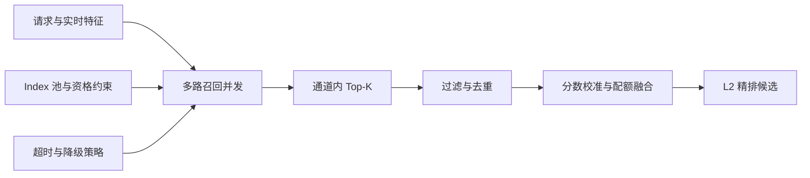

# 召回系统综述

## 1. 目标

召回的任务是在固定时延和资源预算下，将全量物品集合缩减为候选集合。它优先保证“相关物品有机会进入下游”，而不是决定最终顺序。

一个完整 L1 系统通常并行执行多路召回，再过滤、去重和融合。

## 2. 任务输入与输出

- **输入**：用户与设备标识、历史行为、实时会话、场景上下文、可用物品池和请求约束。
- **输出**：带通道、原始分数、模型/索引版本和解释元数据的候选集合。
- **约束**：物品可售/可播、地域与年龄规则、库存、频控、去重、时延和资源预算。
- **下游契约**：L2 需要稳定候选量及可追踪的通道特征；L1 不应把最终排序责任塞入单路召回。

## 3. 核心问题

1. 候选从哪里来：行为共现、协同信号、内容语义、知识图谱、规则或生成模型。
2. 样本如何构造：正例归因、曝光未点、随机负例、批内负例和难负例。
3. 匹配函数如何学习：邻域统计、隐因子、双塔向量内积、图传播或自回归概率。
4. 如何在线服务：近邻表、倒排表、ANN、约束解码、多通道并发和候选融合。
5. 如何评价：Recall@K、HitRate@K、覆盖率、增量召回、索引新鲜度和尾延迟。

## 4. 四类主方法

| 方法 | 主要信号 | 训练或估计方式 | 常见服务产物 |
| --- | --- | --- | --- |
| 协同过滤 CF | 用户-物品交互矩阵 | 邻域统计、矩阵分解、BPR | 用户/物品向量或近邻表 |
| I2I | 会话或行为序列中的物品共现 | 共现统计、Item2Vec、图模型 | 物品近邻表或向量索引 |
| 双塔 | 用户、物品和上下文特征 | 对比学习、采样 Softmax | 用户向量与物品 ANN 索引 |
| 生成式召回 | 行为序列、语义 ID、多模态内容 | 自回归训练、受约束解码 | 物品标识序列 |

### 4.1 双塔召回

双塔的决定性约束是分数可分解为请求向量与物品向量的简单匹配，因此物品向量能够预计算。它善于融合用户、上下文和物品内容，适合作为主力个性化通道。重点不是只选 MLP 或 Transformer，而是保持正例归因、负例分布、相似度、向量归一化和 ANN 距离一致。

### 4.2 协同过滤

CF 从用户-物品交互矩阵提取群体模式，包括 UserCF、ItemCF、矩阵分解、BPR、ALS 与图 CF。矩阵分解得到的是优化目标下的 latent embedding，并非严格意义的本征向量。它在行为充足时强而稳定，但对冷启动、曝光偏差和交互稀疏敏感。

### 4.3 I2I 召回

I2I 由一个或多个种子物品触发。相似度可以来自 ItemCF 共现、Item2Vec、监督度量学习、InfoNCE、自监督内容表示或图算法。SimCSE 原为句表示方法，在本手册中仅作为可迁移的 dropout 双视图范式，称为 SimCSE-style，而非经典 I2I 标准算法。

### 4.4 生成式召回

生成式召回直接产生物品 ID 或多级语义 ID。语义 ID 常由残差量化得到，模型以自回归概率生成代码，并通过 Trie 做合法约束。TIGER 代表语义 ID 检索路线；HSTU 更侧重大规模推荐序列建模；OneRec 展示了 Kuaishou 在统一生成式推荐和偏好对齐方向的工业探索。

## 5. 其他召回方式

四类主方法不穷尽工业系统。以下通道通常承担兜底、冷启动、关系扩展、业务注入或主动反馈采集，详见[其他召回方式综述](./其他召回方式/其他召回方式综述.md)：

| 通道 | 作用 | 注意事项 |
| --- | --- | --- |
| 热门/趋势 | 无历史兜底、热点响应 | 分场景/地域/时间窗，避免全局热门垄断 |
| 规则/运营 | 活动、合规、保量和强业务约束 | 版本化、审计、设置配额与失效时间 |
| 内容检索 | 文本、类目、标签或多模态相似 | 适合新品，需处理语义同质化 |
| 图与知识召回 | 社交、作者、主题、知识实体扩展 | 关注图新鲜度、路径偏差与扇出 |
| 探索通道 | 新品、长尾和不确定性采样 | 需要流量预算、风险约束和反事实评价 |

这些通道可能内部仍使用双塔、I2I 或图 embedding，因此“信号来源”“学习目标”“表示形式”“服务方式”应分开描述。

## 6. 在线请求与候选契约

L1 请求至少应携带 `request_id、user_id/device_id、scene、timestamp、region、客户端能力、实验桶、实时会话`。每个候选至少保留 `item_id、channel、raw_score、rank、reason、model_version、index_version、generated_at`；融合后再追加 `normalized_score、all_channels、filter_reason`。多来源候选不能在去重时只保留第一条命中，否则无法计算通道重合率和增量价值。

Index 池负责可推荐物品、标识映射、向量/倒排/近邻索引及其发布生命周期；各召回方法负责自己的样本、模型或统计量；L1 服务负责请求路由、多路并发、截止时间、候选合并和可观测性。三类职责应分别维护，避免索引、模型数据和在线编排互相耦合。

## 7. 在线编排

编排器根据场景、用户状态、实验桶和总时延预算选择通道。例如新用户增加热门、内容和探索预算，活跃用户增加双塔与协同预算。每路必须配置目标候选数、软超时、硬截止时间、并发上限、熔断阈值与回退策略；请求到达硬截止时间后不再等待慢通道。

过滤一般分两层：检索前用地域、年龄、库存等条件缩小可搜索集合，检索后用最新下架状态、已消费、频控和安全规则复核。为抵消过滤损耗，通道应按历史通过率超额召回，并监控过滤后候选是否仍满足 L2 最小输入量。

## 8. 去重、校准与融合

多路原始分数不可直接相加：余弦相似度、共现权重、自回归概率和热门分完全不同量纲。常见融合层次如下：

1. **固定配额**：每路取固定 Top-K，稳定、可解释，适合第一版。
2. **秩融合**：使用 Reciprocal Rank Fusion，弱化原始分数量纲差异：$s(i)=\sum_c w_c/(k+r_{c,i})$。
3. **分数校准**：按通道与场景用分位数、Isotonic 或 Platt scaling 映射到可比较空间。
4. **学习式融合**：以候选通道、分数、排名、重合数、用户状态为特征学习进入 L2 的价值。
5. **约束配额**：为新品、长尾、内容安全或业务供给设置上下限，但不得绕过硬资格规则。

同一物品被多路命中时保留全部来源，可使用最大校准分、加权和或学习模型合并。最终截断前检查总量、通道覆盖和主题/供给结构，避免单一高重合通道吃满预算。

## 9. 超时、熔断与降级

- 单路超时：返回已产生的部分候选，不阻塞整个请求。
- 错误率或尾延迟持续超阈值：熔断该路，使用最近成功缓存、轻量 I2I 或分群热门。
- 用户/实时特征不可用：切换到设备、地域和场景级先验，记录降级原因。
- 候选不足：按优先级补充热门和高质量库存，而不是放宽合规或资格约束。
- 全链路需支持模型、路由配置和 Index 版本的独立回滚，并避免新模型查询不兼容的旧向量。

## 10. 监控与告警

| 层次 | 核心指标 | 典型诊断含义 |
| --- | --- | --- |
| 请求健康 | 请求量、成功率、空结果率、降级率、熔断次数 | 服务是否可用，回退是否被频繁触发 |
| 时延容量 | 各通道 P50/P95/P99、总 P99、超时率、QPS、CPU/GPU/内存 | 慢路、排队或资源瓶颈 |
| 候选漏斗 | 原始量、去重后量、过滤后量、送入 L2 数量、过滤原因分布 | 过度过滤、召回不足或重复浪费 |
| 通道结构 | 通道命中量、占比、重合率、独占候选率、增量 Recall | 某路是否提供独立价值 |
| 分数质量 | 原始/校准分分布、Top-K 分位数、分数漂移、校准误差 | 模型或数据分布是否改变 |
| 供给覆盖 | 物品/类目/作者覆盖率、长尾率、新品率、热门集中度 | 是否陷入头部垄断或供给萎缩 |
| 时效一致性 | 模型版本、Index 版本、特征年龄、事件到可召回延迟 | 发布错配、实时链路积压 |
| 下游价值 | L2 采用率、正例命中、最终曝光/点击贡献、单位资源收益 | 候选是否真正被下游使用 |

告警应按场景和通道建立动态基线，而非只使用全局固定阈值。发布时比较新旧版本的候选 Jaccard、分数分布、空结果率和 P99；故障复盘必须能按 `request_id` 还原通道路由、版本、耗时、候选和过滤原因。

## 11. 评测体系

召回评测应同时回答“相关候选是否进入下游”“各通道是否提供独立价值”以及“在线代价是否可接受”。指标定义、聚合口径、离线切分和多通道增量评测详见[召回系统评测](./召回系统评测.md)。

| 维度 | 代表指标与检查项 |
| --- | --- |
| 候选命中 | Recall@K、HitRate@K、正例进入候选集的比例 |
| 供给覆盖 | 物品覆盖率、长尾覆盖率、新品覆盖率和人均候选量 |
| 通道价值 | 单路召回、增量召回、通道重合率、去重前后候选量 |
| 数据与索引 | 索引新鲜度、向量覆盖率、空结果率和过滤后结果充足率 |
| 在线性能 | P50/P95/P99、QPS、超时率、降级率和资源成本 |

离线集合必须按时间切分并复现线上候选资格，避免未来交互和失效物品泄漏。新增通道不能只看自身 Recall@K，还要在相同总候选预算下测量与已有通道合并后的增量召回，以及候选增长对 L2 时延和效果的影响。

## 12. 选型参考

| 场景 | 优先基线 | 主要补充 |
| --- | --- | --- |
| 交互丰富、个性化主链路 | 双塔 + ANN | 多兴趣、难负例、蒸馏 |
| 稳定隐式反馈、实现成本敏感 | ItemCF/BPR | ALS、LightGCN |
| 强会话意图、相邻消费明显 | ItemCF/Item2Vec I2I | 对比学习、实时会话图 |
| 新品内容丰富、交互稀疏 | 内容双塔/SimCSE-style | 探索和热门兜底 |
| 研究统一生成与长序列能力 | 生成式召回 | 语义 ID、约束解码、偏好对齐 |

生产方案通常不是四选一。推荐从热门兜底 + ItemCF + 双塔建立可解释基线，再根据增量召回、维护成本和延迟瓶颈扩展，而不是只因模型新颖替换成熟通道。

## 13. 前沿方向

- 语义 ID 与生成式召回，以及 OneRec 类召回排序统一路线。
- 多兴趣、长序列和实时意图召回。
- 文本、图像、音频与行为信号的统一多模态表示。
- 面向长尾、公平和长期价值的候选生成。
- 稀疏、稠密、图和生成式通道的混合检索。