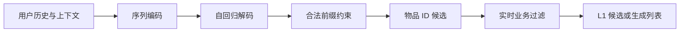
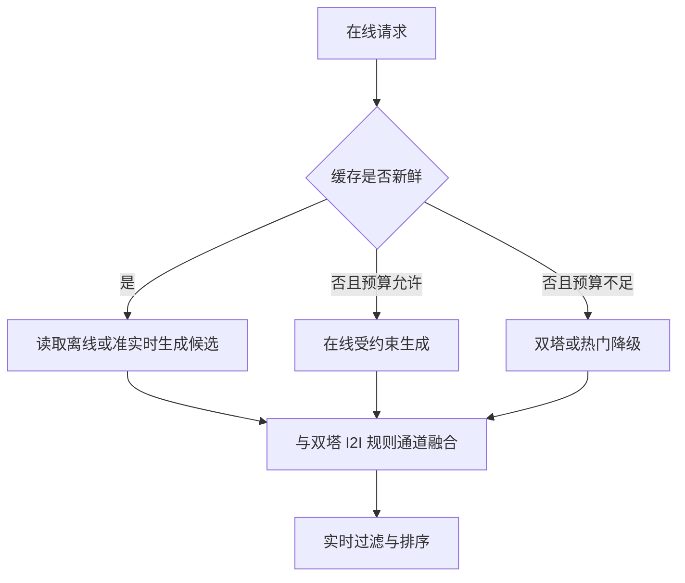

# 生成式召回综述

生成式召回（Generative Retrieval / Generative Recommendation）把“编码用户并在全库索引中检索候选”改写为“根据用户上下文生成一个或多个物品标识”。若物品 $i$ 被表示为 token 序列 $(c_1,\ldots,c_M)$，模型学习：

$$
p(i\mid x_u)=\prod_{m=1}^{M}p(c_m\mid x_u,c_{<m})
$$

它不是“让通用聊天 LLM 输出商品名称”，也不是 Kuaishou 单独提出的一种算法，而是一条包含离散物品标识、生成式检索、推荐序列建模、受约束解码和偏好对齐的研究路线。TIGER 是语义 ID 生成检索的重要代表；HSTU 研究大规模生成式推荐中的序列建模；Kuaishou 的 OneRec 则进一步探索统一生成与排序、工业规模训练和偏好对齐。

工业系统通常不会在一次召回请求中运行开放词表、长文本输出的通用大语言模型。更常见的实现是：

1. 使用推荐领域数据训练参数规模可控的专用 Transformer。
2. 每个物品只生成一个原始 ID token，或长度通常很短的语义 ID token 序列。
3. 用 Trie、有限状态约束或层次码本把解码限制在当前可推荐物品集合中。
4. 通过 KV cache、批处理、浅层 beam、词表裁剪和模型蒸馏控制在线成本。
5. 在严格延迟场景中离线生成用户候选或兴趣簇候选，在线只查 KV；需要实时性的流量再执行增量生成。
6. 与双塔、I2I、热门和规则召回并行运行，由融合层控制候选配额和降级。

因此，判断生成式召回能否上线，不能只看模型参数量，而要同时看输出长度、每步有效分支数、beam 宽度、是否在线生成、缓存命中率以及传统通道能否兜底。

## 1. 生成式召回到底生成什么

“生成式推荐”是一个宽泛概念，至少包含三类不同问题。

| 路线 | 输出 | 主要目标 | 是否等同于 L1 生成式召回 |
| --- | --- | --- | --- |
| 文本生成式推荐 | 解释、评论、自然语言 item 名称或推荐回答 | 统一任务、可解释性、对话交互 | 不一定，开放文本还需要实体链接和候选校验 |
| 生成式物品检索 | 原始 item ID 或语义 ID | 从全库直接产生候选 | 是本文重点 |
| 生成式序列推荐 | 下一物品、下一组物品或完整推荐 session | 建模行为序列及列表内部依赖 | 可用作召回，也可能进一步替代排序链路 |

传统双塔学习用户向量 $q_u$ 与物品向量 $v_i$，再执行最大内积检索：

$$
\operatorname{TopK}_{i\in\mathcal I} q_u^\top v_i
$$

生成式召回则学习从上下文到标识序列的条件分布：

$$
\operatorname{TopK}_{i\in\mathcal I} p_\theta(\operatorname{id}(i)\mid x_u)
$$

两者的根本差别不是是否使用 Transformer，而是候选空间如何搜索：双塔把物品放在外部 ANN 索引中，生成模型把物品标识及其条件概率结构编码到参数、码本和合法前缀树中。



## 2. 完整的数据、训练与服务链路

生成式召回不是单一模型，而是一组必须共同版本化的组件。

### 2.1 离线数据与样本

原始日志至少包括：

$$
(u,i,a,t,scene,exposure,position,dwell,device)
$$

其中 $a$ 是点击、有效观看、收藏、加购、购买等行为。处理步骤通常包括：

1. 按事件时间切分训练集、验证集和测试集，避免未来物品或未来行为泄漏。
2. 按业务间隔切分 session，过滤机器人、误触和异常高频行为。
3. 选择输入历史长度，并对过长用户序列做近期截断、分层采样或兴趣压缩。
4. 将目标物品映射为稳定的原始 ID 或语义 ID。
5. 对多行为设置样本权重，或构建多个行为 token 与多目标损失。

对下一物品训练，一条长度为 $T$ 的序列可展开为多个前缀样本：

$$
([i_1],i_2),([i_1,i_2],i_3),\ldots,([i_1,\ldots,i_{T-1}],i_T)
$$

实际系统要限制单个重度用户贡献的样本量，否则模型容易被少量高活跃用户主导。

### 2.2 物品 tokenizer 或标识系统

标识系统负责把物品映射为模型可以生成的 token。它决定输出长度、词表大小、语义共享、新品能力和解码成本，是生成式召回与普通序列推荐最显著的差异之一。

### 2.3 生成模型

Encoder-decoder 模型先将用户历史编码为隐状态，再由 decoder 生成目标代码；decoder-only 模型则把历史、上下文和目标拼成统一 token 流。模型可以输出单个物品、Top-$K$ 个独立物品，或一整段有顺序的推荐列表。

### 2.4 合法性索引与解码器

模型给出 token 概率，但 catalog、Trie、库存表和策略规则决定哪些序列当前可以完成为合法物品。这个组件相当于生成式召回的“索引层”，不能因为不再使用 ANN 就被省略。

### 2.5 在线候选服务

线上服务加载同一版本的模型、tokenizer、item-to-code 映射和合法前缀索引，生成候选后还要执行库存、地域、安全、已看、频控和去重过滤，再交给融合或排序阶段。

## 3. 物品标识与语义 ID

### 3.1 单 token 原始 ID

最直接的方式是把每个 item ID 当成一个类别：

$$
p(i\mid x_u)=\operatorname{softmax}(W h_u)_i
$$

优点是映射唯一、解码一步完成、没有语义码碰撞。缺点是输出层和 embedding 表随物品数线性增长，不同物品之间不能通过标识共享结构，新品也没有可复用代码。本目录的 [model.py](./model.py) 与 [train.py](./train.py) 是 GRU 加全物品分类的最小基线，用来说明这一形式，不代表工业级大库实现。

### 3.2 数字串或任意 ID 序列

也可以把原始 ID 拆成数字或子 token。这样缩小了单步词表，但相邻数字没有稳定语义，序列长度增加，还会产生大量不存在的组合。除非配合严格约束，否则它通常只是编码压缩，不是语义建模。

### 3.3 语义 ID

语义 ID 先用内容、协同或多模态 encoder 得到物品向量 $e_i$，再将其量化为短代码：

$$
e_i \longrightarrow (c_{i,1},c_{i,2},\ldots,c_{i,M})
$$

以残差量化为例，令 $r_{i,0}=e_i$，第 $m$ 层从码本 $E_m$ 中选择最近码字：

$$
c_{i,m}=\arg\min_k\lVert r_{i,m-1}-E_m[k]\rVert_2^2
$$

$$
r_{i,m}=r_{i,m-1}-E_m[c_{i,m}]
$$

前几层通常表达较粗的语义簇，后几层逐步编码残差信息。若每层有 $K$ 个码字、共 $M$ 层，理论路径容量为 $K^M$；实际容量会受到码字利用不均、前缀拥塞和碰撞影响。

### 3.4 语义 ID 的三种信息来源

| 来源 | 优势 | 风险 |
| --- | --- | --- |
| 内容或多模态 embedding | 新品可编码，语义可解释 | 未必反映真实协同偏好 |
| 协同 embedding | 与用户行为和消费关系一致 | 冷启动弱，热门偏差明显 |
| 内容与协同联合表示 | 兼顾语义和行为 | 训练、版本与目标权重更复杂 |

TIGER 体现了内容语义向量加残差量化的经典路径；后续工作开始在 tokenizer 中加入协同约束、码字均衡和可学习分配。这里需要区分两件事：更准确地重建输入 embedding，不一定能产生更适合推荐的代码；tokenizer 应同时用重建质量、协同一致性、码本利用率和最终 Recall/NDCG 评估。

### 3.5 碰撞、码字坍缩与版本稳定性

多个物品可能共享同一码序列。常见处理包括：

- 在末尾追加碰撞 token，使完整代码唯一。
- 增加量化层数或码本大小。
- 使用均衡聚类或多样性正则，避免大量物品挤入少数前缀。
- 允许一个语义叶子挂接多个物品，再由轻量模型二次区分。

码本重训可能让同一物品的 ID 改变，这比普通 embedding 更新更危险，因为训练标签、在线 Trie、缓存和回放日志都会失去一致性。生产发布至少要绑定：

```text
model_version
tokenizer_version
item_code_mapping_version
valid_prefix_index_version
catalog_snapshot_version
```

新品接入也不是自动解决的。内容 encoder 可以立即给新品计算向量，但仍需量化、碰撞处理、更新合法前缀索引，并确认旧模型是否学过该前缀附近的概率结构。

## 4. 模型结构与训练目标

### 4.1 输入表示

用户上下文通常由以下 token 或特征组成：

- 按时间排序的物品原始 ID 或语义 ID。
- 点击、观看、收藏、购买等行为类型。
- 时间间隔、位置、设备、入口和场景。
- 用户长期画像或压缩后的长期兴趣。
- 当前请求上下文，例如时间、地域和页面类型。

物品语义 ID 有多个层级时，必须防止模型混淆“第 1 层码字 7”和“第 2 层码字 7”。可以为不同层使用独立词表，或叠加 level embedding。

### 4.2 单物品生成

给定用户上下文 $x_u$，对目标物品代码使用 teacher forcing：

$$
\mathcal L_{NTP}=-\sum_{m=1}^{M}
\log p_\theta(c_{i,m}\mid x_u,c_{i,<m})
$$

训练时每一步看到真实前缀，推理时看到自身生成的前缀，这会产生 exposure bias。可通过序列级训练、候选回采、scheduled sampling 或偏好优化缓解，但这些方法会提高训练复杂度。

### 4.3 列表或 session 生成

独立生成 $K$ 个物品后再拼接，无法直接建模列表内部的互补、重复和顺序。列表生成将目标写成：

$$
Y=[\operatorname{id}(i_1),\text{SEP},\ldots,
\operatorname{id}(i_K),\text{EOS}]
$$

并优化：

$$
\mathcal L_{list}=-\sum_{t=1}^{|Y|}\log p_\theta(Y_t\mid x_u,Y_{<t})
$$

这种方式可以学习“前面已经出现什么”，有机会把相关性、多样性和连贯性纳入同一策略，但输出长度扩大到约 $K\times M$，推理成本和误差累积也同步增加。OneRec 的 session-wise generation 属于这一方向。

### 4.4 多行为与多目标

仅预测下一次点击容易放大点击诱导和短期兴趣。可以对有效观看、完成播放、点赞、收藏、购买等设置加权目标：

$$
\mathcal L=\sum_b\lambda_b\mathcal L_b
$$

也可训练 reward model 估计列表级价值，再对生成结果做偏好对齐。业务权重必须通过在线实验校准，不能把观看时长、互动率和长期留存简单相加后视为无偏效用。

### 4.5 负样本与偏好对齐

全词表交叉熵不需要像双塔那样显式采一个负物品，但当前步的其他 token 都是竞争类别。大词表下若采用 sampled softmax，则采样分布仍会影响模型边界。

序列级偏好优化可从 beam 或采样结果中选择高奖励列表 $Y^+$ 与低奖励列表 $Y^-$。DPO 类目标比较策略相对参考模型对两者的偏好：

$$
\mathcal L_{DPO}=-\log\sigma\left(
\beta\log\frac{\pi_\theta(Y^+\mid x)}{\pi_{ref}(Y^+\mid x)}
-\beta\log\frac{\pi_\theta(Y^-\mid x)}{\pi_{ref}(Y^-\mid x)}
\right)
$$

推荐日志通常只观测被展示列表的反馈，无法同时得到同一请求下多个列表的真实偏好。工业方案因此会用 reward model、反事实估计或在线探索构建偏好对，但要警惕 reward hacking、位置偏差和模型自举造成的闭环偏差。

## 5. 受约束解码与候选生成

### 5.1 为什么不能直接贪心生成

逐 token 贪心只保留局部概率最高的路径，容易错过整体概率更高的物品，也只能得到一个结果。无约束 beam search 又可能生成不存在、已下架或重复的代码。因此，生产解码通常需要 beam 与合法前缀约束共同工作。

### 5.2 Trie 约束

把所有当前合法物品代码写入 Trie。对前缀 $c_{<m}$，只允许后继集合 $A(c_{<m})$：

$$
p'(c_m\mid x,c_{<m})=
\begin{cases}
p(c_m\mid x,c_{<m}), & c_m\in A(c_{<m})\\
0, & \text{otherwise}
\end{cases}
$$

每一步只对有效分支取 Top-$B$，直至获得足够的完整物品。这样可以把非法 ID 率降到零，但库存、地域和审核状态变化频繁时，直接为每个请求重建 Trie 不现实。常见做法是维护 catalog 级稳定 Trie，在叶子完成后执行实时过滤；对强约束场景维护地域或场景分片的合法集合。

- [semantic_id.py](./semantic_id.py)：残差量化、碰撞后缀和合法 ID Trie。
- [semantic_id_example.py](./semantic_id_example.py)：语义 ID 构建与受约束逐步解码示例。

### 5.3 Beam search

路径分数通常是 token 对数概率之和：

$$
s(c_{1:M})=\sum_{m=1}^{M}\log p(c_m\mid x,c_{<m})
$$

固定长度语义 ID 不需要复杂的长度惩罚；若列表可以提前结束，则需校准 EOS 偏好。Beam 越大，召回率通常越高，但每步排序、KV cache 存储和后续去重成本也越高。实际应绘制 $B$ 对 Recall、端到端延迟和 GPU 成本的 Pareto 曲线，而不是直接使用论文中的 beam 宽度。

### 5.4 Top-$K$ 候选的三种产生方式

1. **单次 beam 输出多个叶子**：最接近生成式检索，适合固定短代码。
2. **逐物品生成并屏蔽已选结果**：易控制列表约束，但重复执行 decoder。
3. **一次生成完整列表**：直接建模列表内部依赖，但序列长、失败恢复和约束逻辑更复杂。

候选分数不能只取最后一步概率。通常使用完整路径 log probability，并按物品、关系类型或校准桶做后处理。多个代码对应同一物品时还需要概率合并。

### 5.5 业务约束和降级

强时效规则不适合全部写进模型参数。上线链路仍应保留：

- 下架、库存、地域和安全过滤。
- 已看过滤、作者或商家频控。
- 同质内容去重与类目配额。
- 商业化、运营和合规策略。
- 解码超时、GPU 故障和版本不一致时的双塔或热门通道降级。

生成式模型负责产生相关候选，不等于可以删除候选治理层。

## 6. 典型工作与技术演进

下表按它们解决的主要问题组织，而不是把所有使用 Transformer 的推荐模型都称为生成式召回。

| 时间 | 工作 | 核心贡献 | 在本路线中的位置 |
| --- | --- | --- | --- |
| 2022 | DSI | 将查询直接映射到文档 ID，提出可微生成式索引 | 生成式检索的重要前身，不是推荐模型 |
| 2022 | P5 | 把多种推荐任务统一为 text-to-text 预训练与提示任务 | 证明统一生成接口的价值，但不等同于大库语义 ID 召回 |
| 2023 | TIGER | 用 RQ-VAE 语义 ID 和序列到序列模型生成下一物品 | 语义 ID 生成式推荐的代表性起点 |
| 2024 | LC-Rec | 将协同语义注入 LLM 推荐与物品索引 | 强调内容语言空间与协同行为空间的结合 |
| 2024 | EAGER | 以双流方式协同行为与语义信息 | 推进语义和协同联合建模 |
| 2024 | LETTER | 学习兼顾层次语义、协同正则和代码多样性的 tokenizer | 直接处理 token 化质量和分配偏差 |
| 2024 | HSTU | 面向高基数、非平稳长行为序列设计可扩展架构 | 重点是生成式推荐骨干与规模化，不是语义 ID 检索本身 |
| 2025 | OneRec | 语义 token、session-wise 列表生成、稀疏 MoE 和迭代偏好对齐 | 展示统一生成模型替代级联链路的工业探索 |

### 6.1 DSI：生成式索引前身

DSI（Differentiable Search Index）让 Transformer 从文本查询直接生成文档 ID，并研究文档标识设计和训练方式。它建立了“语料信息进入模型参数、检索变成标识生成”的范式。推荐系统与搜索的差异在于用户兴趣持续变化、反馈有曝光偏差、catalog 更新频繁，因此不能直接照搬 DSI 的静态语料设定。

### 6.2 P5：统一任务不等于高效召回

P5 将用户、物品、评论和多个推荐任务转换为自然语言序列，使用统一语言建模目标预训练。它对推荐基础模型、多任务迁移和提示式交互影响较大，但自然语言生成结果还要映射回合法物品；在百万级 catalog 上，它本身没有自动解决低延迟 Top-$K$ 候选搜索。因此应把 P5 看作“推荐即语言处理”的代表，而不是 TIGER 式生成检索的同义词。

### 6.3 TIGER：语义 ID 生成检索

TIGER（Recommender Systems with Generative Retrieval）先对物品语义表示做残差量化，再训练 Transformer 根据用户 session 生成下一物品的语义 ID。其贡献包括：

- 通过层次代码减少单步输出词表。
- 让语义相近物品共享代码前缀。
- 使用序列生成替代显式 ANN 查询。
- 论文实验报告了对无历史交互物品更好的泛化能力。

需要注意，公开基准上的效果不等于已证明在任意工业流量、延迟和更新频率下优于强双塔。TIGER 更适合作为生成式召回的技术基线。

### 6.4 LC-Rec、EAGER 与 LETTER：改进 tokenizer

这一阶段的共同问题是：仅量化文本 embedding，可能得到“内容相似但推荐关系不相似”的 ID；不均衡的代码分配还会造成热门前缀拥塞。

- **LC-Rec** 强调把协同关系注入语言模型可使用的物品表示与索引。
- **EAGER** 使用行为流和语义流协作，试图同时保留协同信号与内容泛化。
- **LETTER** 在 RQ-VAE 语义正则之外加入协同对齐和代码多样性约束，并讨论 ranking-guided generation loss。

它们说明 tokenizer 不是一次性的预处理工具，而是生成推荐目标的一部分。不过 tokenizer 与生成器联合更新会增加 ID 漂移风险，工业系统常需要在“联合最优”和“版本稳定”之间折中。

### 6.5 HSTU：大规模生成式推荐骨干

HSTU（Hierarchical Sequential Transduction Unit）针对高基数、非平稳、超长用户行为序列设计。论文重点包括序列建模架构、训练计算扩展规律和长序列效率；公开结果报告 HSTU 在 8192 长度序列上相对 FlashAttention2 Transformer 的速度优势，并报告大规模模型在多个线上场景部署。

但 HSTU 不应被写成“用语义 ID 做 beam search 的召回算法”。它回答的是生成式推荐骨干如何处理工业行为数据和扩展计算，具体候选标识、召回边界与解码方式仍取决于应用系统。

### 6.6 OneRec：从单点召回到列表生成与偏好对齐

OneRec 使用 encoder-decoder，根据用户历史生成一个短视频 session；采用平衡残差量化生成语义 token，以稀疏 MoE 扩大容量，并通过 reward model 与迭代 DPO 对齐列表偏好。论文公开配置中包括 3 层语义 ID、每层 8192 个码字、长度 256 的历史和 5 个目标视频。

其部署章节给出了比“使用大模型”更有价值的工程信息：在线使用 1B 模型，采用 KV cache 与 FP16，beam size 为 128；MoE 推理时只激活部分专家。论文报告在快手主场景 1% 流量实验中，相对原多阶段系统总观看时长提升 1.68%，平均单视频观看时长提升 6.56%。这些是特定系统和实验配置下的论文报告，不能直接外推为所有业务的预期收益。

OneRec 的意义在于证明统一生成路线可以进入核心工业实验，而不是证明传统多路召回和级联排序已经普遍过时。其论文也指出互动类指标仍有改进空间。

## 7. 工业系统如何解决生成延迟

### 7.1 先澄清成本模型

通用 LLM 慢，主要因为参数量大、上下文长、输出文本长且词表开放。推荐生成器通常具有不同的成本结构。设 encoder 成本为 $C_{enc}$，每个 decoder step 的增量成本为 $C_{step}$，代码长度为 $M$，beam 为 $B$，则粗略成本可写为：

$$
C_{online}\approx C_{enc}+M\cdot B\cdot C_{step}+C_{constraint}+C_{filter}
$$

KV cache 避免每一步重复计算完整前缀，但不会消除 beam 扩张、候选排序和显存读写。因此“代码只有 3 个 token”不代表成本固定为三次前向，也不能把 NLP token/s 直接换算成推荐 QPS。

### 7.2 四种实际部署形态

#### 形态 A：离线物化候选

定时为活跃用户或兴趣簇生成 Top-$N$，写入 KV：

```text
user_or_cluster_id -> [(item_id, score, model_version), ...]
```

在线读取后叠加实时过滤和传统通道。这种方式最稳、延迟最低，适合用户兴趣变化相对慢的场景；缺点是不能完整利用请求级上下文，且全量用户刷新成本较高。

#### 形态 B：准实时异步生成

用户发生关键行为后，通过消息队列异步刷新候选缓存。请求路径仍是 KV 查询，但候选能在秒级或分钟级更新。它把 GPU 推理从同步峰值流量中移出，是生成模型常见的工程折中。

#### 形态 C：在线小模型生成

对价值高或强实时流量执行同步生成。常用优化包括：

- 缩短历史或先将长期兴趣压缩成少量 latent token。
- 使用较浅 decoder、蒸馏、量化、稀疏 MoE 或 speculative decoding。
- encoder 结果和稳定历史部分缓存，只有新行为增量更新。
- 连续批处理、请求合并和固定 shape，提升 GPU 利用率。
- 使用 KV cache，限制 beam、代码长度和最大候选数。
- 按合法前缀裁剪 logits，避免对完整无效词表排序。

#### 形态 D：分流或混合链路

生成式通道只承担一部分候选配额，例如探索、长尾、新品或高价值用户；双塔、I2I、热门与规则通道继续提供覆盖和降级。融合层对不同通道分数校准，排序层仍负责精细多目标决策。这通常是从实验走向稳定生产风险最低的路径。



### 7.3 为什么论文中的超大模型仍可能上线

训练参数量不等于单次推理激活量。稀疏 MoE 只激活少量专家；短代码降低输出步数；专用模型不生成自然语言；GPU 服务通过批处理摊薄成本；高稳定性流量还可由缓存覆盖。另一方面，模型规模依然会影响参数存储、通信、首 token 延迟和容灾成本，因此必须以端到端 P99 和单位请求成本验证，不能只看 FLOPs。

### 7.4 在线服务伪代码

```python
def generative_recall(request, limit):
	cache_key = make_cache_key(request.user_id, request.scene)
	cached = candidate_cache.get(cache_key)
	if cached is not None and cached.is_fresh():
		generated = cached.items
	elif inference_budget.allow(request):
		context = build_incremental_context(request)
		generated = constrained_beam_decode(
			model=current_model,
			context=context,
			prefix_index=current_prefix_index,
			beam_size=serving_config.beam_size,
			max_items=serving_config.generation_limit,
			deadline=request.deadline,
		)
	else:
		generated = []

	fallback = conventional_recall(request)
	candidates = calibrated_merge(generated, fallback)
	return policy_filter(candidates, request)[:limit]
```

这个伪代码刻意保留缓存、deadline、传统召回和策略过滤，因为这些部分决定系统是否真正可用。

## 8. 与传统双塔和级联系统的比较

| 维度 | 双塔加 ANN | 生成式召回 |
| --- | --- | --- |
| 候选搜索 | 外部向量索引近邻搜索 | 自回归产生合法标识路径 |
| item-item 共享 | 通过连续 embedding | 通过共享代码前缀和模型参数 |
| 输出空间 | 所有索引物品 | tokenizer 与合法前缀定义的物品 |
| Top-$K$ 成本 | ANN 查询通常较稳定 | 随代码长度、beam 和约束分支增长 |
| 新品接入 | 编码并插入 ANN | 编码、量化、更新映射/Trie，模型未必熟悉新代码 |
| 实时过滤 | ANN 前后过滤 | 解码约束与解码后过滤结合 |
| 列表建模 | 通常逐物品打分 | 可直接生成有顺序列表 |
| 可解释性 | 可分析向量和特征 | 可分析 token 路径，但概率误差会逐步累积 |
| 版本管理 | 模型、embedding、索引 | 模型、tokenizer、映射、Trie、catalog |
| 降级成熟度 | 工程生态成熟 | 需要额外设计超时和非法路径兜底 |

生成式召回并不天然免除全库成本。它把 ANN 的显式检索成本换成了参数化搜索与逐步解码成本；优劣取决于 catalog 规模、代码结构、模型容量、延迟预算和目标关系。

## 9. 优势、局限与适用场景

### 9.1 主要优势

- **统一建模**：用户历史、物品表示和候选生成可以用同一序列目标优化。
- **参数共享**：语义 ID 的共享前缀让长尾物品复用统计信息。
- **列表级决策**：能够把已生成物品作为后续条件，直接学习顺序、连贯性和多样性。
- **多任务接口**：行为类型、场景和任务可统一表示为 token 或条件。
- **冷启动潜力**：内容驱动 semantic ID 能为无交互物品提供结构化标识。
- **摆脱单一向量相似度**：条件概率可以表达比固定内积更复杂的匹配关系。

### 9.2 主要局限

- **自回归延迟**：每个输出 token 依赖前缀，难以像 ANN 一样一次并行检索大量候选。
- **误差累积**：前缀选错后，后续只能在错误子树中继续生成。
- **标识系统脆弱**：碰撞、码本坍缩和版本漂移会同时影响训练与服务。
- **动态 catalog 困难**：新增、删除和状态变化需要同步映射与合法前缀索引。
- **热门与曝光偏差**：下一物品似然容易学习日志中的展示策略，而非真实反事实偏好。
- **目标不完整**：高似然不自动满足多样性、安全、库存和商业约束。
- **调试复杂**：问题可能来自数据、tokenizer、模型、beam、Trie 或业务过滤中的任何一层。
- **基础设施不成熟**：成熟 ANN 服务通常比自定义约束解码服务更容易扩缩容和容灾。

### 9.3 更适合的场景

- 用户行为天然有强顺序性的短视频、音乐、新闻和连续消费内容。
- 目标列表内部关系重要，不能只按独立 item score 排序。
- 内容特征丰富，需要利用 semantic ID 改善长尾与新品覆盖。
- 业务具备 GPU serving、严格版本治理和多通道降级能力。
- 有足够流量进行在线实验，并能承担新旧系统长期并行成本。

### 9.4 不宜直接替换传统召回的场景

- 极低延迟、极高 QPS 且已有强 ANN 基础设施。
- catalog 变化极快，tokenizer 和合法索引难以及时同步。
- 可观测反馈少，序列数据不足以训练稳定生成器。
- 强规则或精确匹配主导，模型生成没有明显价值。
- 尚未建立曝光去偏、回放评测和可靠降级机制。

## 10. 训练、离线评估与在线实验

### 10.1 召回质量

- Recall@K、HitRate@K、NDCG@K、MRR。
- 按热门、中腰部、长尾和新品分桶的 Recall@K。
- 与双塔 ANN 在相同候选数、时间切分和延迟预算下比较。
- 多通道融合后的增量召回率，而不只看生成通道单独指标。

### 10.2 生成与 tokenizer 质量

- 非法 ID 率、重复率、提前 EOS 率。
- 码本 perplexity、码字利用率、前缀负载分布和碰撞率。
- 量化重建误差、协同邻域保持率和层级语义纯度。
- 新品可生成率、删除物品残留率和映射迁移正确率。

### 10.3 系统指标

- 端到端 P50、P95、P99 延迟，而不只报告模型 kernel 时间。
- 首 token 延迟、每 token 延迟和完整 Top-$K$ 完成时间。
- GPU 利用率、显存、批大小、超时率和单位千次请求成本。
- 缓存命中率、候选新鲜度、降级率和版本不一致率。

### 10.4 在线业务指标

- 点击、有效观看、播放完成、收藏、购买或长期留存。
- 内容覆盖率、长尾曝光、作者/商家公平性和重复曝光。
- 用户负反馈、安全指标和策略违规率。
- 对传统通道的替代率与互补率。

离线回放必须模拟“当时可推荐的 catalog”和当时策略约束。用今天的物品映射回放历史请求，会把未来物品和未来码本信息泄漏到评测中。

## 11. 推荐的工业落地路径

不建议第一步就删除 ANN 和排序系统。更稳妥的演进顺序是：

1. **建立强基线**：固定数据切分、候选数和延迟预算，对比双塔、序列模型与热门通道。
2. **验证 tokenizer**：先离线检查碰撞、码本利用率、协同邻域和新品映射。
3. **旁路生成**：生成候选仅用于日志和回放，不影响线上结果。
4. **小配额并行召回**：分配少量候选配额，保留传统通道和排序层。
5. **异步缓存优先**：先验证离线或准实时生成价值，再决定是否投入同步 GPU serving。
6. **受控在线生成**：只对部分流量开启，设置硬 deadline、beam 上限和自动降级。
7. **列表级实验**：单物品召回稳定后，再评估 session generation 或偏好对齐。
8. **是否统一链路由收益决定**：只有端到端质量、成本、稳定性同时成立，才考虑减少级联阶段。

上线门槛应同时包含：无非法结果、版本可回滚、超时可降级、单位成本可接受、核心业务指标显著提升，以及安全和多样性指标不退化。

## 12. 常见误区

### 误区一：生成式召回就是让 LLM 输出商品名

工业生成式召回通常输出封闭集合中的短物品代码，并使用专用模型和约束解码。开放文本推荐属于相邻但不同的问题。

### 误区二：不使用 ANN 就不需要索引

语义 ID 映射、Trie、合法 catalog 和版本快照共同构成新的索引系统。索引没有消失，只是从连续向量结构变成离散路径结构。

### 误区三：语义 ID 天然支持新品

新品可以获得内容代码，但模型是否会在正确上下文中生成该代码仍取决于前缀共享、训练覆盖和上线更新机制。

### 误区四：交叉熵没有负采样，所以没有负例问题

其他 token 仍是竞争类别，日志曝光偏差也仍然存在。使用 sampled softmax、偏好学习或 beam 回采时，候选和拒绝样本设计会直接影响结果。

### 误区五：生成列表后不再需要排序和规则

生成器可以学习部分列表关系，但实时库存、安全、商业和强运营约束仍需确定性执行。是否移除排序层是系统级实验结论，不是生成范式的定义。

## 13. 本目录示例与阅读方式

- [model.py](./model.py)：GRU 加全物品分类的最小原始 ID 基线。
- [train.py](./train.py)：样本构造、训练、Recall@K 与 NDCG@K 评估。
- [semantic_id.py](./semantic_id.py)：简化的残差量化、碰撞后缀和合法 ID Trie。
- [semantic_id_example.py](./semantic_id_example.py)：从向量量化到约束解码的完整小例子。

安装 PyTorch 后运行 `python train.py`；仅依赖标准库的语义 ID 示例运行 `python semantic_id_example.py`。这些代码用于解释概念，没有实现工业 Transformer、分布式训练、GPU beam search 或在线缓存服务。

## 14. 参考工作

- Tay et al., [Transformer Memory as a Differentiable Search Index](https://arxiv.org/abs/2202.06991), NeurIPS 2022.
- Geng et al., [Recommendation as Language Processing (P5)](https://arxiv.org/abs/2203.13366), RecSys 2022.
- Rajput et al., [Recommender Systems with Generative Retrieval](https://arxiv.org/abs/2305.05065), NeurIPS 2023.
- Zheng et al., [Adapting Large Language Models by Integrating Collaborative Semantics for Recommendation (LC-Rec)](https://arxiv.org/abs/2311.09049), ICDE 2024.
- Wang et al., [EAGER: Two-Stream Generative Recommender with Behavior-Semantic Collaboration](https://arxiv.org/abs/2406.14017), KDD 2024.
- Wang et al., [Learnable Item Tokenization for Generative Recommendation (LETTER)](https://arxiv.org/abs/2405.07314), CIKM 2024.
- Zhai et al., [Actions Speak Louder than Words: Trillion-Parameter Sequential Transducers for Generative Recommendations](https://arxiv.org/abs/2402.17152), ICML 2024.
- Deng et al., [OneRec: Unifying Retrieve and Rank with Generative Recommender and Iterative Preference Alignment](https://arxiv.org/abs/2502.18965), 2025.