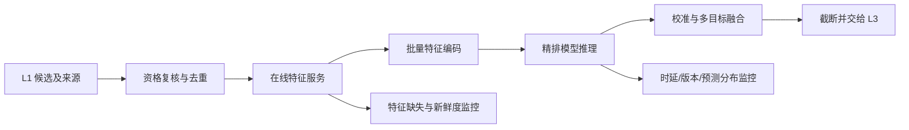

# L2 精排：在线服务

精排服务在请求 deadline 内，对 L1 候选完成特征拼接、批量推理、校准和效用融合。服务模块覆盖特征可得性、性能预算、版本管理、降级链路和线上观测。

## 专题导航

- [特征服务](./特征服务/README.md)
- [推理优化](./推理优化/README.md)
- [级联与降级](./级联与降级/README.md)
- [模型发布与监控](./模型发布与监控/README.md)

## 1. 请求链路

L1 候选携带通道、原始分、排名、原因和索引版本。L2 必须保留这些信息作为特征和日志字段，不能只接收 item ID。进入模型前重新执行低成本的实时资格复核；安全、库存等强约束仍以 Index/L3 的最终判定为准。

## 2. 特征服务与 point-in-time 一致性

在线特征通常由用户 KV、物品 KV、流式序列、请求上下文和实时统计组成。设计原则：

- 读取必须有 deadline、缓存、TTL 和明确默认值。
- 同一特征在离线训练和在线服务使用同一 schema、编码、归一化和 OOV 策略。
- 序列按事件时间排序，在线与训练使用相同窗口、长度截断和去重规则。
- 实时统计要避免反馈环路，例如将当前请求的点击同步写入当前请求特征。
- 特征定义、owner、敏感等级和可用时刻均应版本化。

特征服务超时不能静默返回任意旧值。应返回带缺失标记的默认值，记录缺失来源，并由模型或路由策略选择降级路径。

## 3. 批量推理与性能预算

同一请求的候选共享用户和上下文特征，物品维度可按 batch 堆叠。实现上优先批量 embedding 查询和单次前向，避免对每个 item 单独 RPC/推理。容量规划至少测量候选数、序列长度、字段数、batch 大小与模型 P50/P95/P99 的关系。

常见优化及边界：

| 手段 | 收益 | 代价或风险 |
| --- | --- | --- |
| 动态 batching | 提升设备利用率 | 增加排队延迟，需要 deadline 感知 |
| 量化/编译 | 降低 CPU/GPU 成本 | 精度回归、算子兼容性 |
| 蒸馏 | 用轻量学生近似教师 | 丢失教师特征或候选细节 |
| L2 内部级联 | 少量候选使用复杂模型 | 粗排误杀、链路复杂 |
| 序列截断/摘要 | 控制 attention 成本 | 损失远期兴趣 |
| embedding 缓存 | 减少重复查表 | 失效、版本和内存治理 |

优化前先固定效果基线；推理速度提升若改变了特征、候选或精度，必须重新验证端到端收益。

## 4. 发布、实验与回滚

模型发布单元至少包括：模型权重、特征 schema、词表/embedding、校准器、效用融合配置、候选接口版本和运行时依赖。仅替换权重会造成 schema 不匹配或概率失真。

推荐流程：离线回放与特征一致性检查 -> shadow 推理比较 -> 小流量灰度 -> 分桶实验 -> 全量发布。每一步记录模型、特征、校准和融合版本；回滚应能在分钟级切换到已验证版本。Shadow 模式只比较预测分布和延迟，不能代替真实用户实验。

## 5. 降级与故障模式

| 故障 | 首选处理 | 监控信号 |
| --- | --- | --- |
| 单个特征缺失 | 默认值 + 缺失标记，必要时轻量模型 | 缺失率、默认值占比 |
| 特征服务超时 | 使用缓存或简化特征模型 | RPC P99、缓存命中 |
| 复杂模型超时 | 回退轻量精排或稳定融合分 | 推理 P99、回退率 |
| 模型加载/版本异常 | 使用上一稳定版本 | 版本分布、加载失败 |
| 预测分布突变 | 熔断灰度、回滚并排查特征 | logit/概率分位数、ECE |
| L1 候选不足 | 透传候选并标记，不伪造分数 | 候选数、空结果率 |

降级策略要在演练中验证其时延、候选语义和 L3 兼容性。安全、合规和频控规则不能因模型降级而关闭。

## 6. 在线监控

- 服务：QPS、候选数、特征 RPC、模型 P50/P95/P99、超时、回退和资源利用率。
- 特征：缺失率、新鲜度、OOV、分布漂移、线上离线一致性抽样。
- 预测：各任务 logit/概率分布、分位数、分群校准、融合分排序变化。
- 业务：L2 采用、L3 后最终曝光、CTR/CVR/时长、负反馈和实验护栏。
- 版本：模型、特征、校准器、融合参数和候选接口的请求占比。

特征、预测、列表和业务指标应按同一实验版本关联观察。

## 常见误解

- **模型导出成功就等于可以上线**：特征语义、批推理、校准器、融合逻辑和日志版本共同构成线上契约。
- **平均延迟达标即可**：精排服务需要同时守住 P99、超时率、降级率和资源稳定性。
- **降级是异常路径**：降级链路是服务设计的一部分，应有明确触发条件和效果监控。
