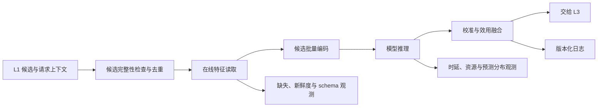

# L2 精排在线服务综述

在线服务解决的是：如何在单次请求的 deadline 内，将 L1 候选、请求时刻可用的特征、模型、校准器和效用配置组装为可追溯的 L2 候选级决策。离线指标只说明模型在历史数据上的能力；只有特征语义一致、推理性能稳定、异常可降级、版本可回滚时，这种能力才能成为线上价值。

在线服务的输入是 L1 候选及其通道、原始分、排名、原因和版本，以及用户、物品、上下文、序列和实时状态。输出至少应包含任务原始值、校准值或融合分，以及模型、特征、校准器、融合配置和实验版本。L2 可以执行候选 ID、schema 和重复项等完整性检查，但这不是资格的最终裁决；L3 仍负责列表级多样性、频控、合规、供给及其他硬约束。

本文将故障或预算受限时使用的、带明确制品版本和分数尺度的回退结果统一称为**版本化稳定融合分**。它必须说明参与融合的信号、分数方向、校准方式和适用路径，不能指代临时拼接的任意排序。

## 1. 服务接口与请求生命周期

在线接口应将候选级分数与其执行状态一并返回，使完整路径、轻量路径和回退路径都能被 L3 和日志系统以同一契约消费。

| 接口部分 | 最小字段 | 约束 |
| --- | --- | --- |
| 请求标识与预算 | `request_id`、场景、请求时间、`deadline`、实验桶 | deadline 应向特征、推理和路由依赖传播，保留校准、日志和 L3 交接预算 |
| L1 候选 | `candidate_id`、`input_index`、通道、原始分、排名、候选版本 | `input_index` 保留输入顺序；L2 去重需记录规范候选与重复来源 |
| 请求上下文 | 用户、设备、入口、地域和其他已授权上下文 | 仅包含请求时刻可用且与 schema 兼容的字段 |
| 候选级输出 | 原始值、校准值/融合分、`score_status`、`execution_path` | 每个候选都应说明分数来自完整、轻量或回退路径，或明确为未评分 |
| 请求级输出 | `request_status`、原因码、耗时分段、制品与路由版本 | 支持回放、容量分析和异常定位 |

L2 可按可复现规则合并完全重复的候选以节省计算，但必须保留输入位置和 L1 来源的映射；去重不能替代 L3 的资格、合规或频控判断。响应中不应将不同路径的未校准数值混为同一分数：无法评分的候选以 `unscored` 和原因码显式标记，由已定义的后续策略处理；发生回退时使用 `degraded` 和对应路径/版本标记。请求超出可用预算时应提前停止非必要工作并返回约定状态，而不是在 deadline 后继续等待或伪造模型分。

## 2. 请求链路与核心问题

服务设计需要同时回答四个问题：

| 问题 | 需要保证的事实 | 典型失败后果 |
| --- | --- | --- |
| 特征是否正确 | 线上字段、时间点、词表、默认值与训练一致 | 离线有效而线上漂移或泄漏 |
| 能否按时完成 | 候选数、序列长度、RPC 与推理满足 deadline | P99 超时、排队放大、请求失败 |
| 异常时如何保持语义 | 缺失、超时、版本异常有明确回退 | 静默旧值、任意路由或无效分数 |
| 结果能否解释和回放 | 请求、候选、特征、预测与版本可关联 | 无法定位效果或稳定性回归 |

## 3. 如何评测在线服务

在线服务不能只以平均响应时间验收。评测应在固定候选、特征版本和流量形态下，分别检验正确性、性能、可靠性和决策影响。

| 维度 | 关键指标或检查 | 说明 |
| --- | --- | --- |
| 一致性 | 特征 schema 命中、线上离线值比对、OOV/缺失率、预测差异 | 以请求回放或影子流量比对训练/服务事实 |
| 性能 | QPS、队列时间、P50/P95/P99、CPU/GPU、内存、单请求成本 | 必须按候选数、序列长度、场景和模型版本切片 |
| 可靠性 | 超时率、错误率、回退率、缓存命中、加载失败率、恢复时间 | 回退后的候选语义、分数范围与 L3 接口也要验证 |
| 预测质量 | logit/概率分位数、校准、分群分布、融合分排序变化 | 服务优化不能无意改变数值语义 |
| 端到端价值 | 灰度实验主指标、负反馈、供给护栏、长期指标 | Shadow 只能验证一致性和性能，不能替代用户实验 |

建议验证顺序为：离线请求回放和特征比对 -> 压测与容量曲线 -> Shadow 推理 -> 故障/回退演练 -> 小流量灰度 -> 分场景全量发布。每一步都记录模型、特征、校准器、融合配置和候选接口版本。

## 4. 主要方向与方法

| 方向 | 主要解决的问题 | 常见方法 | 深入阅读 |
| --- | --- | --- | --- |
| 特征服务 | 请求时是否取到正确、及时、可解释的特征 | KV/缓存、TTL、默认值、schema、point-in-time、序列窗口 | [特征服务](./特征服务/README.md) |
| 推理优化 | 如何在效果与 P99/成本之间取舍 | 候选批量化、并行、动态 batching、量化、编译、蒸馏、缓存、序列截断 | [推理优化](./推理优化/README.md) |
| 级联与降级 | 高峰或故障时如何保持可用和输出语义 | 轻量模型、两阶段精排、缓存结果、版本化稳定融合分、熔断和 deadline 路由 | [级联与降级](./级联与降级/README.md) |
| 模型发布与监控 | 如何安全变更并发现线上回归 | 制品联合发布、回放、Shadow、灰度、A/B、回滚、版本/数据/预测观测 | [模型发布与监控](./模型发布与监控/README.md) |

### 4.1 特征服务

特征服务将用户 KV、物品 KV、实时序列、请求上下文和统计特征组织为请求时刻的事实快照。每次读取都应有 deadline、缓存、TTL、默认值和缺失标记；在线与训练必须共享 schema、编码、归一化、OOV 与序列截断语义。特征超时不能静默返回任意旧值。

### 4.2 推理优化

同一请求内的候选共享用户和上下文，应优先批量查表、批量编码和单次前向。动态 batching 提升设备利用率但引入排队；量化、编译和蒸馏降低成本但需回归预测质量；截断序列或缓存 embedding 控制复杂度，但要验证远期兴趣和版本失效的影响。

### 4.3 级联与降级

级联以轻量阶段筛掉明显低价值候选，再将预算留给复杂模型；降级在特征、模型或依赖异常时切换到缓存、轻量模型或版本化稳定融合分。两者都需要明确触发条件、最大耗时、输出字段和 L3 兼容性，不能把“返回任何一个分数”视作成功。

### 4.4 模型发布与监控

可发布单元包括模型权重、特征 schema、词表/embedding、校准器、效用融合配置、候选接口与运行时依赖。发布应先在回放和 Shadow 中确认数值与延迟，再经灰度和实验验证端到端价值；监控需要覆盖服务、特征、预测、业务与版本，且能关联到同一请求事实。

## 5. 与其他模块的边界

- 数据与特征定义训练事实和特征语义；在线服务保证这些语义在请求时刻可用。
- 模型架构和学习目标决定预测；在线服务不应通过隐式默认值或无记录降级改变其含义。
- L3 决定列表级规则；L2 服务在任何回退路径中都需保留候选、分数和版本语义供 L3 消费。
- 系统评测判断改动的真实价值；服务优化需要同时通过性能、正确性和线上实验验证。

## 常见误解

- **模型导出成功就等于可以上线**：特征、校准、融合、批推理、日志和回退共同构成线上契约。
- **平均延迟达标即可**：精排服务必须守住 P99、超时率、回退率和资源稳定性。
- **Shadow 成功说明业务一定提升**：Shadow 验证数值和性能，业务收益仍需真实流量实验。
- **降级只是异常处理**：降级是服务设计的一部分，应预先演练并持续观测其效果。