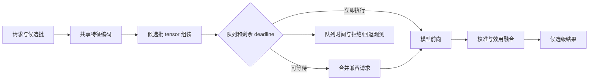

# 推理优化

推理优化解决的是：在不无记录地改变 L2 排序语义的前提下，让请求在既定 deadline 内完成特征编码、模型前向、校准和候选级输出。它不是单纯追求单次模型前向最快，而是对端到端 P99、吞吐、资源成本与预测质量进行可验证的取舍。

返回[在线服务导航](../README.md)或[在线服务综述](../在线服务综述.md)。

特征依赖的读取、TTL 和 point-in-time 语义由[特征服务](../特征服务/README.md)负责；异常下的服务路由由级联与降级负责；本页关注特征快照已经就绪后，如何高效、稳定且等价地执行 L2 计算。

## 1. 问题定义与性能预算

一次请求的可观测耗时可拆为：

$$
T_{e2e}=T_{queue}+T_{feature}+T_{encode}+T_{forward}+T_{post}+T_{network}
$$

其中 $T_{queue}$ 是等待动态 batch 或设备执行的时间，$T_{encode}$ 包含 tensor 组装、embedding 查询和序列 padding，$T_{post}$ 包含校准、效用融合、排序和日志摘要。只优化 $T_{forward}$，往往不能改善用户看到的 P99。

| 目标 | 需要回答的问题 | 常见误判 |
| --- | --- | --- |
| 时延 | 在候选数、序列长度和流量峰值变化时能否守住 P99 | 只在空闲机器上测试单条样本 |
| 吞吐与成本 | 每个请求或每千次排序消耗多少 CPU/GPU 与内存 | 只看 QPS，忽略排队和资源饱和 |
| 数值语义 | 优化前后 logit、概率、校准和候选顺序是否仍可接受 | 仅比较离线 AUC |
| 隔离性 | 一个大请求、热 key 或异常 batch 是否拖慢正常请求 | 将所有请求塞入同一无上限队列 |
| 可回滚性 | 新运行时、量化制品和调度参数能否独立回退 | 将模型变更与所有性能变更绑定发布 |

应先从业务 deadline 中扣除网关、特征读取、后处理和安全余量，再为排队、编码和模型执行分配预算。预算不是固定比例：候选数、序列长度、模型版本和场景会改变计算形状，因此 SLO 也应按这些维度切片。

## 2. 先建立可复现基线

优化前固定模型、校准器、特征 schema、候选集合和运行环境，记录端到端基线。否则无法判断收益来自运行时，还是来自候选截断、特征缺失或模型语义变化。

| 基线切片 | 至少覆盖的输入 | 观察指标 |
| --- | --- | --- |
| 候选规模 | 小、中、大候选集合及上界请求 | 端到端 P50/P95/P99、内存、排序差异 |
| 序列形状 | 空序列、常见长度、长序列和截断边界 | 编码/attention 耗时、输出稳定性 |
| 流量状态 | 稳态、突发、冷启动和资源接近饱和 | 队列时间、丢弃率、设备利用率 |
| 业务场景 | 不同入口、设备、地域或模型桶 | 延迟、错误和分群预测分布 |
| 设备与运行时 | CPU/GPU、驱动、推理引擎、精度模式 | 编译开销、算子回退、数值差异 |

基线请求应保留输入快照引用、候选 ID 与顺序、模型和运行时版本、输出 logit/概率及总耗时分段。包含真实线上形状的回放集比随机 tensor 更有价值。

## 3. 请求级批量化与调度

同一请求的候选共享用户、上下文和大部分序列特征，应将候选堆叠成 batch，复用共享编码，再一次或少量前向计算。逐候选 RPC 或逐候选调用模型会使固定开销随候选数线性放大。

跨请求动态 batching 能提升加速器利用率，但它引入 $T_{queue}$，并非总是更快。调度器应定义最大等待时间、最大 batch、按模型/shape 的兼容规则和 deadline 感知的提前出队策略。不能让剩余预算很小的请求继续等待凑 batch。

| 方法 | 主要收益 | 使用条件 | 主要风险 |
| --- | --- | --- | --- |
| 请求内候选批量化 | 消除重复调用和共享编码 | 候选可对齐为同一模型输入 | 忽略 padding 导致长请求放大成本 |
| 动态 batching | 提升设备利用率和吞吐 | 流量稳定、可接受短暂排队 | P99 被队列主导，shape 过度混合 |
| shape 分桶 | 降低 padding 和编译图碎片 | 序列/候选长度分布有明显分层 | 分桶过细降低合批概率 |
| 并行分片 | 缩短大 batch 执行时间 | 结果可确定地合并，通信可控 | 同步等待和跨卡传输抵消收益 |
| 请求准入控制 | 保护正常请求的 P99 | 有明确定义的后续回退语义 | 把过载隐藏成随机失败 |

## 4. 常见优化方向

### 4.1 计算图与运行时

图编译、算子融合、内存复用和高效推理引擎通常不改变模型数学定义，是优先尝试的优化。需要确认动态 shape 支持、首次编译抖动、未支持算子的回退路径以及不同驱动/硬件上的可复现性。编译缓存键应包含模型、精度和必要的 shape 配置，避免误复用不兼容图。

### 4.2 低精度与量化

FP16、BF16、INT8 或更低比特可降低带宽、计算或成本，但会改变数值误差边界。量化应区分权重量化、激活量化、静态/动态校准和不同硬件内核；校准集需覆盖长尾特征、OOV、长序列和高分候选，不能只使用平均样本。

### 4.3 模型与输入形状控制

序列截断、窗口摘要、候选上限、embedding 缓存和蒸馏能显著控制计算量，但可能改变模型的有效输入或表达能力。其中候选上限和复杂模型筛选涉及服务路由，应与[级联与降级](../级联与降级/README.md)共同定义；本页只要求在固定输入形状下量化其性能和语义影响。

| 手段 | 优化对象 | 可能改变的语义 | 必要验证 |
| --- | --- | --- | --- |
| 图编译/算子融合 | 调度、内核和内存访问 | 理论上等价，实际可能有算子回退 | 输出差异、冷启动、各 shape 延迟 |
| 低精度/量化 | 数值表示 | logit 尾部、概率和排序可能变化 | 分群误差、校准、Top-K 重叠 |
| embedding 缓存 | 重复查表和传输 | 版本或失效错误会改变输入 | 命中率、版本命中、陈旧读比例 |
| 序列截断/摘要 | attention 长度 | 远期兴趣和长行为链可能丢失 | 长序列分群、排序与业务实验 |
| 蒸馏 | 模型复杂度 | 学生不能完全复制教师边界 | 预测、校准、分群与线上收益 |

## 5. 数值等价与效果回归

将输出误差压到一个全局均值以内并不够。精排对候选相对顺序和概率校准敏感，尤其应检查高分候选、分数接近的候选、稀疏特征、长序列和不同业务场景。

| 检查层次 | 检查内容 | 目的 |
| --- | --- | --- |
| 输入 | 编码后 tensor、mask、候选顺序和 batch 边界 | 排除组装或 padding 错误 |
| 原始输出 | logit 绝对/相对误差、NaN/Inf、溢出比例 | 定位数值稳定性问题 |
| 预测语义 | 概率分位数、ECE/Brier、任务间关系 | 防止校准或多任务输出漂移 |
| 排序语义 | Top-K 重叠、pairwise 反转率、NDCG | 捕获小误差引发的列表变化 |
| 端到端 | Shadow 分布、灰度实验指标和护栏 | 验证真实流量下的价值 |

阈值应随任务、场景和优化方法预先定义。例如低精度可以允许有限 logit 误差，却不应接受关键分群的校准恶化或 Top-K 大面积翻转。若优化修改了特征、候选集合或模型结构，它已不只是推理优化，应按模型/服务变更重新评审。

## 6. 容量、压测与上线门禁

压测应复现到达过程、请求形状和下游争用，而不是只发送均匀的固定 batch。至少分别测试冷启动、模型加载后首批请求、突发流量、长序列、最大候选数、混合模型版本和资源接近饱和的状态。

| 阶段 | 验证内容 | 失败时的处理 |
| --- | --- | --- |
| 回放 | 固定输入下的输出、校准和排序差异 | 修正运行时或撤销不等价优化 |
| 微基准 | 单模型/单 shape 的执行、显存和编译行为 | 识别算子、内存或 shape 瓶颈 |
| 容量压测 | QPS 曲线、队列、P99、资源和错误率 | 调整 batch、并发、分桶或容量 |
| Shadow | 真实流量形状的延迟和预测分布 | 排查线上特征与负载差异 |
| 灰度 | 业务指标、负反馈、回退率和成本 | 暂停扩量或回滚独立优化制品 |

运行时、量化模型、编译配置和动态 batching 参数应独立版本化，记录到请求日志。这样发生回归时可以只回滚导致问题的优化，而不必同时撤销模型或特征发布。

## 7. 实施清单

1. 分段采集端到端耗时，先定位 $T_{queue}$、编码、前向或后处理中的主要瓶颈。
2. 固定真实形状的回放集和数值基线，按场景、候选数和序列长度设定验收阈值。
3. 先采用不改变输入输出定义的批量化、图编译和内存优化，再评估低精度、截断或蒸馏。
4. 为动态 batching 设置最大等待、最大 batch、shape 规则和 deadline 感知出队条件。
5. 同时验收 P99、队列时间、资源、原始输出、校准和排序，而非只报告 QPS 或 AUC。
6. 将运行时与调度配置版本化，经回放、压测、Shadow 和灰度逐步发布，并准备独立回滚。

## 常见误解

- **量化后只需比较 AUC**：量化还会影响校准、数值稳定性、Top-K 排序和不同设备上的延迟。
- **单条推理快就代表整页快**：候选批处理、特征读取、排队和后处理共同决定端到端 P99。
- **batch 越大吞吐越高就越好**：过大的 batch 或等待时间会牺牲 deadline，并放大长序列的尾延迟。
- **图编译天然等价**：动态 shape、未支持算子、精度模式和运行时回退都可能改变性能或数值。
- **压测通过即可全量**：固定压测无法替代 Shadow 和灰度对真实流量形状、成本与业务护栏的验证。