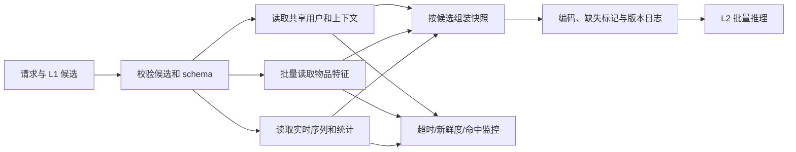

# 特征服务

特征服务将用户、物品、请求上下文、实时序列和统计信号组装为一次请求时刻的**特征快照**，供 L2 对同一批 L1 候选完成批量推理。它不只是“读取若干数值”的 KV 层，而是训练定义在 backend 中的可执行语义：字段是否存在、值在何时可见、怎样编码、缺失时输入什么，以及这些事实如何被记录和回放。

返回[在线服务导航](../README.md)或[在线服务综述](../在线服务综述.md)。

数据模块定义哪些特征可训练、如何按事件时间构造；本目录讨论如何在 deadline 内将同一份定义可靠地提供给线上模型。L3 的列表级约束不应伪装为 L2 特征输入。

## 1. 要解决的问题

对一次请求 $r$、用户 $u$、候选集合 $\mathcal{C}_r$ 和请求时刻 $t_r$，特征服务要生成：

$$
\boldsymbol{x}_{r,i}=
\operatorname{assemble}(\boldsymbol{x}^{user}_{u,t_r},
\boldsymbol{x}^{item}_{i,t_r},
\boldsymbol{x}^{context}_{r,t_r},
\boldsymbol{x}^{sequence}_{u,t_r},
\boldsymbol{x}^{l1}_{r,i})
\quad i \in \mathcal{C}_r
$$

这里的关键不是拼接顺序，而是所有分量都应代表 $t_r$ 时模型允许看到的事实。线上为了更快而读取未来统计、未发布物品信息或回写后的当前行为，会造成训练服务不一致或标签泄漏。

| 目标 | 服务必须保证 | 反例 |
| --- | --- | --- |
| 语义正确 | schema、编码、默认值、归一化与训练制品一致 | 数值字段在线按新分桶处理，embedding ID 改变 |
| 时间正确 | 只返回请求时已可用的值，并携带更新时间 | 在线统计混入请求后的行为或未来修订数据 |
| 性能可控 | 共享读取批量化，依赖有超时和预算 | 对每个候选逐个 RPC，候选数上升即 P99 失控 |
| 异常可解释 | 缺失、过期、超时和回退均显式标记 | 静默返回无边界的旧缓存值 |
| 可回放 | 版本、来源、快照/摘要能关联请求日志 | 只能看到最终分数，无法复现输入 |

## 2. 输入输出契约

特征接口至少接收请求 ID、用户 ID、候选 ID 列表、场景和请求时间，以及 L1 随候选传递的通道、原始分、排名和版本。服务返回的不是一组无来源的 tensor，而是可编码的值与其元信息。

| 契约字段 | 含义 | 必要原因 |
| --- | --- | --- |
| `feature_schema_version` | 字段、类型、编码和默认值的版本 | 防止模型使用不兼容输入 |
| `feature_value` | 原始或已标准化的特征值 | 明确由在线服务还是模型运行时编码 |
| `source` | 请求、用户 KV、物品 KV、流、缓存或默认值 | 支持定位依赖和回退影响 |
| `event_time` / `update_time` | 事实时间与最近更新时间 | 判断 point-in-time 与新鲜度 |
| `status` | 命中、缺失、过期、超时、降级 | 防止异常被误解成正常数值 |
| `vocabulary_version` | 离散映射或 embedding 词表版本 | 保证 ID 空间与模型权重匹配 |

模型、schema、词表、归一化参数和默认值应作为同一发布契约校验兼容性。若存在不能兼容的字段迁移，应双写/双读并灰度切换，不能只修改服务字段名或含义。

## 3. 请求编排

用户、上下文与序列对同一请求内的候选共享，应只读取一次；物品特征按候选批量读取；用户-物品交叉、attention 和其他高维组合在模型侧按 batch 计算。这样既避免 N 次 RPC，也让候选数、序列长度与依赖数量的时延关系可测量。

推荐为每类依赖分配明确预算，例如先限定总 deadline，再为序列、用户 KV、物品批量读取和组装预留上限。依赖并行不等于无限并发：必须限制单请求 fan-out、批量大小和重试次数，避免下游抖动放大为级联超时。

## 4. 时间语义与训练服务一致性

### 4.1 point-in-time 规则

训练样本在 $t_r$ 使用的特征，和线上请求在同一 $t_r$ 可读取的特征必须遵守相同可用时刻。对于聚合指标、实时计数和序列，要区分事件发生时间、写入完成时间和服务可见时间；训练回放应模拟最后一种，而非使用离线处理完成后的最终表。

| 特征类型 | 线上实现要点 | 一致性检查 |
| --- | --- | --- |
| 用户/物品 KV | 带版本、更新时间和 TTL 的读取 | 抽样对比同一 key 与 schema 版本 |
| 请求上下文 | 直接从请求构建，枚举与单位受治理 | 回放请求得到相同字段和值域 |
| 行为序列 | 按事件时间排序、去重、截断并过滤无效事件 | 对齐窗口、最大长度、padding 与 mask |
| 实时统计 | 记录可见时间和更新延迟，防止回读当前反馈 | 回放时只读取 $t_r$ 前可见的版本 |
| 离散/连续编码 | 词表、OOV、分桶、归一化随制品发布 | 比较编码后 ID/数值而不仅是原始值 |
| L1 来源特征 | 随候选透传通道、分数方向、排名和版本 | 校验候选集合与离线样本口径 |

### 4.2 默认值不是普通业务值

每个可缺失字段应定义默认值、缺失标记、适用模型和 owner。默认值要与训练时的缺失处理完全一致；例如数值填 $0$ 时，模型必须能通过缺失位区分“真实零值”与“无值”。对关键字段，缺失标记本身可能触发轻量模型或回退路由。

## 5. 缓存、新鲜度与降级

缓存用于控制读取成本和尾延迟，不应改变特征语义。缓存键需包含实体、场景或必要的 schema/版本维度；失效策略应根据特征类型分别定义，不能用一个 TTL 覆盖所有字段。

| 情形 | 可选处理 | 必须记录 |
| --- | --- | --- |
| 正常命中且新鲜 | 使用缓存值 | 来源、更新时间、缓存年龄 |
| 缓存未命中 | 在剩余预算内读取权威源 | miss 原因、RPC 时延 |
| 值过期 | 使用允许的陈旧值或默认值 | 过期时长、允许策略、字段状态 |
| 单字段缺失 | 默认值 + 缺失标记，或移除依赖该字段的分支 | 字段名、缺失率、模型路径 |
| 核心依赖超时 | 切换简化特征模型或版本化稳定融合分 | 触发规则、回退版本、候选语义 |
| schema/词表不兼容 | 拒绝不兼容制品并回滚稳定组合 | 制品版本、校验失败原因 |

“读取到旧值”不能默认为成功。不同字段可容忍的陈旧程度不同：物品类目可能较宽松，库存、实时热度和用户刚发生的行为通常更严格。是否可使用陈旧值应由特征定义决定，并暴露给监控与回放。

## 6. 评测与上线验收

上线前至少以固定请求回放、压测和故障演练验证特征服务。只测平均 RPC 时延无法发现 schema 漂移、长序列、热门 key 或候选数膨胀带来的问题。

| 验收维度 | 最小检查 | 通过标准示例 |
| --- | --- | --- |
| 契约兼容 | schema、词表、归一化、默认值与模型制品校验 | 不兼容组合无法被加载 |
| 离在线一致 | 固定请求回放比较编码后特征和预测 | 差异可解释且在预先约定阈值内 |
| 新鲜度 | 按字段/来源统计更新时间和过期比例 | 关键字段满足各自 freshness SLO |
| 性能 | 按候选数、序列长度、场景和热冷 key 压测 | 总链路守住 P99 与错误率预算 |
| 故障语义 | 模拟缺失、慢依赖、超时和 schema 错配 | 状态可见，回退路径输出可被 L3 消费 |
| 可观测性 | 请求关联特征版本、来源和状态摘要 | 可定位某次预测使用的输入制品 |

可观测性不等于完整记录所有用户原始特征。日志应遵循权限和最小化原则：记录字段版本、来源、缺失/过期状态、聚合摘要或经批准的快照引用；敏感数据按访问控制和留存策略处理。

## 7. 实施清单

1. 为每个字段登记 owner、schema、可用时刻、更新频率、默认值、敏感等级和 freshness SLO。
2. 为模型制品锁定兼容的 schema、词表、归一化、缺失规则和候选接口版本。
3. 按共享用户/上下文、批量物品、序列与统计分层编排，设置总 deadline 与依赖预算。
4. 在响应中或请求日志中保留来源、更新时间、状态和版本摘要，支持请求回放。
5. 对缺失、过期、超时和不兼容分别定义处理，演练其对 L2 输出和 L3 接口的影响。
6. 以固定回放验证编码后输入和预测，以分布式压测验证 P99 与资源，以灰度监控验证真实流量。

## 常见误解

- **特征服务只负责读取数值**：它还承担时点、版本、缺失、默认值和可审计性等语义契约。
- **有 TTL 就解决了新鲜度问题**：TTL 只限制缓存寿命；事实更新时间、可见延迟和字段业务语义同样需要定义。
- **实时特征一定优于离线特征**：更新时延、稳定性、成本和训练服务一致性共同决定价值。
- **默认值可以临时决定**：默认值、缺失标记和回退模型都必须在训练、发布和故障演练中验证。
- **记录完整特征就方便排障**：可回放需与隐私、权限和留存规则平衡，优先记录版本和状态摘要。