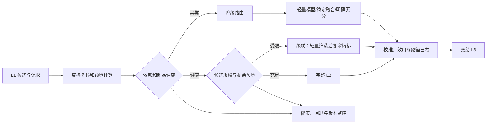

# 级联与降级

级联与降级都在决定“这批候选在当前预算下走哪一条 L2 路径”，但目的不同：**级联**是正常情况下把有限计算优先分配给更值得复杂建模的候选；**降级**是在依赖、容量或版本异常时，仍返回语义明确、可监控、可被 L3 消费的候选级结果。

返回[在线服务导航](../README.md)或[在线服务综述](../在线服务综述.md)。

推理优化关注固定执行路径如何更快；本页关注何时选择不同执行路径。特征缺失、过期和 schema 语义由[特征服务](../特征服务/README.md)判定，具体制品发布和回滚治理由模型发布与监控负责。无论选择哪条路径，L3 的合规、频控、库存和列表级约束都不能被关闭或绕过。

## 1. 路由问题与不变契约

对请求 $r$ 的候选集合 $\mathcal{C}_r$，路由器根据请求形状、剩余预算、依赖状态和版本健康度选择路径 $p$：

$$
p_r=\operatorname{route}(\mathcal{C}_r,\; d_r,\; h_r,\; v_r)
$$

其中 $d_r$ 是剩余 deadline，$h_r$ 是特征、模型和资源健康状态，$v_r$ 是兼容的制品版本。路径可以是完整 L2、轻量 L2、局部复杂模型、版本化稳定融合分或明确的无分路径；它不应是临时拼接的任意排序。

| 不变项 | 所有路径必须保证 | 原因 |
| --- | --- | --- |
| 候选身份 | 保留候选 ID、L1 来源、原始分、排名和资格状态 | 便于 L3、日志和回放理解输入来源 |
| 输出契约 | 返回约定的任务分、校准/融合分、路径与版本状态 | 防止下游将不同语义的数值混用 |
| 分数语义 | 明确分数是否来自模型、校准器、稳定融合或不可用标记 | 避免将未校准 logit 当作可比较概率 |
| 路由证据 | 记录触发规则、剩余预算、缺失/超时和制品版本 | 支持排障、评估和策略审计 |
| 安全边界 | 不关闭资格复核、合规、频控和 L3 规则 | 性能压力不能改变硬约束 |

若两条路径的输出不可直接比较，应在路径内完成校准或使用经过验证的统一效用尺度；若无法做到，必须明确标记并由后续策略按约定处理。不能把“返回了一个浮点数”误认为排序语义成立。

## 2. 请求路由链路

路由决策应尽量在低成本、稳定的信号上完成，例如候选数量、序列长度、剩余预算、已知依赖状态和经过验证的模型版本。不要让复杂路径先执行到超时后才无条件切换，这既浪费预算，也会导致同一请求出现难以解释的部分结果。

## 3. 正常路径：级联设计

### 3.1 级联的目的

典型结构是轻量阶段先从 $N$ 个候选中选出 $K$ 个，再由复杂模型排序：

$$
\mathcal{C}^{heavy}_r=\operatorname{TopK}(g_{light}(\boldsymbol{x}_{r,i}), K),
\qquad
s_i=f_{heavy}(\boldsymbol{x}_{r,i}),\ i\in\mathcal{C}^{heavy}_r
$$

轻量阶段不需要完全复刻复杂模型，但必须尽量保留最终目标真正需要的候选。若复杂模型只为部分候选提供分数，还必须定义其余候选如何进入统一输出：例如使用已校准的轻量分，或将复杂分与轻量分按已验证规则融合。

| 策略 | 适用情况 | 优点 | 需要防范的风险 |
| --- | --- | --- | --- |
| 固定 Top-K | 候选规模和成本较稳定 | 简单、易压测和回放 | 小请求过度裁剪，大请求预算不够 |
| 按候选规模比例保留 | 候选数波动明显 | 相对保留率稳定 | 上界请求仍可能超过预算 |
| 预算感知 K | deadline、队列或设备负载变化 | 在拥塞时保护 P99 | 路径分布变化影响实验解释 |
| 分群阈值 | 场景、用户或物品价值差异明显 | 将计算投向高价值区域 | 阈值固化历史偏差或造成覆盖不均 |
| 学习式路由 | 有足够历史数据和可观测成本 | 可直接优化价值/成本 | 训练偏差、不可解释和线上漂移 |

### 3.2 轻量阶段的选择

轻量模型可以是较浅网络、较短序列版本、蒸馏学生或稳定融合模型。选择依据不是它单独的 AUC，而是它对复杂模型最终 Top-K、关键转化候选和负反馈护栏的保留能力。轻量模型同样需要特征契约、校准、版本和监控，不能被当作无治理的临时代码。

### 3.3 级联评测

| 维度 | 关键检查 | 说明 |
| --- | --- | --- |
| 保留质量 | 重模型 Top-K 召回、关键正例保留、pairwise 误杀 | 按场景、用户活跃度和物品年龄切片 |
| 排序质量 | 完整路径与级联路径的 NDCG、校准和融合分变化 | 观察复杂分与轻量分混合后的可比性 |
| 性能 | 候选数到 K、队列、P99、资源和成本曲线 | K 的收益应覆盖增加的路由复杂度 |
| 公平与覆盖 | 长尾内容、新品、弱反馈用户的通过率 | 防止只保留热门或易预测候选 |
| 线上价值 | 灰度主指标、负反馈与供给护栏 | 离线保留率不是最终业务结论 |

## 4. 异常路径：降级设计

降级应是预先发布、可演练的路径集合，而不是临时 `catch` 逻辑。每类故障要有检测信号、触发阈值、允许的最短路径、输出语义和恢复条件。优先级通常为：保持硬约束与请求可用性，再最大化可解释的排序质量，最后恢复复杂模型效果。

| 触发情形 | 检测信号 | 推荐路径 | 不应做的事 |
| --- | --- | --- | --- |
| 非关键特征缺失 | 字段缺失/过期状态超过规则 | 缺失标记 + 兼容模型 | 静默填充未知旧值 |
| 关键特征或序列超时 | RPC 超时、freshness 违约 | 简化特征模型或版本化稳定融合分 | 继续等待直到耗尽 deadline |
| 复杂模型慢或不可用 | 运行时 P99、加载失败、设备健康 | 轻量模型或已校准轻量分 | 输出未完成 batch 的部分随机结果 |
| 量化/新版本异常 | NaN、预测分布突变、版本校验失败 | 上一稳定模型和运行时组合 | 在同一请求中混用未校准版本 |
| 流量过载 | 队列长度、剩余预算、资源饱和 | 预算感知 K、轻量路径、准入控制 | 以无限重试压垮下游 |
| L1 候选不足 | 候选数低于正常范围 | 透传现有候选并标记数量状态 | 凭空补候选或伪造模型分 |

版本化稳定融合分只能来自预先定义并验证的信号，例如 L1 原始分、轻量模型分和可靠业务先验，且必须明确方向、归一化、校准、版本和适用场景。它不是“模型挂了以后把几个字段相加”。

## 5. 触发、恢复与防抖

路由器既要及时进入保护路径，也要避免因单次抖动频繁切换。触发规则可使用连续失败次数、滑动窗口错误率、剩余预算和版本健康检查；恢复则应采用更严格的持续健康条件或小流量探测。

| 机制 | 作用 | 设计要点 |
| --- | --- | --- |
| deadline 路由 | 根据剩余时间提前选择路径 | 预留校准、日志和 L3 交接时间 |
| 熔断 | 依赖持续异常时停止继续调用 | 记录打开原因和探测恢复状态 |
| 半开探测 | 用小部分请求验证依赖恢复 | 与正常流量隔离，限制并发 |
| 滞回/冷却 | 避免阈值边缘频繁切换 | 进入和退出阈值不应完全相同 |
| 限流/准入 | 防止过载扩散到所有请求 | 被拒绝请求也要走已定义的后续语义 |

路径选择、阈值、轻量模型和稳定分配置都应独立版本化。请求日志至少关联 `route_version`、`path`、触发原因、剩余预算、特征状态、模型/校准器版本和候选数量，以区分模型效果变化与路由分布变化。

## 6. 验证、演练与发布

级联和降级不能只在故障发生后验证。发布前，应使用固定回放评估所有路径的输入输出契约，并在压力和故障注入下检查服务行为；发布后，需将完整路径和每种回退路径的请求占比、质量和业务指标分开观察。

| 阶段 | 验证内容 | 通过条件示例 |
| --- | --- | --- |
| 离线回放 | 各路径输出、分数尺度、Top-K 保留和日志关联 | 候选与版本可回放，误差和保留率达标 |
| 压测 | 高候选数、长序列、突发下的 K 与回退分布 | P99、错误和队列在预算内 |
| 故障演练 | 特征超时、模型失败、版本错配、过载 | 明确进入预期路径，不破坏 L3 契约 |
| Shadow | 真实形状下的路径选择与预测差异 | 路由比例符合预期，无异常分布漂移 |
| 灰度实验 | 主指标、负反馈、供给与路径分群 | 降级比例和业务护栏均可接受 |

发布时将路由规则与模型、校准器、运行时配置区分开版本化，以便先验证策略本身，再逐步扩大模型或预算变更。出现异常可回滚到已验证的路由配置或稳定制品组合。

## 7. 实施清单

1. 列出所有完整、轻量和回退路径，定义每条路径的输入、输出分数、版本与适用条件。
2. 对混合路径验证统一分数尺度；无法比较时明确标记并约束后续处理。
3. 用最终目标的 Top-K 保留、关键正例和分群覆盖评估级联，不能只看轻量模型单独指标。
4. 为每种依赖故障定义触发、回退、恢复和日志字段，并通过故障注入演练。
5. 设置 deadline、熔断、限流和滞回，避免无界等待、重试风暴和频繁抖动。
6. 分路径监控时延、错误、回退率、预测分布和业务护栏；以 Shadow 和灰度确认真实价值。

## 常见误解

- **降级只在故障时才需要设计**：容量波动、特征缺失、版本异常和流量过载都需要可预期的回退。
- **任何排序都能作为降级结果**：降级输出仍需保持资格、候选身份、分数尺度和接口语义。
- **轻量模型 AUC 高就适合做级联**：更重要的是它是否保留复杂模型和最终目标需要的候选。
- **固定 Top-K 最简单，因此总是最优**：候选规模、场景价值和实时预算可能需要不同的 K 或路径。
- **回退率低说明设计成功**：还需确认回退是否在应触发时及时发生，以及回退分群的业务质量是否可接受。