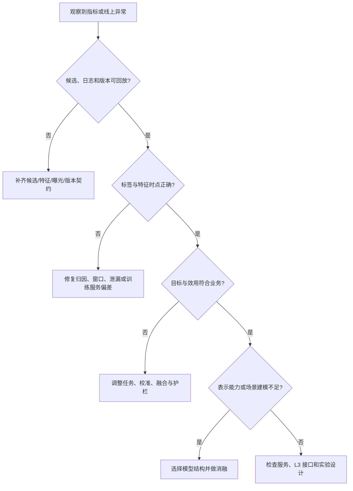

# L2 精排：常见问题与方案选型

本页是 L2 精排的诊断与决策手册。它不重复各模型或算法的原理，而是回答更实际的问题：当离线指标、线上业务或服务稳定性出现现象时，如何从候选、数据、目标、特征、模型、服务和 L3 接口中识别根因，并选择下一步最值得投入的方案。

精排优化应遵循一条证据链：先确认观察到的现象真实存在，再确认候选与数据事实一致，然后检查目标和效用是否表达业务，最后才评估模型结构与服务实现。完整指标定义与实验协议见[精排系统评测](./精排系统评测.md)。

## 1. 诊断框架：从症状回到系统层

| 系统层 | 首先要问的问题 | 常见证据 | 典型动作 |
| --- | --- | --- | --- |
| 候选与 L1 | 好物品是否进入 L2 竞争 | 候选数、通道占比、覆盖、版本 | 调整召回或按通道建模 |
| 数据与标签 | 训练事实是否等于线上事实 | join、窗口、成熟率、位置、泄漏检查 | 修复样本、归因、负例或偏差 |
| 特征 | 模型是否获得正确且可用的信息 | 缺失、新鲜度、哈希比对、分布漂移 | 治理 schema、实时特征与默认值 |
| 目标与效用 | 优化的信号是否对应业务价值 | 各任务指标、ECE、融合分布 | 调整任务、权重、校准和融合 |
| 模型 | 当前表示是否覆盖关键关系 | 消融、分群、复杂度、注意力/专家诊断 | 选择交叉、兴趣、序列或多任务模型 |
| 服务与发布 | 离线语义能否稳定在线执行 | P99、回退、版本、资源和异常演练 | 批处理、优化、降级、回滚 |
| L3 与实验 | 候选级变化是否抵达最终曝光 | L3 调整率、实验桶、最终列表 | 调整接口、共同评测或重设实验 |

## 2. 先建立最小可诊断基线

在选择复杂方案前，应有一个可回放、可服务、可解释的基线。它通常包含有效曝光样本、清晰的 CTR 或基础多任务标签、point-in-time 特征、轻量字段模型、独立校准与端到端日志。

基线不是最终模型，而是后续所有判断的参照系。没有稳定基线时，新增序列模型、复杂多任务或大规模特征往往同时改变多个变量，无法知道收益与回退来自哪里。

最低基线检查项：

- 请求、L1 候选、渲染/视口、反馈、特征和版本能按 `request_id` 串联。
- 训练、验证和测试按事件时间切分，标签具有明确成熟窗口。
- 线上与离线共享字段定义、词表、截断、默认值和校准器版本。
- 同时报告 AUC/LogLoss/NDCG、关键分群与 P99，而非只报告单一分数。
- 可在特征超时、模型异常时回退到已验证的稳定方案。

## 3. 从问题到优先动作

| 现象 | 先验证 | 优先方案 | 不应直接得出的结论 |
| --- | --- | --- | --- |
| AUC 很高，线上无提升 | 候选是否固定、L3 是否重排、概率是否校准 | 检查端到端漏斗与校准，做灰度 | “模型已经足够好” |
| CTR 提升而 CVR/负反馈变差 | 多任务标签、融合权重、点击诱导 | 多任务、价值/风险约束、校准 | “CTR 任务失效” |
| 新品或长尾表现差 | 内容特征、样本覆盖、物品年龄切片 | 内容/多模态特征、探索数据、分层先验 | “ID embedding 无用” |
| 历史丰富用户效果差 | 序列质量、候选相关兴趣 | DIN/DIEN/BST/SASRec，先做序列基线 | “必须立即上大 Transformer” |
| 字段很多但收益停滞 | 特征泄漏、交叉需求、线上缺失 | LR/DeepFM/DCN 消融、特征治理 | “字段越多越好” |
| 多目标互相伤害 | 标签条件、梯度、任务量纲 | ESMM/MMoE/PLE、权重和分群诊断 | “共享底座天然有效” |
| 离线正常，线上预测漂移 | schema、默认值、新鲜度、词表 | 请求回放、特征比对、回滚 | “需要更多训练数据” |
| P99 超标 | 候选数、序列长度、RPC、模型批量 | 批处理、截断、蒸馏、内部级联 | “只要换 GPU 即可” |

### 3.1 离线高分，线上没有增益

这是最常见的复合问题。先确认线上实验中 L2 的候选级输出是否变化，并检查 L3 后实际曝光是否随之变化；再比较离线与线上特征、校准器和融合版本；最后审视离线候选集是否过于容易或仅覆盖旧策略高位物品。

| 可能原因 | 首先验证 | 优先方案 |
| --- | --- | --- |
| 候选集不同 | L1 通道、候选数和资格版本 | 固定候选回放，按通道评测 |
| 概率不可用 | ECE、分群校准、融合分布 | 独立时间集校准，审计融合函数 |
| L3 抵消变化 | L2/L3 分数相关、调整率、最终位置 | 联合观察 L2 采用与最终曝光 |
| 训练服务偏差 | 特征哈希、默认值、序列长度 | 请求回放，修复 schema 与时点 |
| 实验噪声或污染 | 分桶、样本量、并行变更 | 重设实验单元与运行窗口 |

优先阅读[精排系统评测](./精排系统评测.md)、[概率校准](./学习目标/概率校准/README.md)和[特征工程与训练服务一致性](./数据与特征/特征工程与训练服务一致性/README.md)。

### 3.2 CTR 提升，转化、时长或负反馈变差

该模式表明“被点击”与最终业务价值并不完全一致。检查转化是否只在点击条件样本上定义，时长是否受内容长度影响，负反馈是否进入目标或护栏；再检查任务权重与融合函数是否让 CTR 主导了效用。

优先方案是定义一致的漏斗标签、引入 CVR/CTCVR、有效消费、负反馈或价值任务，使用多任务结构与校准后融合。详见[多任务与多目标](./学习目标/多任务与多目标/README.md)、[时长与连续值建模](./学习目标/时长与连续值建模/README.md)和[ESMM](./模型架构/多任务学习/ESMM/README.md)。

### 3.3 新用户、新物品或长尾群体退化

首先按用户生命周期、物品年龄、类目和 L1 通道切片，确认退化来自样本不足、ID 不可泛化、内容信息缺失还是场景分布变化。可优先补充内容/属性特征、分层先验、探索数据和冷启动默认策略；当多个场景之间存在稳定分布差异时，再考虑场景自适应。

相关入口：[负样本构造](./数据与特征/负样本构造/README.md)、[特征工程与训练服务一致性](./数据与特征/特征工程与训练服务一致性/README.md)、[场景自适应](./模型架构/多场景与迁移/场景自适应/README.md)。

### 3.4 字段很多，离线收益仍然停滞

不要先堆叠字段。依次检查字段是否在线可得、是否发生泄漏、是否只是重复表达同一信号、缺失值是否携带错误语义，以及是否缺少能表达字段关系的结构。先用 LR/Wide & Deep 识别高价值人工交叉，再比较 DeepFM、DCNv2、AutoInt 或 FiBiNET 的独立增益。

相关入口：[LR 与 Wide & Deep](./模型架构/基础与特征交叉/LR与WideDeep/README.md)、[DeepFM](./模型架构/基础与特征交叉/DeepFM/README.md)、[DCNv2](./模型架构/基础与特征交叉/DCNv2/README.md)。

### 3.5 历史丰富用户的排序仍然差

先确认历史事件顺序、行为类型、截断、去重和实时更新是否正确；再区分问题是“当前候选需要激活不同历史兴趣”还是“行为顺序和长期依赖很重要”。前者优先 DIN/DIEN，后者优先 BST/SASRec/BERT4Rec；模型选择前先以相同特征和目标完成序列消融。

相关入口：[DIN](./模型架构/用户兴趣建模/DIN/README.md)、[DIEN](./模型架构/用户兴趣建模/DIEN/README.md)、[BST](./模型架构/序列建模/BST/README.md)、[SASRec](./模型架构/序列建模/SASRec/README.md)。

### 3.6 多任务互相伤害

先验证各任务标签的样本空间与成熟规则是否一致，检查任务样本量、梯度范数、损失量纲和分群退化。若任务共享特征但梯度存在冲突，可从权重调整、共享底座加独立头开始，再比较 MMoE 的专家门控或 PLE 的共享/任务专家分离。

相关入口：[多任务与多目标](./学习目标/多任务与多目标/README.md)、[MMoE](./模型架构/多任务学习/MMoE/README.md)、[PLE](./模型架构/多任务学习/PLE/README.md)。

### 3.7 P99 超标或高峰频繁降级

先拆分请求耗时：候选数、特征 RPC、embedding 查询、序列构造、模型前向和后处理。通常先实施候选批处理、共享特征、缓存和序列截断；确认语义与效果后再考虑量化、蒸馏或 L2 内部级联。降级方案应复用明确的输出 schema 和校准/融合接口。

相关入口：[推理优化](./在线服务/推理优化/README.md)、[级联与降级](./在线服务/级联与降级/README.md)。

## 4. 目标与模型的选型地图

先按“要优化的决策关系”选择目标，再按“信息如何表达”选择模型。目标与结构不是一一绑定关系。

| 业务或诊断需求 | 优先目标设计 | 典型模型起点 | 必须同时确认 |
| --- | --- | --- | --- |
| 需要稳定 CTR 概率 | Pointwise BCE + 校准 | LR/Wide & Deep、DeepFM | 曝光、位置、可见性与 ECE |
| 请求内 Top-K 不佳 | Pairwise 或 Listwise 辅助 | 字段模型、DIN、序列模型 | 同请求候选、负例和 $K$ |
| 点击后转化不足 | CTR/CVR/CTCVR 多任务 | ESMM、共享底座 | 漏斗样本空间与延迟标签 |
| 多业务目标冲突 | 多任务 + 约束融合 | MMoE、PLE | 任务权重、护栏与分群 |
| 时长/金额长尾严重 | 两阶段、分桶、分位数或分布目标 | 多任务头 | 内容长度、异常值与逆变换 |
| 当前候选与历史关系不足 | 候选感知兴趣 | DIN、DIEN | 历史质量、截断与候选数 |
| 强顺序或长依赖 | 序列目标与位置/时间编码 | BST、SASRec、BERT4Rec | 在线可见序列与 P99 |
| 多入口分布差异 | 场景特征、场景任务或适配 | STAR、场景自适应 | 每场景数据量与共享程度 |

具体目标细节见[学习目标](./学习目标/README.md)，完整模型分类见[模型架构](./模型架构/README.md)。

## 5. 选择方案时的工程约束

方案选型不仅比较离线效果，还需要评估数据成本、线上成本和可运营性。

| 约束 | 应纳入选型的问题 | 常见取舍 |
| --- | --- | --- |
| 候选规模 | 每请求有多少候选、是否可批处理 | 复杂模型只服务截断后的少量候选 |
| 序列长度 | 历史长度与更新频率如何 | 截断、摘要、分层表示与蒸馏 |
| 特征可得性 | 是否能在 deadline 内读取 | 用稳定默认值、缓存或轻量路径 |
| 数据规模 | 长尾场景是否支撑更多参数 | 共享底座、迁移或更简单的模型 |
| 发布风险 | 是否能版本化、回放与回滚 | 联合发布权重、schema、校准和融合 |
| 可解释与审计 | 是否涉及资格、风险或业务规则 | 规则留在 Index/L3，L2 输出可追溯信号 |

服务设计与发布要求见[在线服务](./在线服务/README.md)。

## 6. 失败模式与修复顺序

| 失败模式 | 根因信号 | 修复优先级 |
| --- | --- | --- |
| 候选漂移 | L1 新通道改变输入分布，L2 离线分数失效 | 保留通道特征，按候选来源评测，再评估是否重训 |
| 训练服务偏差 | 离线有完整序列，线上延迟或缺失 | point-in-time 快照与请求回放先行 |
| 位置泄漏 | 模型复制旧策略的展示位置 | 位置只用于诊断、去偏或明确策略输入 |
| 假负例 | 延迟转化、未进入视口或已购买物品被标负 | 重做归因与过滤，再考虑难例采样 |
| 概率不可用 | Focal/Pairwise 输出直接参与融合 | 使用独立校准集并监控 ECE |
| 版本割裂 | 权重、词表、校准器或融合参数不同步 | 作为一个发布工件进行版本化 |
| L3 责任错位 | L2 分数硬编码去重、配额或合规 | 保留 L3 的显式约束与审计 |

## 7. 一个可执行的优化循环

1. 用[评测文档](./精排系统评测.md)确认现象、切片和统计范围。
2. 固定候选、时间、标签、特征和版本契约，复现问题请求。
3. 优先修复候选覆盖、标签归因、泄漏、特征缺失和训练服务偏差。
4. 调整学习目标、校准与效用融合，验证任务指标和业务护栏。
5. 只针对已证实的表示缺口引入模型结构，并用独立消融确认收益。
6. 在目标候选规模和高峰 QPS 下验证 P99、回退和资源。
7. 通过灰度与随机实验决定扩量、继续观察、回滚或进入下一轮诊断。

## 8. 上线前决策清单

- 候选、渲染位置、标签、特征、模型和融合版本可按请求回放。
- 标签窗口成熟，训练/验证/测试没有未来信息泄漏。
- 已报告区分、校准、请求内排序、多任务、关键分群和服务指标。
- 新增特征、采样、目标、模型和服务优化均有独立消融。
- 校准器与效用融合经过独立时间集验证，并随模型联合发布。
- 特征异常、模型加载失败和超时都有稳定降级、告警与回滚路径。
- 在线实验包含主指标、负反馈、供给、长期价值和系统护栏。

## 常见误解

- **模型选型从网络结构开始**：候选语义、标签口径、特征可得性和服务预算先于模型复杂度。
- **一个离线指标能决定方案**：区分能力、概率质量、请求内排序、分群表现和线上护栏需要联合判断。
- **L2 分数可以承担所有业务约束**：列表级去重、配额、合规和频控需要保留在 L3 的明确接口中。

精排没有放之四海皆准的最强模型。可靠方案通常是数据语义清楚、特征一致、目标匹配、模型刚好够用，并能在真实流量中安全迭代的方案。
