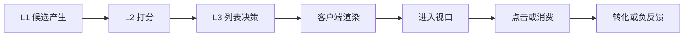

# 样本空间与曝光归因

样本空间回答一个先于模型的问题：**哪些候选构成一次可学习、可比较的推荐机会？** L2 训练样本不是“用户与全库物品”的任意组合，也不是所有进入服务链路的候选；它应当对应某个请求中，用户在明确场景下实际有机会接触并产生反馈的候选。

本页解释请求候选样本如何被定义、展示链路中哪些事件可以作为曝光证据、后续行为如何归因到一次曝光，以及如何保存可回放事实。标签本身的业务语义与成熟窗口见[标签定义与时间窗口](../标签定义与时间窗口/README.md)；如何从样本中选取负例见[负样本构造](../负样本构造/README.md)；展示偏差的校正条件见[偏差与去偏](../偏差与去偏/README.md)。

## 1. 样本单位与边界

推荐以“请求 - 候选”为基本样本单位：

$$
z=(r,u,i,c,t,\mathcal C_t,\boldsymbol f_t,e,\boldsymbol y,v)
$$

| 字段 | 含义 | 为什么必须保存 |
| --- | --- | --- |
| $r$ | 请求 ID 或稳定请求键 | 串联候选、排序、渲染和反馈 |
| $u$、$i$ | 用户和候选物品 | 定义交互主体与去重范围 |
| $c$、$t$ | 场景与事件时间 | 决定上下文与 point-in-time 特征 |
| $\mathcal C_t$ | 当时可竞争候选集合 | 支持请求内排序和候选回放 |
| $\boldsymbol f_t$ | 当时可获得的特征快照 | 防止训练使用未来信息 |
| $e$ | 候选、排序、渲染、视口等事件 | 判断用户是否真的有机会看见 |
| $\boldsymbol y$ | 按规则归因的行为标签 | 连接学习目标与反馈 |
| $v$ | 候选、模型、特征、实验版本 | 支持问题定位与可复现比较 |

候选集合 $\mathcal C_t$ 应记录 L1 通道、通道原始分、候选资格、去重结果和候选集合版本。只保存最终展示列表无法判断某物品是被 L2 排低、被 L3 调整，还是根本没有被 L1 召回。

## 2. 从候选到反馈的事件架构

一次推荐机会至少经历以下事件层级。事件名称可随系统变化，但语义边界需要稳定。

| 事件层 | 代表事实 | 能否直接作为 CTR 未点击负例 | 说明 |
| --- | --- | --- | --- |
| 入选候选 | 进入 L2/L3 | 否 | 用户可能从未看到该候选 |
| 最终列表 | 被 L3 放入返回列表 | 否 | 返回不代表客户端成功显示 |
| 渲染曝光 | 卡片完成渲染 | 视产品而定 | 是 CTR 的最低可审计口径 |
| 有效曝光 | 进入视口且满足可见条件 | 通常可以 | 更接近用户真实注意机会 |
| 交互反馈 | 点击、停留、购买、屏蔽 | 不适用 | 需要按标签窗口与归因规则关联 |

对无限滚动、分页、预加载和网络失败场景，应额外记录页面批次、可见时长、滚动深度、渲染状态和退出原因；否则“未点击”会混入大量并未被用户看到的候选。

## 3. 曝光口径的选择

不同目标需要不同的最小曝光口径，不能用一种曝光定义覆盖所有任务。

| 任务 | 推荐正负样本口径 | 关键补充字段 | 不宜直接使用的对象 |
| --- | --- | --- | --- |
| CTR | 渲染或有效曝光后的点击/未点击 | 位置、视口、页面批次 | 仅进入候选集的物品 |
| 有效消费 | 曝光后达到消费规则/未达到 | 内容长度、播放状态、跳出 | 未渲染候选 |
| CVR | 点击或明确意图后的转化/未转化 | 点击时间、归因窗口、成熟状态 | 所有未点击曝光的候选 |
| 负反馈 | 曝光或消费后主动负反馈 | 触发位置、严重度、撤销状态 | 无行为样本 |
| Listwise | 同请求中可回放的竞争候选 | 候选集合、L2/L3 位置 | 跨请求拼接的随机负例 |

选择口径时应优先保证事件可信和可回放，再追求样本量。若“进入视口”难以精确采集，应明确使用渲染曝光作为近似，并把该限制写入评测与实验结论。

## 4. 行为归因规则

归因决定一次行为属于哪一条曝光记录。默认可先按 `request_id + item_id` 关联；当该键缺失或一个物品被多次曝光时，需要预先选择稳定规则。

| 场景 | 可选归因规则 | 需要记录的决策 |
| --- | --- | --- |
| 同一请求重复候选 | 请求内去重或首个展示归因 | 去重键、保留位置和原因 |
| 多次曝光后点击 | 最近一次、首次或多触点归因 | 时间间隔、曝光序列与归因版本 |
| 点击后跨会话转化 | 最近有效点击、渠道归因或多触点权重 | 跨端 ID、窗口、退款/取消回写 |
| 曝光后主动屏蔽 | 最后一次有效曝光或消费对象 | 触发主体、撤销与时效 |

归因规则应在样本生成前固定，并随标签版本发布。否则同一模型的训练集会因回填或规则变更而悄然改变，离线比较不再具有可解释性。

## 5. 重复曝光、去重与候选语义

同一用户同一物品可能在同一请求、连续分页或不同入口中出现。需要分别定义：

- **请求内去重**：同一 `request_id` 中是否只保留一个候选，以及保留哪个通道和位置。
- **跨请求重复曝光**：在多长时间窗口内视为重复；重复曝光是新样本、降权样本还是需要排除。
- **首曝与复曝**：是否为模型提供 `impression_count`、距上次曝光时间等状态特征。
- **候选资格变化**：库存、合规、地域或内容下架导致的不可用候选，必须与“模型未选中”区分。

这些规则既影响训练数据，也影响评测中请求内候选的构成。候选语义一旦变化，应更新 `candidate_set_version`，并按新旧版本分别报告指标。

## 6. 可回放数据契约

离线样本应能还原请求发生时的候选、排序、资格与特征。建议至少落盘以下日志：

| 日志类别 | 最小字段 | 主要用途 |
| --- | --- | --- |
| 请求日志 | `request_id`、用户/匿名 ID、场景、时间、实验桶 | 定位请求和随机化上下文 |
| 候选日志 | L1 通道、候选集合、资格、原始分、版本 | 重建竞争集合 |
| 排序日志 | L2 分数、融合分、L3 前后位置、模型版本 | 解释排序变化 |
| 展示日志 | 渲染、视口、页面批次、位置、设备 | 定义曝光与位置偏差 |
| 反馈日志 | 行为时间、物品、行为类型、订单/撤销状态 | 生成成熟标签 |
| 特征日志 | schema、快照时间、缺失标记或特征哈希 | 检查训练服务一致性 |

请求 ID 不可用时，可以使用稳定的会话、页面批次、时间戳和匿名用户键组合，但必须评估碰撞率与 join 误配率。无法重建候选集合的请求不应用于 Listwise 或请求内 NDCG 结论。

## 7. 质量检查与故障定位

| 检查项 | 发现的问题 | 常用处理 |
| --- | --- | --- |
| 请求到候选的 join 覆盖率 | 候选日志缺失、ID 变更 | 阻断训练或按版本隔离 |
| 候选到渲染的覆盖率 | 服务返回不等于客户端展示 | 补齐客户端回执与失败原因 |
| 渲染到视口的比例 | 页面结构、滚动或埋点异常 | 按页面批次和设备审计 |
| 行为归因成功率 | 跨端 ID、窗口或去重错误 | 检查归因键和未归因原因 |
| 候选数与通道占比 | L1 变化造成输入漂移 | 分版本训练/评测并保留通道特征 |
| 重复曝光率 | 过曝、去重或窗口策略问题 | 调整去重与重复曝光口径 |

## 常见误解

- **进入候选集就等于曝光**：候选、渲染、进入视口和用户交互是不同层次的事件。
- **返回给客户端就等于用户看到**：网络、渲染、分页和滚动都会改变实际注意机会。
- **只保存最终排序即可复现训练**：候选来源、展示状态、实验桶和请求版本共同构成可回放样本。
- **同一物品的多次曝光天然等价**：首曝、复曝、不同场景和不同页面批次需要明确建模或归因规则。