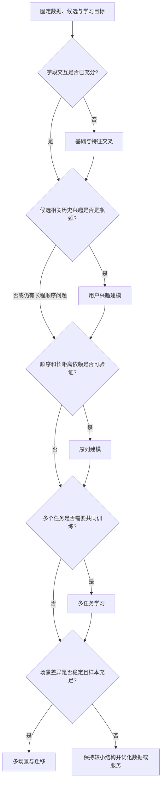

# 模型架构

模型架构解决的是：在确定的候选、特征与学习目标下，如何表示用户、物品和上下文，并让模型捕捉真正需要的交互关系。它不替代样本定义、标签成熟度、学习目标、概率校准或在线服务治理；这些前提不稳定时，堆叠更复杂的网络通常只会放大噪声与离在线偏差。

本模块按结构问题而不是按论文名称组织。阅读时先判断当前瓶颈属于字段交互、候选相关兴趣、长序列依赖、任务共享，还是场景差异，再进入对应子模块。学习目标与损失选择见[学习目标](../学习目标/README.md)，样本、特征和训练服务契约见[数据与特征](../数据与特征/README.md)，离线与在线验证见[精排系统评测](../精排系统评测.md)。

## 1. 模块地图

| 子模块 | 直接解决的问题 | 常见起点 | 需要先具备的证据 | 不应误作的事 |
| --- | --- | --- | --- | --- |
| [基础与特征交叉](./基础与特征交叉/LR与WideDeep/README.md) | 稀疏字段如何编码，哪些字段组合需要显式或隐式交互 | LR、Wide & Deep、DeepFM | 字段含义、词表和离在线特征一致 | 用深层网络掩盖错误特征或泄漏 |
| [用户兴趣建模](./用户兴趣建模/DIN/README.md) | 当前候选应激活用户历史中的哪些兴趣 | DIN、DIEN | 事件序列可信，候选与历史存在相关性 | 把无序、无语义的日志拼成兴趣序列 |
| [序列建模](./序列建模/BST/README.md) | 行为顺序、时间间隔和长距离依赖如何建模 | BST、SASRec、BERT4Rec | 序列足够长，顺序和时间可稳定回放 | 用长模型替代对短序列与冷启动的处理 |
| [多任务学习](./多任务学习/ESMM/README.md) | CTR、CVR、时长、风险等任务怎样共享或隔离 | ESMM、MMoE、PLE | 各任务标签口径清楚且关系可解释 | 将结构共享等同于多目标排序策略 |
| [多场景与迁移](./多场景与迁移/STAR/README.md) | 多入口、多地域或多业务线如何共享与适配 | STAR、场景自适应 | 场景 ID 稳定、各场景样本与差异可量化 | 将噪声分桶或流量波动当成场景差异 |

五个方向可以组合，但组合不等于同时叠加所有模块。例如，DIN/BST 往往建立在字段交叉主干之上，多任务头可接在任意表征主干之后，场景适配则可以作用于特征、专家或任务头。组合前应先为每一层写清输入、输出、参数共享范围和线上时延预算。

## 2. 从问题到结构的阅读路径

该路径不是严格的单向依赖，而是一套排查顺序。基础模型是所有比较的共同参照；兴趣和序列模块回答不同时间范围的历史行为问题；多任务与多场景模块改变参数共享方式，不能替代前面任一模块对特征或行为语义的要求。

## 3. 统一输入输出契约

无论采用哪一种结构，L2 模型应围绕同一请求候选事实工作。对请求 $r$、候选 $i$，可将输入抽象为：

$$
\boldsymbol h_{r,i}=f\left(
\boldsymbol x_{user},
\boldsymbol x_{item},
\boldsymbol x_{context},
\boldsymbol x_{history},
\boldsymbol x_{recall},
\boldsymbol x_{scene}
\right)
$$

其中各特征均应在请求时刻可用。模型将 $\boldsymbol h_{r,i}$ 映射到单任务概率、多任务预测或排序分数；预测语义由学习目标决定，而不是由网络名称决定。

| 输入/输出层 | 典型内容 | 架构需要遵守的约束 |
| --- | --- | --- |
| 用户与物品字段 | ID、类目、统计量、向量、状态 | 词表、OOV、快照与隐私语义一致 |
| 请求上下文 | 场景、设备、时间、入口、位置 | 只使用服务端实际可得字段 |
| 历史行为 | 行为类型、物品、时间间隔、序列长度 | 事件顺序、截断、去重和迟到事件一致 |
| L1 来源 | 通道、原始分、排名、命中原因 | 分数方向和通道版本可回放 |
| 任务输出 | CTR/CVR/时长/风险/排序分数 | 概率、数值和排序分数不可混用 |

## 4. 架构比较的实验纪律

模型对比必须固定非架构变量：候选集、时间切分、样本口径、特征快照、标签版本、损失定义、训练预算和服务资源。否则“模型提升”可能只是更换了候选、加入未来统计、改变负采样或使用了更长训练时间。

| 检查维度 | 离线需要确认 | 线上需要确认 |
| --- | --- | --- |
| 预测与排序 | AUC/PR-AUC、LogLoss、NDCG/MAP 及分群 | 点击、转化、价值和负反馈护栏 |
| 概率语义 | Brier、ECE、可靠性曲线 | 融合后数值稳定性与阈值命中率 |
| 数据覆盖 | 新老用户、短长序列、冷热门物品、各通道 | 流量结构与训练分布是否漂移 |
| 性能资源 | 参数量、训练成本、特征读取量 | P50/P95/P99、超时、降级与成本 |
| 稳定与可解释 | 多随机种子、时间窗、消融结果 | 灰度回滚、异常分群与长期效应 |

复杂模型应至少相对于轻量基线给出增量证据：收益来自哪类人群、哪类请求或哪种候选；是否在概率质量或服务时延上付出代价；以及该代价是否被线上业务收益覆盖。

## 5. 实现与服务边界

模型设计需要同时符合线上约束。序列长度、embedding 表规模、注意力计算、专家数量和场景路由都会影响服务延迟与内存；离线可取得的特征不一定能在请求路径稳定提供。

- 先定义请求级特征读取预算、最大候选数、最大序列长度和时延上限，再选择网络规模。
- 对序列不足、特征缺失、专家/场景路由失败等情况定义明确默认值或降级路径。
- 将特征 schema、词表、序列截断、模型权重、校准器和效用函数作为可回放的发布版本。
- 在影子流量或请求回放中比较离在线特征、模型输入、预测与延迟；不要只验证模型文件能加载。

## 6. 建议的演进阶梯

1. 以 LR、MLP 或 Wide & Deep 级别的字段模型建立数据、目标、服务与评测基线。
2. 只有在候选相关的短期兴趣能被离线切片和线上实验验证时，引入 DIN/DIEN 类兴趣建模。
3. 当行为顺序、时间间隔或长距离依赖在足够样本上呈现增益时，引入 Transformer 或序列推荐结构，并严格控制长度和时延。
4. 当多个标签的样本空间与业务关系已澄清后，尝试 ESMM、MMoE、PLE 等多任务结构，并独立观察每个任务。
5. 当场景定义稳定且长尾场景有足够证据时，增加场景共享/专属参数或迁移策略。
6. 每次仅改变一个可解释的结构假设，完成消融、分群、校准和线上护栏验证后再叠加下一层。

## 常见误解

- **复杂模型必然优于轻量基线**：模型收益需要在相同候选、特征、目标和服务预算下比较。
- **一个模型家族能解决全部问题**：字段交叉、兴趣、序列、任务冲突和场景迁移对应不同结构问题。
- **模型架构可以修复错误样本或泄漏特征**：架构只学习输入提供的信号，数据契约错误会污染所有模型。
- **多任务或多场景只是给主干多加几个头**：它们改变参数共享、样本关系和线上路由，需要独立评估。
- **离线模型更大就值得上线**：参数量、序列长度和专家数量会直接影响 P99、成本与降级风险。