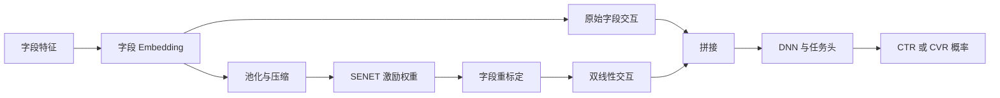

# AutoInt 与 FiBiNET

AutoInt 与 FiBiNET 都面向“字段很多，但并非每个字段对都同样重要”的交叉问题。AutoInt 使用多头自注意力在字段间传递信息，FiBiNET 先用 SENET 风格的重标定估计字段重要性，再用双线性函数构造字段交互。两者可减少人工枚举交叉，但并不会消除词表、缺失、时间可用性和服务一致性的要求。

它们适合与[DeepFM](../DeepFM/README.md)、[DCNv2](../DCNv2/README.md)在完全相同的字段、样本和资源预算下做对照，而不是直接替换已验证的特征合同。

## 原始文献

| 模型 | 来源 | 核心贡献 |
| --- | --- | --- |
| AutoInt | Song et al., *AutoInt: Automatic Feature Interaction Learning via Self-Attentive Neural Networks*, CIKM 2019 | 以多头自注意力自动学习字段交互，支持堆叠层表达高阶关系。 |
| FiBiNET | Huang et al., *FiBiNET: Combining Feature Importance and Bilinear Feature Interaction for Click-Through Rate Prediction*, RecSys 2019 | 用 SENET 重标定字段，再以双线性层表达特征对交互。 |

## AutoInt：字段自注意力

设字段 embedding 为 $\boldsymbol{e}_i$，每个注意力头计算：

$$
\alpha_{ij}=\operatorname{softmax}_j\left(
\frac{(\boldsymbol{W}_Q\boldsymbol{e}_i)^{\top}(\boldsymbol{W}_K\boldsymbol{e}_j)}{\sqrt{d}}
\right),
\qquad
\widetilde{\boldsymbol{e}}_i=\sum_j\alpha_{ij}\boldsymbol{W}_V\boldsymbol{e}_j.
$$

多头输出经残差、投影和非线性变换后可继续堆叠，使字段表示逐层吸收其他字段的信息。


| 优势 | 局限 | 适用信号 |
| --- | --- | --- |
| 能为不同样本选择不同字段关系，天然支持高阶堆叠 | 字段数为 $F$ 时注意力计算约为 $O(F^2)$，字段过多会显著增加成本 | 离线分析显示不同场景/样本依赖的字段组合差异明显。 |

## FiBiNET：字段重要性与双线性交互

FiBiNET 先聚合全部字段，经过压缩与激励网络得到字段缩放系数 $s_i$，以 $\boldsymbol{e}_i'=s_i\boldsymbol{e}_i$ 重标定字段。随后对字段对做双线性变换，例如：

$$
\boldsymbol{p}_{ij}=\boldsymbol{e}_i^{\top}\boldsymbol{W}\boldsymbol{e}_j,
$$

其中 $\boldsymbol{W}$ 可为共享、按字段对或分组参数。原始与重标定后的交互可同时输入 DNN。



| 优势 | 局限 | 适用信号 |
| --- | --- | --- |
| 先区分字段重要性再建模交互，双线性形式比点积更灵活 | 字段对参数化可能膨胀；SENET 权重受全局上下文限制 | 少数字段常主导样本，且字段对交互比简单点积更有增量。 |

## 选型对比

| 需求 | 优先选择 | 原因 |
| --- | --- | --- |
| 需要稳健、低成本的二阶自动交叉 | DeepFM | FM 成熟且计算紧凑。 |
| 需要有界阶数的显式交叉 | DCNv2 | 交叉深度和参数化方式直接可控。 |
| 需要样本相关的字段依赖选择 | AutoInt | 自注意力对字段关系动态加权。 |
| 希望显式重标定字段并增强字段对变换 | FiBiNET | SENET + 双线性交互匹配该假设。 |
| 历史行为与候选匹配主导效果 | 用户兴趣建模 | 字段注意力不能替代候选感知注意力。 |

## 最小可运行示例

[model.py](./model.py) 实现 `AutoInt` 的多头字段自注意力，以及 `FiBiNET` 的字段重标定和共享双线性交互；[train.py](./train.py) 使用同一组固定随机种子数据分别训练二者。

```powershell
python train.py
```

两种模型均接收形状为 `[batch_size, field_count]` 的整型离散字段，输出未经概率校准的 logit。该示例只展示核心交互计算，未包含多值字段池化、字段掩码、数值特征编码或线上延迟优化。

## 训练与服务检查

- 固定字段数、embedding 维度、头数/层数或双线性参数化，确保模型比较不是通过扩大参数量获益。
- 字段缺失应有独立 embedding 和监控；将缺失字段直接删除会改变注意力分母和交互集合。
- 对 AutoInt 记录字段数、头数、序列化 batch 推理开销与 P99；对 FiBiNET 记录双线性参数规模与低频字段稳定性。
- 以消融验证 SENET、双线性层、注意力层和残差连接的独立贡献，并按场景、OOV、缺失和冷启动切片报告结果。
- 仅将注意力、缩放或双线性权重作为诊断线索；需要解释业务动作时，仍须使用受控实验或归因方法。

## 常见误解

- **字段注意力权重就是业务因果贡献**：注意力表达模型内部的表示选择，不等同于因果归因。
- **自动交叉可以忽略字段治理**：字段质量、缺失语义和服务可得性仍是前提。
- **字段越多注意力一定越强**：无关字段会增加二次计算、噪声和过拟合风险。
- **FiBiNET 的字段重要性等于全局特征重要性**：重标定依赖当前样本输入，不能直接替代整体特征分析。
