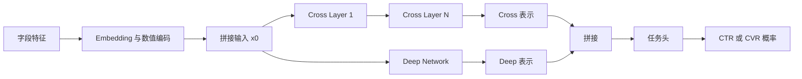

# DCNv2

DCNv2（Deep & Cross Network V2）以 Cross Network 显式构造有界阶数的字段交叉，并与深层网络并联学习隐式非线性关系。相比 DeepFM 的低秩二阶点积，DCNv2 可用全矩阵、低秩分解和 mixture-of-experts 参数化交叉变换，适合固定字段集合下仍需要更强显式交互能力的排序问题。

它是特征交叉主干，不会自动获得当前候选相关的历史兴趣，也不会化解多任务梯度冲突。先阅读[基础与特征交叉总览](../README.md)以确定问题是否真的属于字段交叉。

## 原始文献

Wang et al., *DCN V2: Improved Deep & Cross Network and Practical Lessons for Web-scale Learning to Rank Systems*, WWW 2021。该工作扩展了原始 DCN 的向量交叉，提出更具表达力的矩阵/低秩交叉与混合专家交叉，并总结了大规模排序的实践要点。

## 交叉网络机制

令 $\boldsymbol{x}_0$ 为拼接后的稠密输入，单层交叉可写为：

$$
\boldsymbol{x}_{l+1}=\boldsymbol{x}_l+
\boldsymbol{x}_0\odot(\boldsymbol{W}_l\boldsymbol{x}_l+\boldsymbol{b}_l).
$$

第 $l$ 层会引入最高 $l+1$ 阶的显式组合。为控制参数规模，$\boldsymbol{W}_l$ 可做低秩分解 $\boldsymbol{U}_l\boldsymbol{V}_l^{\top}$；混合专家版本再由门控按样本组合多个交叉专家。交叉塔和 DNN 塔的输出通常拼接后进入任务头。



| 参数化 | 优势 | 代价与风险 |
| --- | --- | --- |
| 向量/原始交叉 | 参数少、计算快 | 表达能力受限。 |
| 全矩阵交叉 | 可表达更丰富的字段依赖 | 参数量随输入宽度平方增长。 |
| 低秩矩阵 | 在表达力与成本间折中 | 秩过低欠拟合，过高接近全矩阵成本。 |
| MoE 交叉 | 可按样本选择交叉变换 | 门控塌缩、调参和线上 P99 更复杂。 |

## 与相邻模型的取舍

| 问题 | DCNv2 的适合度 | 对照模型 |
| --- | --- | --- |
| 已有明确规则交叉 | 不必优先增加复杂交叉 | [LR 与 Wide & Deep](../LR与WideDeep/README.md) |
| 大量二阶稀疏交叉 | 可作为增强基线 | [DeepFM](../DeepFM/README.md) 通常更简洁。 |
| 需要可控的三阶及以上显式交叉 | 高 | Cross 层数直接提供阶数上界。 |
| 需要样本相关字段选择 | 可能有效但不一定最直接 | [AutoInt 与 FiBiNET](../AutoInt与FiBiNET/README.md) 更聚焦字段选择。 |
| 用户历史与候选匹配 | 不足 | 应使用[用户兴趣建模](../../用户兴趣建模/README.md)。 |

## 适用场景

适合字段交互复杂、DeepFM 或 Wide & Deep 已稳定但仍有可复现的交叉残差，且数据量、参数预算和在线延迟允许增加交叉层的场景。常见信号包括用户、物品、上下文、召回通道和价格/位置等组合存在稳定的非线性关系。

不宜优先使用于特征缺失严重、样本量不足、候选变化才是性能瓶颈或线上 P99 已接近预算的系统。先修复特征合同、候选覆盖或标签定义，通常比堆叠交叉专家更有效。

## 最小可运行示例

[model.py](./model.py) 包含低秩 `CrossLayer` 与并联 DNN 塔的 `DCNv2`；[train.py](./train.py) 在固定随机种子的三字段合成数据上训练该模型。

```powershell
python train.py
```

示例将各字段 embedding 拼接为 $\boldsymbol{x}_0$，以低秩投影近似交叉矩阵，并输出未经概率校准的二分类 logit。它省略了生产所需的数值特征归一化、词表治理、MoE 门控和线上特征服务。

## 实施与验证检查

- 固定输入拼接顺序、embedding 宽度和归一化方式；Cross Network 对输入尺度和字段漂移敏感。
- 逐步消融 cross 层数、低秩维度、专家数和 DNN 塔，记录参数量、吞吐、P50/P99 及显存。
- 检查 MoE 门控的专家利用率和熵；长期只激活少数专家时，应缩减专家或重新审视特征与损失。
- 与 DeepFM 的对比必须使用同一候选、特征、样本、训练步数和总参数预算，并报告校准与分群指标。
- 对冷用户、低频类目、缺失字段和 OOV 建立独立回放；不要让默认 embedding 与交叉层放大异常输入。

## 常见误解

- **更深的交叉网络必然更好**：交叉深度、秩和专家数需要由数据量、消融和延迟预算共同约束。
- **DCNv2 能替代行为兴趣模型**：字段交叉与候选感知历史属于不同问题。
- **MoE 交叉一定会自动分工**：需用专家利用率和分群收益确认，而不是从门控名称推断。
- **显式交叉更容易解释因果**：结构显式不等于业务因果，仍只是在拟合观测分布。
