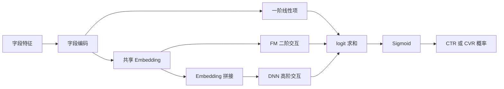

# DeepFM

DeepFM 将一阶线性项、FM（Factorization Machine）二阶交叉与 DNN 高阶交互放入同一端到端模型。三个部分共享字段 embedding，因此比“先做 FM、再手工拼接 DNN”的方案更紧凑，常作为多离散字段 CTR/CTCVR 的强基线。它建模字段交互，不负责定义标签、处理行为时序或决定最终多目标融合。

本目录的 [model.py](./model.py) 与 [train.py](./train.py) 是最小结构样板；生产实现还需补齐特征版本、日志、校准、回放和降级能力。全局取舍见[基础与特征交叉总览](../README.md)。

## 原始文献

Guo et al., *DeepFM: A Factorization-Machine based Neural Network for CTR Prediction*, IJCAI 2017。论文的关键设计是 FM 与 deep 分支共享原始字段 embedding，以较低的额外特征工程成本同时学习低阶和高阶交互。

## 结构与公式

设第 $i$ 个字段的标量特征为 $x_i$，embedding 为 $\boldsymbol{v}_i$。FM 的二阶项是：

$$
y_{\mathrm{FM}}=w_0+\sum_i w_i x_i+
\sum_{i<j}\langle\boldsymbol{v}_i,\boldsymbol{v}_j\rangle x_i x_j.
$$

二阶部分可等价地以 $O(kd)$ 复杂度计算：

$$
\frac{1}{2}\sum_{f=1}^{d}\left[
\left(\sum_i v_{i,f}x_i\right)^2-
\sum_i v_{i,f}^2x_i^2
\right].
$$

将各字段 embedding 拼接为 $\boldsymbol{a}^{(0)}$，DNN 递推为 $\boldsymbol{a}^{(l+1)}=g(\boldsymbol{W}_l\boldsymbol{a}^{(l)}+\boldsymbol{b}_l)$。最终 logit 通常为：

$$
z=y_{\mathrm{FM}}+\boldsymbol{w}_{\mathrm{deep}}^{\top}\boldsymbol{a}^{(L)}+b,
\qquad \hat{p}=\sigma(z).
$$

| 组成 | 作用 | 对输入的要求 |
| --- | --- | --- |
| 一阶项 | 保留字段的直接偏好与偏置 | 稀疏索引、数值缩放和默认值稳定。 |
| FM 项 | 学习任意字段对的低秩二阶关系 | embedding 维度、字段值尺度和多值池化一致。 |
| DNN | 补充非线性高阶组合 | 拼接顺序固定，控制宽度、层数和正则以防过拟合。 |

## 优势、局限与相邻模型

| 维度 | DeepFM | 适合改用的结构 |
| --- | --- | --- |
| 二阶稀疏交叉 | 自动覆盖，避免手工枚举 | 规则交叉有明确业务语义时可保留 [Wide & Deep](../LR与WideDeep/README.md)。 |
| 更高阶显式交叉 | 主要依赖 DNN 隐式学习 | 需要控制交叉阶数时评估 [DCNv2](../DCNv2/README.md)。 |
| 字段关系选择 | 所有字段对经 FM 共享处理 | 字段语义复杂且选择效应明显时评估 [AutoInt 与 FiBiNET](../AutoInt与FiBiNET/README.md)。 |
| 训练服务成本 | 通常低于复杂注意力/专家交叉 | embedding 表与 DNN 仍可能成为参数和 P99 主体。 |
| 可解释性 | 一阶项和部分字段对可检查 | 深层高阶关系不应视为因果解释。 |

适合字段较多、类别特征稀疏、二阶交叉重要且需要成熟强基线的精排；不宜在历史顺序、当前候选匹配或任务冲突才是主要瓶颈时单独加深 DeepFM。

## 训练与服务检查

- 明确每个字段是一值、多值、连续值还是统计值；多值特征的 sum/mean/attention 池化必须离在线一致。
- 连续特征不能直接与 one-hot 采用任意相同尺度；记录归一化、截断、缺失标记和分桶版本。
- 固定 embedding 总参数量、DNN 宽度、特征集合和损失后，才比较 FM 项、深层分支及其他架构的增益。
- 关注低频 ID、OOV、空多值字段和新用户/新物品切片，并按场景检查 AUC、LogLoss、ECE 与线上 P99。
- 排查训练服务差异时，分别导出一阶 logit、FM logit、deep logit 与最终 logit，避免只能看到最终分数。

## 常见误解

- **DeepFM 自动完成全部特征工程**：词表、连续值、多值特征和缺失语义仍需显式设计。
- **FM 项覆盖高阶交叉**：FM 主要表达二阶交互，高阶关系由深层分支学习。
- **共享 embedding 必然优于独立 embedding**：共享降低参数并促进联合学习，也可能在字段语义冲突时引入约束。
- **离线 AUC 提升即可上线**：需检查校准、分群稳定性、特征可用率与线上资源成本。
