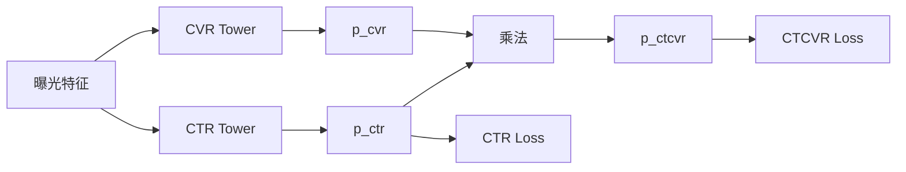

# ESMM

ESMM（Entire Space Multi-Task Model）联合训练点击与点击后转化，避免 CVR 任务只从已点击样本学习。代表论文为 Ma et al., *Entire Space Multi-Task Model*, SIGIR 2018。

## 任务关系

令 $p_{ctr}$ 为点击概率，$p_{cvr}$ 为点击条件下的转化概率，$p_{ctcvr}$ 为曝光后点击且转化的概率：

$$
p_{ctcvr}=p_{ctr}p_{cvr}
$$

CTR 损失使用全曝光点击标签，CTCVR 损失也使用全曝光空间的点击且转化标签。乘法关系使 CVR 塔能从 CTCVR 目标获得全空间梯度；前提是点击、转化归因窗口一致且标签已成熟。



## 何时使用

| 适合 | 不适合直接解决 |
| --- | --- |
| 点击后转化的漏斗关系明确，且 CVR 仅在点击样本学习 | 一般多任务的梯度冲突、位置偏差、业务效用融合 |
| CTR/CTCVR 归因规则稳定，可在同一曝光空间构造标签 | 转化窗口未成熟或点击/转化口径互相矛盾 |

应同时评估 CTR、CTCVR、校准和线上转化。若多个非漏斗任务仍互相伤害，进一步比较 [MMoE](../MMoE/README.md) 或 [PLE](../PLE/README.md)。

## 可运行示例

[model.py](./model.py) 定义两个塔，并显式返回 CTR、CVR logits 与 CTCVR 概率；[train.py](./train.py) 生成确定性的曝光、点击、转化合成数据，优化 CTR 与 CTCVR 二元交叉熵。

```powershell
python train.py
```

示例仅用于说明结构与联合损失，不包含真实归因、延迟回传、负采样、校准和线上服务逻辑。

## 工程检查

- 用同一曝光主键和成熟截止时间构造 CTR、CTCVR 标签，防止标签泄漏。
- 分人群检查点击率、转化率与预测校准；不能仅看 CTCVR 的离线提升。
- 将输出接入版本化效用函数；供给、频控和合规约束留给 L3。

## 常见误解

- **ESMM 直接输出无偏 CVR**：它处理特定漏斗样本空间，不取代展示偏差和标签治理。
- **CTCVR 提升必然带来业务转化提升**：还需要结合校准、候选覆盖和线上实验判断。