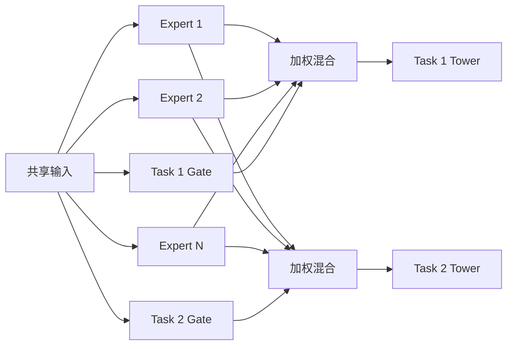

# MMoE

MMoE（Multi-gate Mixture-of-Experts）用共享专家产生多个候选表示，再让每个任务的门控选择不同组合。代表论文为 Ma et al., *Modeling Task Relationships in Multi-task Learning with Multi-gate Mixture-of-Experts*, KDD 2018。

## 结构定义

对输入 $x$，第 $e$ 个专家输出 $h_e(x)$，任务 $k$ 的门控输出专家权重 $g_k(x)$：

$$
z_k=\sum_{e=1}^{E}g_{k,e}(x)h_e(x), \qquad g_k(x)=softmax(W_kx)
$$

每个 $z_k$ 进入独立任务塔。与 Shared-bottom 相比，MMoE 允许同一用户或上下文在不同任务中使用不同的共享模式。



## 何时使用

| 适合 | 风险与替代 |
| --- | --- |
| 任务相关但不同人群、场景的共享程度不同 | 先用独立塔或 Shared-bottom 建立基线 |
| 有足够数据诊断门控使用和分任务收益 | 任务冲突强且 MMoE 仍负迁移时比较 [PLE](../PLE/README.md) |

专家数越多并不等于共享更好。过量专家会增加内存、延迟和门控塌缩风险；标签定义冲突时应先治理目标，而不是增加专家。

## 可运行示例

[model.py](./model.py) 实现四个共享专家、两个任务门控和任务塔；[train.py](./train.py) 用两个相关的二元合成任务，逐任务打印损失。

```powershell
python train.py
```

示例省略稀疏特征、任务采样、动态权重、分布式训练和线上特征一致性。

## 工程检查

- 同时报告每个任务的 AUC、LogLoss、校准与关键分群指标，不能以总损失替代。
- 记录门控均值、熵和专家利用率；单个专家长期主导通常是塌缩信号。
- 对专家数量、塔宽、任务权重及独立头/Shared-bottom 进行消融，并评估 P99 延迟。

## 常见误解

- **专家数越多共享能力越强**：过多专家会增加训练和服务成本，并可能出现门控塌缩。
- **门控分配就是任务因果关系**：门控反映参数使用方式，需结合任务指标解释。