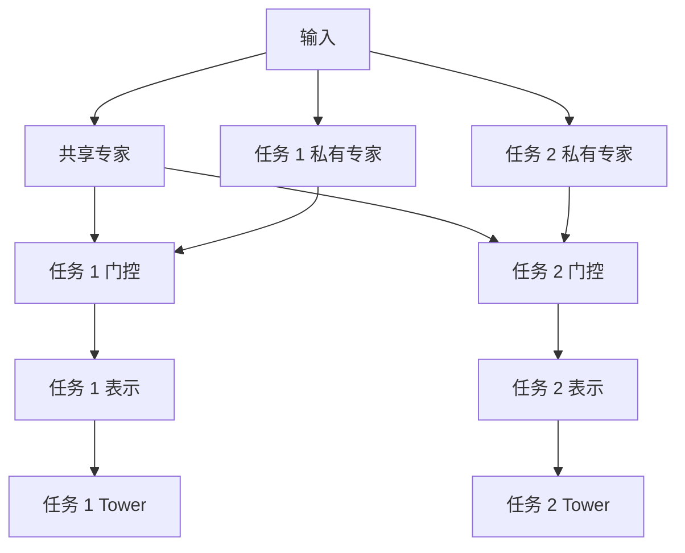

# PLE

PLE（Progressive Layered Extraction）将每层专家分为共享专家和任务特有专家，并让任务门控只读取自身私有专家与共享专家，从结构上限制无关任务表示的直接混入。代表论文为 Tang et al., *Progressive Layered Extraction for Multi-Task Learning*, RecSys 2020。

## 结构定义

第 $l$ 层中，任务 $k$ 的候选集合由私有专家和共享专家组成：

$$
z_k^{(l)}=\sum_{e \in [private_k,shared]}g_{k,e}^{(l)}(x)h_e^{(l)}(x)
$$

共享门控可以读取所有专家以生成下一层共享表示；任务门控不直接读取其他任务的私有专家。多层提取使共享部分逐层被筛选，而非一次性硬共享。



## 何时使用

| 适合 | 不应直接归因给 PLE |
| --- | --- |
| MMoE 已观察到稳定的任务负迁移，且样本量足够 | 标签窗口不一致、任务权重错误、特征泄漏 |
| 可接受更多专家、参数和在线延迟 | 漏斗样本空间问题，应先检查 [ESMM](../ESMM/README.md) |

先比较独立塔、Shared-bottom 和 [MMoE](../MMoE/README.md)。若 MMoE 的梯度或分群指标仍显示明确伤害，再以 PLE 验证私有/共享分离的增益。

## 可运行示例

[model.py](./model.py) 实现一层 PLE：每个任务有两个私有专家，另有两个共享专家；[train.py](./train.py) 训练两个相关二元任务并逐任务输出损失。

```powershell
python train.py
```

该示例是教学核心实现，不包含论文中的多层共享门控、生产级特征管道、任务采样、校准与服务优化。

## 工程检查

- 分层记录私有/共享专家的利用率、门控熵、梯度范数和任务分群表现。
- 通过共享专家数、私有专家数、层数、任务权重消融确认收益来源。
- 评估参数量、吞吐、P99 与回滚路径；线上发布仍需监控主目标和风险任务。

## 常见误解

- **PLE 总能消除负迁移**：任务定义、样本规模和共享层设计仍决定迁移效果。
- **更复杂的专家结构优先于目标治理**：先确认标签、权重和任务冲突来源。