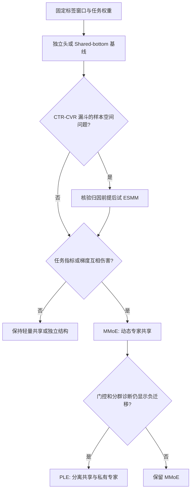

# 多任务学习

多任务结构决定多个预测目标如何共享或隔离表示，不负责定义最终业务效用。精排常同时预测 CTR、CTCVR/CVR、有效消费、时长和负反馈；它们共享用户、物品与上下文，却可能拥有不同样本空间、标签延迟和梯度方向。

对输入特征 $x$，多任务模型输出各任务预测，并以明确的权重形成训练目标：

$$
[y_1,y_2,...,y_K]=f_{mtl}(x), \qquad L=sum_{k=1}^{K}(lambda_k L_k)
$$

其中标签窗口、漏斗关系和权重语义见[学习目标：多任务与多目标](../../学习目标/多任务与多目标/README.md)。最终排序权重、校准、合规与列表约束仍属于后续效用层和 L3。

## 模型导航与文献

| 模型 | 结构要点 | 代表文献 | 主要适用场景 |
| --- | --- | --- | --- |
| [ESMM](./ESMM/README.md) | 联合 CTR 与 CTCVR，以乘法关系覆盖全曝光空间 | Ma et al., *Entire Space Multi-Task Model*, SIGIR 2018 | 点击后转化漏斗清晰，CVR 选择偏差突出 |
| [MMoE](./MMoE/README.md) | 共享专家加任务特定门控 | Ma et al., *Modeling Task Relationships in Multi-task Learning with Multi-gate Mixture-of-Experts*, KDD 2018 | 任务相关，但共享程度因任务或样本而异 |
| [PLE](./PLE/README.md) | 共享/私有专家逐层提取 | Tang et al., *Progressive Layered Extraction for Multi-Task Learning*, RecSys 2020 | 任务冲突更强，且数据量可支撑更复杂结构 |

## 选择路径

ESMM 可与 MMoE/PLE 组合，但先确认任务能否共用样本与特征，再叠加网络模块。

## 训练与上线检查

- 固定任务集合、标签版本、成熟截止时间、采样规则和损失权重，避免结构比较混入数据变化。
- 分任务、分场景、分人群报告 AUC、LogLoss、校准、价值指标和风险护栏；总损失下降不代表每个任务受益。
- 监控梯度范数/相似度、专家利用率、门控熵及任务预测分布，定位负迁移和门控塌缩。
- 先离线对比独立头、Shared-bottom 与候选结构，再小流量灰度；同时跟踪主目标、负反馈、延迟转化和 P99。

## 常见误解

- **多任务一定优于单任务**：不相关或口径冲突的任务会产生负迁移。
- **ESMM 输出天然无偏 CVR**：它缓解特定漏斗选择问题，不取代曝光偏差和标签治理。
- **专家越多越能解决冲突**：专家过多会增加成本，并可能产生门控塌缩。