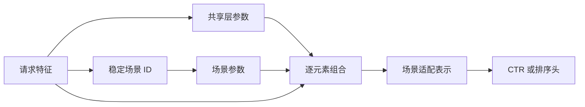

# STAR

STAR（Star Topology Adaptive Recommender）通过共享网络和场景特定参数服务多个域或入口。代表论文为 Sheng et al., *One Model to Serve All: Star Topology Adaptive Recommender for Multi-Domain CTR Prediction*, CIKM 2021。

## 结构定义

对场景 $s$，一层的有效参数由共享参数和场景参数组合：

$$
W_{effective,s}=W_{shared} * W_{scene,s}
$$

共享参数吸收跨场景的稳定规律；场景参数调制该规律以适应基准率、特征关系或候选分布的稳定差异。实际网络可在多层使用此结构，并保留场景偏置。



## 何时使用

| 适合 | 不适合直接解决 |
| --- | --- |
| 多域共享用户、物品或行为语义，但域差异稳定可量化 | 标签窗口不一致、特征缺失、路由错误 |
| 长尾场景需要借助大场景共享统计 | 页面规则、频控和供给约束，应留在 L3 |

先与全局模型、独立模型和“场景 ID 作为普通特征”的模型比较。小场景收益不稳定时，应优先检查样本量、标签成熟度和场景划分，而不是持续增加专属参数。

## 可运行示例

[model.py](./model.py) 实现共享权重与场景权重逐元素组合的两层网络；[train.py](./train.py) 生成三种稳定分布差异的合成 CTR 场景，并逐场景打印损失。

```powershell
python train.py
```

该示例只展示参数组合和场景级评测，不包含稀疏特征、真实候选流量、线上路由、校准或发布系统。

## 工程检查

- 将场景 ID、默认场景、路由规则、参数版本和回退模型一起版本化并可回放。
- 分场景、跨场景用户、冷热门物品和候选通道评估 AUC、LogLoss、校准、P99 与错误率。
- 监控小场景参数范数、特征 OOV、标签基准率和样本量，防止大场景主导或跨场景泄漏。

## 常见误解

- **每个入口都应单独训练模型**：共享程度由数据规模、特征重合和目标一致性决定。
- **场景参数可承载页面规则**：列表规则应保持在 L3 的可审计约束中。