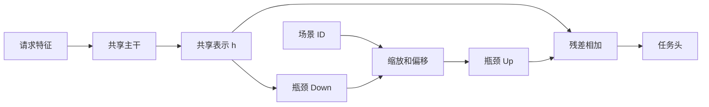

# 场景自适应

场景自适应是在共享主干中按场景注入小规模条件参数的通用方法族，包括场景 embedding、条件归一化、adapter、门控和领域对抗。adapter 的代表性来源包括 Rebuffi et al., *Learning Multiple Visual Domains with Residual Adapters*, NeurIPS 2017；在推荐中应结合具体数据和目标验证，而不能将该论文直接视为 CTR 效果保证。

## 条件 Adapter

共享主干先得到表示 $h$，再用场景 $s$ 的缩放与偏移调制瓶颈 adapter：

$$
h_s=h+U(relu(Dh * (1+gamma_s)+beta_s))
$$

其中 $D$ 和 $U$ 在场景间共享，而 $gamma_s$、$beta_s$ 是小规模场景参数。它比每场景独立塔更节省参数，也比只输入场景 ID 更明确地限制适配位置。



## 选型边界

| 方法 | 适合 | 主要风险 |
| --- | --- | --- |
| 场景 embedding 作为特征 | 差异弱，先验证基本场景信息 | 只能让下游网络自行学习如何适配 |
| 条件 adapter 或归一化 | 主干可共享，需低成本局部调制 | 场景路由、OOV 和默认值治理 |
| 门控/专家 | 差异随样本动态变化 | 复杂度、延迟与门控塌缩 |
| 独立模型 | 大场景目标或特征语义根本不同 | 长尾样本不足、发布成本高 |

候选来源、标签窗口或特征可用性不一致时，应先统一数据契约。若差异是稳定的域参数关系，可优先考虑 [STAR](../STAR/README.md)。

## 可运行示例

[model.py](./model.py) 定义共享 MLP 与场景条件瓶颈 adapter；[train.py](./train.py) 使用与 STAR 相同的三场景合成数据，并输出每场景二元交叉熵。

```powershell
python train.py
```

该示例是教学核心实现，不包含真实特征 schema、场景冷启动初始化、对抗训练、采样策略、校准或服务路由。

## 工程检查

- 定义未知场景、缺失场景和适配参数加载失败时的默认值与共享模型回退。
- 按场景、跨场景用户和新增场景报告排序、概率、长尾覆盖和资源指标。
- 对 adapter 宽度、插入层、是否共享任务头与全局/独立模型做消融；全局平均提升不足以支持上线。

## 常见误解

- **场景 embedding 足以解决域差异**：特征、标签、候选来源和目标权重都可能发生变化。
- **全局平均提升代表每个场景受益**：应按场景和跨场景用户分别评测。