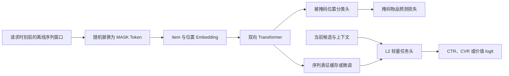

# BERT4Rec

BERT4Rec 以双向 Transformer 和掩码物品预测（masked item prediction）学习序列表征。它能利用一个离线序列窗口内被掩码位置两侧的上下文，适合离线预训练、序列补全或将预训练表示缓存后提供给轻量 L2 任务头的场景。

双向编码不等于允许线上读取未来行为：离线样本的整个窗口仍必须在请求或标签时刻之前可得。若模型负责在线下一步预测，必须重新设计窗口与 mask，或改用因果结构。

## 原始文献

Sun et al., *BERT4Rec: Sequential Recommendation with Bidirectional Encoder Representations from Transformer*, CIKM 2019。该工作将 Cloze 式掩码训练引入序列推荐，并以双向注意力从被掩码 token 周围的行为上下文中预测其物品身份。

## 掩码预训练结构

将部分物品 token 替换为专用 `[MASK]` token，模型以双向编码器预测原物品：

$$
\mathcal{L}_{MIP}=-\sum_{t\in\mathcal{M}}
\log p(i_t\mid \mathcal{S}_{\setminus\mathcal{M}}),
\qquad
\boldsymbol{H}=\operatorname{Transformer}(\boldsymbol{X};\boldsymbol{M}_{padding}).
$$

$\mathcal{M}$ 为被掩码位置集合，注意力只屏蔽 padding，不施加因果方向限制。预训练得到的序列向量可冻结、微调或缓存，并由下游 L2 头结合候选与上下文使用。



## 适用场景与取舍

| 场景 | BERT4Rec 的适合度 | 说明 |
| --- | --- | --- |
| 有大规模历史且可离线预训练、缓存表示 | 高 | 双向上下文能提升通用表示质量。 |
| 必须逐事件在线预测下一物品 | 低 | [SASRec](../SASRec/README.md) 的因果语义更直接。 |
| 需要候选和时间/类型特征端到端融合 | 中 | [BST](../BST/README.md) 通常更贴近 L2 任务。 |
| 序列窗口可能混入标签后的事件 | 不适用 | 必须先修复 point-in-time 样本构造。 |

## 最小可运行示例

[model.py](./model.py) 实现带 padding 的双向 Transformer 和专用 mask token embedding；[train.py](./train.py) 随机替换一个位置并训练该位置的物品分类。

```powershell
python train.py
```

示例中的物品 ID 为 `1..100`，`0` 为 padding，`101` 为 mask token；模型只在被掩码位置计算交叉熵。为保持聚焦，它省略了多位置掩码策略、微调任务头、分布式预训练和缓存刷新。

## 训练、服务与评测检查

- 为 padding、真实物品和 `[MASK]` 分配互不冲突的 ID；mask token 不应出现在真实行为日志中。
- 样本窗口、掩码位置和所有双向上下文均须早于对应标签/请求时刻，避免隐蔽的未来信息泄漏。
- 分别报告掩码预测质量、表示迁移后的 L2 AUC/LogLoss/ECE 与线上业务指标；三者不能互相替代。
- 选择离线缓存还是在线重算时，核验表征新鲜度、存储成本、P99、模型版本和特征词表的一致性。

## 常见误解

- **掩码预测指标提升等于精排收益**：预训练任务与端到端业务目标需要分别验证。
- **双向表征可直接读取未来行为**：在线请求仅能使用决策时刻之前的事件。
- **预训练表示天然不过期**：兴趣迁移、词表升级与事件延迟都会使缓存表示失效。