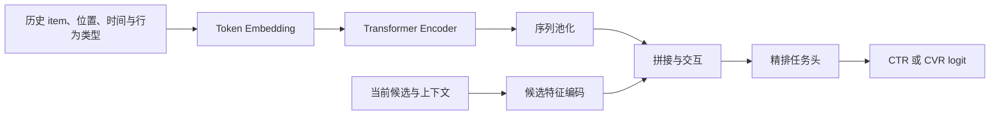

# BST

BST（Behavior Sequence Transformer）将用户历史编码为 Transformer token 序列，并把位置、行为类型、时间间隔及当前候选相关特征融入精排预测。它适合顺序、阶段性意图和上下文共同影响点击或转化的场景；与只做下一物品预测的序列模型相比，BST 的任务头天然面向 L2 候选。

本页与[序列建模总览](../README.md)配套使用。历史必须以请求时刻为边界构造，具体的截断、事件可用性和训练服务一致性约束见[特征工程与训练服务一致性](../../../数据与特征/特征工程与训练服务一致性/README.md)。

## 原始文献

Chen et al., *Behavior Sequence Transformer for E-commerce Recommendation in Alibaba*, CIKM 2019。该工作以 Transformer 建模用户行为序列，并将行为、位置与时间等特征作为序列 token 的组成部分，以支持电商排序场景中的上下文感知建模。

## 结构与掩码

对第 $t$ 个行为 token，可写为：

$$
\boldsymbol{x}_t=\boldsymbol{e}_{item_t}+\boldsymbol{e}_{position_t}+
\boldsymbol{e}_{behavior_t}+\boldsymbol{e}_{time_t},
\qquad
\boldsymbol{H}=\operatorname{Transformer}(\boldsymbol{X};\boldsymbol{M}).
$$

$\boldsymbol{M}$ 是由任务及在线可见事件决定的 attention mask。将池化后的序列表征与候选向量 $\boldsymbol{e}_i$ 拼接后，可由任务头得到 $z_{u,i}$。候选可在任务头融合，也可作为特殊 token 进入编码器；两种方式都要避免把请求之后的行为暴露给模型。



## 适用场景与取舍

| 情况 | BST 的适合度 | 说明 |
| --- | --- | --- |
| 序列、时间和行为类型都影响当前候选的价值 | 高 | 可统一编码多种行为上下文。 |
| 只需轻量的下一步偏好预测 | 中 | [SASRec](../SASRec/README.md) 的因果目标更直接。 |
| 需要离线掩码预训练 | 中 | [BERT4Rec](../BERT4Rec/README.md) 更贴合该训练范式。 |
| 候选相关历史选择是核心残差 | 中 | 可先以 [DIN](../../用户兴趣建模/DIN/README.md) 建立更轻量基线。 |
| 历史很短或序列日志不可靠 | 低 | 应先改善历史质量或使用静态特征。 |

## 最小可运行示例

[model.py](./model.py) 实现位置编码、padding mask 的单层 Transformer 与候选融合任务头；[train.py](./train.py) 使用固定随机种子的历史和候选训练二分类精排样例。

```powershell
python train.py
```

输入为 `history_item_ids [batch_size, history_length]`、`target_item_ids [batch_size]`，其中 `0` 为 padding；输出为未校准的 logit。示例省略行为类型、时间间隔、多层编码器及线上序列服务。

## 训练、服务与评测检查

- 固定 token 组成、位置方向、时间分桶、最大长度、截断方向和空序列回退；训练和线上必须共享这些规则。
- 根据任务选择因果或双向 mask，验证集与线上回放不得使用请求之后的事件。
- 与静态池化、DIN、SASRec 对比时固定候选、任务头、标签、窗口和参数预算，并按序列长度与新鲜度切片报告结果。
- 监控有效序列长度、padding 比例、注意力耗时、显存与 P99；超长序列要有可审计的截断或降级策略。

## 常见误解

- **Transformer 必然比注意力池化更强**：序列长度、顺序信号和服务预算决定合适结构。
- **双向上下文总能在线使用**：线上请求可用的行为范围决定 mask 与编码方式。
- **BST 自动完成候选相关建模**：候选注入位置和融合方式仍是需消融验证的设计选择。