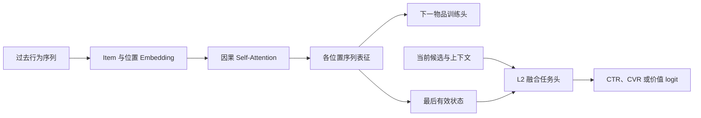

# SASRec

SASRec（Self-Attentive Sequential Recommendation）使用单向 self-attention 编码用户过去行为，以每个位置的历史前缀预测下一物品。因果 mask 使训练与在线逐步推断保持一致，适合顺序、近期偏好和长距离依赖对下一步行为确有贡献的场景。

作为 L2 组件时，SASRec 的序列表征仍需和当前候选、用户、上下文及 L1 来源特征融合；下一物品损失只是训练信号，不是 CTR/CVR 或业务价值的替代品。

## 原始文献

Kang and McAuley, *Self-Attentive Sequential Recommendation*, ICDM 2018。该工作以可堆叠的自注意力块替代循环网络，借助位置编码和因果注意力同时建模最近行为与远距离依赖。

## 因果序列编码

设前缀 token 表示为 $\boldsymbol{X}$，第 $t$ 个位置只能关注 $1\ldots t$：

$$
\boldsymbol{H}=\operatorname{Transformer}(\boldsymbol{X};\boldsymbol{M}_{causal}),
\qquad
M_{t,j}=\begin{cases}0,&j\leq t\\-\infty,&j>t.\end{cases}
$$

每个位置的输出 $\boldsymbol{h}_t$ 可接 softmax 或采样损失预测下一物品 $i_{t+1}$。在线请求中通常读取最后一个有效位置的表示，并将其与 L2 当前候选特征拼接。



## 适用场景与取舍

| 场景 | 首选 | 原因 |
| --- | --- | --- |
| 在线只能使用过去行为，下一步偏好明确 | SASRec | 因果训练和推断语义一致。 |
| 需要直接融合行为类型、时间与候选特征 | [BST](../BST/README.md) | 更适合精排级的丰富 token/融合设计。 |
| 需要双向掩码预训练 | [BERT4Rec](../BERT4Rec/README.md) | 训练目标和编码方向更匹配。 |
| 当前候选相关性强而顺序较弱 | [DIN](../../用户兴趣建模/DIN/README.md) | 候选感知池化成本通常更低。 |

## 最小可运行示例

[model.py](./model.py) 实现位置 embedding、padding mask 和因果 Transformer；[train.py](./train.py) 用确定性递增物品序列训练逐位置下一物品分类。

```powershell
python train.py
```

模型输入为 `sequence_item_ids [batch_size, sequence_length]`，输出为每个位置对物品词表的 logits。示例用全量 softmax 展示目标定义；大词表生产训练通常需要采样、检索或分层 softmax 等替代方案。

## 训练、服务与评测检查

- 因果 mask、padding、位置方向、序列窗口和下一物品标签必须由同一个事件时间切分逻辑生成。
- 负采样分布、去重规则和重复曝光策略会改变下一物品目标；应单独版本化并报告。
- 在最终 L2 中固定任务头和候选集合，验证序列表征对 AUC、LogLoss、ECE、NDCG 及线上收益的增量。
- 对最后有效位置、空序列、超长序列和实时事件延迟建立回放测试和降级策略。

## 常见误解

- **下一物品预测就是完整精排目标**：L2 还需结合候选、上下文和多行为价值。
- **因果 mask 是统一最优选择**：mask 取决于在线可见信息与训练任务定义。
- **更长历史必然更好**：注意力成本和噪声会随窗口增长，应由消融选择长度。