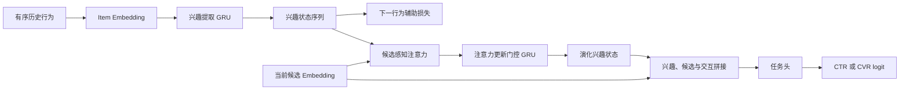

# DIEN

DIEN（Deep Interest Evolution Network）在候选感知兴趣建模之外，进一步将有序行为序列编码为随时间演化的兴趣状态。它适用于用户兴趣会迁移、行为顺序有信息量，且 [DIN](../DIN/README.md) 的候选感知池化已验证但仍有稳定残差的场景。

DIEN 不会修复未来信息泄漏、历史实体不可比较或候选覆盖不足。先满足[用户兴趣建模总览](../README.md)中的序列数据契约，再判断演化结构是否值得其额外训练和服务成本。

## 原始文献

Zhou et al., *Deep Interest Evolution Network for Click-Through Rate Prediction*, AAAI 2019。该工作以兴趣提取层编码序列，以辅助损失约束兴趣状态预测下一行为相关性，并使用注意力更新门控的兴趣演化层产生候选相关状态。

## 结构与目标

兴趣提取层首先将历史 item embedding 输入 GRU：

$$
\boldsymbol{h}_t=\operatorname{GRU}(\boldsymbol{e}_{h_t},\boldsymbol{h}_{t-1}).
$$

辅助损失通过时刻 $t$ 的兴趣状态区分真实下一行为与负采样行为：

$$
\mathcal{L}_{aux}=-\sum_t m_t\left[
\log\sigma(s(\boldsymbol{h}_t,\boldsymbol{e}_{h_{t+1}}))+
\log(1-\sigma(s(\boldsymbol{h}_t,\boldsymbol{e}_{n_{t+1}})))
\right].
$$

其中 $m_t$ 屏蔽没有有效下一行为的位置，$\boldsymbol{e}_{n_{t+1}}$ 是负样本。演化层以候选相关性 $\alpha_t$ 调制更新门，抽象为：

$$
\widetilde{\boldsymbol{z}}_t=\alpha_t\boldsymbol{z}_t,
\qquad
\boldsymbol{g}_t=(1-\widetilde{\boldsymbol{z}}_t)\odot\boldsymbol{g}_{t-1}+
\widetilde{\boldsymbol{z}}_t\odot\widetilde{\boldsymbol{g}}_t.
$$



## DIN 与 DIEN 对比

| 维度 | DIN | DIEN |
| --- | --- | --- |
| 主要历史假设 | 与候选相似的行为更重要 | 兴趣表示还会随行为顺序而演化。 |
| 核心机制 | Activation Unit + 加权池化 | 兴趣提取 GRU + 辅助损失 + 候选感知演化。 |
| 服务成本 | 候选数与历史长度共同影响注意力成本 | 另有序列状态计算、辅助训练与更新复杂度。 |
| 优先条件 | 需要候选相关历史，但顺序证据不足 | DIN 已稳定，长序列或兴趣迁移切片显示额外收益。 |

## 最小可运行示例

[model.py](./model.py) 实现兴趣提取 GRU、候选注意力更新门控与可掩码的辅助下一行为损失；[train.py](./train.py) 使用固定随机种子的历史、候选和负样本训练主任务与辅助任务。

```powershell
python train.py
```

示例中 `history_item_ids` 的形状为 `[batch_size, history_length]`，`0` 为 padding；主模型输出未校准的 logit，辅助损失仅用于训练。为清楚展示核心计算，它不实现行为类型、时间间隔特征、分布式负采样或状态缓存。

## 实施与验证检查

- 定义历史实体、行为类型、事件时间、迟到事件、去重、截断方向和在线更新时延；任何未来事件都不能进入主任务或辅助任务。
- 辅助正负样本应严格来自同一可用时间范围，且掩码只覆盖拥有真实下一行为的相邻位置；检查负样本是否意外等于正样本。
- 分别消融兴趣提取层、辅助损失、演化层和候选注意力；只有端到端提升不足以证明每个部件有价值。
- 以序列长度、兴趣稳定/迁移、冷/热用户、候选类目和历史新鲜度切片报告效果、校准、吞吐与 P99。
- 明确在线状态的重建与回退策略。训练中可顺序处理整段历史，不代表线上可以安全复用过期状态。

## 常见误解

- **DIEN 是 DIN 的无条件替代品**：兴趣演化信号与序列数据质量决定其增益。
- **辅助损失越强越好**：辅助任务需要与主任务共享有效语义且避免未来信息。
- **GRU 自动理解时间间隔**：仅输入行为顺序时，模型并不知道真实间隔；需要时应显式提供时间特征。
- **演化状态可永久缓存**：词表、截断窗口、事件迟到和模型版本变化都会影响状态有效性。