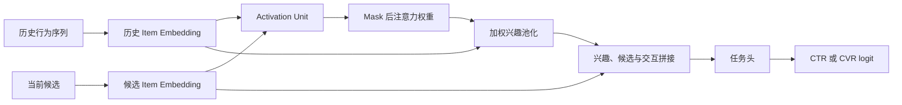

# DIN

DIN（Deep Interest Network）将当前候选作为 query，对用户历史逐条计算相关性，并按候选动态聚合历史兴趣。它解决的不是“用户总体喜欢什么”，而是“面对这个候选时，哪些过去行为是有效证据”。因此更适用于历史实体与候选可比较、候选之间差异显著的 CTR/CVR 精排场景。

本页与[用户兴趣建模总览](../README.md)配套使用。历史必须只包含请求时刻以前在线可见的事件；事件时间、去重、截断、padding 与空历史规则应遵循[特征工程与训练服务一致性](../../../数据与特征/特征工程与训练服务一致性/README.md)。

## 原始文献

Zhou et al., *Deep Interest Network for Click-Through Rate Prediction*, KDD 2018。该工作以局部激活单元（Activation Unit）按当前候选对历史行为加权，避免将所有历史压缩为同一个静态用户向量。

## 候选感知注意力

令当前候选 embedding 为 $\boldsymbol{e}_t$，第 $i$ 个历史行为 embedding 为 $\boldsymbol{e}_{h_i}$。DIN 的局部激活单元可由下列特征计算注意力分数：

$$
a_i = g([\boldsymbol{e}_{h_i},\boldsymbol{e}_t,
\boldsymbol{e}_{h_i}-\boldsymbol{e}_t,
\boldsymbol{e}_{h_i}\odot\boldsymbol{e}_t]),
\qquad
\alpha_i=\frac{\exp(a_i)}{\sum_{j\in\mathcal{H}}\exp(a_j)}.
$$

候选相关兴趣向量为：

$$
\boldsymbol{v}_{interest}=\sum_{i\in\mathcal{H}}\alpha_i\boldsymbol{e}_{h_i}.
$$

其中 $\mathcal{H}$ 排除 padding 位置。实现中必须在 softmax 前屏蔽 padding，否则补零位置会参与注意力归一化，尤其会污染短序列样本。



## 与静态聚合和 DIEN 的取舍

| 方案 | 历史表示 | 优势 | 局限 |
| --- | --- | --- | --- |
| 静态池化 | 均值、求和或固定统计特征 | 计算低、易缓存 | 同一用户对所有候选使用同一兴趣向量。 |
| DIN | 候选感知注意力池化 | 直接建模“此候选与哪些历史相关” | 对历史顺序和兴趣演化表达有限，推理成本随候选数与序列长度增长。 |
| [DIEN](../DIEN/README.md) | GRU 兴趣状态与候选感知演化 | 可利用行为顺序与兴趣变化 | 辅助任务、状态演化和线上更新更复杂。 |

当静态聚合无法区分同一用户对不同候选的兴趣时，可先验证 DIN；只有在顺序、兴趣变化切片上仍有稳定残差时，再评估 DIEN。

## 最小可运行示例

[model.py](./model.py) 实现局部激活单元、padding mask 与候选感知兴趣池化；[train.py](./train.py) 构造固定随机种子的物品历史和当前候选，训练二分类任务。

```powershell
python train.py
```

示例输入为 `history_item_ids [batch_size, history_length]` 与 `target_item_ids [batch_size]`，其中 `0` 为 padding；模型输出未经概率校准的 logit。它不包含真实行为类型、时间间隔、多值特征或线上历史读取。

## 训练、服务与评测检查

- 固化事件定义、时间排序、最大长度、重复行为处理、空序列回退和迟到事件策略；不要在离线回放中混入请求时刻后的行为。
- 训练与服务必须使用相同的 item 词表、embedding ID、截断方向和 padding 语义；请求批处理不应改变注意力 mask。
- 记录候选数、有效历史长度、注意力计算耗时和 P99；多候选批量打分时，复杂度会同时受候选数和历史长度影响。
- 与静态历史池化在短/长历史、冷/热用户、不同候选类目和不同兴趣稳定度切片中比较 AUC、LogLoss、校准及线上效用。
- 对空历史、全 padding、OOV 物品和重复行为建立独立测试；模型应有明确的有限输出与回退行为。

## 常见误解

- **DIN 只要输入历史序列就能提升效果**：历史行为质量、候选相关性和序列截断共同决定收益。
- **注意力权重可直接解释用户意图**：权重是预测模型的内部机制，需要结合实验和业务语义分析。
- **历史越长信息越完整**：过长序列会增加延迟和噪声，应以时间、行为类型和消融确定截断策略。
- **DIN 可以替代候选召回**：它只重排已进入 L2 的候选，不能弥补 L1 未召回的兴趣内容。