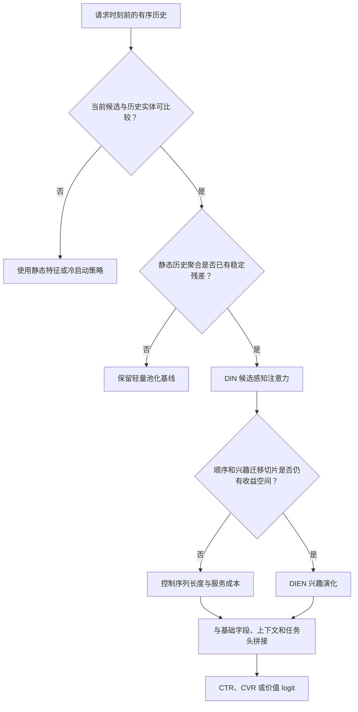

# 用户兴趣建模

用户兴趣建模关注“面对当前候选时，用户历史中的哪些行为最相关”。它区别于单纯字段交叉：历史行为不是静态聚合特征，而是以当前候选为条件的动态兴趣证据。该类模型适合历史丰富、候选差异明显且短中期偏好对点击或消费有显著影响的场景。

历史序列必须按事件时间、行为类型、去重和截断规则构造，且只包含请求时刻前在线可见的行为。相关数据契约见[数据与特征：特征工程与训练服务一致性](../../数据与特征/特征工程与训练服务一致性/README.md)。

## 模型导航与文献来源

| 模型 | 结构要点 | 代表文献 | 主要适用场景 |
| --- | --- | --- | --- |
| [DIN](./DIN/README.md) | 当前候选为 query，对历史行为做候选感知注意力池化 | Zhou et al., *Deep Interest Network for Click-Through Rate Prediction*, KDD 2018 | 当前物品与近期/历史兴趣匹配决定点击的场景 |
| [DIEN](./DIEN/README.md) | 在候选感知基础上用 GRU 建模兴趣演化，并引入辅助损失 | Zhou et al., *Deep Interest Evolution Network for Click-Through Rate Prediction*, AAAI 2019 | 兴趣变化明显、行为顺序与演化有增量价值的场景 |

## DIN 与 DIEN 对比

| 维度 | DIN | DIEN |
| --- | --- | --- |
| 核心假设 | 历史中与当前候选相近的行为更重要 | 兴趣不仅相关，而且会随时间演化 |
| 历史处理 | 候选感知注意力聚合 | GRU 兴趣状态 + 候选感知兴趣演化 |
| 优势 | 结构直观，适合候选差异大的精排 | 能编码行为顺序与兴趣变化 |
| 局限 | 对顺序和长距离动态关系较弱 | 训练、序列更新与辅助任务更复杂 |
| 优先尝试条件 | 有可靠历史但需要控制服务成本 | DIN 已不足且长序列/兴趣变化切片有证据 |

DIN/DIEN 通常输出候选相关兴趣向量，再与用户、物品、上下文和 L1 来源特征拼接输入后续任务头；它们不定义 CTR/CVR 标签，也不自动解决多任务冲突。

## 输入输出与选择路径

兴趣模型的最小输入契约是有序历史 $\mathcal{H}_{u,t}$、当前候选 $i$ 与请求时刻 $t$。它生成候选相关表示 $\boldsymbol{v}_{interest}(u,i,t)$，而非独立于候选的固定用户向量：

$$
\boldsymbol{v}_{interest}(u,i,t)=f_{interest}(\mathcal{H}_{u,t}, i),
\qquad
z_{u,i}=f_{head}(
\boldsymbol{x}_{user},
\boldsymbol{x}_{item},
\boldsymbol{x}_{context},
\boldsymbol{v}_{interest}(u,i,t)).
$$

选择应从可验证的残差出发：先用静态历史池化确认历史总体有价值，再验证 DIN 的候选相关性，最后才以 DIEN 检验顺序和迁移信号。不能仅因有序列字段就跳过前两步。

## 适用与不适用场景

适合：电商、内容流、短视频等当前候选与历史实体具有可比较语义的系统；用户有足够历史，且按候选匹配的兴趣强度能在离线切片上区分收益。

不宜优先使用：冷启动用户、历史极短、行为实体不可比、序列记录质量不稳定，或服务只能提供陈旧历史的场景。这些场景应先加强基础特征、冷启动策略或考虑更合适的场景适配，而不是以 padding 扩充空历史。

## 实施与验证检查

- 定义序列实体、行为类型、时间顺序、重复行为、最大长度、空历史向量和迟到事件规则。
- 记录并比较候选数、历史长度、注意力计算成本和 P99；DIN 的计算量随两者共同增长。
- 在短/长历史、兴趣稳定/变化、冷/热用户和不同候选类目切片中比较 DIN、DIEN 与静态聚合基线。
- 对 DIEN 的辅助任务单独消融，确认没有用到未来行为，也没有因辅助负例改变主任务样本分布。
- 在线同时观察短期点击、消费质量、重复曝光和负反馈，避免只强化短期相似兴趣。

## 推荐迭代顺序

1. 以静态历史统计或池化向量建立可服务基线，并验证时间截断和空历史回退。
2. 固定候选、标签、词表、历史窗口与任务头，只替换为 DIN，检查候选相关兴趣的净收益。
3. 仅在顺序长度、兴趣迁移或历史新鲜度切片显示残差时，引入 DIEN 并独立消融辅助损失。
4. 在相同延迟和资源预算下确认线上收益；若 P99 或状态新鲜度不满足约束，应回退为更轻量的兴趣表示。

## 常见误解

- **有历史序列就应该使用 DIN 或 DIEN**：候选相关性、历史质量和服务预算共同决定价值。
- **注意力权重可以直接解释用户意图**：它是模型内部的表示选择，需要结合业务分析和实验验证。
- **DIEN 一定优于 DIN**：只有兴趣演化信号可靠且额外复杂度可承受时，DIEN 才可能带来净收益。