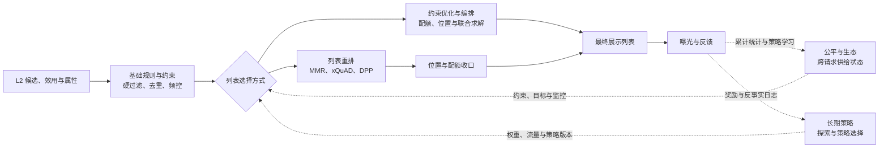

# L3 后处理

L3 后处理位于 L2 精排之后，面向 L2 截断后的候选集合，将逐物品的校准效用、属性与请求时状态转化为可直接展示的有序列表。它通常处理数十到数百个候选，具体数量应由页面长度、候选质量和端到端 deadline 决定。

L2 负责估计候选级的偏好与价值；L3 负责去重、多样性、频控、库存、合规、供给和页面编排等列表级决策。合规、安全、库存和强频控属于不可绕过的硬约束，diversity、trending、探索和生态扶持属于需要与候选效用共同权衡的软目标。

## 内容导航

| 内容 | 说明 |
| --- | --- |
| [后处理系统综述](./后处理系统综述.md) | 输入输出契约、规则分层、去重/多样性/趋势、重排算法、性能与降级、评测和研究脉络。 |
| [基础规则与约束](./基础规则与约束/README.md) | 去重、频控、库存和合规等必须先定义故障语义的基础能力。 |
| [列表重排](./列表重排/README.md) | MMR、意图覆盖和 DPP 等相关性-多样性权衡方法。 |
| [约束优化与编排](./约束优化与编排/README.md) | 贪心配额、位置编排与复杂约束求解。 |
| [公平与生态](./公平与生态/README.md) | 曝光公平、供给集中度和长尾扶持。 |
| [长期策略](./长期策略/README.md) | Contextual Bandit、Slate 决策与长期价值。 |
| [L3 后处理文献](../../文献/L3后处理/README.md) | 列表重排、约束与编排、公平与供给生态、Slate 决策的论文索引，并交叉链接 Bandit 与反事实评估文献。 |

## 由顶向下的内容架构

本目录按**问题所有权**展开，而不是按代码调用栈堆叠目录。阅读时先建立系统模型，再进入一次请求的必经链路、列表求解方法和跨请求策略；运行时的实际顺序见下一节。

| 内容层 | 回答的问题 | 对应内容 |
| --- | --- | --- |
| 系统地图 | L3 与 L2 的边界是什么，哪些模块在一次请求中必经 | [后处理系统综述](./后处理系统综述.md) |
| 必经链路 | 哪些候选可以进入最终列表 | [基础规则与约束](./基础规则与约束/README.md) |
| 当前列表求解 | 在可行候选中如何平衡效用、多样性、配额和位置 | [列表重排](./列表重排/README.md)、[约束优化与编排](./约束优化与编排/README.md) |
| 跨请求策略 | 如何把供给健康、探索和长期价值注入当前求解 | [公平与生态](./公平与生态/README.md)、[长期策略](./长期策略/README.md) |
| 证据与研究 | 如何回放、评测并追溯理论方法 | [后处理系统综述](./后处理系统综述.md) 的评测章节、[L3 后处理文献](../../文献/L3后处理/README.md) |

保持上述五个问题域直接位于 L3 根目录，是有意的设计：它们是平行的知识入口，使用 README 的关系图表达依赖，避免为了表示一条逻辑链路而引入额外的空包装目录。

## 运行时关系

这些目录**不是六个固定串行步骤**。L3 有一条所有请求都必须经过的安全主链路，也有按业务复杂度选择或组合的优化方法；公平与长期目标则跨越多次请求，向主链路提供约束、权重或策略，而不是简单地排在列表末尾再执行一次。



### 主链路、求解方法与策略层

| 目录 | 在一次请求中的位置 | 主要优化或保障什么 | 与其他目录的关系 |
| --- | --- | --- | --- |
| [基础规则与约束](./基础规则与约束/README.md) | **必经的前置串行阶段** | 展示资格、去重、频控、库存与合规；优先保证“不该展示的绝不展示” | 为所有后续选择方法缩小到可行候选集。硬约束在降级时仍必须执行。 |
| [列表重排](./列表重排/README.md) | 默认的候选选择方法 | 在可行候选中平衡 L2 效用、多样性、新颖性和意图覆盖 | MMR、xQuAD、DPP 是该阶段的不同算法；其结果可再交给位置/配额编排收口。 |
| [约束优化与编排](./约束优化与编排/README.md) | 可位于重排之后，也可与重排联合求解 | 类目/作者/商家配额、位置、模块和运营编排 | 简单场景中用于对重排结果补位和收口；复杂场景中可直接替代“先重排后编排”，同时优化相关性和约束。 |
| [公平与生态](./公平与生态/README.md) | **跨请求的横切目标层** | 供给集中度、长尾覆盖、主体曝光公平 | 将累计曝光状态、配额或惩罚项注入重排/求解器；不应单独排在最后改变已完成的列表。 |
| [长期策略](./长期策略/README.md) | **跨请求的策略层** | 受控探索、长期留存和延迟收益 | 决定本次使用的权重、探索预算或策略版本，再由主链路执行；依赖曝光反馈持续更新。 |

### 两种常见落地方式

| 方式 | 适用场景 | 请求内关系 |
| --- | --- | --- |
| 分阶段流水线 | 规则清晰、时延敏感、需要强可解释性 | 基础规则与约束 -> 列表重排 -> 约束优化与编排 -> 最终列表。公平和长期策略提供配置与状态。 |
| 联合优化 | 配额、位置和多样性强耦合，且候选规模与算力可控 | 基础规则与约束 -> 联合求解器 -> 最终列表。联合求解器可吸收重排、编排、公平目标；仍需可行解优先和贪心回退。 |

因此，目录按“问题所有权”划分，而非强迫所有系统采用同一种执行顺序。入门或多数生产系统应先实现分阶段流水线；只有当“先重排再修补”持续带来明显损失时，再引入联合优化。

## 模块边界

| 阶段 | 核心问题 | 输入 | 输出 |
| --- | --- | --- | --- |
| L2 精排 | 每个候选对当前请求的预期价值是多少 | L1 候选与丰富特征 | 校准预测、候选效用和候选属性 |
| L3 后处理 | 哪些候选以什么顺序共同展示 | L2 输出、页面约束、实时状态和策略 | 最终有序列表、位置、调整原因和策略版本 |
| 客户端/反馈 | 哪些结果真正可见并产生反馈 | L3 最终列表与页面状态 | 渲染、曝光、交互与归因日志 |

## 文件架构

```text
L3后处理/
├── README.md
├── 后处理系统综述.md
├── 基础规则与约束/
│   ├── README.md
│   ├── 去重与实体归并/README.md
│   ├── 频控与疲劳控制/README.md
│   └── 库存与合规过滤/README.md
├── 列表重排/
│   ├── README.md
│   ├── MMR/{README.md, rerank.py, example.py}
│   ├── 意图覆盖与xQuAD/README.md
│   └── DPP与集合建模/README.md
├── 约束优化与编排/
│   ├── README.md
│   ├── 贪心配额/README.md
│   └── 整数规划与拉格朗日方法/README.md
├── 公平与生态/
│   ├── README.md
│   └── 曝光公平与长尾扶持/README.md
└── 长期策略/
    ├── README.md
    ├── Contextual Bandit/{README.md, epsilon_greedy.py, example.py}
    └── Slate与强化学习/README.md
```

`列表重排/MMR/` 提供现有的可运行样例；其余入口页先固化问题边界、输入状态和评测要求，后续再按专题补充算法实现与实验。该文件树描述的是内容展开层级，不要求运行时依照树中目录顺序调用。

## 专题约定

每个专题应说明输入状态、硬/软约束、目标函数、复杂度、超时回退、日志字段和离线/在线指标。跨请求状态必须标明存储粒度、过期语义与读失败处理；任何策略都不得绕过合规、安全、库存和强频控约束。
## 推荐阅读顺序

先读 [后处理系统综述](./后处理系统综述.md) 建立 L2/L3 边界和规则优先级；随后阅读[基础规则与约束](./基础规则与约束/README.md)，明确任何求解方法都不能绕过的安全边界。再运行 [MMR](./列表重排/MMR/README.md) 理解默认重排路径，并根据配额/位置耦合程度选择[约束优化与编排](./约束优化与编排/README.md)。最后阅读[公平与生态](./公平与生态/README.md)与[长期策略](./长期策略/README.md)，将跨请求目标安全地接入主链路。