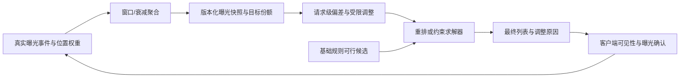

# 公平与生态

公平与生态策略协调用户效用、供给覆盖和长期平台健康。它不在基础规则之后“再改一次已完成列表”，而是将跨用户、跨时间窗的累计曝光状态转化为[列表重排](../列表重排/README.md)或[约束优化与编排](../约束优化与编排/README.md)可消费的软目标、预算或配额。

本模块必须区分一次请求的局部选择与跨请求累计目标，也必须区分“下发给客户端的展示机会”与“客户端确认的真实曝光”。商家、作者、类目等保护对象、统计窗口、归因事件和目标份额均须版本化；合规、安全、库存和强频控仍由[基础规则与约束](../基础规则与约束/README.md)定义，不能被公平目标抵消。

## 1. 输入、输出与状态契约

| 输入/状态 | 作用 | 必须明确的语义 |
| --- | --- | --- |
| `entity_key`、`groups` | 候选所属作者、商家、类目或供给簇 | 多组归属、未知组和分组版本 |
| `utility`、`input_index` | 用户效用与稳定回放顺序 | 是否已完成跨组校准 |
| `exposure_snapshot` | 窗口内的加权真实曝光或获批近似值 | 统计窗、衰减、刷新时间、状态版本 |
| `target_share`、`policy_version` | 各组目标份额、上限或软预算 | 目标来源、适用人群与变更历史 |
| `visibility_weights` | 位置或模块可见性权重 | 是预估可见性还是真实曝光归因 |

策略输出应为每个候选的公平调整、命中组、输入快照版本和选择原因，以及请求级 `policy_mode`（正常、缓存、neutral、fallback）。它不能直接输出“公平成功”：长期目标只可由累计统计和线上实验判断。

## 2. 目标、可行域与跨请求闭环

令 $E_g(t)$ 为组 $g$ 在统计窗口内的加权真实曝光，$q_g(t)=E_g(t)/\sum_hE_h(t)$ 为实际份额，$\pi_g$ 为版本化目标份额。一个可解释的偏差为：

$$
\delta_g(t)=\pi_g-q_g(t),
\qquad
b_g=\operatorname{clip}(\eta\delta_g,-b_{max},b_{max}).
$$

请求内可将 $b_g$ 作为受限的软调整，例如 $\tilde u_i=u_i+b_{g(i)}$，再由重排或编排器在原始可行域内选择。$\eta$、$b_{max}$ 和目标份额必须按用户、供给质量和风险切片评估；不能把低质量或不合格候选仅因“欠曝”而强行展示。

曝光事件必须使用展示请求 ID、位置和幂等键去重；仅把服务端下发当作真实曝光会在渲染失败、折叠模块和客户端中断时系统性偏置统计。

## 3. 复杂度、状态访问与 deadline

令 $N$ 为请求候选数，$R$ 为每候选关联的公平分组数，$G_a$ 为本请求激活分组数。利用已物化的组调整时，本地打分与排序前准备为 $O(NR)$，增量状态为 $O(G_a)$；若对所有候选逐一远程读取累计曝光，会把请求放大为 $O(NR)$ 次 RPC，这是不可接受的。

应先从候选分组去重，批量读取 $G_a$ 个状态并限制并发；状态快照可按滑动窗口、指数衰减或时间桶保存，空间通常与受监控分组数和窗口桶数相关。将状态读取、调整计算、列表求解和曝光回写分开计时；回写应基于实际曝光异步、幂等完成，不阻塞当前列表响应。

## 4. 降级、评测与治理

- 快照超时或过期时，按获批策略使用明确标记的缓存、neutral 调整或相关性基线；禁止把未知状态解释为“某组欠曝”。
- 监控份额偏差、加权 HHI、长尾覆盖、组内用户效用、负反馈、状态新鲜度、回写延迟、回退率和跨组校准误差。
- 离线回放与线上实验都要同时报告用户效用和供给指标，并按用户/主体切片检查改善是否以某一群体的系统性损失为代价。
- 目标份额、受保护对象、事件口径和降级规则由业务、风控与治理共同审阅；公平策略不是模型自行决定的价值判断。

## 专题导航

| 专题 | 关注问题 |
| --- | --- |
| [曝光公平与长尾扶持](./曝光公平与长尾扶持/README.md) | 如何定义曝光-价值对齐、集中度和长尾供给，并把累计偏差安全注入当前列表。 |