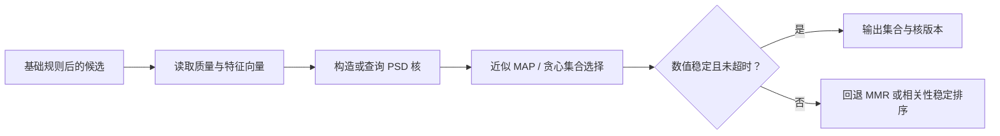

# DPP 与集合建模

Determinantal Point Process（DPP）通过候选核矩阵同时表达单项质量与候选间的互斥性。与 MMR 的逐项最大相似度惩罚不同，DPP 的集合分数由子核行列式给出，因而可直接刻画“整组候选是否既有质量又覆盖不同方向”。它适合需要集合级多样性、候选池可控且核特征可靠的场景。

DPP 是[列表重排](../README.md)的软目标方法，只能在基础规则定义的可行集合上求解。它不是实体去重、频控或配额编排的替代品；这些强规则仍应由[基础规则与约束](../../基础规则与约束/README.md)或[约束优化与编排](../../约束优化与编排/README.md)负责。

## 1. 核矩阵与集合目标

令 $L$ 为正半定的候选核矩阵，$S$ 为目标集合，则 DPP 的集合权重满足：

$$
P(S)\propto\det(L_S),
$$

其中 $L_S$ 是由集合 $S$ 对应行列组成的子矩阵。一个常用构造是：

$$
L_{ij}=q_i q_j \boldsymbol{\phi}_i^\top\boldsymbol{\phi}_j,
$$

其中 $q_i>0$ 表示候选质量，$\boldsymbol{\phi}_i$ 是归一化特征向量。该形式是质量缩放后的 Gram 矩阵，天然正半定；不要把任意相似度表直接作为 $L$，否则会出现负特征值、数值不稳定或不符合预期的集合偏好。

| 输入 | 作用 | 要求 |
| --- | --- | --- |
| `item_id`、`input_index` | 稳定选择和回放 | 同行列式时固定 tie-break |
| `quality` | 候选质量 $q_i$ | 与 L2 效用或质量融合规则版本化 |
| `vector` | 构造 Gram 核的特征 $\boldsymbol{\phi}_i$ | 维度一致、归一化和缺失语义明确 |
| `top_k`、候选池上限 | 目标集合大小与算力预算 | deadline 内必须有回退 |



## 2. 核设计与规模控制

质量和相似度共同决定列表行为：提高 $q_i$ 会偏向高效用候选，提高相似性会让相近候选同时出现的行列式降低。质量不应简单复用未校准的多任务 logit；应明确它是 L2 效用、内容质量、时效还是它们的版本化融合。

| 核来源 | 优势 | 主要风险 |
| --- | --- | --- |
| 内容 embedding Gram 核 | 可表达语义互补 | 模型漂移、向量零值和跨域不可比 |
| 主题/类目特征核 | 可解释、成本低 | 粒度过粗会误伤同主题的合理选择 |
| 行为/共现特征核 | 可贴近替代关系 | 热门偏置、反馈回路和冷启动缺失 |

完整 MAP 推断一般代价较高。线上通常先用 L2 截断候选池，再用贪心近似、低秩分解或专用线性代数库；应将候选池大小、特征维度、核构造耗时和数值异常率作为硬监控指标。

## 3. 复杂度与请求时实现

令 $N$ 为候选数、$K$ 为目标列表长度、$d$ 为原始向量维度、$r$ 为低秩特征维度。DPP 的成本主要由核构造和集合选择共同决定：

| 实现方式 | 请求时复杂度 | 增量空间 | 适用边界 |
| --- | --- | --- | --- |
| 本页教学脚本：逐候选重算行列式 | $O\left(N(K^4+K^3d)\right)$ | $O(K^2)$ | 仅小候选池回放；不得直接上线。 |
| 完整核 + Cholesky 贪心 MAP | 核构造 $O(N^2d)$，选择约 $O(NK^2)$ | $O(N^2)$ | $N$ 很小、内存与数值预算明确时。 |
| 低秩 $r$ 维近似 | 特征投影约 $O(Ndr)$，选择依实现约 $O(NKr)$ | $O(Nr)$ | 推荐的线上研究起点，仍需基准测试与数值验证。 |

完整核的 $O(N^2)$ 内存通常首先触及 L3 的容量和 GC 风险，因此“先把 $N$ 截断到足够小”是 DPP 的前提，不是可选优化。将核构造放到离线并不自动消除请求时成本：候选集合和质量 $q_i$ 会随请求变化，仍需说明如何读取、裁剪或近似组合。

## 4. 最小可运行示例

[dpp.py](./dpp.py) 用标准库构造质量加权 Gram 核，并在小候选池上以“最大子核行列式”做确定性贪心选择；[example.py](./example.py) 展示两个相近科技候选与一个正交生活候选中，第二个位置为何偏向生活候选。

```powershell
python example.py
```

示例的行列式求解只用于教学和小规模回放，具体量级见上一节。生产实现应使用经过数值验证的矩阵库和近似算法，且在非正定、NaN、超时或候选不足时执行明确回退。

## 5. 服务、降级与评测

- 记录质量融合版本、特征/核版本、候选池大小、每步增量行列式、数值裁剪、选择结果和回退原因。
- 对核构造、矩阵分解和选择循环分别设置时间/内存预算；任何一段超过预算即回退，不等待完整核计算结束。
- 对核进行离线正半定检查、条件数/特征值监控与输入向量质量检查；不能仅在出现异常时把 NaN 静默替换为零。
- 核构造或求解超过预算时，优先回退到已验证的 MMR 或相关性稳定排序；回退路径不得放宽基础约束。
- 离线比较 NDCG、集合覆盖、列表内相似度、长尾覆盖、核异常率与运行成本；线上观察用户效用、负反馈、P99 和回退率。

## 常见误解

- **DPP 必然比 MMR 更优**：只有核能准确表达质量和相似性、且预算可承受时，集合建模才可能有净收益。
- **任意相似度矩阵都可用于 DPP**：核应满足正半定等数值条件，否则行列式没有可靠的概率/质量解释。
- **行列式越大就是用户越喜欢**：它是列表级代理目标，仍需要与真实用户效用和线上实验对齐。