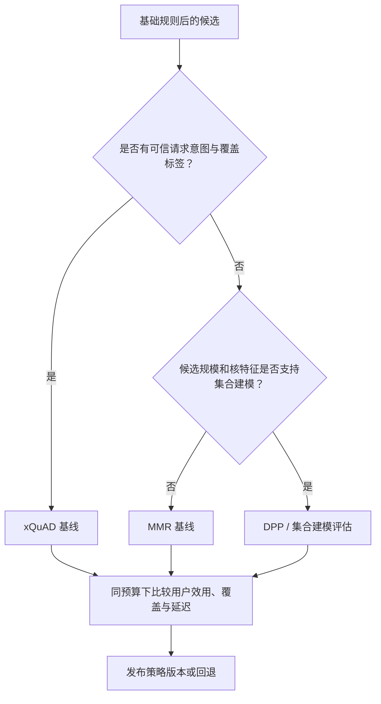
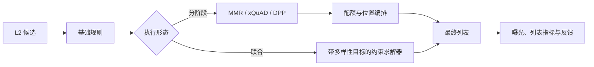

# 列表重排

列表重排在[基础规则与约束](../基础规则与约束/README.md)筛出的可行候选中，做列表级而非候选级的选择：在不显著损失 L2 效用的前提下，降低语义重复、覆盖不同意图或主题，并在必要时提高新颖性和长尾覆盖。它不改变候选是否合规可展示，也不负责跨请求的累计曝光目标。

## 1. 输入、输出与边界

列表重排接收通过强规则的候选集合 $\mathcal{F}_{basic}$，每个候选至少包含 L2 校准效用、稳定 ID/原始位置以及方法所需的相似度、向量或意图特征。输出应是最终候选顺序及逐位置的决策证据：

| 字段 | 含义 |
| --- | --- |
| `item_id`、`input_index` | 用于稳定排序、日志和离线回放 |
| `l2_utility` | 候选级相关性/价值的版本化输入 |
| `rerank_score`、`score_components` | 每一位置的重排分与效用/多样性分解 |
| `feature_version`、`strategy_version` | 相似度、意图、核与参数版本 |
| `fallback_reason` | 特征缺失、数值异常或超时后的降级原因 |

通用目标可写为：

$$
\max_{S,\,|S|=K}
\sum_{i\in S}u_i+\alpha D(S)+\beta C(S),
\qquad S\subseteq\mathcal{F}_{basic},
$$

其中 $u_i$ 为 L2 效用，$D(S)$ 为冗余惩罚或多样性收益，$C(S)$ 为意图覆盖收益。不同方法只是对 $D$ 与 $C$ 的建模不同；硬约束始终由 $\mathcal{F}_{basic}$ 保证。

## 2. 方法导航与选择路径

| 方法 | 核心信号 | 适用问题 | 最小示例 |
| --- | --- | --- | --- |
| [MMR](./MMR/README.md) | 候选效用 + 与已选项的最大相似度 | 需要低成本地抑制语义/主题冗余 | 二维向量贪心重排 |
| [意图覆盖与 xQuAD](./意图覆盖与xQuAD/README.md) | 请求意图权重 + 候选意图覆盖 | 已知且可信的子意图/主题覆盖 | 未覆盖意图收益贪心 |
| [DPP 与集合建模](./DPP与集合建模/README.md) | 质量加权正半定核 | 需要集合级质量与互斥性 | 小候选池行列式贪心 |

先建立相关性稳定排序与 MMR 基线，再在标签质量和离线残差有证据时引入 xQuAD 或 DPP。算法名称不应代替问题诊断：没有可靠意图时 xQuAD 会放大噪声，没有可靠核与预算时 DPP 会增加风险而非收益。

## 3. 复杂度、内存与请求预算

以下记号用于比较请求时的**增量计算**：$N$ 为通过基础规则后进入重排的候选数，$K$ 为输出列表长度，$d$ 为向量维度，$m$ 为活跃意图数。特征读取、序列化和 RPC 排队不包含在 Big-O 中，却同样必须计入 P99；表中的空间不重复计算上游已持有的候选字段。

| 方法 | 推荐请求时实现 | 时间复杂度 | 增量空间 | 延迟控制要点 |
| --- | --- | --- | --- | --- |
| MMR | 维护每个剩余候选的最大已选相似度 | $O(NKd)$ | $O(N)$ | 限制 $N$；按需算相似度，避免默认构造 $N^2$ 矩阵 |
| xQuAD | 维护每个意图的未覆盖度 | $O(NKm)$ | $O(m)$ | 截断低权重意图，限制 $m$ 和候选意图稀疏度 |
| DPP | 低秩/Cholesky 贪心近似 | 核构造 $O(N^2d)$，选择约 $O(NK^2)$ | 完整核 $O(N^2)$ | 仅用于严格截断候选池；大 $N$ 用低秩近似或回退 |

这些量级描述的是单请求算法成本，而不是容量规划承诺。实际发布应为“候选截断、特征读取、重排、序列化”分别设定预算，并在任一阶段触线时保留已满足强规则的稳定回退列表。对大多数高 QPS 场景，MMR 或相关性稳定排序应是默认预算基线，xQuAD/DPP 只在信号与收益能覆盖额外成本时启用。

## 4. 在线执行、降级与组合

列表重排可作为独立阶段，也可与[约束优化与编排](../约束优化与编排/README.md)联合求解。前者易于灰度和解释，后者适合位置配额、运营承诺等约束与多样性目标强耦合的场景；无论采用哪种形态，先通过强规则是不可变边界。

特征服务超时、意图标签缺失、核数值异常或计算超过 deadline 时，应回退到版本化的相关性稳定排序或经验证的轻量 MMR，并写入 `fallback_reason`。回退不允许重新引入被基础规则过滤的候选。

## 5. 评测与验收

- 离线同时评估候选效用/NDCG、列表内相似度、意图/类目覆盖、长尾覆盖、候选不足和延迟；只优化重复率会掩盖相关性损失。
- 按请求长度、兴趣集中度、冷/热用户、类目、特征缺失和候选规模切片；多样性收益通常只在部分切片显著。
- 记录每个位置的输入效用、重排分解、特征/参数版本、选择原因和回退路径，使策略变更可复盘。
- 在线联合观察点击、消费质量、负反馈、会话深度、P99、回退率与系统性偏置；短期点击提升不足以证明列表体验改善。

## 常见误解

- **重排就是去重**：去重处理同一实体排他性；重排处理不同候选间的软偏好折中。
- **多样性指标越高越好**：必须在用户效用、任务完成和延迟预算内优化。
- **把三种算法串行叠加一定更强**：它们可能重复惩罚同一信号，应通过联合目标或消融实验决定组合方式。