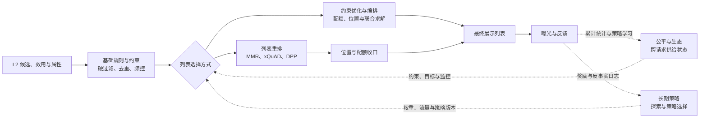

# 后处理系统综述

L3 后处理是将 L2 的**候选级预测与效用**转化为**可直接展示的列表**的决策层。它通常处理 L2 截断后的数十到数百个候选；确切规模取决于页面位置数、候选质量、时延预算和规则复杂度，不能把“数百”当作固定架构约束。

L2 回答“当前用户对单个候选的预期价值是多少”，L3 回答“哪些候选应以什么顺序共同出现”。因此，L3 不只是 rule-based 修补层：它由**必经执行链路、可选或可组合的列表求解器、跨请求策略层**共同组成。前者保证展示安全和一致性，求解器决定当前列表，策略层则在多次请求上提供目标、状态和学习信号。

## 1. 输入、输出与职责边界

| 边界 | 输入或输出 | 责任 |
| --- | --- | --- |
| L2 -> L3 | 候选 ID、候选顺序、校准后的效用与任务分、置信度、召回来源、物品属性、模型和融合版本 | 保留候选级价值与证据，不能只交付一个不可解释的总分 |
| L3 内部 | 用户/会话状态、页面布局、实时库存、合规状态、频控状态、实验与策略版本 | 依据请求时可见事实生成最终列表 |
| L3 -> 曝光 | 最终位置、展示状态、调整原因、命中规则、策略版本、降级路径 | 为渲染、归因、回放和故障排查提供证据 |

L3 可以丢弃不合格候选、替换候选或改变位置，但不应伪装成重新预测用户偏好。CTR、CVR、时长等候选级预测、概率校准和效用融合主要属于 L2；L3 消费这些信号并施加列表级决策。若 L3 调整显著改变实际曝光，应在训练和实验分析中单独记录，不能把规则造成的未曝光直接解释为用户负反馈。

## 2. 由顶向下的系统模型

目录按问题所有权组织，**不等于**每个目录都在单次请求中按文件树顺序执行：

| 系统层 | 本次请求中的作用 | 解决的问题 | 对应目录 |
| --- | --- | --- | --- |
| 必经执行链路 | 先执行 | 资格、合规、库存、频控、去重和实体归并 | [基础规则与约束](./基础规则与约束/README.md) |
| 列表求解器 | 在可行候选中选择一种或组合多种方法 | 相关性、多样性、新颖性、意图覆盖、配额和位置 | [列表重排](./列表重排/README.md)、[约束优化与编排](./约束优化与编排/README.md) |
| 跨请求策略层 | 在请求前提供状态/策略，在请求后消费反馈 | 曝光公平、长尾供给、探索、长期收益 | [公平与生态](./公平与生态/README.md)、[长期策略](./长期策略/README.md) |
| 治理与证据 | 贯穿全程 | 版本、命中原因、回放、指标与实验 | 本文第 5 节及 [L3 后处理文献](../../文献/L3后处理/README.md) |

### 2.1 两种请求内实现

| 实现方式 | 请求内流程 | 适用条件 |
| --- | --- | --- |
| 分阶段流水线 | 基础规则与约束 -> 列表重排 -> 约束优化与编排 -> 最终列表 | 规则清晰、时延敏感、需要强可解释性；多数系统的起点 |
| 联合优化 | 基础规则与约束 -> 联合求解器 -> 最终列表 | 多样性、配额和位置强耦合，且候选规模、求解时间和回退都可控 |

在分阶段流水线中，“列表重排”先给出偏好与多样性兼顾的候选顺序，“约束优化与编排”再做位置、模块和配额收口。在联合优化中，两者不再是前后两个步骤，而是由同一个求解器同时处理。无论采用哪种方式，公平与长期策略都不是最后再执行的附加步骤，而是向求解器注入状态、约束、权重或探索预算。

## 3. 必经执行链路：先定义可展示的候选

规则应按照不可违反性和可补偿性分层，而不是把所有条件堆进一个加权分数：

| 必经能力 | 典型内容 | 处理原则 |
| --- | --- | --- |
| 硬约束 | 合规与安全、地域/年龄限制、下架和库存、用户屏蔽、强频控 | 不满足即过滤；超时或依赖异常时取更保守的结果 |
| 一致性 | 同 item、同创作者、同商品族或近重复内容 | 定义实体键和保留规则，记录被替换候选及原因 |
| 状态控制 | 用户-实体-时间窗频控、会话疲劳、屏蔽状态 | 请求时读取可见状态；状态缺失或不确定时不能默认放行 |

### 3.1 基础规则与约束

- **库存与合规过滤**：库存、地域、年龄和安全状态决定候选是否可展示；依赖不确定时采取保守结果。
- **频控与疲劳控制**：使用用户-实体-时间窗状态限制重复曝光，明确状态延迟、跨端一致性和“读不到状态时更保守”的故障语义。
- **去重与实体归并**：按商品、内容、创作者、素材簇或语义相似度归并；选择保留候选时通常比较资格、L2 效用、质量和时效，而非只比较 ID。

这些能力在 [基础规则与约束](./基础规则与约束/README.md) 中按去重、频控、库存与合规继续拆分。它们构成所有后续方法的输入边界：不合格候选不会因 MMR、配额、探索或公平目标而重新进入结果列表。

## 4. 列表求解器：决定本次列表

L3 的优化目标通常可写为：

$$
\max_{S,\,|S|=K}\ \sum_{i\in S} u_i
+ \alpha\,D(S)
+ \beta\,N(S)
+ \gamma\,E(S)
\quad \text{s.t.}\quad S\in\mathcal F,
$$

其中 $u_i$ 是 L2 提供的候选级效用，$D(S)$、$N(S)$、$E(S)$ 分别表示多样性、新颖性和生态目标，$\mathcal F$ 表示合规、库存、频控和配额等可行集合。权重应按场景和实验版本管理；硬约束应写入 $\mathcal F$，而非靠一个很大的惩罚项“尽量满足”。

trending、运营保量和探索不是一个额外的必经目录：它们是施加到求解器上的**策略表达**。趋势可作为时效敏感的候选效用项，也可作为受上限约束的配额或位置规则；运营保量通常由编排求解器处理；探索预算由长期策略层下发。三者都必须在基础规则定义的可行集合内生效。

| 方法族 | 解决的问题 | 与目录的对应关系 | 性能与工程要点 |
| --- | --- | --- | --- | 
| MMR | 用相关性和相似度平衡逐步选择 | [列表重排/MMR](./列表重排/MMR/README.md) | 朴素实现约为 $O(nK^2)$；预计算或缓存相似度、限制 $K$ 与候选数可控制延迟 |
| xQuAD / 意图覆盖 | 覆盖显式意图或子主题 | [列表重排/意图覆盖与 xQuAD](./列表重排/意图覆盖与xQuAD/README.md) | 依赖意图定义质量；适合多意图检索和内容推荐 |
| DPP | 对整组候选建模互斥与质量 | [列表重排/DPP 与集合建模](./列表重排/DPP与集合建模/README.md) | 核矩阵构建和行列式计算较重，常用于较小候选集或近似算法 |
| 贪心配额 | 低时延地满足位置与计数约束 | [约束优化与编排/贪心配额](./约束优化与编排/贪心配额/README.md) | 通常为 $O(nK)$；维护类目/作者计数并保证稳定排序 |
| 整数规划或拉格朗日方法 | 多个硬配额与软目标共同存在 | [约束优化与编排/整数规划与拉格朗日方法](./约束优化与编排/整数规划与拉格朗日方法/README.md) | 限定规模和求解时间，优先返回可行解并配置贪心回退 |

MMR 是最常见的低成本起点。每一步选择与已选集合不相似、但仍具高效用的候选：

$$
i^*=\arg\max_{i\notin S}
\left[\lambda u_i-(1-\lambda)\max_{j\in S}\operatorname{sim}(i,j)\right].
$$

它适合候选量级有限且相似度可靠的场景，但不能自动满足作者上限、库存、频控或跨列表公平。生产实现应在 MMR 前后显式执行约束检查，并为相似度缺失、候选不足和 deadline 耗尽定义确定性的回退顺序。

### 4.1 时延、回退与稳定性

L3 的预算来自端到端 deadline 中 L1、L2、网关和客户端耗时之后的剩余部分。常用优化顺序为：先用硬过滤减少候选；缓存静态实体键和相似度；采用增量计数与 Top-K 堆；对复杂算法限定候选数与最大迭代；最后才考虑近似或更复杂的求解器。

每条请求应保留 `strategy_version`、输入候选版本、命中规则、调整前后位置和 `execution_path`。超时、状态服务不可用或求解失败时，应按预先版本化的保守路径返回：继续执行不可绕过的安全/合规约束，停用非必要软优化，并标记降级原因；不能在未知状态下放宽频控或合规。

## 5. 跨请求策略、评测与治理

公平与长期目标无法只靠单次列表判断。前者将主体曝光、供给集中度和长尾覆盖等累计状态转化为配额或惩罚项，详见[公平与生态](./公平与生态/README.md)；后者根据受控探索、奖励和反事实日志选择策略版本或权重，详见[长期策略](./长期策略/README.md)。两者都通过列表求解器影响当前请求，并通过曝光反馈更新，而不是绕过主链路直接修改最终列表。

### 5.1 评测与实验

后处理直接改变最终曝光列表，评价时要把列表目标、约束执行和相关性损失放在一起观察。

| 维度 | 代表指标与检查项 |
| --- | --- |
| 列表质量 | 重复率、类目/主题覆盖、ILD、多样性、新颖性和惊喜度 |
| 约束执行 | 硬约束满足率、规则触发率、频控命中率和违规漏放率 |
| 供给生态 | 曝光集中度、长尾曝光、商家/作者覆盖和群体曝光公平性 |
| 效果代价 | 重排前后 NDCG、相关性分数损失、候选丢失率和列表稳定性 |
| 在线性能 | 重排 P95/P99、超时率、回退率和约束求解失败率 |
| 业务护栏 | CTR、时长、转化、负反馈、投诉和长期留存 |

离线评测应复现线上候选顺序、可用库存、硬约束和策略版本，并给出相关性与多样性等目标的 Pareto 曲线，而不是只汇报单个加权总分。线上实验除 CTR/CVR 外，还应监控违规漏放、频控失效、供给集中度、负反馈和延迟；当策略影响跨请求状态时，实验单元和观察窗口也要覆盖这种干扰。

## 6. 研究脉络与选型

L3 的经典研究从相关性-多样性权衡，逐步扩展到意图覆盖、集合建模、公平曝光和长期 slate 决策：

| 方向 | 代表问题 | 起点 |
| --- | --- | --- |
| 多样性重排 | 相关性与相似度惩罚 | MMR，Carbonell and Goldstein, 1998 |
| 意图覆盖与集合建模 | 多意图覆盖、物品间互斥 | xQuAD；DPP，Kulesza and Taskar, 2012 |
| 公平排序与曝光 | Top-K 保护、价值与曝光对齐 | FA*IR；Singh and Joachims, 2018 |
| 长期列表决策 | 位置交互、延迟反馈、长期收益 | SlateQ，Ie et al., 2019 |
| 现代方向 | 可微排序、因果/反事实评估、安全 RL、生成式重排 | 需要先建立可靠日志、护栏和离线评估，再引入复杂策略 |

论文入口见 [L3 后处理文献](../../文献/L3后处理/README.md)。实际选型通常从“可审计的硬过滤 + 去重 + 贪心配额或 MMR”开始；只有在稳定日志表明列表联动或长期收益是主要瓶颈时，才逐步引入约束求解、学习重排或序列决策。

## 7. 常见误解

- **“L3 只需要规则，所以不必评测”**：任何改变展示位置的规则都会改变曝光分布和反馈，需要与模型一样进行回放、灰度和监控。
- **“多样性越高越好”**：脱离相关性、页面长度和用户意图的多样性会伤害体验，应观察 Pareto 前沿和分群结果。
- **“trending 应该直接加大分”**：趋势是受时效、场景和库存约束的软信号；无约束加分容易挤压个性化结果。
- **“L3 可顺便处理所有脏数据”**：候选完整性应在上游尽早治理；L3 只处理最终展示所需的明确规则和可见状态。