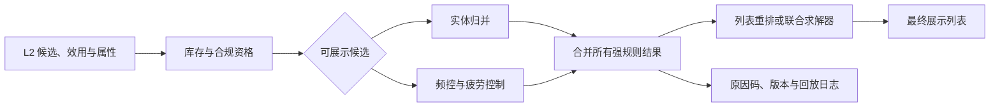

# 基础规则与约束

基础规则与约束是 L3 的展示资格与一致性闸门。它接收 L2 返回的候选级效用、候选属性和请求时状态，移除不可展示或不应重复展示的候选，并向后续列表求解器输出可回放的候选集合。合规、安全、库存和强频控不能由相关性、多样性、公平或探索补偿，也不得在未批准的降级路径中跳过。

它解决的是“候选**能否**参与最终列表”，而非“候选应该排第几”。后者属于[列表重排](../列表重排/README.md)和[约束优化与编排](../约束优化与编排/README.md)；跨请求的曝光目标和探索预算分别由[公平与生态](../公平与生态/README.md)与[长期策略](../长期策略/README.md)提供配置或状态。

## 1. 统一输入输出契约

基础规则至少需要候选标识、L2 稳定效用、原始顺序、实体关系、请求上下文和版本化状态。每个规则必须返回结构化决定，而不是直接静默删除候选：

| 字段 | 含义 |
| --- | --- |
| `candidate_id`、`entity_key` | 候选和展示实体的稳定标识 |
| `eligible` | 是否仍在可行集合中 |
| `reason_codes` | `out_of_stock`、`frequency_cap`、`duplicate_entity` 等可枚举原因 |
| `rule_version`、`state_versions` | 规则、配置和依赖快照版本 |
| `input_index` | 进入 L3 的稳定位置，支持同分回放 |
| `decision_latency`、`degradation_mode` | 在线 SLA 与是否发生获批降级 |

最终传给列表求解器的集合为：

$$
\mathcal{F}_{basic}=
\{i\in C\mid eligibility(i)=1,
frequency\_cap(i)=1,
entity\_consistent(i)=1\}.
$$

任何后续 MMR、配额、曝光公平或探索策略只能从 $\mathcal{F}_{basic}$ 中选择候选。

## 2. 执行关系，而不是硬编码目录顺序

资格过滤通常应尽早执行，以减少无效候选进入后续计算；实体归并与频控的具体相对顺序可随业务语义和状态成本调整。例如，若频控按商品族生效，可先归并降低状态读取；若频控按素材或创作者生效，则可能先检查频控。无论实现顺序如何，最终展示项必须同时满足所有强规则。

图中的并行分支表示规则依赖，而不是要求每个系统都采用同一 RPC 调用顺序。需要短路时，应保证短路原因也会被记录；需要并行时，应在 deadline 内收敛并明确超时语义。

## 3. 复杂度、状态访问与请求预算

令 $N$ 为进入基础规则的候选数，$R$ 为频控规则数，$E$ 为去重后的实体数，$Q$ 为资格判定谓词数。Big-O 只描述本地计算；缓存未命中、RPC 排队和原子写入通常才是 P99 的主导因素。

| 模块 | 本地计算 | 请求状态/空间 | 关键优化 |
| --- | --- | --- | --- |
| 去重与实体归并 | 当前排序实现 $O(N\log N)$ | 实体索引与输出 $O(N)$ | 预先按保留优先级稳定排序后，可用单次哈希扫描；近重复聚类离线完成。 |
| 频控与疲劳 | 每候选/规则的判断 $O(NR)$ | 用户-作用域暴露状态 | 先对作用域去重，再批量读写；保留必须是原子操作。 |
| 库存与合规 | $O(NQ)$，通常近似 $O(N)$ | 候选状态快照 | 批量多取或预拼接快照，限制依赖 fan-out。 |

因此基础规则的优化目标不是弱化 fail-closed，而是在不改变拒绝语义下控制 fan-out：限制输入候选池，按 `entity_key`、`user_id + scope` 聚合读写，使用批量接口或有界并发，并为每种状态源设置独立 deadline。依赖状态不可用时仍返回可审计的拒绝或已批准降级路径，不能为了缩短请求而默认放行。

## 4. 专题导航

| 专题 | 关注问题 | 最小示例 |
| --- | --- | --- |
| [去重与实体归并](./去重与实体归并/README.md) | 同一内容、商品族、多素材与近重复候选如何只保留一个代表项。 | 稳定实体归并与抑制映射 |
| [频控与疲劳控制](./频控与疲劳控制/README.md) | 用户-对象-时间窗状态如何限制跨请求重复曝光。 | 内存滚动窗口与展示预留 |
| [库存与合规过滤](./库存与合规过滤/README.md) | 库存、地域、年龄、版权和安全状态如何保守判定资格。 | fail-closed 决策与原因码 |

三个示例均为标准库、可直接运行的语义演示。它们刻意省略分布式状态、依赖 RPC、策略发布和审计基础设施；上线时应保留示例中的确定性、原因码和失败语义，而不是照搬内存实现。

## 5. 状态失败、降级与可观测性

规则应按风险分级。强安全、版权、地域、年龄、库存和强频控的关键状态未知或超时，默认 fail-closed；弱疲劳或非关键体验规则是否允许缓存/放行，必须由规则所有者显式定义并带版本记录。禁止把“状态读失败”编码为普通低分特征。

每次决策应保存输入候选摘要、命中规则、依赖状态版本与新鲜度、过滤前后候选数、执行耗时、降级模式和最终展示结果。通过这些字段可回答三个运营问题：为何某候选未展示、某次请求为何候选不足、以及某策略版本是否改变了误拦截或错误展示率。

## 6. 验收清单

- 每条强规则都有清晰的状态源、版本、优先级、超时语义与责任方。
- 所有删除或替换候选的操作都产生稳定原因码，且可用当时快照回放。
- 同一输入、状态版本和规则版本下，输出集合与保留顺序确定；并发场景使用原子预留或等价机制。
- 对状态未知、候选缺字段、同分、候选不足、跨端状态与规则版本切换建立自动化测试。
- 监控规则命中率、依赖错误率、状态新鲜度、候选不足率、误拦截与错误展示，并按策略/状态版本分组。