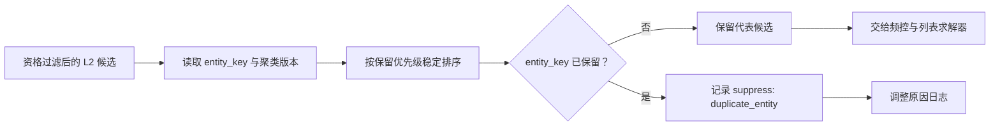

# 去重与实体归并

去重与实体归并解决“多个候选在最终列表中是否代表同一展示意图”的问题。L1 的多路召回、同商品多素材、同创作者的相似内容和商品族变体都可能让多个 ID 指向同一实体；若直接交给重排，会造成重复曝光、夸大某一实体的竞争机会，并使多样性指标失真。

本页只处理**同一展示实体的排他性**。类目、主题或创作者的覆盖是列表级软目标，属于[列表重排](../../列表重排/README.md)；合规、库存与频控先决定候选是否可展示，见[基础规则与约束总览](../README.md)。

## 1. 输入、输出与规则优先级

去重应接收已经完成最终资格过滤的候选，并保留进入 L3 时的稳定输入位置。最小候选契约如下：

| 字段 | 用途 | 示例 |
| --- | --- | --- |
| `item_id` | 具体候选的稳定标识 | `sku_123`、`video_456` |
| `entity_key` | 需要互斥展示的实体键 | 商品族、内容簇或素材主实体 |
| `score` | L2 校准后的候选级效用 | 用于同实体保留比较 |
| `quality`、`freshness` | 在效用相近时的业务质量与时效证据 | 可选但必须版本化 |
| `input_index` | L2 输出中的稳定位置 | 所有条件相同时保证可回放 |

建议采用以下确定性顺序：先按 `score`，再按质量、时效、输入位置和 ID 选择代表项。实体键必须来自版本化的规则、商品关系或近重复聚类结果；L3 不应在 request deadline 内临时执行全库向量聚类。



## 2. 精确重复、实体归并与近重复

| 类型 | 判定依据 | 典型处理 | 风险 |
| --- | --- | --- | --- |
| 精确重复 | 相同 `item_id` | 保留优先输入或最高效用版本 | 多路召回来源丢失，需在日志保留来源映射 |
| 实体归并 | 相同商品族、主内容或素材主实体 | 每个 `entity_key` 保留一个代表候选 | 实体关系延迟会导致短暂重复或误杀 |
| 近重复 | 离线内容簇、指纹或高置信语义簇 | 将簇 ID 作为 `entity_key` 或单独配额 | 阈值不稳会损伤相关性或漏掉重复 |

近重复判断的召回率与精度应独立评估。把“同类目”直接当作近重复通常过强，会把用户对一个明确意图的合理多样选择错误压缩为单条结果。

## 3. 复杂度与请求预算

设 $N$ 为候选数、$E$ 为不同实体数。当前 [deduplicate.py](./deduplicate.py) 先按保留优先级排序，再按 `entity_key` 扫描，因此时间复杂度为 $O(N\log N)$，排序后的候选、保留结果和压制映射带来 $O(N)$ 额外空间。

若 L2 已按相同且稳定的保留优先级排序，可直接单次哈希扫描：时间为 $O(N)$，实体集合状态为 $O(E)$，输出仍最多为 $O(N)$。不要为了这个优化改变“同分如何保留”的确定性契约。实体关系查询应以请求批量读取或候选快照提供；近重复特征计算、全量相似候选生成和聚类属于离线或准实时任务，不能在请求内做 $O(N^2)$ 两两比较。

## 4. 最小可运行示例

[deduplicate.py](./deduplicate.py) 用标准库实现稳定的实体归并；[example.py](./example.py) 构造同商品族、多素材候选并打印保留和抑制结果。

```powershell
python example.py
```

该样例只演示已给定的 `entity_key` 如何被确定性地处理，不包含生产中的商品关系服务、近重复模型、实时内容审核或跨页状态。

## 5. 服务、回放与验收

- 先完成库存/合规等最终资格过滤，再进行实体归并；被频控拒绝的代表项不应自动替换为同实体的已抑制候选，除非实体策略显式允许该替换。
- 记录输入候选、`entity_key`、聚类或关系版本、保留优先级、代表项与每个被抑制项的 `reason_code`。
- 对实体键缺失、同分候选、关系版本切换、聚类误合并和候选不足建立回放测试；实体键未知时应按场景选择保守抑制或显式标记，不要静默随机处理。
- 线上同时观察重复率、代表项替换率、重排前后效用损失、列表覆盖和 P99；仅看重复率会掩盖误杀高价值候选的问题。

## 常见误解

- **去重等同于多样性**：去重只解决同一实体的排他性；多样性还要处理不同实体之间的主题、意图和创作者覆盖。
- **保留 L2 分最高项一定正确**：当质量、时效、库存或展示素材存在差异时，应明确并版本化保留优先级。
- **近重复可以在线临时计算**：高成本相似度计算会侵蚀 L3 的 deadline；应优先复用离线或准实时生成的簇/关系。