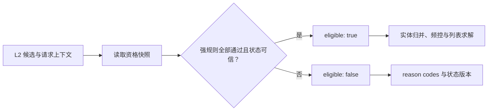

# 库存与合规过滤

库存与合规过滤定义候选能否被用户看到的最终资格。库存、下架、地域、年龄、版权、内容安全、商家状态和活动生效时间都属于这一层；它们不能被 L2 高分、MMR 多样性、配额或探索策略覆盖。

本专题只做展示资格判定，不估计“用户是否喜欢”。通过过滤的候选才可进入[去重与实体归并](../去重与实体归并/README.md)、[频控与疲劳控制](../频控与疲劳控制/README.md)与后续列表求解。

## 1. 请求时资格模型

对候选 $i$、用户上下文 $x$ 和请求时刻 $t$，最终资格可表达为：

$$
eligible(i,x,t)=
inventory(i,t)
\land published(i,t)
\land region(i,x)
\land audience(i,x)
\land rights(i,x,t)
\land safety(i,x,t).
$$

任一强约束为假，或关键状态未知时，候选都不应展示。过滤器输出不应只有布尔值，而应携带可回放的状态版本和原因码：

| 输出字段 | 含义 |
| --- | --- |
| `eligible` | 是否进入后续 L3 流程 |
| `reason_codes` | 如 `out_of_stock`、`region_blocked`、`safety_unknown` |
| `policy_version` | 规则配置与优先级版本 |
| `state_versions` | 库存、版权、审核等依赖快照版本 |
| `evaluated_at` | 决策时间与请求上下文版本 |



## 2. 规则优先级与状态来源

建议将规则编译成显式、可配置的决策表，而不是散落在多个业务分支中：

| 规则类别 | 典型状态源 | 失败处理 | 说明 |
| --- | --- | --- | --- |
| 库存与上架 | 库存/商品或内容发布服务 | 强规则 fail-closed | 使用请求时可见快照，防止售罄或下架仍展示 |
| 地域、年龄与版权 | 用户地域、年龄分层、版权策略 | 强规则 fail-closed | 规则冲突时以限制更强者为准 |
| 内容安全 | 审核标签与策略服务 | 强规则 fail-closed | 未审核、审核过期或状态未知不可当作安全 |
| 商家/活动资格 | 商家治理或活动配置 | 按业务等级定义 | 强运营承诺通常视为强规则 |

状态读取必须明确 freshness SLA。过期快照不是天然可信：对高风险规则可直接拒绝，对可容忍的库存类规则可使用有版本标记的短暂缓存，但需要由规则所有者批准并可观察。

## 3. 复杂度与依赖 fan-out

令 $N$ 为候选数、$Q$ 为资格谓词数。对已经物化的候选状态，当前 [eligibility_filter.py](./eligibility_filter.py) 的本地判断为 $O(NQ)$；$Q$ 通常是小常数，所以计算本身近似 $O(N)$。一次性持有完整状态快照需要 $O(NQ)$ 字段空间，而逐候选流式判定可将工作区降到 $O(Q)$，代价是降低批量读取能力。

实际延迟主要来自库存、发布、地域、受众、版权和安全等状态源的 fan-out。线上应优先使用按 `candidate_id` 的批量状态读取或预拼接资格快照，并对并行 RPC 设置上限和各自 deadline；不要为每个候选串行访问所有依赖。fail-closed 可以在本地按谓词短路，但审计要求决定是否仍读取/记录其余状态版本，二者应在契约中明确而非临时省略。

## 4. 最小可运行示例

[eligibility_filter.py](./eligibility_filter.py) 展示一个纯函数资格过滤器：库存不足、地域不允许、内容不安全和关键安全状态未知都会返回 `eligible=False` 与对应原因码；[example.py](./example.py) 展示可展示与未知状态两种结果。

```powershell
python example.py
```

样例没有调用真实依赖服务，也不定义业务政策本身。生产实现应先在请求 deadline 内并行读取所需快照，再使用固定的 `policy_version` 求值；不得在服务超时后将未知关键状态默认为通过。

## 5. 降级、回放与验收

- 按规则等级区分依赖超时：强安全、版权、地域和年龄约束默认拒绝；只有明确声明为可降级的非关键规则才能采用缓存或保守替代。
- 保留候选输入、请求属性的脱敏版本、完整原因码、状态来源/版本/新鲜度、策略版本和最终执行路径，支持事后回放与投诉排查。
- 对状态冲突、状态过期、服务超时、区域切换、年龄变更、下架竞态和审核撤回建立测试；回放应使用当时的快照，不可用当前状态覆盖历史决策。
- 线上监控过滤命中率及原因分布、依赖错误率、状态新鲜度、候选不足率、错误展示投诉率和误拦截申诉率；异常波动应可定位到具体状态源或策略版本。

## 常见误解

- **合规过滤是低权重特征**：它定义可行集合，不能与预测分数进行加权交换。
- **缓存存在就可以无限期降级**：缓存是否可用取决于规则风险和新鲜度 SLA，尤其安全/版权状态必须谨慎。
- **只记录最终是否展示即可**：缺少原因码、状态版本和策略版本将无法解释或复现资格判定。